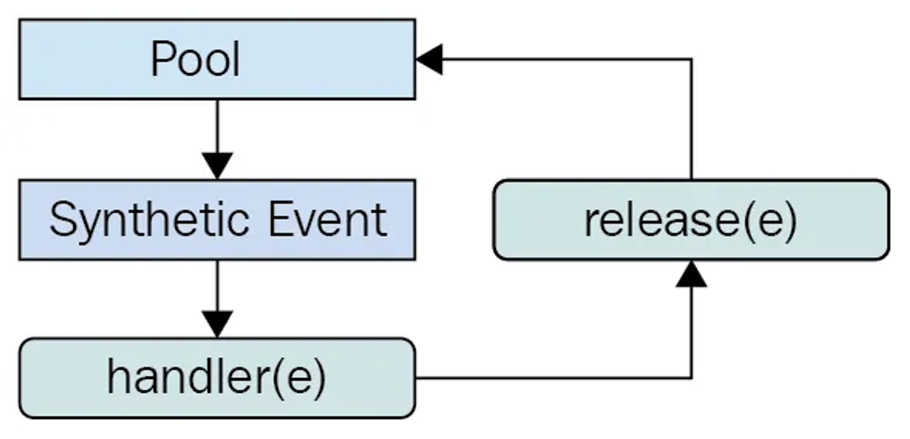
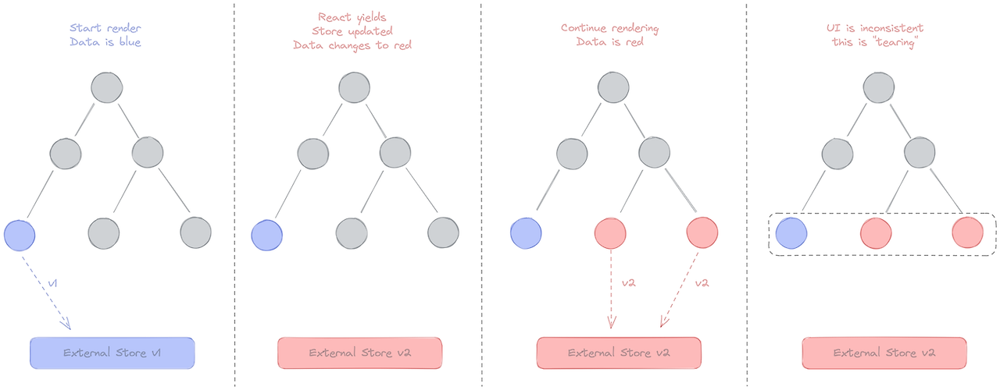

# Ch.10 리액트 17과 18의 변경 사항 살펴보기

## 10.1 리액트 17 버전 살펴보기

- 리액트 17버전은 16버전과 다르게 새롭게 추가된 기능 X
- 호환성이 깨지는 변경 사항, 즉 기존에 사용하던 코드의 수정을 필요로 하는 변경 최소화

### 리액트의 점진적인 업그레이드

- 과거: 이전 버전의 API를 중단하고 전체 애플리케이션을 새롭게 업그레이드

- 17버전: 18버전으로 업데이트 했다고 가정하면 18버전의 기능과 일부 기능에 대해서는 17버전에 머무는 것이 가능

- 리액트 팀에서는 이 방법은 업그레이드가 불가능한 상태에서만 차선책이기 때문에 임시방편이라고 함

### 이벤트 위임 방식의 변경

**이벤트 위임**

- 캡처: 이벤트 핸들러가 트리 최상단 요소에서부터 시작해서 실제 이벤트가 발생한 타깃 요소까지 내려 가는 것

- 타깃: 이벤트 핸들러가 타깃 노드에 도달하는 단계. 여기서 이벤트가 호출된다.

- 버블링: 이벤트가 발생한 요소에서부터 시작해 최상위 요소까지 다시 올라간다.

**이러한 이벤트 단계의 원리를 활용해 이벤트를 상위 컴포넌트에만 붙이는 것을 의미**


- 과거: 16버전에서는 모든 이벤트를 문서 전체(document)에서 관리

- 17버전: 모든 이벤트를 리액트 컴포넌트 최상단 트리 루트 요소에서 관리

- 이유: 다른 라이브러리와 과거 버전 등이 혼재될 경우 혼란을 방지

### import React from ‘react’가 더 이상 필요 없다: 새로운 JSX transform

- 17버전 부터 바벨과 협력하여 import 구문 없이도 JSX 반환이 가능해졌다 -> 이로 인해 번들링 크기가 줄어들고 컴포넌트 작성이 간결해짐

### 그 밖의 주요 변경 사항

**이벤트 폴링 제거**

- `SyntheticEvent`: 브라우저의 기본 이벤트를 한 번 더 감싼 이벤트 객체

- 리액트는 기본 이벤트가 아닌 한 번 래핑한 이벤트를 사용하기 때문에 이벤트가 발생할 때마다 이 이벤트를 새로 만들어야 했고, 그 과정에서 항상 새로 이벤트를 만들 때마다 메모리 할당 작업이 일어날 수 밖에 없었다. 또한 메모리 누수를 방지하기 위해 이렇게 만든 이벤트를 주기적으로 해제해야 하는 번거로움이 존재 -> 여기서 이벤트 풀링은 `SyntheticEvent` 풀을 만들어서 이벤트가 발생할 때마다 가져오는 것을 의미



1. 이벤트 핸들러가 이벤트를 발생시킨다.

2. 합성 이벤트 풀에서 합성 이벤트 객체에 대한 참조를 가져온다.

3. 이 이벤트 정보를 합성 이벤트 객체에 넣어준다.

4. 유저가 지정한 이벤트 리스너가 실행된다.

5. 이벤트 객체가 초기화되고 다시 이벤트 풀로 돌아간다.

**해당 방법은 결국 재사용할 시 모든 이벤트 필드를 `null`로 변경하여 만약 비동기 코드 내부에서 e에 접근하면 `null`을 받게된다.**

※ 만약 해당 이벤트를 접근하고 싶으면 `e.persist()` 사용

- 결국 비동기 코드로 접근하기 위해서 별도 메모리 공간에 합성 이벤트 객체를 할당해야 한다는 점, 그리고 모던 브라우저에서 이와 같은 방식이 성능 향상에 크게 도움이 안된다는 점으로 인해 해당 이벤트 풀링은 삭제됨.

**useEffect 클린업 함수의 비동기 실행**

- 리액트의 `useEffect`에 있는 클린업 함수는 리액트 16버전까지는 동기적으로 처리됨

- 동기적으로 실행되기 때문에 해당 클린업 함수가 완료되기 전까지 다른 작업을 방해하여 불필요한 성능 저하로 이어지는 문제가 발생하게 됨

- 17버전부터 화면이 완전히 업데이트 된 이후에 클린업 함수가 비동기적으로 실행되게 변경

**컴포넌트 undefined 반환에 대한 일관적인 처리**

- 16 버전에서 `forwardRef`나 `memo`에서 `undefined`를 반환하는 경우 에러가 발생하지 않았으나 17 버전부터 에러가 발생 되도록 변경

## 10.2 리액트 18 버전 살펴보기

- 17 버전이 점진적인 업그레이드를 준비 했다면 18 버전은 다양한 기능이 추가가 되었는데 그중 가장 큰 변경점은 **동시성 지원**이다

**동시성이란?**

- 기존에는 렌더링이 동기적으로 한 번에 진행됨 -> 무거운 업데이트가 렌더링 되어야 할 때 UI 멈추는 문제 발생
- 렌더링을 멈출 경우 사용자 인터렉션 X
- 이 문제를 해결한 것이 바로 동시성

**동시성 렌더링**

- 업데이트 예약: 상태 변경 발생 시 작업의 우선순위를 정하고 렌더링 시작.

- 작업 분할 및 양보: 렌더링 과정을 작은 단위로 쪼개어 수행하며, 주기적으로 브라우저에 제어권을 양보.

- 긴급 이벤트 우선 처리: 사용자 입력 등 고우선순위 이벤트 발생 시, 진행 중이던 낮은 순위의 렌더링을 즉시 중단하고 이벤트에 대응.

- 렌더링 재개 및 폐기: 이벤트 처리가 끝나면 중단된 지점부터 다시 렌더링하거나, 상태가 변했다면 기존 작업을 폐기하고 새로 계산.

- 일괄 반영(Commit): 전체 컴포넌트 트리가 완성된 시점에만 최종 결과를 실제 DOM에 한꺼번에 반영하여 UI 일관성 유지.

### 새로 추가된 훅 살펴보기

**useId**

- 컴포넌트별로 유니크한 값을 생성하는 새로운 훅

- 클라이언트와 서버 상의 불일치를 피하면서 컴포넌트 내부에 고유한 값을 생성할 수 있음 -> **하이드레이션 방지**

- 32글자의 이진 문자열로 이루어져 있다
  - 왼쪽 5자리 : 부모의 트리 (앞글자가 R = 서버, r = 클라이언트)

**useTransition**

- UI 변경을 가로막지 않고 상태를 업데이트할 수 있는 리액트 훅

```jsx
import { useState, useTransition } from "react";
// ...

export default function TabContainer() {
  const [isPending, startTransition] = useTransition();
  const [tab, setTab] = useState < Tab > "about";

  function selectTab(nextTab: Tab) {
    startTransition(() => {
      setTab(nextTab);
    });
  }

  return (
    <>
      {/* ... */}
      {isPending ? (
        "로딩 중"
      ) : (
        <>
          {tab === "about" && <About />}
          {tab === "posts" && <Posts />}
          {tab === "contact" && <Contact />}
        </>
      )}
    </>
  );
}
```

- 위 예제와 같이 사용할 경우 탭과 탭 사이에 이전의 렌더링이 완전히 완료되지 않은 상태에서도 렌더링이 블로킹되지 않는다

- 18 버전의 변경 사항의 핵심 중 하나인 동시성을 다룰 수 있는 훅

- 컴포넌트에서만 사용 가능하며 단순히 `startTransition`을 `import`할 수 있다

**사용 시 주의점**

- `startTransition` 내부는 반드시 `setState`와 같은 상태를 업데이트하는 함수와 관련된 작업만 넘길 수 있다. 만약 `props`나 사용자 정의 훅에서 반환하는 값 등을 사용하고 싶다면 뒤에서 설명할 `useDeferredValue`를 사용하면 된다.

- `startTransition`으로 넘겨주는 상태 업데이트는 다른 모든 동기 상태 업데이트로 인해 실행이 지연될 수 있다. 예를 들어, 타이핑으로 인해 `setState`가 일어나는 경우 타이핑이 끝날 때까지 `useTransition`으로 지연시킨 상태 업데이트는 일어나지 않는다.

- `startTransition`으로 넘겨주는 함수는 반드시 동기 함수여야 한다. 만약 이 안에 `setTimeout`과 같은 비동기 함수를 넣으면 제대로 작동하지 않게 된다. 이는 `startTransition`이 작업을 지연시키는 작업과 비동기로 함수가 실행되는 작업 사이에 불일치가 일어나기 때문이다.

**useDeferredValue**

- 리액트 컴포넌트 트리에서 리렌더링이 급하지 않은 부분을 지연할 수 있게 도와주는 훅

- 디바운스와 비슷하지만 고정된 지연 시갑 없이 첫 번째 렌더링이 완료된 후에 `useDeferredValue`로 지연된 렌더링 수행 (중단 O, 사용자 인터렉션 차단 X)

- `useTransition`과의 차이점

  - `useTransition`은 상태를 업데이트하는 함수를 감쌈
  - `useDeferredValue` 상태 값 자체만을 깜사서 사용

  **실제로는 두 역할 모두 동일한 수행을 한다**

**useSyncExternalStore**

- 17 버전에 존재했던 `useSubscription`의 구현이 대체된 훅
- 테어링 현상을 방지하기 위해 존재하는 훅

**테어링 현상**

- 하나의 `state` 값이 있음에도 서로 다른 값을 기준으로 렌더링 되는 현상
- 17 버전에서는 일어나지 않는 현상이었지만 18 버전에 생긴 훅(useTransition, useDeferredValue)들로 인해 동시성 이슈가 발생할 수 있다.



1. 첫 번째 컴포넌트에서는 외부 데이터 스토어의 값이 파란색이었으므로 파란색 렌더링
2. 나머지 컴포넌트들도 파란색으로 렌더링 준비
3. 갑자기 외부 데이터 스토어의 값이 빨간색으로 변경
4. 나머지 컴포넌트들은 렌더링 도중에 바뀐 색을 확인해 빨간색으로 렌더링
5. 결과적으로 같은 데이터 소스를 바라보고 있음에도 컴폰넌트 색상이 달라지는 테어링현상 발생

```jsx
function useWindowWidth() {
  return useSyncExternalStore(
    subscribe,
    //subscribe: 상태 변경 함수. innerWidth 가 변경될때 일어나는 콜백
    //store.subscribe
    () => window.innerWidth,
    // 현재 스토어 값
    // store.snapshot
    () => 0
    // 서버사이드 렌더링 시 제공되는 기본값
  );
}

export default function App() {
  const windowSize = useWindowWidth();
  return <>{windowSize}</>;
}
```

리액트에서 관리하는 `state`는 `useTransition`, `useDeferredValue`에서 처리해주기 때문에 상관없지만 리액트 클로저 밖에 외부 데이터 소스(document.body, window.innerwidth, DOM, 외부 상태 관리 라이브러리) 등이 해당된다.

**useInsertionEffect**

- css-in-js를 위한 훅
- css의 추가 및 수정은 브라우저 렌더링 작업 대부분을 다시 계산하기 때문에 무거운 작업 -> styled-component와 리액트 17 버전에서는 서버 사이드에서 스타일 코드를 삽입함
- 해당 작업을 훅으로 처리하는 것이 `useInsertionEffect`이다

**실행 순서**

useInsertionEffect -> DOM 변경 작업 완료 -> useLayoutEffect -> DOM 반영 → useEffect

### react-dom/client

- 리액트 트리를 만들 때 사용되는 API가 변경됨.

**createRoot**

- 기존 react-dom에 있던 `render`를 대체할 새로운 메서드
- 리액트 18 버전의 기능을 사용하려면 `createRoot`와 `render`를 같이 사용

```jsx
// index.js
import React from "react";
import ReactDOM from "react-dom/client";
import App from "./App";

// 기존의 ReactDOM.render 대신 createRoot 사용
const container = document.getElementById("root");
const root = ReactDOM.createRoot(container);

root.render(<App />);
```

**hydrateRoot**

- SSR에서 하이드레이션을 하기 위한 새로운 메서드
- React DOM 서버 API와 함께 사용
- 대부분의 서버 사이드 렌더링은 프레임워크에 의존하고 있기 때문에 수정할 일은 대부분 없다
  - 자체적으로 SSR을 구현해서 사용하고 있을 경우 수정

### react-dom/server

**renderToPipeableSteam**

- 리액트 컴포넌트를 HTML로 렌더링하는 메서드

- 스트림을 지원하는 메서드로, HTML을 점진적으로 렌더링하고 클라이언트에서는 중간에 script를 삽입하는 등의 작업을 할 수 있다

- 서버는 Suspense를 사용해 빠르게 렌더링이 필요한 부분을 먼저 렌더링할 수 있고, 값비싼 연산으로 구성된 부분은 이후에 렌더링할 수 있다

- 기존 `renderToNodeStream`은 무조건 순서대로 진행하여 블로킹이 걸린다 -> `renderToPipeableSteam`은 순서나 오래거리는 렌더링에 영향을 받지 X

**renderToReadableStream**

- `renderToPipeableSteam`이 Node.js 환경에서의 렌더링을 위해 사용된다면, `renderToReadableStream`은 웹스트림을 기반으로 작동 이는 서버 환경이 아닌 클라우드플레어나 디노 같은 웹 스트림을 사용하는 모던 엣지 런타임 환경에서 사용되는 메서드

**웹 스트림**

- 서버에서 생성한 HTML을 브라우저로 한꺼번에 보내지 않고, 준비되는 대로 조각조각 나눠서 전송하는 기술

### 자동 배치(Automatic Batching)

- 여러 상태 업데이트를 하나의 리렌더링으로 묶어서 성능을 향상시키는 방법

- 예를 들어, 버튼 클릭 한 번에 두 개 이상의 state를 동시에 업데이트 한다면, 자동 배치에서는 이를 하나의 리렌더링으로 묶어서 수행할 수 있다

### 더욱 엄격해진 엄격 모드

**리액트의 엄격 모드**

- 리액틍서 제공하는 컴포넌트 중 하나로, 리액트 애플리케이션에서 발생할 수도 있는 잠재적인 버그를 찾는 데 도움이 되는 컴포넌트

- 리액트에서 널리 알려져 있는 Fragment 나 Suspense와 마찬가지로 컴포넌트 형태로 선언해서 사용할 수 있다

**엄격 모드 작업**

- 더 이상 안전하지 않은 특정 생명주기를 사용하는 컴포넌트에 대한 경고

  - `UNSAFE_`가 붙지 않은 메서드가 삭제된 것과 해당 메서드 사용 시 경고 로그 출력

- 문자열 ref사용 금지

  - 다음과 같은 이유로 금지됨

    1. 문자열로 값을 주는 것은 여러 컴포넌트에 걸쳐 사용될 수 있으므로 충돌의 여지가 있다.

    2. 앞의 코드에서도 볼 수 있듯이 단순히 문자열로만 존재하기 때문에 실제로 어떤 ref에서 참조되고 있는지 파악하기 어렵다.

    3. 리액트가 계속해서 현재 렌더링되고 있는 컴포넌트의 ref의 값을 추적해야 하기 때문에 성능 이슈가 있다.

- findDOMNode에 대한 경고 출력

  - `findDOMNode`: 부모가 특정 자식만 별로도 렌더링할 수 있다.
  - 리액트가 추구하는 트리 추상화 구조를 무너뜨리기 때문에 경고 출력

- 구 Context API 사용 시 발생하는 경고

  -

- 예상치 못한 부작용 검사
  - 다음 내용을 의도적으로 의중 호출
    - 클래스형 컴포넌트의 constructor, render, shouldComponentUpdate, getDerivedStateFromProps
    - 클래스형 컴포넌트의 setState의 첫 번째 인수
    - 함수형 컴포넌트의 body
    - useState, useMemo, useReducer에 전달되는 함수

**리액트 18에서 추가된 엄격 모드**

- 컴포넌트가 마운트 해제된 상태에서도 (컴포넌트가 렌더링 트리에 존재하지 않는 상태에서도) 컴포넌트 내부의 상태값을 유지할 수 있는 기능을 제공할 예정

  - 예시) 사용자가 뒤로가기를 했다가 다시 현재 화면으로 돌아왔을 때 리액트가 즉시 이전의 상태를 그대로 유지해 표시할 준비를 하는 것

- 컴포넌트가 최초에 마운트될 때 자동으로 모든 컴포넌트를 마운트 해제하고, 두 번째 마운트에서 이전 상태를 복원하게 된다. (개발 모드에서만 적용)

**Suspense 기능 강화**

- 컴포넌트를 동적으로 가져올 수 있게 도와주는 기능

```jsx
import React, { Suspense, lazy } from "react";

// Sample Component
const SampleComponent = lazy(() => import("./SampleComponent"));

const App = () => {
  return (
    <Suspense fallback={<div>로딩 중...</div>}>
      <SampleComponent />
    </Suspense>
  );
};

export default App;
```

- Suspense를 사용하여 동적으로 컴포넌트를 가져오고, 로딩 상태를 쉽게 처리할 수 있다.

- 컴포넌트가 로드되는 동안 fallback UI를 제공하여 사용자에게 로딩 상태를 알린다.

- Suspense는 서버 사이드 렌더링과 함께 사용할 수 있어, 초기 로딩 속도를 개선

**이전 버전의 문제점**

1. 컴포넌트가 보이기 전에 useEffect가 실행되는 문제

2. Suspense는 서버에서 사용 불가

### 인터넷 익스플로러 지원 중단에 따른 추가 폴리필 필요

- `Promise`, `Symbol`, `Object.assign`의 세 기능을 지원하지 않는 브라우저에서 서비스한다면 폴리필을 반드시 추가해야 합니다.

### 그 밖의 알아두면 좋은 변경사항

- 이제 컴포넌트에서 `undefined`를 반환해도 에러가 발생하지 않는다. `undefined` 반환은 `null` 반환과 동일하게 처리된다.

- 이와 마찬가지로 `<Suspense fallback={undefined}>`도 null과 동일하게 처리된다.

- `renderToNodeStream`이 지원 중단됐다. 그 대신 `renderToPipeableStream`을 사용하는 것이 권장된다.
