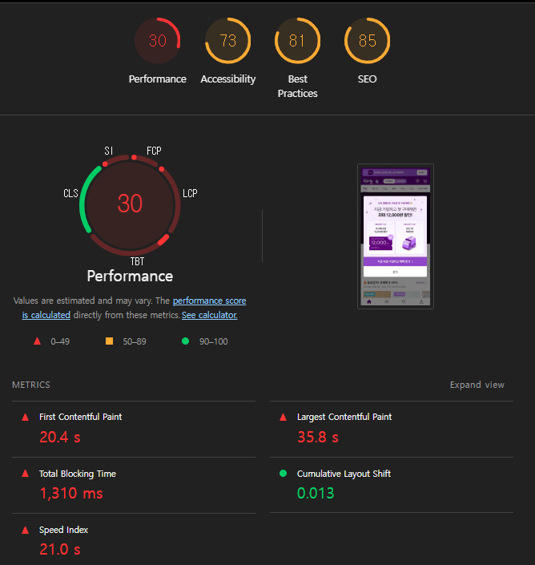

# Takeaways

## Takeaways

## 웹페이지 성능을 측정하는 다양한 방법

### 애플리케이션에서 확인하기

* web-vitals 라이브러리: PerformanceObserver 라는 API 사용(브라우저에서 웹페이지 성능 측정 위해 사용)
* 성능 기록을 서버 등 어딘가에 기록하고 싶다면 소량의 분석용 데이터를 전송하기 위해 만들어진 sendBeacon API나 fetch 등의 API를 사용해 임의로 서버로 보내거나, 구글 애널리틱스로 보낼수도 있다.
* Next.js는 기본적으로 성능 측정을 할 수 있는 메서드인 NextWebVitalsMetric을 제공
  * 기본적인 핵심 웹 지표 외에도 아래와 같은 Next.js에 특화된 사용자 지표도 제공. (모든 시간 단위는 ms)
    * **Next.js-hydration**: 페이지가 서버 사이드에서 렌더링되어 하이드레이션하는 데 걸린 시간
    * **Next.js-route-change-to-render**: 페이지가 경로를 변경 한 후 페이지 렌더링을 시작하는 데 걸리는 시간. 페이지 전환에 걸린 시간
    * **Next.js-render**: 경로 변경이 완료된 후 페이지를 렌더링하는 데 걸린 시간. 페이지 전환에 따른 렌더링에 걸린 시간
    * Next.js는 **최초에 서버 사이드 렌더링을 수행**하기 때문에 **필연적으로 리액트 하이드레이**션 작업이 뒤 따른다. 그리고 이후에는 클라이언트 사이드 라우팅이 일어나는 한 next.js-route-change-to-render와 Next.js-render가 번갈아 나타난다.
* web-vitals를 설치해서 지표를 수집하는 방식은 단순히 코드 몇줄만으로 지표를 수집할 수 있지만 사전 준비가 필요하고 어쨌든 코드 몇줄 수정이 필요하다.

### 구글 라이트하우스

* 구글에서 제공하는 웹 페이지 성능 측정 도구. 크롬 개발자 도구에는 기본적으로 내장돼 있다.
* 핵심 웹 지표 뿐 아니라 접근성, PWA, SEO 등 점검
* lighthouse 라는 npm 라이브러리를 이용하면 CLI 명령어로 지표 수집
* 가급적 시크릿 창으로 실행해 확인

#### 탐색모드

* 페이지에 접속했을 때 부터 페이지 로딩이 완료될 때까지 성능을 측정하는 모드  
* 성능
  * FCP(First Contentful Paint), LCP, CLS 외에도 3가지 추가적인 지표가 있다.
  * TTI(Time to interactive) → 구글이 Lighthouse를 업데이트하면서 TTI를 공식 지표에서 제외. \
    **TBT, INP(기간모드) 확인**
    * 페이지에서 사용자가 완전히 상호작용 할 수 있을 때까지 걸리는 시간. 최대한 빠르게 상호작용이 되도록 준비하려면 메인 스레드가 하는 자바스크립트 작업 최소화. 전체적인 자바스크립트 실행 속도 또한 높일 필요가 있다.
      * FCP로 측정되는 페이지 내 콘텐츠가 표시되는 지점
      * 보여지는 페이지 요소 대부분에 이벤트 팬들러가 부착되는 시점
      * 페이지가 유저의 상호작용에 50ms 내로 응답하는 시점
  * **Speed Index**
    * 페이지가 로드되는 동안 **콘텐츠가 얼마나 빨리 시각적으로 표시되는지** 계산
    * 브라우저에서 로드되는 페이지를 실시간으로 캡처하고 speedline 라이브러리를 사용해 캡처된 이미지를 분석해 speed index 계산
  * **Total Blocking Time**
    * 메인 스레드에서 특정 시간 이상 실행되는 작업. 즉, **긴 작업이 수행될 때마다 메인 스레드가 차단**된 것으로 간주한다.
    * TBT는 긴 작업을 모아서 각각의 긴 작업의 시간에서 50ms을 뺀 다음 이를 모두 합해 계산.
    * TBT는 모든 긴 작업을 대상으로 하는 것은 아니고 FCP부터 TTI 사이의 작업만 대상으로 한다. 즉, 사용자가 무언가 작업이 진행되고 있지 않다는 것을 눈치 챌 수 있는 시간을 대상으로만 총 차단 시간을 구한다. → FCP부터 "페이지 로드 완료(또는 분석 종료)" 시점까지를 기준으로 TBT를 계산
* 접근성
  * 장애인, 고령자 등 신체적으로 불편한 살마들이 일반적인 사용자와 동등하게 웹페이지를 이용할 수 있도록 보장하는 것.
  * 다양한 사용자를 배려하기 위해 HTML과 CSS등에 적절한 대안을 삽입
  * 스크린 리더: 웹페이지의 내용을 직접 들을 수 있다.
    * 그림, 사진을 읽으려면 적절한 alt 문자 필요.
  * 오디오, 비디오는 청각이 제한적인 경우를 위해 자막이 필요
  * 마우스를 활용할 수 없는 상황에 대비해 키보드만으로 모든 콘텐츠에 접근할 수 있어야 한다.
* 권장사항
  * **웹사이트를 개발할 때 고려해야 할 요소들을 얼마나 지키고 있는지** 확인
  * 보안, 표준 모드, 최신 라이브러리, 소스 맵 등
  * **CSP가 XSS 공격에 효과적인지 확인**
    * XSS(Cross Site Scripting): 개발자가 아닌 제3자가 삽입한 스크립트를 통해 공격하는 기법(e.g. 게시판 악의적인 스크립트)
    * CSP(Content Security Policy): 웹사이트에서 호출할 수 있는 컨텐츠를 제한하는 정책. 이 제한 정책에는 이미지, 스타일, 스크립트와 같은 정적인 콘텐츠 뿐 아니라 주소, 도메인 등 정보도 포함.
  * 감지된 JavaScript 라이브러리: 페이지에서 감지되는 자바스크립트 라이브러리. jQuery, Next.js, React, Lodash, 등
  * HSTS(HTTP Strict Transport Security) policy: HTTPS 사용하는 지 확인
  * **페이지 로드 시 위치정보 권한 요청 방지하기**
    * 사용자 동의 없이 페이지 로드 시 사용자의 물리적 위치를 알 수 있는 메서드인 `window.navigator.geolocation.getCurrentPosition()`, `window.navigator.geolocation.watchPositon()` 을 실행하는지 확인. 물론 이 두 함수가 호출된다고 바로 사용자 위치 정보를 가져올 수 있진 않고 브라우저에서 한번 물어보는 절차를 거친다. 그러나 다짜고짜 페이지 로드 시 요청하는 것은 사용자의 특별한 액션 없이 가져오는 것이므로 반드시 사용자의 액션 이후에 실행돼야한다.
  * **페이지 로드 시 알림 권한 요청 방지하기**
    * 사용자동의 없이 페이지 로드 시 웹페이지 알림을 요청하는 `Notification.requestPermission()`을 실행하는지 확인. 마찬가지로 브라우저에서 사용자에게 알림 허용 여부를 확인하지만 반드시 사용자 액션이 있을 때만 호출해야 한다.
  * 알려진 보안 취약점이 있는 프런트엔드 자바스크립트 라이브러리를 사용하지 않음
  * **사용자가 비밀번호 입력란에 붙여넣을 수 있도록 허용**
    * 반드시 비번 입력란은 붙여넣기가 가능해야한다.
    * 일반적으로 직접 쳐야 안전하다고 생각하기 쉽지만, 실제로는 반대입니다.
      * 비밀번호 관리자(Password Manager) 사용 권장: 보안을 위해 사용자는 서비스마다 다르고 복잡한 비밀번호(예: qZ7!pL9#vX2...)를 써야 합니다. 이런 비밀번호는 외우기 어렵기 때문에 1Password나 LastPass 같은 관리 도구가 자동으로 붙여넣어 줘야 하는데, 이를 막으면 사용자는 결국 123456 같은 쉬운 번호를 쓰게 됩니다.
  * 이미지를 올바른 가로세로 비율로 표시
  * 이미지가 적절한 해상도로 제공됨
  * 페이지에 HTML Doctype 있음
    * 표준을 준수해 웹페이지가 작성됐다는 의미
    * Doctype이 없다면 표준을 준수하지 않은 것으로 간주해 호환 모드로 렌더링. 이는 불필요한 작업.
    * `<!DOCTYPE html>` 선언해 호환 모드 실행을 막는다.
  * 문자 집합을 제대로 정의함
    * 서버가 HTML파일을 전송할 때 문자가 어떻게 인코딩돼 있는지 지정해 브라우저가 각 바이트가 나타내는 문자를 알 수 있게한다.
    * charset 지정. 대부분 UTF-8로 인코딩
  * 지원 중단 API 사용하지 않기
  * 콘솔에 로그된 브라우저 오류 없음
  * Chrome Devtools의 Issues패널에 문제 없음
  * 페이지에 유효한 소스 맵이 있음
    * 소스맵: 압축되어 읽기 어려워진 소스코드를 원본 소스코드로 변환할 수 있도록 도와주는 파일. 디버깅에 도움.
  * `font-display: optional` 을 사용하는 폰트가 미리 로드되는지 확인
    * 브라우저가 아주 짧은 시간(보통 0.1초 미만) 동안만 폰트를 기다려봅니다. optional 설정을 썼을 때 효과를 보려면 폰트가 최대한 빨리 도착해야 합니다. `<link rel="preload">` 로 미리 로드 해야함.
      * 빨리 오면: 개발자가 지정한 폰트로 보여줍니다.
      * 늦게 오면: 기다리지 않고 바로 시스템 기본 폰트로 보여줍니다.
    * 개발자가 원하는 임의이 폰트를 보여주면서 동시에 사용자에게 버벅거림 없는 렌더링 보장
* **검색엔진 최적화**
  * 웹페이지가 구글과 같은 검색엔진이 쉽게 웹페이지 정보를 가져가서 공개할 수 있도록 최적화 되어 있는지 확인하는 것
  * 검색엔진이 최적화 되어 있을수록 검색결과 우선순위에 높에 나타나며 사용자가 유입될 가능성이 높아진다.
  * 문서를 크롤링하기 쉽게 만들었는지, robots.txt가 유효한지, 이미지와 링크에 설명 문자가 존재하는지, `<meta>`나 `<title>`등으로 페이지 정보를 빠르게 확인할 수 있는지 등 확인

#### 기간모드

* 실제 웹페이지를 탐색하는 동안 지표 측정
* 성능 측정을 원하는 작업을 수행해 측정.
*   View Trace

    * 웹 성능을 추적한 기간을 성능 탭에서 보여준다. 상세하게 시간의 흐름에 따라 어떻게 웹페이지가 로딩됐는지를 보여준다.

    &#x20;
* 트리맵
  * 페이지를 불러올 때 함께 로딩한 모든 리소스를 모아서 볼 수 있는 곳.
  * 웹페이지 전체 자바스크립트 리소스 중 **어떤 파일이 전체 데이터 로딩 중 어느 정도 차지했는지 확인**
  * 로딩한 리소스에서 사용하지 않은 바이트 크기 확인.(사용하지 않았다고 불필요한 것이라 단정지을수는 없다) 번들링 리소스에서 불필요한 것이 없는지 확인.
  * 크롬 개발자 도구 > 소스 탭 에서 파일명을 입력해 실제 내부 소스코드도 확인할 수 있다.

#### 스냅샷

* 현재 페이지 상태를 기준으로 분석. 현재 상태에서 검색엔진의 최적화, 접근성, 성능 등을 분석
* 페이지 로딩이 아닌 특정 페이지 상태를 기준으로 분석하고 싶을 때 사용.

### WebPageTest

* 마찬가지로 웹사이트 성능 분석 도구. 한국과 어느 정도 거리가 먼 서버를 기준으로 테스트하므로 크롬 개발자 도구에서 테스트했을 때보다 성능 지표가 좋지 않을 가능성이 매우 높다. 글로벌 웹사이트를 지향하는 것이 아니라면 이 점은 염두에 두고 테스트.
* WebPageTest에서 제공하는 분석 도구
  * Site Performance
  * Core Web Vitals
  * Lighthouse
  * Visual Comparison: 2개 이상의 사이트를 동시에 실행해 시간의 흐름에 따른 로딩 과정 비교
  * Traceroute: 네트워크 경로 확인하는 도구

#### Site Performance

**Performance Summary (p836-841)**

  

* 총 3번 성능 테스트가 이뤄지므로 3개의 서로 다른 결과
* Opportunities & Experiments (구체적인 내용 p839-841)
  * 웹사이트에 대한 평가를 총 3가지로 나눠서 보여준다.
  * Is it Quick
    * TTFB(Time to First Byte)이 짧은지, 콘텐츠 렌더링이 즉각적으로 일어나는지, LCP
  * Is it Usable
    * 웹사이트 사용성과 시각적 요소 확인
    * CLS, 상호작용을 빠르게 할수 있는지, 접근성
    * **meta: viewport 삽입**
      * 사용자가 볼 수 있는 영역인 뷰포트를 설정하는 속성. 사용자 디바이스에 따라 달라지는데 \
        브라우저에 해당 페이지의 면적, 비율을 어떻게 제어할지를 정의.
      * `<meta name="viewport" content="width=device-width, initial-scale=1">` \
        **너비는 디바이스 너비에 맞게 최초 확대 수준은 1.0(기본)**&#xC73C;로 하겠다는 뜻.
    * 클라이언트 사이드에서 과도하게 HTML을 많이 렌더링 하는지. 즉, 최초로 다운받은 HTML과 최종 결과물 HTML 차이가 적어야 한다.
  * Is it Resilient
    * 보안 취약성 점검.
    * 렌더링을 블로킹하는 제3자 라이브러리가 있는지. 기본적으로 외부에서 불러오는 JS와 CSS 등의 리소스는 페이지 렌더링을 막는다. 타사 요청은 또한 웹페이지 성능이 타사 응답 성능에 의존하게 만들어 버리므로 위험하다.
    * Resilient 측면에서도 최초로 다운받은 HTML과 최종 결과물 HTML 차이가 적어야 한다. HTML이 자바스크립트에 의존적일수록 자바스크립트 에러와 제3자 네트워크 요청 실패 등으로 인한 페이지 렌더링 실패 가능성이 높아진다. 가능한한 HTML은 완성된 채로 다운로드 돼야 한다.
* Observed Metrics
  * TTFB, 렌더링 시작에 소요되는 시간, FCP 등
  * 시간의 흐름에 따라 어떤 식으로 렌더링 되는지
* Individual Runs
  * 3번의 테스트를 돌려서 평균값을 보여주는데 각 실행별로 어떤 결과를 보여주는지 확인할 수 있다.

**Filmstrip, Waterfall, Assets, JavaScript**

* 시간의 흐름에 따라 웹사이트가 어떻게 그려졌는지, 이때 어떤 리소스가 불러져왔는지 확인
* 렌더링을 가로막는 리소스나 예상보다 일찍 실행되는 스크립트 등 확인 
* Optimizations
  * 리소스들이 얼마나 최적화돼있는지(assets 메뉴)
  * &#x20; 
  * Keep-Alive 설정: 서버와의 연결을 계속 유지하고 있는지
    * Keep-Alive는 브라우저와 서버가 한 번 연결을 맺은 후, 필요한 파일(HTML, CSS, JS, 이미지 등)을 다 받을 때까지 그 연결 통로를 끊지 않고 재사용하는 기술
    * 서버와 새로 연결을 맺을 때마다 'TCP 3-Way Handshake'라는 복잡한 인사 과정이 필요한데, Keep-Alive가 없으면 파일 하나 받을 때마다 이 인사를 반복해야 합니다.
  * GZip: 리소스 압축
  * Progressive JPEG로 JPEG 이미지를 렌더링하고 있는지
    * Progressive JPEG: JPEG를 완벽한 픽셀로 위에서부터 아래까지 서서히 로딩하는 기법이 아니라 전체 이미지를 블러 처리했다가 서서히 또렷해지는 기법
  * Cache Static: 리소스 캐시 정책이 올바르게 수립돼 있는지
  * CDN Detected 100%: 리소스가 CDN을 거치고 있는지
* Console Log (JavaSCript탭)
  * 사용자가 웹페이지에 접속했을 때 console.log로 무엇이 기록됐는지 확인.
* Main-thread Processing (JavaSCript탭)
  * 리소스를 기다리는 idle time은 집계에 포함하지 않는다.&#x20;

**WebPageTest 외부에서 제공하는 기타 서비스**

* 링크를 클릭하면 모두 외부 페이지로 이동한다.
* **Image Analysis**
  * 이미지, 비디오 클라우드 서비스 업체인 Cloudinary로 연결
  * 해당 웹사이트에 어떤 이미지가 있는지, 이 이미지들이 최적화되면 어느정도 리소스를 아낄 수 있는지
* **Request Map**
  * 웹사이트에서 요청이 어떻게 일어나고 있는지 시각화 도구로 보여준다.
  * 각 리소스 크기와 특정 리소스가 다른 리소스를 불러오는 등 요청 관련 연쇄작용 확인. 큰 사이즈 요청이 연쇄 작용의 너무 뒤에 일어나면 호출을 앞당기는 등 조치.
* Data Cost
  * 각 국가별로 가장 저렴한 요금제를 기준으로 이 웹사이트를 로딩했을 때 실제로 얼마나 가격이 드는지 확인
* **Security Score**
  * 보안업체 Snyk에서 제공하는 기능. 해당 사이트 보안 취약점.

### 크롬 개발자 도구

* Performance Insights 패널은 더 이상 별도의 탭으로 존재하지 않고 'Performance' 패널과 하나로 합쳐졌습니다.

#### Performance tab

* **성능을 측정하기에 앞서 뷰포트를 정해야한다.** \
  뷰포트가 잘리면 실제로 잘린 만큼만 측정되므로 반드시 뷰포트를 온전히 확보하고 성능 측정

**Insights**

* 성능을 측정하는 기간 동안 발생한 이벤트 중 눈여겨봐야할 내용을 모아서 보여준다.

**메인 메뉴**

* 요약 탭
  * 측정 기간의 CPU, 네트워크 요청, 스크린샷, 메모리 점유율 등
  * 상단 시간-상대적 시간: 현재 보고 있는 특정 구간 내에서의 시간 흐름을 보여줍니다. 보통 사용자가 마우스로 드래그해서 확대한 영역의 시작을 기준으로 얼마나 흘렀는지를 나타낼 때가 많습니다.
  * 하단 시간-절대적 시간: 페이지가 처음 로딩을 시작한 0초(시작점)부터 흐른 전체 시간입니다.
  * CPU의 활동량을 시각적으로 보여주는 CPU 전용 그래프 (CPU 점유율)
    * 높은 산 모양 (Peak): 브라우저가 자바스크립트를 실행하거나 화면을 그리느라 CPU를 100% 가깝게 풀가동하고 있다는 뜻입니다.
    * 낮은 골짜기 (Valley): 브라우저가 할 일을 다 마치고 Idle(유휴) 상태로 쉬고 있다는 뜻입니다.
    * 웨이브 안을 채우고 있는 색상들은 CPU가 구체적으로 '어떤 종류의 일'을 하고 있는지를 나타냅니다.
      * 노란색 (Scripting): 가장 많이 보이는 색. 자바스크립트 코드를 읽고 실행하는 데 CPU를 쓰고 있다는 뜻입니다.
      * 보라색 (Rendering): CSS 스타일을 계산하고 레이아웃(위치)을 잡는 중입니다.
      * 초록색 (Painting): 계산된 내용을 바탕으로 화면에 실제 픽셀을 색칠하는 중입니다.
      * 회색 (Loading/Other): 파일을 네트워크에서 불러오거나 기타 시스템 작업을 처리하는 중입니다.
  * CPU 점유율 웨이브 위에 빨간색 선: CPU가 너무 바빠서 50ms 이상 반응이 멈춘 Long Task 구간임을 표시합니다.
  * CPU 점유율 웨이브 아래 파란색 막대, 하늘색 막대
    * 하나의 파일을 가져올 때 걸리는 시간을 '기다리는 시간'과 '받는 시간'으로 나눠서 보여주는 것
    * 파란색 (다운로드 시간): 첫 조각을 받은 후부터 파일 전체를 다 다운로드할 때까지 걸린 시간. 이 구간이 길면 파일 용량이 너무 커서 네트워크 속도가 못 따라가고 있는 것입니다.
    * 하늘색 (대기 시간, TTFB): 서버에 파일 요청을 보낸 후, 서버로부터 첫 번째 데이터 조각이 도착할 때까지 걸린 시간. 이 구간이 길면 서버 응답이 느린 것입니다.
* Network
  * 성능 측정 기간 동안 발생한 네트워크 요청 확인
  * 위에 있는 요청이 우선순위가 높은 요청
  * 칼라에 따라 어떤 종류 요청인지 확인
    * 파란색: HTML
    * 보라색: CSS
    * 노란색: JS
    * 초록색: 이미지
    * 회색: 기타(폰트, JSON 등)
  * 막대 색이 더 연한 왼쪽은 요청을 보내고 최초 바이트가 오기까지 대기 시간
  * 막대 색이 더 진한 오른쪽은 콘텐츠를 다운로드하는데 걸리는 시간
  * 오른쪽 선은 메인 스레드의 응답을 기다리는 시간. 이는 네트워크 소요 시간에 포함하지 않는다. 
*   소요 시간과 기본(Main) p866-872

    * 메인스레드에서 연쇄적으로 일어나는 작업을 한눈에 보기 좋다. (함수가 다른 함수를 연쇄적으로 호출 등)
    * 해당 영역에서 실행된 함수를 확인할 수 있다.
    * Task (맨 위 회색 막대): 브라우저가 처리해야 할 하나의 작업 단위입니다. 이 막대의 오른쪽 끝에 빨간색 삼각형이 있다면 50ms를 넘긴 Long Task입니다.

    &#x20;

    * Memory
      * 자바스크립트 힙의 변화, 노드, 리스너 등의 변화를 그래프로 볼 수 있다.
      * 이 그래프를 클릭하면 해당 영역에서 발생했던 이벤트가 선택되며 어떤 함수의 실행이나 스크립트 등으로 인해 이런 변화가 있었는지 짐작해볼 수 있다.
    * **소스맵은 무작위 사용자들도 개발자 도구를 통해 난독화되지 않은 진짜 코드를 볼 수 있으므로 프로덕션 애플리케이션에서는 사용하지 않는게 좋다.**

### 기타

* 참고 사이트
  * [WebPageTest블로그](https://blog.webpagetest.org)
  * [구글의 web.dev](https://web.dev)
  * [크롬 개발자 도구 가이드](https://developer.chrome.com/docs/devtools/overview)
  * [구글 라이트하우스 가이드](https://developer.chrome.com/docs/lighthouse/overview)
* .woff (Web Open Font Format): 웹사이트 전용으로 만들어진 압축된 폰트 파일 형식
  * 일반적인 폰트 파일인 .ttf나 .otf는 용량이 매우 큽니다. 이를 웹에서 빠르게 주고받기 위해 압축한 것이 바로 .woff입니다.
  * WOFF: 초기 버전입니다.
  * WOFF2: 현재 가장 많이 쓰이는 최신 버전으로, WOFF보다 약 30\~50% 더 가볍습니다. 아까 분석 리포트에서 본 3MB짜리 폰트도 이 WOFF2 형식을 쓰고 서브셋(필요한 글자만 남기기) 처리를 하면 용량을 획기적으로 줄일 수 있습니다.
* 이제 폰트는 캐싱되지 않으므로 제3자 호스트에서(Google Fonts나 Adobe Fonts 같이 다른 회사가 운영하는 서버(CDN)에서 폰트를 불러오는 것) 폰트를 불러오는 것은 성능상 큰 이점이 없다. 하지만 편리해서 많이 사용.
  * 예전에는 사용자가 A라는 사이트에서 구글 폰트를 한 번 다운로드하면, B라는 사이트에 갔을 때 브라우저가 "어? 이거 아까 받은 거네!" 하고 캐시(저장된 파일)를 꺼내 써서 아주 빨랐습니다.
  * 보안상의 이유(사용자 추적 방지 등)로 최신 브라우저들은 사이트마다 캐시를 따로 관리합니다. 즉, A 사이트에서 받은 폰트가 있어도 B 사이트에 가면 무조건 새로 다운로드해야 합니다. 그래서 굳이 남의 서버(제3자 호스트)를 거칠 이유가 사라진 것이죠.
* 웹사이트와 동일한 곳에서 폰트를 호스팅하거나 프리로드로 브라우저에 최우선 리소스임을 알려주거나 프리커넥트로 미리 해당 오리진에 연결할수 있게 하는게 좋다.
  * **동일 호스팅**(**Self-hosting**): 폰트를 내 서버에 직접 올려서 불러오는 것. font.woff2 파일을 내 서버 폴더(예: /public/fonts/)에 넣고, CSS에서 url('/fonts/font.woff2')로 불러옵니다.
  * **Preload**: HTML 상단에 `<link rel="preload">`를 써서 브라우저가 CSS를 다 읽기도 전에 폰트 다운로드를 시작하게 만드세요.
  * **Preconnect**: 만약 어쩔 수 없이 외부 폰트(구글 폰트 등)를 써야 한다면, 미리 그 서버와 연결 통로를 뚫어놓는 `<link rel="preconnect">`를 쓰라는 뜻입니다.
* robots.txt: 웹사이트의 루트 디렉토리에 위치하는 단순한 텍스트 파일로, 검색 로봇(크롤러)들에게 우리 사이트의 어느 부분은 들어가도 되고, 어느 부분은 들어가면 안 되는지 가이드라인을 제시하는 약속입니다. 관리자 페이지(/admin)나 결제 페이지처럼 검색 결과에 노출될 필요가 없는 경로를 차단하여 보안을 강화하고, 검색 로봇이 중요한 페이지만 효율적으로 훑고 가게 만듭니다.
* **CSS sprite**
  * 여러 개의 작은 이미지들을 하나의 큰 이미지 파일로 합쳐서 관리하고, CSS의 background-position 속성을 이용해 필요한 부분만 보여주는 웹 성능 최적화 기법
    * 이미지를 개별 요청으로 받지 않고 묶어서 받으므로 요청 개수를 줄여 페이지를 빠르게 로딩
  * 과거에 아이콘이나 버튼이 많을 때 로딩 속도를 높이기 위해 필수적으로 사용되었던 방식
  * 최근에는 몇 가지 대체 기술이 나오면서 사용 빈도가 예전보다는 줄었지만, 여전히 중요한 기법입니다.
  * 대체 기술: **아이콘 폰트(Font Awesome 등)**&#xB098; **SVG 스택(SVG Stack)** 방식을 많이 사용합니다. \
    특히 SVG는 해상도가 깨지지 않고 색상 변경이 쉬워 선호됩니다.
* **SVG Stack**
  * CSS Sprite의 원리를 SVG(벡터 이미지)에 적용한 방식
  * 여러 개의 `<symbol>`이나 `<g>` 태그로 감싸진 SVG 아이콘들을 하나의 .svg 파일 안에 몰아넣습니다.
  * HTML에서 `<use>` 태그를 사용해 파일 안의 특정 아이콘 ID를 불러와서 보여줍니다.
* **아이콘 폰트(Icon Font)**
  * 아이콘을 이미지 파일이 아닌 '글자(Font)'처럼 취급하는 방식입니다.
  * 각 아이콘을 특정 알파벳이나 기호에 대응시켜 폰트 파일(.woff, .woff2)로 만듭니다.
  * 텍스트처럼 제어: font-size로 크기를 키우고, color로 색을 바꾸는 등 텍스트 속성을 그대로 쓸 수 있습니다.
  * 폰트 파일 하나만 받으면 수백 개의 아이콘을 쓸 수 있어 매우 편리합니다.
  * 단점: 색상 제한. 한 아이콘에 여러 색상을 넣기 어렵습니다 (단색 위주). **폰트 파일 자체가 너무 무거우면(3MB 등) 오히려 로딩 속도를 방해할 수 있습니다.**
* 이미지 최적화: **아이콘 같은 작은 요소는 SVG Stack이나 컴포넌트로 효율을 극대화하고, 상품 사진 같은 큰 데이터는 클라우드 기반의 이미지 최적화 솔루션을 통해 관리하는 것이 정석**
  * **아이콘 및 그래픽 요소: SVG Stack & Icon System**
    * 사이트의 로고, 아이콘, 간단한 일러스트 등은 SVG Stack이나 전용 아이콘 시스템으로 관리합니다.
    * **SVG Stack 활용**: 수십 개의 아이콘을 하나의 SVG 파일에 symbol로 담아 관리합니다. 이렇게 하면 네트워크 요청을 1번으로 줄이면서도 관리가 매우 편해집니다.
    * **컴포넌트화**: React나 Vue 같은 프레임워크를 쓰는 기업들은 각 SVG 아이콘을 개별 컴포넌트로 만들어 디자인 시스템(Design System)의 일부로 관리하기도 합니다.
    * **CDN 배포**: 공통으로 쓰이는 아이콘 팩은 클라우드 기반의 CDN(Content Delivery Network)에 올려 전 세계 어디서든 빠르게 불러올 수 있게 합니다.
  * **대형 이미지 및 상품 사진: Cloud Image 플랫폼 (Image CDN)**
    * 커머스 기업이나 콘텐츠가 많은 대기업은 수백만 장의 고해상도 이미지를 관리해야 합니다. 이때는 단순히 서버에 저장하는 것이 아니라 지능형 이미지 클라우드 서비스를 사용합니다.
      * **동적 리사이징 (On-the-fly Resizing)**: 원본 이미지 한 장만 업로드하면, 사용자의 기기(모바일, 태블릿, PC)에 맞춰 서버가 실시간으로 크기를 조절해 보내줍니다. (예: image.com/photo.jpg?w=300)
      * **자동 포맷 변환**: 브라우저가 WebP나 AVIF 같은 고효율 포맷을 지원하면 자동으로 변환해서 보내주고, 지원하지 않으면 JPG로 보내주는 식입니다.
      * **주요 솔루션**: Cloudinary, Imgix 같은 전문 유료 서비스. AWS Lambda@Edge나 Cloudfront를 이용한 자체 구축 시스템
*   **User Timing API**: 개발자가 웹사이트의 특정 작업이 얼마나 걸리는지 직접 정밀하게 측정할 수 있도록 브라우저가 제공하는 도구

    * "로그인 버튼을 누르고 데이터가 올 때까지의 정확한 시간"처럼 사용자 정의 작업의 속도를 알고 싶을 때 이 API를 사용합니다.
    * **성능 탭 > 메인 메뉴 > Timing** 에서 확인

    ```js
    const mark = "markA";
    window.performance.mark(mark);
    //측정하고 싶은 작업 시작

    window.performance.measure("여기 적은 메시지가 Timings에 나타난다.", mark);
    ```
