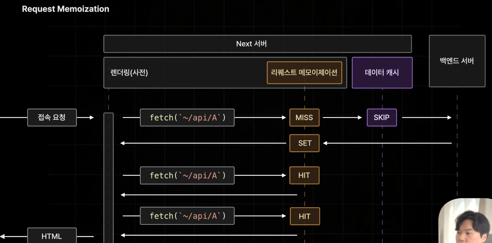
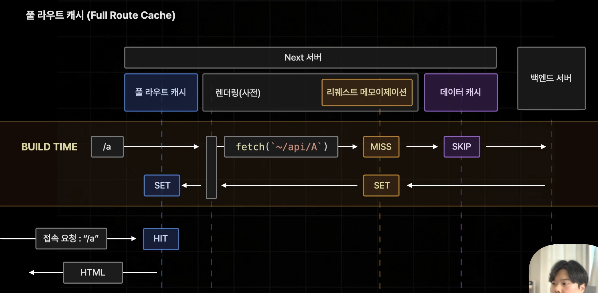
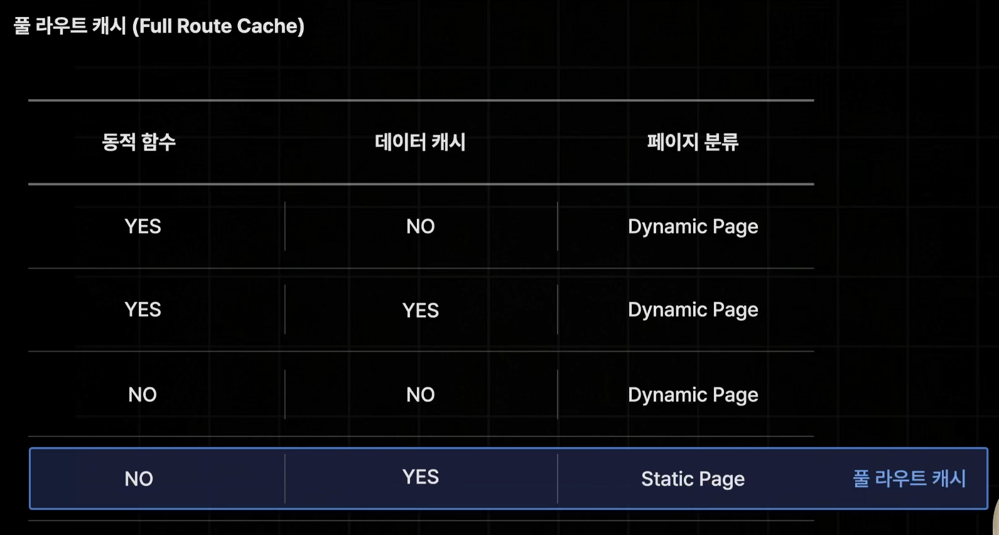
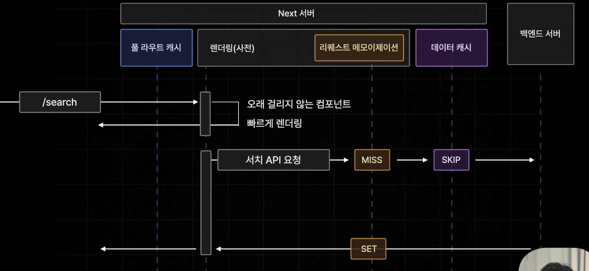
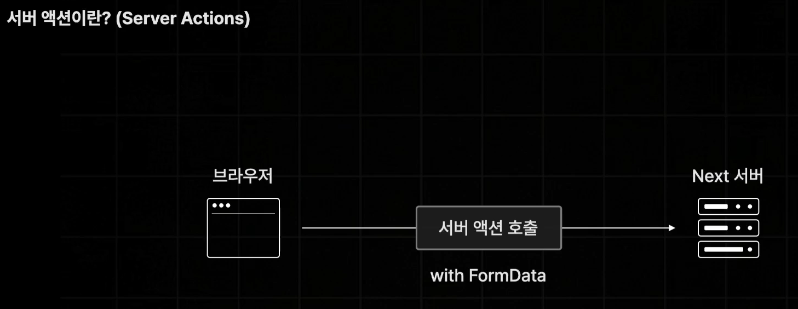
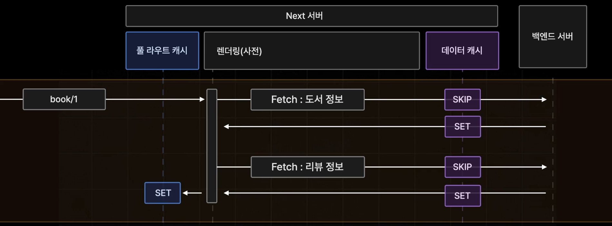

# 앱 라우터

- 앱라우터에서는 페이지 데이터가 서버 컴포넌트는 RSC payload로 클라이언트 컴포넌트는 JS bundle로 나뉘어서 동시에 전달된다.
- useSearchParams → 현재 페이지에 전달된 query string값을 꺼내올 수 있다.
  - 페이지 라우터에서는 useRouter().query.q 로 query string을 가져왔지만 앱라우터에서는 라우터객체에 query속성이 없다.
  - 앱라우터에서는 useSearchParams() 사용.
- Next.js 15 버전부터는 searchParams, params 가 Promise로 변경되었습니다. 따라서 이전처럼 params.id로 바로 접근하면 데이터를 가져오지 못하거나 에러가 발생합니다. 반드시 await를 사용하여 데이터를 먼저 풀어주어야(Unwrap) 합니다.
- 빌드할때 useSearchParams같이 빌드타임에는 값을 알수없는 훅을 실행하려고 하면 에러난다.
  → 오직 클라이언트측에서만 실행되도록 Suspense안에서 실행
  - Suspense 안에 있으면 사전 렌더링에서 제외되므로 오류나지 않음
    - 해당 컴포넌트의 비동기 작업이 종료될때까지 미완성 상태로 남아있음(로딩중 보여주고)
    - useSearchParams()는 비동기로 동작하는 훅
- favicon은 public/이 아닌 app/아래에 놓는다.

```tsx
import { ReactNode } from "react";
import Searchbar from "../../components/searchbar";

export default function Layout({ children }: { children: ReactNode }) {
  return (
    <div>
      <Suspense fallback={<div>Loading...</div>}>
        <Searchbar /> // 클라이언트 측에서 쿼리스트링을 불러올수 있을때까지
        suspense
      </Suspense>
      {children}
    </div>
  );
}
```

## 라우팅 설정

- page라는 이름의 파일만 페이지 라우터로 취급
  
  

- query string, url parameter 등이 페이지 컴포넌트의 props로 전달된다. Promise 객체 타입에 프로퍼티로 담겨있다.
  - Promise 객체는 반드시 await로 먼저 결과를 확정한 뒤에 프로퍼티에 접근해야 합니다.
  - note:
    - Promise는 비동기 작업의 결과물입니다. 데이터를 요청하자마자 바로 주는 게 아니라 "나중에 줄게"라는 영수증을 먼저 주는 것과 같아요. await를 붙이면 자바스크립트가 "알았어, 결과가 나올 때까지 다음 줄로 안 넘어가고 기다릴게"라고 동작하게 됩니다.

- Co-Location
  - 필요한 컴포넌트들을 페이지 파일과 함께 모아둘 수 있다. app/아래 같이 두면 됨. 따로 page/ 만들어서 구분할 필요 없음

## layout

- layout 의 children은 페이지 컴포넌트
- `(폴더명)`: 라우트 그룹
  - 경로에는 영향을 미치지 않는 폴더
  - 경로는 그대로 두고 공통 레이아웃만 적용할 때 사용

## 서버 컴포넌트(RSC)

- 앱라우터 디폴트 컴포넌트
- 서버측에서만 실행되는 컴포넌트(브라우저에서 실행안됨)
  - async function: 서버컴포넌트는 서버측에서 사전렌더링을 위해 한번만 실행되므로 비동기 async여도 문제가 되지 않는다.
- 서버 컴포넌트: 특정페이지에 필요한 여러 컴포넌트 중 JS상호작용이 없어서 서버측에서만 실행되면 되는 컴포넌트
- 클라이언트 컴포넌트: 특정페이지에 필요한 여러 컴포넌트 중 JS상호작용이 있어서 하이드레이션이 필요하기 때문에 서버와 브라우저에서 각각 한번씩 실행되어야 하는 컴포넌트
- 서버컴포넌트와 클라이언트 컴포넌트를 분류하면 넥스트서버가 브라우저로부터 접속 요청 받아서 사전 렌더링에서 HTML생성할때는 서버+클라이언트 컴포넌트 한번 실행 → 이후 하이드레이션 위해 컴포넌트들 모아 JSBundle로 전달할때는 서버 컴포넌트는 빼고 클라이언트 컴포넌트들만 전달
- 넥스트는 페이지의 대부분을 서버 컴포넌트로 구성하고 필요한 경우에만 클라이언트 컴포넌트를 사용할 것을 권장
  - 클라이언트 컴포넌트가 줄어들수록 JS bundle용량도 줄어들기 때문
- 상호작용이 있어야하면 클라이언트 컴포넌트, 그렇지 않다면 모두 서버컴포넌트로 만든다.
- secretKey를 서버컴포넌트에서 사용해도 브라우저에는 전달되지 않아서 보안 문제가 발생하지 않는다.
- 데이터 fetching 가능
- useEffect같은 브라우저에서만 실행 가능한 리액트 훅 호출 불가

### 서버 컴포넌트 주의사항

#### 1. 서버 컴포넌트에는 브라우저에서 실행될 코드가 포함되면 안된다.

- 브라우저에서 동작하는 훅(useState, useEffect 등) 사용 불가
- 이벤트 핸들러 사용 불가
- 브라우저에서 실행되는 기능을 담고 있는 라이브러리 호출 불가

#### 2. 클라이언트 컴포넌트는 클라이언트에서만 실행되지 않는다.

#### 3. 클라이언트 컴포넌트에서 서버 컴포넌트를 import 할 수 없다.

- 브라우저에서 하이드레이션을 위해 실행될때, 서버컴포넌트는 존재하지 않기 때문(JS bundle에서 제외). 없는 코드는 import 불가
- 만약 실수로 클라이언트 컴포넌트에서 서버 컴포넌트를 import하는 코드를 작성하면 넥스트는 자동으로 서버 컴포넌트를 클라이언트 컴포넌트로 변경한다. 개발 도중 매번 오류나면 흐름이 막히기 때문.
- 서버 컴포넌트가 클라이언트 컴포넌트가 되면 JS bundle에 포함.
- 때문에 클라이언트의 자식으로, 즉, 클라이언트에서 서버컴포넌트를 return하는 것은 웬만하면 피하도록 한다.
- 만약, 어쩔수 없이 클라이언트 컴포넌트에서 서버 컴포넌트를 return해야한다면(자식으로 둬야한다면) 서버컴포넌트를 클라이언트 컴포넌트에서 import하지 말고 children prop으로 받는다. → 넥스트는 children으로 전달된 서버 컴포넌트는 클라이언트 컴포넌트로 변경하지 않는다. children으로 받으면 클라이언트 컴포넌트는 서버 컴포넌트를 직접 실행할 필요가 없기 때문

```tsx
export default function Home() {
  return (
    <ClientComponent>
      <ServerComponent />
    </ClientComponent>
  );
}

export default function ClientComponent({ children }: { children: ReactNode }) {
  return <div>{children}</div>;
}
```

#### 4. 서버 컴포넌트에서 클라이언트 컴포넌트에게 직렬화 되지 않는 Props는 전달 불가하다.

- 직렬화(serialization)
  - 객체, 배열, 클래스 등 복잡한 구조의 데이터를 네트워크 상으로 전송하기 위해 아주 단순한 형태(문자열, Byte)로 변환하는 것
  - 자바스크립트 함수는 직렬화가 불가능함
    - 클로저, 렉시컬 스코프 등 다양한 환경에 의존해 있는 경우가 많기 때문에 단순한 문자열이나 바이트 형태로 변환할 수 없음
- 직렬화 되지 않는 Props
  - 함수 같은 값은 서버 컴포넌트에서 클라이언트 컴포넌트로 props 전달 불가

- 넥스트의 사전 렌더링 과정
  - 서버 컴포넌트가 먼저 실행 → → RSC payload(JSON과 비슷한 형태의 문자열)생성 → 클라이언트 컴포넌트들이 뒤이어 실행 → RSC payload + 클라이언트 컴포넌트 ⇒ HTML 페이지 완성
  - RSC payload: RSC의 순수한 데이터(결과물). RSC를 직렬화 한 결과 - RSC payload에는 서버 컴포넌트의 모든 데이터가 포함되어있다.
  - 서버 컴포넌트의 렌더링 결과 - 연결된 클라이언트 컴포넌트의 위치 - 클라이언트 컴포넌트에게 전달하는 Props값 등
    

## Navigating(페이지 이동)

- 페이지 이동은 CSR 방식으로 처리 (페이지 라우트와 동일)
- 페이지 이동에 필요한 번들파일 받아오는 시간 줄이기 위해 Pre fetching(이동할 페이지 데이터를 미리 불러옴)
  - rsc + js bundle
- 단, 앱라우터에서는 페이지 이동시에 JS bundle뿐 아니라 RSC payload도 함께 전달
  - JSBundle에는 클라이언트 컴포넌트들만 포함되기 때문
  - 서버컴포넌트를 실행한 결과물인 RSC payload도 함께 보냄
    
- 서버컴포넌트로만 되어있다면 페이지 이동시 JS bundle에 포함될 클라이언트 컴포넌트가 없으므로 그냥 rsc페이로드만 전달
  - 클라이언트 컴포넌트를 리턴한다면 해당 컴포넌트(페이지)로 이동 시 JS bundle도 전달되는 것 확인

### programmatic navigating

- link태그가 아닌 이벤트 핸들러 등을 통해 이동
- `import { useRouter } from "next/navigation";`

### Static vs Dynamic page

- 앱라우트에 존재하는 모든 페이지는 Static 또는 Dynamic 페이지로 나뉜다.
- 페이지 유형에 따라 프리패칭의 동작도 달라진다.
- Static → RSC, JS bundle
  - SSG 방식으로 빌드타임에 미리 생성된 정적 페이지
  - static 페이지는 데이터 업데이트가 추가로 필요하지 않으니까 RSC+JSbundle 둘 다 불러온다.
  - 기본적으로 모든 페이지가 static으로 설정. 만약 페이지 내부에서 query string, url parameter 등을 꺼내 쓰는 등 빌드타임에 생성하면 안될 것 같은 동작을 수행하면 자동으로 dynamic 페이지로 설정
- Dynamic → RSC
  - SSR 방식으로 브라우저가 요청을 보낼때마다 생성하는 동적 페이지
  - dynamic 페이지는 데이터 업데이트가 향후에 필요할수 있으니까 일단 RSC만 프리패칭하고 JS bundle은 실제 페이지 이동이 발생했을때 불러온다.

## 데이터 페칭

### 페이지 라우터


- 페이지 라우터에서는 Page 컴포넌트 안에 데이터 패칭 로직을 작성하면 서버 뿐 아니라 브라우저에서도 한번 더 실행되기 때문에 서버측에서만 데이터를 불러오기 위해서 getServerSideProps, getStaticProps 같은 특수한 함수를 이용해야한다.
  → 서버측 모든 데이터는 컴포넌트 트리 최상단에 위치하는 Page컴포넌트에게만 props로 전달되다보니 props drilling

### 앱 라우터

- 클라이언트 컴포넌트에는 Async 키워드 사용 불가 → 브라우저에서 동작 시 문제를 일으킬 수 있기 때문에(props전달이나 memoization 차원에서)
- 서버컴포넌트는 브라우저에서는 실행되지 않으므로 Async 키워드 붙여서 비동기 함수로 사용가능
  → await 키워드와 함께 컴포넌트 내부에서 직접 데이터 패칭 → 각 컴포넌트가 필요한 데이터 패칭하면 되므로 props drilling 할 필요 없음.
- getServerSideProps, getStaticProps 같은 특수한 함수 사용하지 않는다.

## 데이터 캐시

- fetch 메서드를 통해 불러온 데이터를 Next 서버에 보관하는 기능
- fetch의 두번째 인수
  - axios 등 HTTP 리퀘스트 라이브러리에서는 활용할 수 없음. 오직 fetch 메서드에서만 활용 가능
  - 넥스트의 fetch 메서드는 데이터 캐시 등의 기능을 추가해 일반 fetch메서드를 확장한 것.
- 영구적으로 데이터를 보관해 불필요한 데이터 페칭을 방지하거나 특정 시간을 주기로 갱신 시키는 것도 가능
- 캐시 옵션
  - no-store: 데이터 패칭 결과 저장하지 않음. 캐싱을 아예 하지 않도록 설정. v15기본값
    
  - force-cache: 요청 결과 무조건 캐싱. 한번 호출된 이후에는 다시는 호출하지 않음. 캐싱된 데이터는 JSON형태로 넥스트 서버에 보관(.next/cache/fetch-cache/)
    
  - {next: {revalidate: 3}}
    - 특정 시간을 주기로 캐시 업데이트(3초 주기로 업데이트)
    - 페이지 라우터의 ISR 방식과 유사
    - 3초 지나고 첫 요청은 우선 stale한 데이터라도 먼저 보내고 업데이트

  [data cache revalidate](./assets/cache-revalidate.png)
  - {next: {tags: ['a']}}
    - on-Demand Revalidate
    - 요청이 들어왔을 때 데이터를 최신화

```ts
const res = await fetch(`~/api`, { cache: "no=store" });
const res = await fetch(`~/api`, { cache: "force-cache" });
const res = await fetch(`~/api`, { cache: { next: { revalidate: 3 } } });
const res = await fetch(`~/api`, { cache: { next: { tags: ["a"] } } });
```

### Request Memoization

- 데이터 캐시로 데이터 패치를 최적화
- 넥스트가 하나의 페이지를 렌더링하는 동안에 발생하는 중복된 API요청을 자동 캐싱.
  
  
- request memoization은 데이터 캐시와 다르다.
  - 하나의 페이지를 렌더링 하는 동안 중복된 API요청을 캐싱하기 위해 존재.
  - 하나의 요청으로 받은 데이터를 동일한 페이지의 모든 컴포넌트에서 사용할수 있음
  - 렌더링이 종료되면 모든 캐시가 소멸된다. (새로고침 누르면 다시 API 요청)


- 서버 컴포넌트가 도입되면서 컴포넌트가 각각 필요한 데이터를 패칭하다보니 API 중복 호출되는 경우 종종 있었음.
- 데이터 캐시는 백엔드 서버로 부터 불러온 데이터를 거의 영구적으로 보관하기 위해 사용. 서버 가동중에는 영구적으로 보관된다.

### Full Route Cache

- 넥스트 서버가 빌드타임에 특정 페이지 렌더링 결과를 캐싱하는 기능
- SSG와 유사
- 넥스트의 모든 페이지는 static 또는 dynamic으로 분류. 단, 서버 컴포넌트만 해당됩니다. (클라이언트 컴포넌트는 페이지 유형에 영향을 미치지 않음) 즉, Next.js가 페이지를 빌드할 때, 해당 페이지가 정적인지 동적인지를 결정하는 기준은 오직 서버 컴포넌트의 동작에만 달려 있다.
  - static page: dynamic 페이지가 아니면 기본적으로 모두 static page (default)
  - dynamic page: 특정 페이지가 접속 요청을 받을때마다 매번 변화가 생기거나 데이터가 달라질 경우
    - 1. 캐시되지 않는 data fetching을 사용할 경우 (revalidate option은 다이나믹 페이지를 만드는 옵션 아님)
    - 2. 동적함수(cookies(), headers(), searchParams)를 사용하는 컴포넌트가 있을 때

- 그 중 static page에만 full route cache가 적용.
  
  

- full route cache도 revalidate이 가능하다. (ISR처럼)
  - 페이지를 구성하는 서버 컴포넌트 중 하나라도 fetch요청에 revalidate이 되어있다면 데이터가 revalidate되면서 자동으로 풀 라우트 캐시도 revalidate된다.


- 동적 경로를 갖는 페이지를 static 페이지로 설정하려면 generateStaticParams 사용
- generateStaticParams를 사용하면 페이지 내부에 데이터 캐싱이 설정되지 않은 데이터 패칭이 존재해도 무조건 해당 페이지는 static 페이지가 된다.
- 정적으로 추가하지 않은 경로(dynamicParams)는 다이나믹 페이지로 실시간 생성되고 full route cache로 저장된다.
  - 처음 접속 시 실시간으로 생성되지만, 생성된 결과물이 재사용 가능하다면(Static한 데이터라면) Full Route Cache에 저장됩니다.
  - "정적으로 추가하지 않은 경로"는 보통 다이나믹 라우팅([id])에서 generateStaticParams로 미리 정의하지 않은 ID를 가진 페이지를 의미합니다. 이 경우의 동작은 설정에 따라 달라집니다.
    - case A: dynamicParams = true (기본값) 빌드 시점에 정의되지 않은 id로 접속하면, 서버는 그 즉시 해당 페이지를 실시간으로 생성합니다. 이때 생성된 결과는 Full Route Cache에 저장됩니다. 이후 같은 id로 접속하는 사용자들은 캐싱된 결과물을 받게 됩니다. 즉, 처음만 다이나믹하게 생성하고 이후부터는 스테틱하게 작동하는 것입니다.
    - case B: 완전한 Dynamic 페이지 (예: searchParams 사용) 아까 만드신 검색 페이지처럼 접속할 때마다 내용이 바뀌어야 하는 페이지는 Full Route Cache가 생성되지 않습니다. 매번 서버에서 새로 그려야 하기 때문입니다.

```tsx
export function generateStaticParams() {
  return [{ id: "1" }, { id: "2" }, { id: "3" }];
}
```

- 가능하면 페이지를 static으로 두고 풀 라우트 캐시 이점을 누리도록.

- 만약 정적으로(generateStaticParams) 지정한 url 외 경로는 다 NotFound로 보내고 싶다면 dynamicParams라는 변수 값을 false.

```ts
export const dynamicParams = false; // 기본값은 true
```

## 라우트 세그먼트 옵션

- 특정 페이지의 캐싱이나 revalidate, 서버의 리전 설정 등의 동작을 강제로 설정할수 있는 옵션
  - dynamicParams도 route segment option이다.
- 특정 페이지에 악속된 이름의 변수를 선언하고 값을 설정해 export
- dynamic
  - 특별한 상황이 아니라면 사용이 권장되진 않음
  - 특정 페이지의 유형을 강제로 Static, Dynamic 페이지로 설정하는 옵션
  - 이 옵션을 사용하면 페이지 내부의 동적함수나 데이터캐시 유무를 떠나서 강제로 해당 페이지를 static 또는 dynamic으로 설정
  - auto: 기본값. 아무것도 강제하지 않음
  - force-dynamic: 강제로 페이지를 dynamic 페이지로 설정
  - force-static: 강제로 페이지를 static 페이지로 설정
    - 동적함수들은 undefined, 즉 빈값을 반환하도록 자동 설정됨
    - cache: no-store 였다면 강제로 캐싱 되도록 변경됨
  - error: 페이지를 강제로 Static 페이지로 설정. 단, static으로 설정하면 안되는 이유가 있다면 빌드 오류 발생

## 스트리밍

- 보내야하는 데이터가 너무 크거나, 보내는 시간이 너무 오래걸릴때 데이터를 잘게 쪼갠 후 쪼개진 작은 용량 데이터들을 하나씩 클라이언트에 전송하는 기술
- 넥스트는 HTML을 스트리밍한다.
  - 특정 페이지를 렌더링할때 비동기 작업이 없어서 빠르게 렌더링될 수 있는 컴포넌트부터 먼저 렌더링해서 브라우저에 보내고 오래걸릴것 같은 UI는 로딩스피너 등 대체 UI 보여주다가 서버 측에서 컴포넌트의 렌더링이 완료되면 따로 전달
- dynamic page에 자주 사용된다.
  - dynamic page는 full route cache가 되지 않기 때문에.



### 페이지(Page 컴포넌트) 스트리밍

- 해당 페이지와 동일한 위치에 대체 UI loading.tsx 만들면 해당 페이지는 스트리밍 되도록 자동 설정된다. → 페이지 컴포넌트가 아닌 그 외 레이아웃 컴포넌트들 먼저 보여줌
- 동일한 경로에 있는 페이지 컴포넌트 뿐 아니라 layout처럼 해당하는 경로 아래에 있는 모든 비동기 페이지 컴포넌트들이 다 스트리밍 되도록 설정.
- loading.tsx 파일이 스트리밍 하도록 설정하는 페이지 컴포넌트는 모든 페이지 컴포넌트가 아니라 async라는 키워드가 붙어서 비동기로 작동하는 페이지 컴포넌트에만 스트리밍을 제공한다.
  - 비동기 컴포넌트가 아니라면 데이터를 불러오고 있지 않다는 뜻이니까
- loading.tsx는 무조건 페이지 컴포넌트에만 스트리밍을 적용할수 있다.
- loading.tsx는 브라우저에서 쿼리스트링만 변경될때는 트리거되지 않는다. 페이지의 경로가 바뀐게 아니라 쿼리스트링 값만 바뀐것이기 때문에 스트리밍이 동작하지 않음 → 이런 경우에도 스트리밍이 동작하게 만들고 싶다면 리액트 suspense 활용

```tsx
export default async function Page(){}
export default function Page(){} 는 스트리밍 안됨
```

### 컴포넌트 스트리밍

- page 컴포넌트가 아닌 컴포넌트에 스트리밍을 적용하고 싶다면 리액트 suspense 컴포넌트 사용
- suspense도 브라우저에서 쿼리스트링만 변경될때는 트리거되지 않는다.
  - 단, suspense는 key값이 변할때마다 다시 로딩상태가 되도록 설정할 수 있다. key값으로 쿼리스트링을 넣으면 쿼리스트링이 변할때마다 로딩상태 다시 표시.
- suspense를 사용하면 하나의 컴포넌트를 스트리밍하도록 설정할 수 있을 뿐 아니라 하나의 페이지내에서 여러 개의 비동기 컴포넌트들을 동시 다발적으로 스트리밍할 수 있다.
- 스트리밍은 static page가 아닌 dynamic 페이지에 적용해야한다.

## 에러 핸들링

- 같은 위치에 error.tsx → 같은 경로 또는 하위 경로 페이지에서 오류가 발생하면 이 error 컴포넌트가 페이지 컴포넌트대신 화면에 출력
- 같은 경로에 있는 layout까지만 렌더링
- 'use client' → 서버, 클라이언트 어느쪽에서 발생한 오류든 대응할 수 있도록. 클라이언트 컴포넌트는 서버측에서도 실행되고 클라이언트측에서도 실행되니까.
- error, reset prop 제공
  - reset: error가 발생한 페이지를 복구하기 위해 다시 컴포넌트들을 렌더링 시켜보는 기능을 가진 함수. 서버컴포넌트를 다시 실행하진 않고, 그냥 브라우저측에서만 현재 서버로부터 받은 데이터를 이용해 화면을 다시 렌더링 해보기만 하는 메서드. → 클라이언트 컴포넌트 내부에서 발생한 오류만 복수할 수 있다.
  - 새로고침 하고 싶다면 window.location.reload()
    - 근데 이렇게 하면 브라우저에 보관했던 state나 클라이언트 컴포넌트들의 각종 데이터들이 아예 날라가고, 에러가 발생하지 않은 레이아웃이나 또 다른 컴포넌트들까지 다시 렌더링되므로 아주 좋은 방법은 아니다.
  - 따라서 오류가 발생한 부분만 다시 렌더링하고 싶다면 useRouter().refresh() 사용
    - useRouter().refresh(): 현재 페이지에 필요한 서버 컴포넌트들을 다시 불러오고 그 결과값을 화면에 업데이트(넥스트 서버측에 다시 실행해서 그 결과인 RSC payload를 다시 줄것을 요청)
      - 비동기적으로 동작. 하지만 refresh 의 반환값이 promise가 아닌 void이므로 await, async를 사용 못함
      - startTransition(): callback을 인수로 받아 callback안에 들어있는 UI를 변경하는 작업들을 모두 일괄적으로 동시에 처리.
        때문에 startTransition(()=>{useRouter().refresh(); reset();}) 이렇게 사용.
    - reset(): 에러 상태를 초기화, 컴포넌트들을 다시 렌더링
      - 에러상태는 클라이언트 컴포넌트이기 때문에.
    - 브라우저 APi를 사용해 새로고침 하는 것이 아니라 라우터 객체의 refresh를 호출해 next-server에게 서버 컴포넌트만 새롭게 렌더링해달라고 요청한 후, props로 전달받은 reset()을 그 뒤에 호출. → refresh로 전달받은 새롭게 렌더링된 서버 컴포넌트 데이터를 화면에 reset으로 새롭게 다시 렌더링.

## 서버 액션

- 브라우저에서 직접 호출할 수 있는 서버에서 실행되는 비동기함수
- "use server"
- 서버 액션을 사용하면 별도의 API를 만들 필요 없이 간단한 함수 하나 만으로도 브라우저에서 넥스트 서버 측에서 실행되는 함수를 직접 호출할 수 있다.
- 클라이언트인 브라우저에서 특정 폼의 제출 이벤트가 발생했을 때 서버에서만 실행되는 함수를 브라우저가 직접 호출해 실행하고, 데이터까지 폼데이터 형식으로 전달할 수 있게 해주는 기능
- 기존에 API를 통해서만 진행했어야 했던 브라우저와 서버 간의 데이터 통신을 자바스크립트 함수 하나만으로 간결하게 설정.



```tsx
export default function Page() {
  // 사용자가 input에 입력한 모든 값들이 formData 형식으로 묶여서 saveName함수의 매개변수로 전달
  const saveName = async (formData: FormData) => {
    "use server";

    const name = formData.get("name");
    await saveDB({ name: name }); // 데이터베이스에 데이터 저장
    await sql`INSERT INTO Names (name) VALUES (${name})`; // 또는 SQL문을 직접 실행해서 데이터 추가
  };

  return (
    <form action={saveName}>
      <input name="name" placeholder="이름을 알려주세요..." />
      <button type="submit">제출</button>
    </form>
  );
}
```

- submit하면 서버액션을 호출하는 request가 서버에게 날라간다.
- 서버액션들은 컴파일 결과 자동으로 특정한 해시값을 갖는 API로서 설정된다.
- 때문에 브라우저에서 서버액션을 호출할 때 request headers에 Next-Action 이란 이름으로 호출하고자하는 서버 액션의 해시 값까지 함께 명시가 된다.
  <br/>submit후 개발자도구 > 네트워크탭 > Headers > Request Headers > Next-Action
- 즉, 서버액션을 만들면 그 안의 내용을 실행하는 API가 자동으로 생성되는 것. 그리고 브라우저에서 폼 태그를 제출했을때 자동으로 그 API가 호출되는 것.
- 개발자도구 > 네트워크탭 > Payload > Action ID(현재 호출하려는 서버 액션의 해시값)
- 서버액션은 오직 서버측에서만 실행되기때문에 브라우저에서는 호출만 할 수 있을 뿐 코드를 전달받지 않는다. 때문에 보안상으로 민감하거나 중요한 데이터를 다루기 유용.

## 다양한 재검증 방식 살펴보기 (넥스트 서버측에서)

### revalidatePath, revalidateTag, updateTag

1. 특정 주소의 해당하는 페이지만 재검증

- revalidatePath를 사용하면 리렌더를 통해 서버액션의 결과를 화면에 바로 나타낼수 있다.
  - 인수로 전달한 경로 페이지 재검증(재생성). book/id의 페이지 컴포넌트 리렌더. return하는 BookDetail, ReviewEditor, ReviewList모두 리렌더.
  - revalidatePath는 오직 서버측에서만(서버액션내부, 서버컴포넌트내부) 호출 가능
  - revalidatePath는 해당 페이지에 포함된 모든 캐시를 무효화시킨다. (force-cache로 되어있어도)
  - data cache뿐 아니라 페이지 자체를 캐싱하는 full route cache도 함께 삭제된다. 즉, 새롭게 생성된 페이지를 다시 full route cache에 저장하지 않는다. → revalidatePath 이후 새로고침하면 cache된 데이터를 사용할 수 없으니까 넥스트 서버측에서 실시간으로 다이나믹 페이지 만들 듯 새롭게 페이지를 생성해서 브라우저에 보내준다. → 그럼 그때 full route cache로 새로 업데이트.
    - full route cache는 빌드 후 .next > server > app > 해당 파일, 폴더 로 확인가능
  - 결론적으로 revalidatePath를 사용해 페이지 재검증을 요청하면 다음번에 이 페이지에 방문할때 실시간으로 다이나믹 페이지처럼 생성되고 그때가 되서야 full route cache에 데이터가 업데이트된다.

```tsx
revalidatePath(`/book/${bookId}`);
```



- 빌드타임이 종료되고 revalidatePath로 재검증 요청 → full route cache, data cache 제거 → 현재 사용자가 보고있는 화면을 업데이트하기 위해 새롭게 페이지 생성: 이때는 full route cache에 페이지가 업데이트되지 않는다. → 모든 과정이 종료되고 브라우저로부터 다음번에 요청이 들어왔을때 실시간으로 다시 페이지 생성하면서 이때 full route cache에 페이지 업데이트. 이때는 dynamic page처럼 실시간으로 페이지가 생성되다보니 비교적 느린 응답이 올 수 있다.
- 이렇게 동작하는 이유는 revalidate 요청 이후 브라우저에서 이 페이지에 접속했을때 무조건 최신화된 데이터를 보장하기 위해.


- revalidatePath의 두번째 인수로 layout 또는 page를 넘길수 있다.

2. 특정 경로의 모든 동적페이지를 재검증

- 첫번째 인수로 폴더경로, 두번째 인수로 page
- /book/[id] 를 갖는 모든 동적페이지들이 재검증

```tsx
revalidatePath(`/book/[id]`, "page");
```

3. 특정 레이아웃을 갖는 모든 페이지 재검증

```tsx
revalidatePath(`/(width-searchbar)`, "layout");
```

4. 모든 데이터 재검증

```tsx
revalidatePath(`/`, "layout");
```

5. 태그값을 기준으로 데이터 캐시 재검증

- revalidateTag 사용 (인수로 태그값 전달)
- data cache의 4번째 옵션인 `{next: {tags: [`review-${bookId}`]}}` 는 해당 데이터 fetch에 특정 태그를 붙이는 옵션.
  - 붙은 태그를 통해 데이터 캐시를 초기화하거나 재검증
- 오직 태그값을 갖고 있는 fetch 메서드의 데이터 캐시만 삭제하고 리렌더하므로 훨씬 경제적으로 데이터 캐시 재검증

```tsx
// revalidateTag메서드가 호출되면 `review-${bookId}` 값을 갖는 모든 데이터 캐시가 재검증
revalidateTag(`review-${bookId}`, "max");
```

- Next.js 15 버전부터 revalidateTag(tag)와 같이 인자를 하나만 사용하는 방식은 deprecated(사용 중단)되었습니다. 이제는 재검증 동작을 정의하는 두 번째 인자를 필수적으로 전달해야 합니다.
  - 가장 권장되는 방식은 두 번째 인자로 "max"를 추가하는 것입니다. 이렇게 하면 백그라운드에서 데이터를 신선하게 유지하는 SWR(Stale-While-Revalidate) 방식으로 동작합니다.
  - 즉각적인 만료가 필요한 경우: 두 번째 인자로 { expire: 0 }을 전달하면 캐시를 즉시 만료시킵니다.
  - 서버 액션 내에서 즉시 반영을 원하는 경우: revalidateTag 대신 updateTag를 사용하면 현재 페이지의 데이터를 즉시 만료시키고 새로 가져옵니다.

- Next.js 15 캐시 재검증 API 비교 (`revalidateTag` vs `updateTag`)

| 구분            | `revalidateTag(tag, profile)`                | `updateTag(tag)`                                                                                |
| :-------------- | :------------------------------------------- | :---------------------------------------------------------------------------------------------- |
| **핵심 개념**   | **SWR** (Stale-While-Revalidate)             | **즉시 만료** (Immediate Expiry)                                                                |
| **동작 방식**   | 기존 캐시를 보여주며 백그라운드에서 갱신     | 캐시 즉시 만료 및 다음 요청 시 새 데이터 강제                                                   |
| **사용 환경**   | 서버 액션, 라우트 핸들러 등 모든 서버 환경   | **오직 서버 액션(Server Action)** 내부                                                          |
| **UI 업데이트** | 백그라운드 갱신으로 화면 반영이 한 템포 늦음 | **즉시 반영** (Read-Your-Own-Writes 지원)                                                       |
| **필수 인자**   | 두 번째 인자(`profile`) 필수 (예: `"max"`)   | 태그명(`tag`) 하나만 전달                                                                       |
| **권장 용도**   | 외부 시스템 웹훅, 주기적인 데이터 갱신       | **리뷰 작성**, 게시글 수정 등 사용자 액션. 사용자가 본인이 한 행동의 결과를 즉시 확인해야 할 때 |

- 사용자의 직접적인 액션(등록, 수정) 후에는 updateTag를, 주기적이거나 간접적인 데이터 갱신에는 revalidateTag를 선택

## 클라이언트 컴포넌트에서의 서버 액션

- 서버액션을 서버컴포넌트가 아닌 클라이언트 컴포넌트에서 호출해 로딩상태 설정, 에러 핸들링 등
- 리뷰 작성후 버튼 누르고 나서 로딩처리가 되어있지 않아 중복 요청이 갈 수 있다.
  <br/>→ 중복 요청을 방지하기 위한 로딩 상태(Pending state) 처리를 하려면, 현재로서는 버튼이나 폼 부분을 클라이언트 컴포넌트로 분리하는 것이 가장 표준적인 방법. Next.js(React 19)에서 제공하는 로딩 상태 확인 훅(useFormStatus, useActionState)들은 모두 훅(Hook)이기 때문에 클라이언트 컴포넌트("use client")에서만 동작하기 때문입니다.
- useActionState
  - form 상태를 핸들링하는 여러 기능을 가지고 있다.
  - 첫번째 인수: 핸들링하려고 하는 폼의 액션 함수
  - 두번째 인수: 상태 초기값
  - 배열형태로 3개의 값 반환(해당 form의 state, 해당 폼의 action인 formAction, 해당폼의 로딩상태인 isPending )
- useActionState를 사용한다면 form에 action함수를 직접 사용하지 않고 useActionState로 받은 formAction을 사용
  - form submit → formAction실행 → useActionState 가 인수로 받은 서버액션함수 실행
- 서버액션을 useActionState로 감싸 사용할때는 서버액션에서 첫번째 매개변수로 state를 받아와야한다.
  - state값을 사용하지 않을때는 \_ 언더바로 표시

- isPending
  - 해당 서버 액션이 현재 실행중인지 아닌지 의미

- form요소의 경우 되도록 클라이언트 컴포넌트로 만들고 useActionState를 적극 활용.
  - 에러처리는 보통 아래와 같이 한다.
  ```tsx
  useEffect(() => {
    if (state && !state.status) {
      alert(state.error);
    }
  }, [state]);
  ```

```tsx
export default function ReviewEditor({ bookId }: { bookId: string }) {
  const [state, formAction, isPending] = useActionState(
    createReviewAction,
    null,
  );

  return (
    <section>
      <form className={style.form_container} action={formAction}>  //action={createReviewAction} 말고
        <input name="bookId" value={bookId} hidden readOnly />
          <textarea
            disabled={isPending}
            required
            name="content"
            placeholder="리뷰내용"
          />
          <div className={style.submit_container}>
            <input
              disabled={isPending}
              required
              name="author"
              placeholder="작성자"
            />
            <button disabled={isPending} type="submit">
              {isPending ? "..." : "작성하기"}
            </button>
          </div>
      </form>
      ...
```

## Parallel Route (병렬 라우트)

- 여러개의 페이지 컴포넌트를(page.tsx) 병렬로 함께 렌더링하는 기능
- slot : @폴더
  - 병렬로 렌더링 될 하나의 페이지 컴포넌트를 보관하는 폴더
  - slot/page.tsx는 자신의 부모 layout에게 props로 자동 전달된다. 이때 prop의 이름은 슬롯의 이름이다.
- slot폴더는 url경로에 아무런 영향도 미치지 않는다.
- slot에는 개수 제한이 없다.
- slot에 하위 페이지를(e.g. @/feed/setting) 추가로 만들수 있다. → slot의 하위페이지는 별도의 페이지로 따로 렌더링 되는게 아니라 그냥 부모 layout 컴포넌트에 함께 포함되어 부모 slot안에서 페이지가 렌더링된다. 즉, feed slot에 해당하는 페이지만 페이지 이동이 이루어진것처럼 동작.

```
/*
<Link href={"/parallel/setting"}>parallel/setting</Link> 클릭했을때

- feed slot의 경우 setting/page.tsx 가 props로 전달된다. @feed/setting/page.tsx
- sidebar slot의 경우 setting.가 없다. 이럴때 넥스트는 그냥 이전 페이지를 유지하도록 처리 @sidebar/page.tsx
- children도 이전 페이지 그대로 유지

결과적으로 feed slot의 페이지만 업데이트되고 나머지 슬롯은 이전 페이지 유지

- 단, 각각의 slot들이 이전페이지를 유지하는 것은 링크 컴포넌트로 브라우저측에서 CSR방식으로 페이지를 이동할때만 한정된다.
- 브라우저 주소창에 url 직접 적으면 404 뜬다. http://localhost:3000/parallel/setting
- http://localhost:3000/parallel/setting 이 경로에 처음 접속하면(새로고침) layout에서 children이나 sidebar, 즉 해당 slot의 이전 값을 모르기 때문이다.
초기 접속하면 이전에 렌더링해둔 페이지가 없으니까.
- 이럴때는 slot별로 렌더링할 페이지가 없을 떄 대신 렌더링할 default page를 만든다. default.tsx
*/
```

## Intercepting Route

- 사용자가 동일한 경로에 접속해도 특정 조건을 만족하면 다른페이지를 렌더링하는 기능
- 조건: 초기접속 요청이 아닐때에만 intercepting route가능 (조건은 직접 설정하는게 아닌 넥스트에서 정해두었음)
  - 초기 접속 요청이 아닌 CSR방식으로 접속했을때. 즉, 링크 컴포넌트나 router.push 로 이동했을때만 기능
- 인스타그램
  - 피드 탐색하다 특정 게시글 클릭하면 원래 보고 있었던 피드페이지 위로 모달 형태로 게시글 상세 페이지를 별도로 띄워 줌으로써 뒤로가기 했을때 탐색하고 있던 피드로 그대로 돌아오도록 만들었다.
  - 게시글 상세 페이지를 새로고침해서 초기접속 요청으로 접속하면 그때는 게시글의 상세페이지로 이동
- `(.)book/[id]` 형태로 폴더 생성
  - (.): book/[id] 경로의 페이지를 가로채라는 뜻
  - (.): 상대경로 (동일한 경로에 있는 book/[id] 경로의 페이지를 가로채라)
    - (..): 상위경로에 있는 폴더를 가로챌때
    - (..)(..): 상위 2단계 위에 있을때
    - (...): app폴더 바로 밑에 있는 폴더를 intercepting

- app/@modal/(.)book/[id]/page.tsx 는 루트 layout의 prop으로 전달된다. modal이라는 이름으로

- parallel route와 intercepting route를 함께 활용
  - intercepting되어서 모달로 나타나게 되는 도서의 상세 페이지를 이전 페이지와 함께 병렬로 보여줄 수 있다. (여기서는 이전 페이지를 백그라운드로)

```
/*
사용자가 book/1 로 접속한다면 원래는 book/1/page.tsx가 렌더링되야하지만
intercepting route가 동작하고 있으므로
children은 그냥 기존의 페이지를(상세페이지 클릭 전 페이지) 유지한다.
그리고 modal이란 값에 intercepting된 페이지 컴포넌트가 들어온다. @/modal/(.)book/[id]/page.tsx
이때 children과 modal(@/modal/(.)book/[id]/page.tsx)이 병렬로 렌더링된다.
*/
```


## 이미지 최적화


- next는 대부분의 최적화 기법들이 자체적으로 제공. next의 Image컴포넌트를 사용하면 위 사진의 최적화기법들 다 적용됨.
  - 뷰포트에 렌더링될 필요 없는 이미지들은 lazy loading
  - Next.js의 Image 컴포넌트가 뷰포트를 기준으로 동작하는 것은 맞지만, 실제로는 사용자가 이미지를 보기 직전에 미리 준비를 끝내야 하기 때문에 뷰포트보다 훨씬 더 넓은 영역의 이미지를 미리 불러옵니다. 단순히 현재 화면에 딱 걸린 이미지만 불러오면 스크롤을 내릴 때 이미지가 뻥 뚫려 보이는 현상이 발생하기 때문입니다.
  - Next.js는 내부적으로 브라우저의 Intersection Observer를 사용하면서 rootMargin이라는 옵션을 설정합니다.
    - 기능: 뷰포트의 경계선을 가상으로 확장하는 역할을 합니다.
    - 동작: 예를 들어 rootMargin이 200px로 설정되어 있다면, 이미지가 뷰포트 안으로 들어오기 200px 전부터 이미 다운로드를 시작합니다.
    - 결과: 사용자가 스크롤을 내렸을 때 이미 이미지가 로딩되어 있어 끊김 없는 경험을 제공합니다.

- Image tag에 width, height 고정적으로 명시. 필요 이상의 큰 이미지를 불러오지 않도록 설정

```tsx
<Image
  src={coverImgUrl}
  width={80}
  height={105}
  alt={`도서 ${title}의 표지 이미지`}
/>
```

- 만약 이미지가 현재 넥스트 프로젝트에 저장된 이미지가 아니라 외부 서버에 보관된 이미지라면 (이 프로젝트는 Naver 쇼핑 API에서 제공하고 있는 이미지) 넥스트의 보안때문에 자동 차단됨 → next.config.mjs 에 오류메시지에 나온 도메인 추가 → 해당 도메인으로부터 제공되는 이미지를 최적화에 포함

```js
import type { NextConfig } from "next";

const nextConfig: NextConfig = {
  logging: {
    fetches: {
      fullUrl: true,
    },
  },
  images: {
    domains: ["shopping-phinf.pstatic.net"],
  },
};

export default nextConfig;


```

## 검색 엔진 최적화 SEO


- route segment option처럼 해당 page component 또는 layout 컴포넌트에 metadata 변수 선언, export 하면 자동으로 그 페이지 메타 데이터 설정
- 트위터를 위한 메타태그들도 우리가 입력한 값을 기반으로 자동으로 설정됨
- 동적인 값을 통해서 메타데이터를 설정해야 하는 경우, metadata 변수를 통해 정적으로 현재 페이지의 메타 데이터를 export할 수는 없다. 대신 동적인 값으로 메타 데이터를 설정할수 있는 generateMetadata()라는 약속된 이름의 함수 사용, 객체형태로 메타데이터 return.

```tsx
export async function generateMetadata({
  searchParams,
}: {
  searchParams: Promise<{
    q?: string;
  }>;
}) {
  // 현재 페이지의 메타데이터를 동적으로 생성하는 역할.
  // Page컴포넌트가 전달받는 매게변수 props를 그대로 전달받을 수 있다.
  const { q } = await searchParams;

  return {
    title: `${q}: 한입북스 검색`,
    description: `${q}의 검색 결과입니다`,
    openGraph: {
      title: `${q}: 한입북스 검색`,
      description: `${q}의 검색 결과입니다`,
      images: ["/thumbnail.png"],
    },
  };
}
```

## 배포

- 백엔드를 배포하고 vercel 서버에서 빌드할때는 기존 .env의 백엔드 서버 url에 접근할 수 없다.
- vercel에서 빌드할때는 배포한 백엔드 서버 url을 사용
  - 배포한 서버 Domains 주소 복사
- 배포한 프론트 프로젝트 settings > environment variables > createnew > 환경변수로 배포한 백엔드 서버 url 추가 등록
  - key값으로 NEXT_PUBLIC_API_SERVER_URL
  - value값으로 https://아까 복사한 서버 도메인 주소
- Redeploy

### vercel이 제공하는 최적화

- 배포한 프론트 프로젝트 settings > Functions > Function Region(어떤 장소에 이 넥스트 프로젝트가 제공될 것인지 설정) > 서울로 변경 > save > 다시 배포 `vercel --prod`
  - 개발자도구 > Network > Headers > X-Vercel-Id > icn1(서울)
