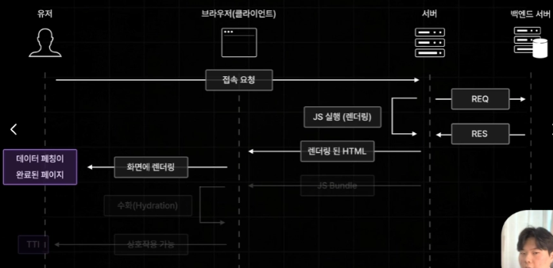

## 2장

### 2.1

- 페이지 라우터
  
  - 현재 많은 기업에서 사용되고 있는 안정적 라우터
  - Pages 폴더의 구조를 기반으로 `React Router`처럼 페이지 라우팅 기능을 제공 → 파일명 기반
- `npx`: node package Executor
- 페이지 라우터의 경우 Next14 버전에서 안정적으로 사용 가능
- `app` 컴포넌트
  - 모든 컴포넌트들의 부모 컴포넌트
  - 전체 페이지에 공통으로 포함되는 헤더 컴포넌트나 레이아웃, 비즈니스 로직 작성 가능
- `document` 컴포넌트
  - 모든 페이지에 공통적으로 적용되어야하는 HTML 코드 설정
  - 리액트 앱의 기존 index.html과 비슷
  - meta 태그, 폰트, charset="utf-8”, 구글 애널리틱스(3rd Party script: 외부 서비스에서 가져와 내 웹에 삽입하는 JS 코드)
- `reactStrickMode`가 켜져있으면 개발 모드 실행 시 컴포넌트 두번 실행하여 디버깅이 불편해짐!

---

### 2.2


- 폴더구조 실습
- [id]/[…id]/[[…id]]

---

### 2.3

- **네비게이팅**: 페이지 이동
- app 안에 네비게이션바
- a태그는 CSR로 페이지를 이동시키는 것이 아닌 서버에 새로운 페이지를 매번 요청하는 방식이라 비교적 느림! 따라서 자체적으로 제공하는 내장 컴포넌트인 Link 이용하기
- **Programmatic navigation**: 함수 이벤트에 따른 이동
- `router.replace(”/”)` : 뒤로가기 방지의 페이지 이동
- `router.back()` : 뒤로가기

---

### 2.4


- `Pre-Fetching`: 페이지를 사전에 불러온다


- **의문**: 사전 렌더링 개념에서 초기 접속 요청 발생 시 서버가 브라우저에게 후속으로 JS Bundle 파일을 불러오기 때문에 초기 접속 요청 종료 이후 페이지 이동 발생 시 브라우저 측에서 직접 JS 코드로 필요한 컴포넌트 교체(`CSR`)로 처리가 된다고 했으나 프리패칭이 필요한가?


- Next는 작성한 모든 리액트 컴포넌트들을 페이지 별로 스플리팅해서 저장해두기 때문에 JS Bundle 파일 전달 시에 모든 페이지에 필요한 JS 코드를 전달하는 것이 아닌 현재 페이지에 필요한 JS Bundle만 전달됨!
- 이유: 모든 페이지의 번들파일 전달 시 용량이 커져 하이드레이션이 늦어짐


- Pre-Fetching을 통해 현재 페이지와 연결된 모든 페이지의 JS Bundle을 불러오게 되어 기존처럼 CSR 장점대로 빠른 속도로 페이지 이동이 가능해짐.
- 최종적으로 초기 접속 요청 시에 하이드레이션을 빠르게 처리할 수 있도록 만들어주면서도 동시에 프리패칭을 통해 초기 접속 요청 이후 페이지 이동까지 빠르게 처리할 수 있는 두마리 토끼를 잡는 방식
- 개발 모드 시에는 프리패칭 동작 X → 빌드해서 실행하는 프로덕션 모드로 실행해야함
- Link 컴포넌트로 구현 시에는 프리패칭이 이루어지지만 router를 통해 이동하는 경우 프리패칭 X

→ `router.prefetch(”/경로”)`를 통해 프리패칭 가능!

- Link 컴포넌트의 프리패칭 해지(잘 사용하지 않을 것을 가정) → `prefetch={false}` prop 추가

### 2.5

`API Routes`: Next.js에서 API를 구축할 수 있게 해주는 기능

- 백엔드 API 서버와 같이 간단한 서버 구축 가능
- 데이터베이스에서 데이터를 꺼내오거나 써드파티에 데이터 불러와서 전달 가능

api 폴더 아래 파일 작성 시 웹페이지를 정의하는 파일이 아닌 api 응답을 정의하는 파일

---

### 2.6 스타일링

다른 css 코드와 충돌이 일어날 수 있어 `index.tsx`에 `index.css`를 바로 import하는 것을 제한하고 있음

```jsx
import style from "./index.module.css";

export default function Home() {
  return <h1 className={style.h1}>인덱스</h1>;
}
```

→ **CSS Module** 사용 : 페이지 별로 `className`이 겹쳐 발생할 수 있는 문제(중복 스타일)를 unique한 `className`으로 바꿔주면서 해결 가능

---

### 2.7

#### 1. GlobalLayout 컴포넌트 (`global-layout.tsx`)

```jsx
import { ReactNode } from "react";
import Link from "next/link";
import style from "./global-layout.module.css";

export default function GlobalLayout({ children }: { children: ReactNode }) {
  return (
    <div className={style.container}>
      <header className={style.header}>
        <Link href={"/"}>📚 ONEBITE BOOKS</Link>
      </header>
      <main className={style.main}>{children}</main>
      <footer className={style.footer}>제작 @yuj2n</footer>
    </div>
  );
}
```

#### 2. CSS Module (`global-layout.module.css`)

```jsx
.container {
  margin: 0 auto;
  box-shadow: rgba(100, 100, 100, 0.2) 0px 0px 29px 0px;
  padding: 0px 15px;
}

.header {
  height: 60px;
  font-weight: bold;
  font-size: 18px;
  line-height: 60px;
}

.header > a {
  color: black;
  text-decoration: none;
}

.main {
  padding-top: 10px;
}

.footer {
  padding: 100px 0px;
  color: gray;
}
```

스타일 적용 실습

---

### 2.8

#### 1. 개별 페이지에서의 설정 (예: `index.tsx`)

#### 2. `_app.tsx` 전체 코드

```jsx
import type { ReactNode } from "react";
import type { NextPage } from "next";
import type { AppProps } from "next/app";

// 1. 레이아웃이 있는 페이지를 위한 타입 확장
type NextPageWithLayout = NextPage & {
  getLayout?: (page: ReactNode) => ReactNode;
};

export default function App({
  Component,
  pageProps,
}: AppProps & { Component: NextPageWithLayout }) {

  // 2. 현재 페이지에 getLayout 메서드가 있는지 확인
  // 없다면 페이지를 그대로 반환하는 기본 함수(page => page) 사용
  const getLayout = Component.getLayout ?? ((page: ReactNode) => page);

  return (
    <GlobalLayout>
      {getLayout(<Component {...pageProps} />)}
    </GlobalLayout>
  );
}
```

함수도 객체이기 때문에 메서드 추가 가능

- book 페이지의 경우 `getLayout`이 없으므로 `?` 처리
- **Component**의 타입 확장
- `??`로 없는 경우 예외처리

---

### 2.9

실습

`interface`: 객체 타입을 정의하기 위한 typescript 문법

```css
/* 줄바꿈 자동 */
white-space: pre-line;
/* 자간 */
line-height: 1.3;
```

- 이미지 안의 이미지 구조


```jsx
<div
  className={style.cover_img_container}
  style={{ backgroundImage: `url('${coverImgUrl}')` }}
>
  
</div>
```

---

### 2.10

#### React App에서의 데이터 패칭


- 가뜩이나 **FCP**도 느려서 화면도 느리게 나오는데 그 이후에 로딩바까지 기다려야함 → 불편함

#### Next.js의 데이터 패칭: 사전 렌더링



- 서버가 전달하는 HTML 파일에 불러온 데이터가 포함되어 데이터 패칭이 완료된 페이지가 추가적인 로딩 없이 한 방에 보여줄 수 있음
- **의문**: 서버에서 백엔드 서버로부터 불러온 데이터가 용량이 크거나 백엔드 서버가 상태가 좋지 못한 경우 요청이 길어지면 빈화면을 오래 기다려야하지 않나? → 로딩바라도 먼저보여주는 `React`가 훨씬 낫지 않나 ⇒ `Next`에서는 **빌드타임**에 미리 마쳐놓도록 설정 가능


#### Next.js의 다양한 사전 렌더링


---

### 2.11

`SSR`

- 가장 기본적인 사전 렌더링 방식
- 요청이 들어올 때마다 사전 렌더링 진행

`getServerSideProps`와 같은 약속된 이름의 함수를 만들어 내보내게 되면 해당 페이지는 `SSR`로 자동 동작

- 백엔드 서버나 써드파티로부터 데이터를 불러옴
- **페이지 컴포넌트**보다 먼저 실행되어서, 컴포넌트에 필요한 데이터 불러오는 함수

서버에서 실행되면 `window`가 `undefined`가 됨

- `window.location` 사용 불가 -> `useEffect`로 콘솔 찍기 가능

`inferGetServerSidePropsType` 타입: `GetServerSideProps`의 반환값 타입 자동 추론

---

### 2.12

#### 하나의 도서 불러오기

```jsx
export default async function fetchOneBook(
  id: number,
): Promise<BookData | null> {
  const url = `http://localhost:12345/book/${id}`;

  try {
    const response = await fetch(url);
    if (!response.ok) {
      throw new Error();
    }

    return await response.json();
  } catch (err) {
    console.error(err);
    // 하나의 도서를 가져와야하므로 빈 배열 X
    return null;
  }
}
```

#### fetch 함수의 병렬화

```jsx
export const getServerSideProps = async () => {
  // 등록된 모든 도서와 추천 도서를 동시에 병렬로 작동
  const [allBooks, recoBooks] = await Promise.all([
    fetchBooks(),
    fetchRandomBooks(),
  ]);

  return {
    props: {
      allBooks,
      recoBooks,
    },
  };
};
```

- 각 모든 도서와 추천 도서를 불러오는 함수가 순서대로 실행되면 어떤 데이터가 먼저 보여지게 되고 어떤 데이터는 보이지 않을 수 있으므로 한번에 같이 가져오도록 구현

---

### 2.13

### SSR

- 장점: 페이지 내부의 데이터를 항상 최신으로 유지 가능
- 단점: 서버 상태가 별로거나 데이터량이 커서 JS 실행 시간이 길어지게 되면 사용자 경험을 해칠 수 있음

#### SSG


SSR의 단점을 해결하는 사전렌더링 방식으로 빌드 타임에 페이지를 미리 사전 렌더링 해둠

- 장점: 사전 렌더링에 많은 시간이 소요되는 페이지더라도 사용자의 요청에는 매우 빠른 속도로 응답 가능
- 단점: 매번 똑같은 페이지만 응답하고 최신 데이터 반영이 어려움

---

### 2.14

SSG 사전 렌더링 방식 적용 실습

1. `index` 페이지처럼 빌드 타임에 사전렌더링 시 데이터 불러오게 하고 싶으면 `getStaticProps` 함수 사용
2. `search` 페이지처럼 **query string**을 사용하여 빌드 타임에 미리 데이터를 미리 불러올 수 없는 페이지인 경우 **React** 앱에서 `CSR`처럼 직접 패칭해서 불러오도록 설정 가능

#### 1. `index` 페이지

```jsx
export const getStaticProps = async () => {
  console.log("인덱스 페이지");

  // 등록된 모든 도서와 추천 도서를 동시에 병렬로 작동
  const [allBooks, recoBooks] = await Promise.all([
    fetchBooks(),
    fetchRandomBooks(),
  ]);

  return {
    props: {
      allBooks,
      recoBooks,
    },
  };
};
```

#### 2. `search` 페이지

```jsx
const [books, setBooks] = useState<BookData[]>([]);

  const router = useRouter();
  const q = router.query.q;

  const fetchSearchResult = async () => {
    const data = await fetchBooks(q as string);
    setBooks(data);
  };

  useEffect(() => {
    if (q) {
      // 검색 결과 불러오는 로직
      fetchSearchResult();
    }
  }, []);
```

---

### 2.15

동적 경로에 SSG 적용하기 실습


- 동적인 경로 페이지에 SSG 적용 시 사전렌더링이 진행되기 전 페이지에서 존재 가능한 모든 경로 직접 설정 미리 해야함! → `getStaticPaths`
- 설정한 페이지들을 `getStaticProps` 를 일일이 호출해서 사전에 여러 페이지 렌더링

```jsx
export const getStaticPaths = () => {
  return {
    paths: [
      // 문자열로만 설정해줘야 작동
      { params: { id: "1" } },
      { params: { id: "2" } },
      { params: { id: "3" } },
    ],
    // 대비책(미설정 시 빌드 X) - notfound 페이지 보여줌
    fallback: false,
  };
};
```

---

### 2.16

#### Fallback 옵션 설정하기

- `fallback` 상태 : **Page** 컴포넌트가 아직 서버로부터 데이터를 전달받지 못한 상태

#### 1. `fallback: false` - 404 NotFound


#### 2. `fallback: “blocking”` - **SSR** 방식으로 사전 렌더링


- `book/4`와 같은 경로에 접근하게 되면 해당 id(4)와 **매칭되는 데이터가 있는 경우**, **SSR** 방식으로 사전 렌더링이 진행됨 → 이때 로딩이 길어지면 아무것도 보이지 않음


- `book/100`과 같이 매칭 데이터가 없어 존재하지 않는 경로는 **NotFound** 페이지가 보임

#### 3. `fallback: true` - **SSR** 방식 + 데이터가 없는 폴백 상태의 페이지부터 반환한 이후 데이터 후속 전송


- `“blocking”`과 비슷하게 **SSR** 방식으로 사전 렌더링이 진행되지만, 로딩 중인 경우 빈 페이지가 아닌 로딩 페이지를 보여줄 수 있음


- `fallback` 상태의 로딩 **text** : `router.isFallback` 프로퍼티로 반환 가능

```jsx
export default function Page(//...) {
	const router = useRouter();

	// 데이터를 기다리는 중
	if (router.isFallback) return "로딩중입니다";

	return (
		// ...
	)
}

export const getStaticProps = async (context: GetStaticPropsContext) => {
  // !로 undefined가 아닐거라 단언
  const id = context.params!.id;
  // string으로 불러와지므로 Number 형변환
  const book = await fetchOneBook(Number(id));

	// fallback: true인 경우에만 사용 가능
  if (!book) {
    return {
      notFound: true,
    };
  }

  return {
    props: { book },
  };
};
```

---

### 2.17

#### ISR : 증분 정적 재생성

- ISR = Incremental Static Regeneration
- **SSG** 방식으로 생성된 정적 페이지를 일정 시간을 주기로 **재생성**하는 기술
- SSG의 단점: 속도는 빠르지만 최신 데이터 반영이 어려웠음


**ISR**의 특징


- 유통기한 설정 가능 → 일정 주기로 페이지 업데이트


- 유통기한이 지났다고 바로 업데이트가 이루어지는 것이 아닌 유통기한 이후 첫 요청 이후인 두번째 요청부터 업데이트 발생
- 매우 빠른 속도로 응답(**SSG**의 장점) + 최신 데이터 반영 가능(**SSR**의 장점)

#### `getStaticProps`의 리턴값으로 revalidate 프로퍼티로 적용 가능

```jsx
export const getStaticProps = async () => {
  console.log("인덱스 페이지");

  // 등록된 모든 도서와 추천 도서를 동시에 병렬로 작동
  const [allBooks, recoBooks] = await Promise.all([
    fetchBooks(),
    fetchRandomBooks(),
  ]);

  return {
    props: {
      allBooks,
      recoBooks,
    },
    // 유통기한: 초 단위
    revalidate: 3,
  };
};
```

---

### 2.18

#### ISR. 주문형 재 검증(On-Demand-ISR)

- **ISR**을 적용하기 어려운 페이지: 시간과 관계없이 사용자의 행동에 따라 데이터가 업데이트되는 페이지
- `Api Routes`를 통해 요청을 받았을 때 특정 페이지를 재생성하도록 만들 수 있음

→ 1. 사용자의 행동에 따라서 데이터가 업데이트 된다거나 2. 특정 조건에 의해 업데이트 되어야하는 페이지를 정적 페이지로서 유지하고 싶을 때 아래와 같이 사용 가능

```jsx
import { NextApiRequest, NextApiResponse } from "next";

export default async function handler(
  req: NextApiRequest,
  res: NextApiResponse,
) {
  try {
    // index 경로 재생성
    await res.revalidate("/");
    return res.json({ revalidate: true });
  } catch (err) {
    if (err) res.status(500).send("Revalidation Failed");
  }
}
```

- [`localhost:3000/api/revalidate`](http://localhost:3000/api/revalidate) 경로를 통해 index 페이지를 재생성할 수 있음

* 이러한 ISR 방식은 대부분의 케이스를 커버할 수 있는 굉장히 강력한 사전 렌더링 방식이기 때문에 최근 넥스트로 구축된 웹 서비스들에서 활발히 사용중 → 향후 Next로 구현 시 사용해보기!

---

### 2.19

#### SEO 설정하기

- `Head` 컴포넌트를 불러와 **return** 문 최상단에 `<Head>` 태그를 통해 작성 가능
- `index` 페이지뿐 아닌 `search` 페이지, 동적 `id` 페이지에도 적용 가능
- **SSG** 방식으로 동작할 때 fallback 옵션이 true로 설정되어 있는 경우 초기 데이터가 없는 폴백 상태의 페이지(로딩페이지)부터 반환 → **SEO**가 적용 안될 수 있음

#### Fallback 상태에도 SEO 적용하기

```jsx
if (router.isFallback)
  return (
    <>
      <Head>
        <title>한입북스</title>
        <meta property="og:image" content="/thumbnail.png" />
        <meta property="og:title" content="한입북스" />
        <meta
          property="og:description"
          content="한입 북스에 등록된 도서들을 만나보세요"
        />
      </Head>
      <div>로딩중입니다</div>
    </>
  );
```

#### 제목, 이미지와 같은 데이터 정보가 있는 경우

```tsx
<Head>
  <title>{title}</title>
  <meta property="og:image" content={coverImgUrl} />
  <meta property="og:title" content={title} />
  <meta property="og:description" content={description} />
</Head>
```

---

### 2.20

#### 배포하기

- **Next.js**는 보통 **Vercel**을 통해 배포 → **Vercel**이 **Next.js** 만든 회사

#### 배포 절차

1. `npm install -g vercel`
2. `vercel login`
3. `vercel`

이 때, 백엔드 서버도 배포가 이루어지지 않으면 도서 내용이 보이지 않음 → 백엔드 서버도 배포!

1. `vercel` 또는 `vercel --prod`

- 제 경우 그냥 vercel을 입력했을 때 **환경 변수를 못 읽어서** 에러(500)가 발생했고 두번째 명령어로 모든 환경변수를 읽어와서 제대로 배포가 되었음

#### 인덱스 페이지와 특정 도서 페이지에 맞는 SEO가 잘 나옴


---

### 2.21

#### Page Router 정리

- 장점
  1. 파일 시스템 기반의 간편한 페이지 라우팅 제공
  2. 다양한 방식의 사전 렌더링 제공
- 단점
  1. 페이지별 레이아웃 설정이 번거로움
  2. 데이터 패칭이 페이지 컴포넌트에 집중됨
  3. 불필요한 컴포넌트들도 JS Bundle에 포함

#### 파일 시스템 기반의 간편한 페이지 라우팅

- `[id].tsx` : 동적 경로 ← book/1 … book/100
- `[…id].tsx` : Catch All Segment ← book/1 … book/123/456
- `[[…id]].tsx` : Optional Catch All Segment ← book, book/1, book/123/456 …

#### 다양한 방식의 사전 렌더링

**Next.js** - 기존 느린 **FCP** 해결하기 위해 접속 요청이 오면 서버 측에서 JS를 실행해 렌더링된 HTML 응답

1. `SSR` : 요청이 들어올 때마다 사전 렌더링 진행 - JS 실행 딜레이 존재 → 응답 속도 느려짐
2. `SSG` : 빌드 타임에 미리 페이지를 사전 렌더링 해둠 - 매번 같은 페이지만 응답
3. `ISR` : **SSG** 페이지 일정 시간마다 재생성/유통기한 및 사용자 요청 - 최신 데이터 반영 가능

#### 페이지별 레이아웃 설정의 번거로움

- 레이아웃 적용하는 과정이 어렵고 레이아웃이 적용되길 원하는 페이지마다 `getLayout` 메서드 추가 필요 → `app router`에서는 **layout** 파일 하나만으로 손쉽게 페이지 별 레이아웃 설정 가능

```jsx
export default function App({ Component, pageProps }: AppPropsWithLayout) {
  // 3. 페이지에 getLayout 메서드가 있으면 사용하고, 없으면 기본값(페이지 그대로 반환) 설정
  const getLayout = Component.getLayout ?? ((page: ReactNode) => page);

  return (
    <GlobalLayout>
      {/* 4. getLayout 함수 안에 현재 컴포넌트를 넣어 실행 */}
      {getLayout(<Component {...pageProps} />)}
    </GlobalLayout>
  );
}
```

#### 데이터 패칭이 페이지 컴포넌트에 집중됨

특정 페이지에 필요한 데이터를 사전 렌더링 과정에서 서버 측에서 불러오게 하려면 `getServerSideProps`/`getStaticProps` 함수로 데이터를 백엔드 서버로부터 불러와 페이지 컴포넌트에게 **Props** 형태로 전달해서 자유롭게 사용 가능

```jsx
export const getServerSideProps = async () => { // 1. 서버 측에서 실행되는 함수 (SSR)
  // (... 데이터 페칭 로직 중략)
  return {
    props: {
      allBooks,
      recoBooks,
    },
  };
};

// 2. 홈 페이지 컴포넌트
export default function Home({ allBooks, recoBooks,}: InferGetServerSidePropsType<typeof getServerSideProps>) {
  return (
				// ...
  );
}
```

- 만약 `Page` 컴포넌트 아래 자식 컴포넌트들이 많아지면 **Props Drilling**이 이루어지는 경우 데이터를 전달하는 과정이 복잡해질 수 있음

#### 불필요한 컴포넌트들도 JS Bundle에 포함


불필요한 컴포넌트: 상호작용을 하는 기능이 없는 컴포넌트


- 모든 `React` 컴포넌트들은 **JS**를 실행하여 렌더링 된 **HTML**을 전송하기 위해 서버에서 1번, **JS Bundle**을 통해 **hydration**이 이루어져 상호작용이 가능해지기 위해 브라우저 측에서 1번, 총 2번 실행됨

실습만해도 Search 바 이외에는 상호작용이 없는 컴포넌트가 훨씬 많음

상호작용 없는 컴포넌트들이 브라우저 측에서 한 번 더 실행될 필요 X → 서버에서만 한 번 실행되면 됨

`Page Router`는 이 불필요한 컴포넌트들도 **JS Bundle**에 포함시켜 용량도 커지고 **hydration**의 시간도 길어져 상호작용이 가능해지기까지 오래 걸리게 됨! → `App Router`에서는 이를 Server Component
