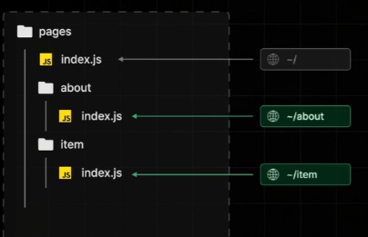
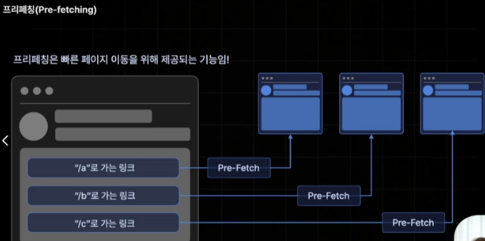
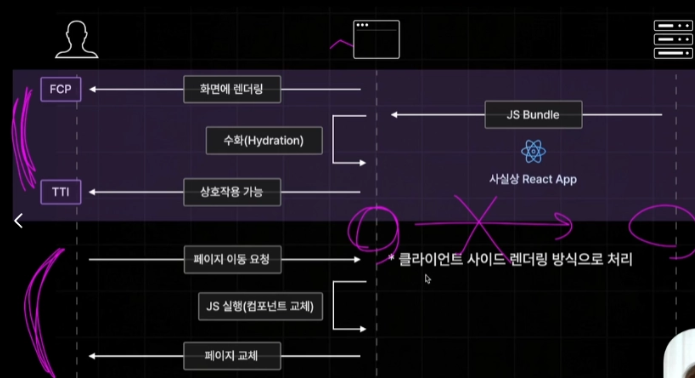
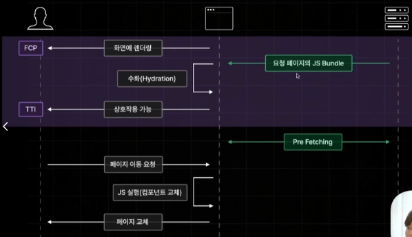

## 2장

### 2.1

- 페이지 라우터
  
  - 현재 많은 기업에서 사용되고 있는 안정적 라우터
  - Pages 폴더의 구조를 기반으로 `React Router`처럼 페이지 라우팅 기능을 제공 → 파일명 기반
- `npx`: node package Executor
- 페이지 라우터의 경우 Next14 버전에서 안정적으로 사용 가능
- `app` 컴포넌트
  - 모든 컴포넌트들의 부모 컴포넌트
  - 전체 페이지에 공통으로 포함되는 헤더 컴포넌트나 레이아웃, 비즈니스 로직 작성 가능
- `document` 컴포넌트
  - 모든 페이지에 공통적으로 적용되어야하는 HTML 코드 설정
  - 리액트 앱의 기존 index.html과 비슷
  - meta 태그, 폰트, charset="utf-8”, 구글 애널리틱스(3rd Party script: 외부 서비스에서 가져와 내 웹에 삽입하는 JS 코드)
- `reactStrickMode`가 켜져있으면 개발 모드 실행 시 컴포넌트 두번 실행하여 디버깅이 불편해짐!

---

### 2.2

- 폴더구조 실습
- [id]/[…id]/[[…id]]

---

### 2.3

- **네비게이팅**: 페이지 이동
- app 안에 네비게이션바
- a태그는 CSR로 페이지를 이동시키는 것이 아닌 서버에 새로운 페이지를 매번 요청하는 방식이라 비교적 느림! 따라서 자체적으로 제공하는 내장 컴포넌트인 Link 이용하기
- **Programmatic navigation**: 함수 이벤트에 따른 이동
- `router.replace(”/”)` : 뒤로가기 방지의 페이지 이동
- `router.back()` : 뒤로가기

---

### 2.4

- `Pre-Fetching`: 페이지를 사전에 불러온다

- **의문**: 사전 렌더링 개념에서 초기 접속 요청 발생 시 서버가 브라우저에게 후속으로 JS Bundle 파일을 불러오기 때문에 초기 접속 요청 종료 이후 페이지 이동 발생 시 브라우저 측에서 직접 JS 코드로 필요한 컴포넌트 교체(`CSR`)로 처리가 된다고 했으나 프리패칭이 필요한가?

- Next는 작성한 모든 리액트 컴포넌트들을 페이지 별로 스플리팅해서 저장해두기 때문에 JS Bundle 파일 전달 시에 모든 페이지에 필요한 JS 코드를 전달하는 것이 아닌 현재 페이지에 필요한 JS Bundle만 전달됨!
- 이유: 모든 페이지의 번들파일 전달 시 용량이 커져 하이드레이션이 늦어짐

- Pre-Fetching을 통해 현재 페이지와 연결된 모든 페이지의 JS Bundle을 불러오게 되어 기존처럼 CSR 장점대로 빠른 속도로 페이지 이동이 가능해짐.
- 최종적으로 초기 접속 요청 시에 하이드레이션을 빠르게 처리할 수 있도록 만들어주면서도 동시에 프리패칭을 통해 초기 접속 요청 이후 페이지 이동까지 빠르게 처리할 수 있는 두마리 토끼를 잡는 방식
- 개발 모드 시에는 프리패칭 동작 X → 빌드해서 실행하는 프로덕션 모드로 실행해야함
- Link 컴포넌트로 구현 시에는 프리패칭이 이루어지지만 router를 통해 이동하는 경우 프리패칭 X

→ `router.prefetch(”/경로”)`를 통해 프리패칭 가능!

- Link 컴포넌트의 프리패칭 해지(잘 사용하지 않을 것을 가정) → `prefetch={false}` prop 추가
