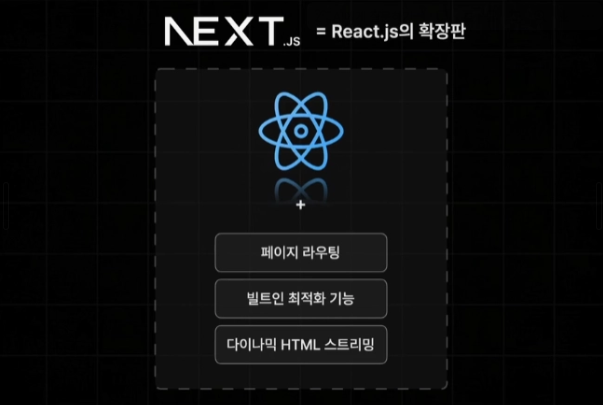
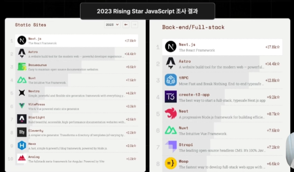
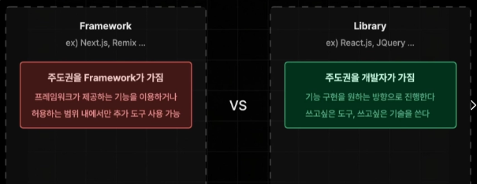
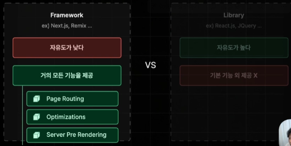
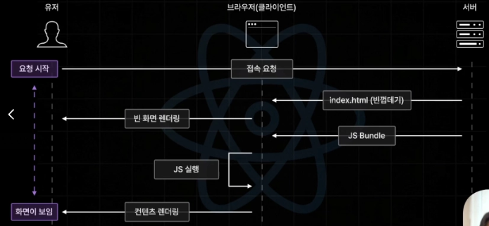
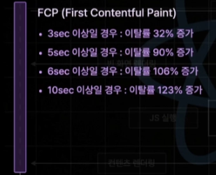
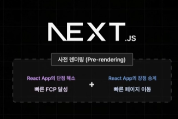

## 1장. Next.js

## 1.1

- `Next.js`:
  - `React.js`를 보다 강력하고 편하게 사용할 수 있는 기능들을 제공
  - 페이지 라우팅
  - 빌트인 최적화 기능
  - 다이나믹 HTML 스트리밍

- 실제 사이트: 카카오 웹툰/Velog/OP.GG/인프런/랠릿
- **Next.js의 인기** 이유? Library가 아닌 Framework이기 때문이 아닐까

- `React`: UI 개발을 위한 JS 라이브러리 ←→ Next: React 전용의 웹 개발 프레임워크
- 프레임워크: 주도권을 개발자가 아닌 Framework가 가지므로 자유도가 낮음

- 예시
  - `React`에서 페이지 라우팅 기능을 구현하는 경우 → React Router/TanStack Router 선택 가능
  - `Next`에서 페이지 라우팅 기능 구현 시 제공해주는 Page/App Router 중 사용

→ 자유도가 높으면 기본 제공 기능이 적고 자유도가 낮으면 편리하고 다양한 기능 사용 가능

⇒ 자연적으로 개발 속도도 증가

---

## 1.2

- React의 렌더링
  1. 유저가 초기 접속 요청 시 빈껍데기(index.html)을 전송하여 빈 화면을 렌더링함
  2. JS Bundle을 전송하여 JS를 실행하여 컨텐츠를 렌더링하게 됨(화면이 보임)
- `CSR(Client Side Rendering)`: 페이지 이동이 매우 빠르고 쾌적하지만 FCP(초기 접속 속도)가 느림

- `FCP(first contentful paint)`: 사용자가 접속 후 화면에 첫 번째 콘텐츠가 나타나는 시점

- **사전 렌더링**
  - Client Side Rendering의 단점을 효율적으로 해결하는 기술
  - 첫 화면을 서버에서 미리 그려서(`SSR/SSG`) 보내주고, 그 다음부터는 JS로 빠르게 화면을 전환(`CSR`)하는 **하이브리드** 방식!
  - **서버에서 미리 HTML을 만들어 두는 모든 행위**를 말하며 SSG와 SSR이 모두 포함됨

| **구분**            | **CSR (Client Side)**             | **SSR (Server Side)**              | **사전 렌더링 (Pre-rendering)**              |
| ------------------- | --------------------------------- | ---------------------------------- | -------------------------------------------- |
| **핵심 개념**       | 브라우저가 JS를 받아 직접 그림    | **요청 시마다** 서버가 그려서 줌   | **브라우저에 오기 전**에 빌드 시 미리 그려둠 |
| **초기 접속 (FCP)** | **느림** (JS 로드 전까지 흰 화면) | **빠름** (완성된 HTML을 받음)      | **빠름** (내용이 꽉 찬 HTML)                 |
| **페이지 이동**     | **매우 빠름** (컴포넌트 교체)     | **빠름** (첫 페이지만 서버가 관여) | **매우 빠름** (수화 후 CSR처럼 동작)         |
| **SEO (검색 엔진)** | 불리함                            | **유리함**                         | **유리함**                                   |
| **서버 부하**       | 낮음 (사용자 PC가 일함)           | 높음 (매번 서버가 일함)            | 방식(SSR/SSG)에 따라 다름                    |

- 동작 방식
  - **첫 방문 (SSR/SSG):** 검색 엔진 최적화와 빠른 속도를 위해 서버에서 완성된 HTML을 딱 한 번 받아옵니다.
  - **이후 이동 (CSR 방식):** 첫 페이지 로드가 끝나면 `Next.js`가 자동으로 **CSR 모드**로 전환됩니다.
    - `next/link`나 `next/navigation`을 사용해 페이지를 이동하면, 서버에서 HTML 전체를 다시 가져오지 않습니다.
    - 오직 그 페이지에 필요한 데이터(JSON)나 **JS 조각**만 서버에서 비동기적으로 가져와서 브라우저가 직접 컴포넌트를 교체합니다.
- 단점
  - **실시간성 부족:** 빌드 시점에 HTML을 만들기 때문에, 블로그 글을 수정하거나 새 상품을 등록해도 다시 빌드(배포)하기 전까지는 웹사이트에 반영되지 않습니다. (이를 해결하기 위해 **ISR** - 증분 정적 재생성이라는, 배포된 사이트를 재빌드하지 않고 특정 페이지의 데이터만 최신으로 업데이트)
  - **개인화된 페이지 불가능:** 로그인한 사용자마다 다른 화면(마이페이지 등)을 보여줘야 한다면, 미리 모든 경우의 수의 HTML을 만들어둘 수 없습니다. 이 경우 결국 다시 SSR이나 CSR을 섞어 써야 합니다.
- 렌더링
  - JS 코드를 HTML로 변환하는 과정
  - 브라우저가 컨텐츠를 화면에 그리는 과정
- Next.js의 사전렌더링 과정
  1. 초기 접속 요청 시에 JS를 실행하여 꽉 찬 HTML을 화면에 렌더링하게 되고, 이때 상호작용은 불가
  2. 브라우저에게 후속으로 JS Bundle을 전송하여 HTML과 연결하여 상호작용이 가능하게 만듦

---

### 1.3

- `Supabase`를 이용한 백엔드 서버 구축
- 현 버전에서 `npx prisma db push` 시에 `DATABASE_URL`말고 `DIRECT_URL`도 요구하여 계속 에러가 떴음.. → `DATABASE_URL`에는 Transaction Pooler를, `DIRECT_URL` 에는 Session Pooler를 작성하여 해결

---

### 1.4

- Next에서 제공하는 Router
  - Page Router - 구 버전
  - App Router - Next 13 버전과 함께 공개된 신규 Router(다양한 신규 기능 제공-서버 컴포넌트)
- App Router: 과도기를 지나 안정기에 접어들었지만 여전히 배워야할 게 많은 변화의 시기
- 도입 현황
  - Next.js 공식 문서와 새로운 프로젝트 템플릿은 모두 App Router를 기본으로 함
  - **생태계 완성:** `TanStack Query`, `Zustand`, `Styled-components` 등 주요 라이브러리들이 서버 컴포넌트(RSC) 대응을 마쳤움
  - **기업 채용:** 신규 프로젝트를 시작하는 기업들은 대부분 App Router를 채택하고 있고, 기존 Page Router를 App Router로 마이그레이션하는 수요도 많아졌습니다.
- 기술적 변화
  - **데이터 페칭 통합 (Data Fetching):** 기존의 복잡한 별도 함수(getStaticProps 등) 없이, 표준 **`fetch`** API의 옵션 설정만으로 SSG, SSR, ISR 전략을 자유롭게 구현하고 제어합니다
  - **Streaming & Suspense (스트리밍 및 서스펜스):** 데이터가 준비된 UI 조각부터 브라우저에 즉시 전송하여, 전체 페이지가 로딩될 때까지 기다리지 않고 사용자 체감 속도를 혁신적으로 개선함.
