## 3장. App Router

### 3.2

#### 페이지 라우팅 설정하기

#### App Router 버전

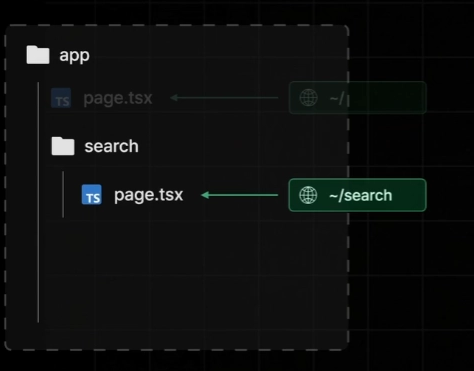

**Page Router**는 pages 폴더 기준 ↔ **App Router**는 app 폴더 기준

페이지 자동 설정은 동일하지만 기존 **Page Router**의 `index.tsx`와 유사하게 `page.tsx`로 된 파일만 페이지 파일로서 취급됨

#### 검색 쿼리(?q=…)

```jsx
export default async function Page({
  searchParams,
}: {
  searchParams: Promise<{ q: string }>;
}) {
  const { q } = await searchParams;
  return <div>Search 페이지 : {q}</div>;
}
```

#### 동적 경로 세그먼트(../[id])

```jsx
export default async function Page({
  params,
}: {
  params: Promise<{ id: string }>;
}) {
  const { id } = await params;
  return <div>book/[id] page : {id} 입니다</div>;
}
```

- **props로 값을 받아올 수 있는 이유**
  - Next.js 서버가 사용자의 접속 URL을 분석해 `params`와 `searchParams`가 담긴 **객체(props)를 페이지 함수의 인자로 직접 넣어주며 호출**하기 때문.
- **`{ searchParams }: { searchParams: ... }`인 이유**
  - 앞의 `{}`는 상자(props)에서 **실제 값**을 꺼내는 '구조 분해 할당'이고, 뒤의 `{}`는 그 값이 어떤 정체(타입)인지 TypeScript에게 알려주는 문법.
- **`await` 비동기로 꺼내오는 이유**
  - Next.js 15부터 성능 최적화를 위해 데이터를 **필요한 시점에만 열어보는 '지연 로딩(Lazy Loading)' 방식**을 채택하여 `Promise` 형태로 전달하기 때문.

→ **Page Router**는 훅(`useRouter`)으로 내가 직접 찾아오는 방식이었다면, **App Router**는 서버가 알아서 밥상(`props`)을 차려다 주는 방식임!

---

### 3.3

#### 페이지 라우팅 설정하기

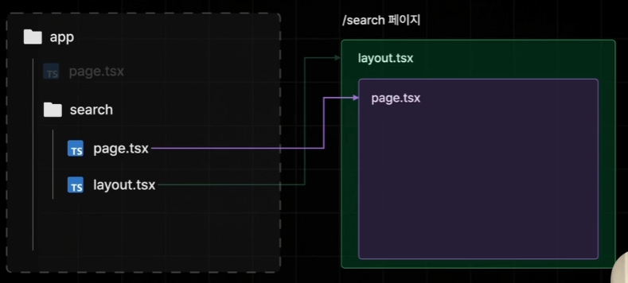

`page.tsx` → “**page**”라는 이름의 파일이 페이지 역할을 하는 파일로 자동 설정된다

`layout.tsx` → **layout**도 마찬가지…!

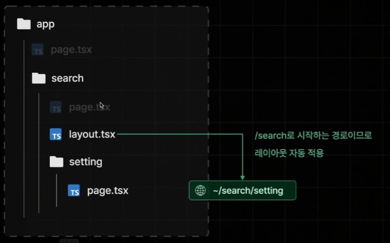

- **layout**은 단순히 현재 search 페이지 뿐아닌 `/search` 하위 모든 페이지 레이아웃으로 적용

→ 최상위 **layout**에 설정해둔 스타일이 모든 페이지에 적용되겠네?

→ 하위 폴더에도 `layout.tsx`을 작성하면 어떻게 되지? ⇒ **중첩**되어 적용

없어서는 안되는 파일이며, a.tsx로 잘못 변경하여도 새 `layout.tsx`를 만들어 서비스가 작동하도록 함

app과 search 페이지에는 적용이 되면서 book 페이지에는 적용되지 않는 `layout.tsx`를 만드려면?

→ App Router 버전의 새로운 기능인 **Route Group** 이용

**Route Group**: `()`로 폴더명을 감쌌을 때 더이상 경로에 어떠한 영향도 미치지 않는 폴더가 됨

**장점**: 경로 상에 영향을 미치지 않으면서 **layout**만 동일하게 적용 가능! → 원하는 페이지에 공통 적용 가능하여 **Page Router**보다 훨씬 쉽게 다양한 케이스의 **layout** 설정 가능

---

### 3.4

#### 리액트 서버 컴포넌트 이해하기

**React Server Component**: React 18v부터 추가된 새로운 유형의 컴포넌트, 서버측에서만 실행됨(브라우저 X)

#### 🤔 Page Router 버전의 Next.js에서는 어떤 문제가 있었을까?

- 상호작용이 없는 컴포넌트들도 **JS Bundle**에 포함시켜 용량이 커져 하이드레이션 과정 또한 길어짐
- **React Server Component**는 JS Bundle을 보내는 과정에서 제외됨!

→ 상호작용이 없으면 서버측에서 사전 렌더링 시 그 때 한 번만 실행되게 하자(React Server Component)

⇒ 페이지의 대부분을 **서버 컴포넌트**로 구성하고 클라이언트 컴포넌트는 필요 시에만 사용할 것!

#### 어떤 걸 Client Component로 봐야할까?


- 실시간 입력 input 값을 **State**로 보관하며, enter를 누르면 **onKeydown** 이벤트 핸들러가 promatic하게 이동시켜줌 → `Client Component`
- `Link`는 HTML 고유의 기능이라 상호작용으로 보지 않음

```jsx
import { ReactNode } from "react";
import Searchbar from "./searchbar";

export default function Layout({ children }: { children: ReactNode }) {
  return (
    <div>
      <Searchbar />
      {children}
    </div>
  );
}
```

- `layout.tsx` 전체를 **Client Component**로 만들지 않고, 따로 컴포넌트를 생성하여 JS Bundle의 용량을 최대한 줄여주기!

```jsx
"use client";

import { useState } from "react";

export default function Searchbar() {
  const [search, setSearch] = useState("");

  const onChangeSearch = (e: React.ChangeEvent<HTMLInputElement>) => {
    setSearch(e.target.value);
  };

  return (
    <div>
      {" "}
      <input value={search} onChange={onChangeSearch} />
      <button>검색</button>
    </div>
  );
}
```

- `"use client";`를 통해 **Client Component**임을 명시

---

### 3.5

#### 리액트 서버 컴포넌트 주의사항

1. 서버 컴포넌트에는 브라우저에서 실행될 코드가 포함되면 안된다.
2. 클라이언트 컴포넌트는 클라이언트에서만 실행되지 않는다.
3. 클라이언트 컴포넌트에서 서버 컴포넌트를 import 할 수 없다.
4. 서버 컴포넌트에서 클라이언트 컴포넌트에게 직렬화되지 않는 Props는 전달 불가하다.

#### 1. 서버 컴포넌트에는 브라우저에서 실행될 코드가 포함되면 안된다

- 서버측에서만 실행되는 컴포넌트이기 때문에 브라우저에서는 아예 실행조차 되지 않음!

→ useState/useEffect/onClick 들은 서버 컴포넌트에서 사용 불가

```jsx
import someLib from "someLib";

export default function Home() {
  someLib();
  return <div>인덱스 페이지</div>;
}
```

또는 라이브러리(someLib)가 브라우저에서 실행되는 기능을 담고 있다면 서버 컴포넌트에서 활용 불가

#### 2. 클라이언트 컴포넌트는 클라이언트에서만 실행되지 않는다.


- **서버 컴포넌트**가 서버측에서만 실행된다고 **클라이언트 컴포넌트** 또한 클라이언트에서만 실행되는 컴포넌트인 것은 아님!
- 사전 렌더링을 위해 서버에서 1회, hydration을 위해 브라우저에서 1회 실행됨 → 서버와 클라이언트에서 모두 실행

#### 3. 클라이언트 컴포넌트에서 서버 컴포넌트를 import 할 수 없다.

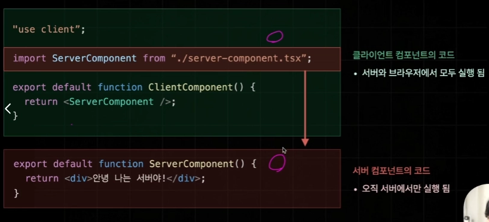

- **서버 컴포넌트**를 **클라이언트 컴포넌트**에 import하게 되면 JS Bundle에서 제외되어 존재하지 않는 코드를 import하려고 하게 되기 때문에 불가능
- 아주 복잡한 Next 앱을 개발하다보면 컴포넌트의 개수가 많아져 서버 컴포넌트를 클라이언트 컴포넌트에 import하게되는 경우가 실제 빈번함 → 이럴때마다 런타임 에러나면 개발도중 불편 ⇒ 서버 컴포넌트를 클라이언트 컴포넌트로 변경함
- 최대한 서버 컴포넌트를 자식으로 두지 않도록 해야함 → 불가피한 상황의 경우 **children props**로 서버 컴포넌트를 받아서 사용

#### 4. 서버 컴포넌트에서 클라이언트 컴포넌트에게 직렬화되지 않는 Props는 전달 불가하다.

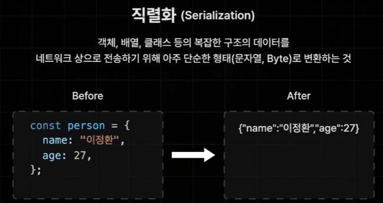

**직렬화**: 객체, 배열, 클래스 등의 복잡한 구조의 데이터를 네트워크 상으로 전송하기 위해 아주 단순한 형태로 변환하는 것

- **함수는 직렬화 불가능** - JS의 함수는 어떠한 값이 아닌 코드 블록들을 포함하고 있는 특수한 형태를 가지기도 하고 **클로저**나 **렉시컬 스코프** 등의 다양한 환경에 의존해있는 경우가 많아 이를 전부 문자열이나 byte화 할 수 없음

직렬화되지 않는 Props : 함수

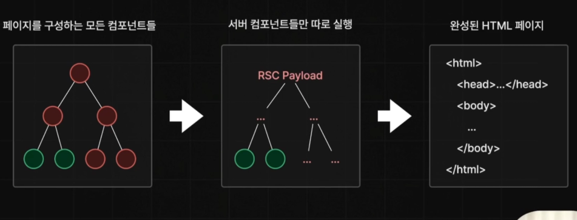

- 서버와 클라이언트 컴포넌트가 동시에 실행해서 HTML 페이지가 완성이 되는 것은 아님!
- 실제 중간 과정을 보면 서버 컴포넌트들이 **RSC Payload**의 형태로 \*\*\*\*먼저 실행되고 그 이후 클라이언트 컴포넌트가 실행되는 구조
- **RSC Payload**: 리액트 서버 컴포넌트의 순수한 데이터(결과물)

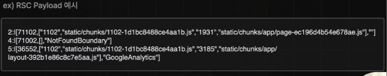

- 서버 컴포넌트의 렌더링 결과
- 연결된 클라이언트 컴포넌트의 위치
- 클라이언트 컴포넌트에게 전달하는 Props 값

---

### 3.6(22)

#### 네비게이션

- **Page Router**와 동일하게 **페이지 이동**은 Client Side Rendering 방식으로 처리
- **App Router**에서는 서버 컴포넌트가 추가되어 방식이 조금 변경됨

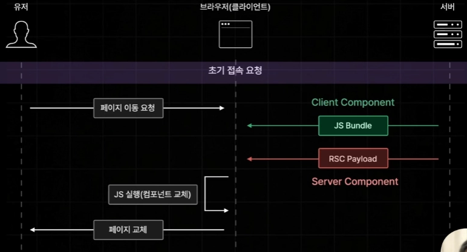

- JS Bundle에는 클라이언트 컴포넌트들만 포함되기 때문에 서버 컴포넌트의 데이터는 빠져있음
- 우리가 만든 모든 페이지들은 두 컴포넌트의 혼합으로 이루어져 있어 **JS Bundle**만 전달하게 되면 서버 컴포넌트 부분이 누락되어 정상적으로 페이지 이동이 이루어지지 않음 → 서버 컴포넌트를 실행한 결과물인 **RSC Payload**도 브라우저에게 보내주게 됨

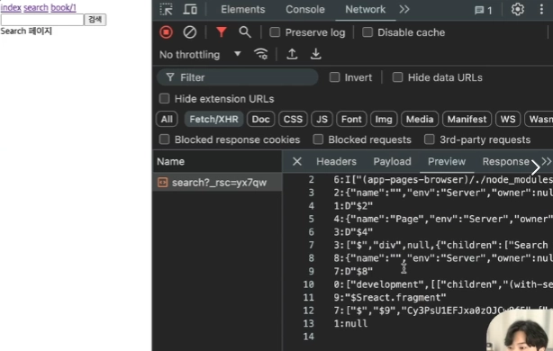

- search 페이지로 이동 시 `Network` 탭에서 **RSC Payload** 확인 가능
- search 페이지에는 **JS Bundle**에 포함될 클라이언트 컴포넌트가 없어서 JS Bundle은 확인 불가

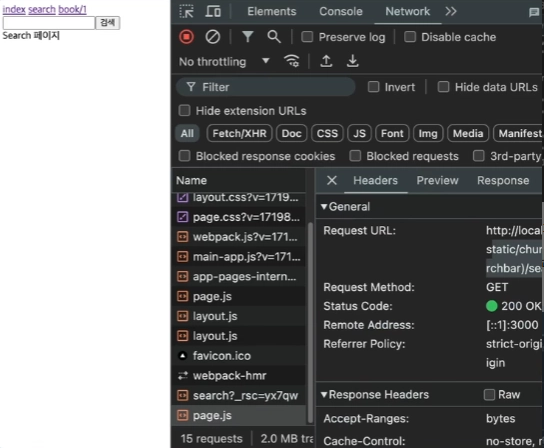

- search 페이지 하위에 클라이언트 컴포넌트를 추가하여 **JS Bundle** 확인(page.js)
- **JS Bundle**도 확인하려면 `All`로 해야 보임

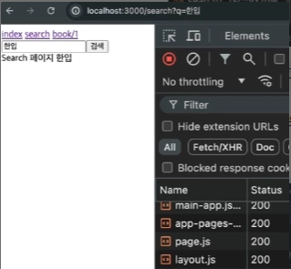

**Programmatic한 페이지 이동**의 예시 : `index.tsx` 페이지에서 “한입”이라고 검색 시 이벤트 핸들러를 통해 페이지가 이동하는 것

- `useRouter` import 시 **next/navigation** 사용, next/router는 Page Router 전용

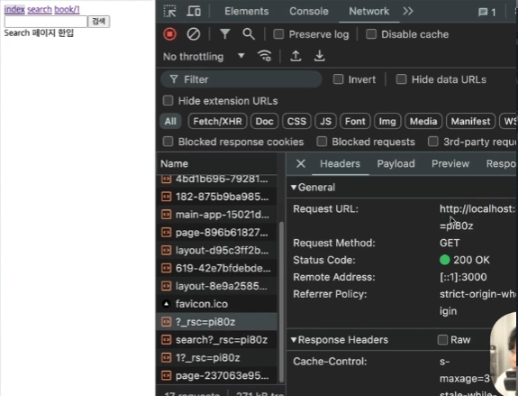

- 개발 모드에서는 프리패칭을 제대로 확인하기 어려우므로 `npm run build` 후 `npm start`해서 새로고침 후 링크를 통한 다른 페이지가 불러와졌는지 확인
- `book` 페이지는 왜 **JS Bundle**을 제외하고 **RSC Payload** 페이지만 불러와졌을까? : `index` 페이지의 경우 **정적페이지**이기 때문에 JS Bundle까지 불러오지만 동적인 페이지로서 설정된 경우 JS Bundle은 생략하고 **RSC Payload만** 불러오게 되어있음
- 페이지 내부에서 **Query string**이나 **URL 파라미터**를 꺼내온다던가 빌드 타임에 생성하면 안될 것 같은 동작 수행 시 자동으로 동적인 페이지로서 설정이 됨!

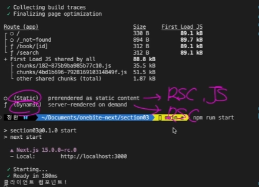

- **Static** → RSC Payload, JS Bundle
- **Dynamic** → RSC Payload

---

### 3.7

#### 한입 북스 UI 구현하기

```jsx
"use client";

import { useEffect, useState } from "react";
import { useRouter, useSearchParams } from "next/navigation";
import style from "./searchbar.module.css";

export default function Searchbar() {
  const router = useRouter();
  const searchParams = useSearchParams();
  const [search, setSearch] = useState("");

  const q = searchParams.get("q");

  useEffect(() => {
    setSearch(q || "");
  }, [q]);

  const onChangeSearch = (e: React.ChangeEvent<HTMLInputElement>) => {
    setSearch(e.target.value);
  };
```

- `useSearchParams`: 현재 페이지에 전달된 query string의 값을 꺼내올 수 있음
- `searchParams.get(”q”)` : 어떤 query string을 불러오고 싶은지
- **App Router**부터는 router 객체에 query 프로퍼티가 제공되지 않음 → `useSearchParams` 라는 Next가 제공하는 훅 이용
