## 4장. 데이터 패칭과 캐시

### 4.1

#### 데이터 패칭

**App Router** 버전의 Next.js App에서는 Server Component로 인해 많은 변화가 발생 → **데이터 패칭**도 마찬가지!


- 서버측에서 데이터를 패칭해오기 위해 위와 같은 함수들을 이용해 불러왔음


- **Page Router** 버전의 Next 앱에서는 Page 컴포넌트 안에 데이터 패칭 로직을 직접 작성하게 되면 브라우저 상에서도 한 번 더 실행되기 때문에 **특수한 함수**(getServerSideProps..)를 이용해야했음 → 서버측에서 불러오는 모든 데이터는 Page 컴포넌트에게만 **Props로 전달**이 되기 때문에 최상단의 페이지로 부터 데이터를 필요로하는 말단의 모든 컴포넌트까지 데이터를 넘겨줘야하는 문제점 존재


- 클라이언트 컴포넌트에서는 `Async` 키워드를 사용할 수 없었음 - 브라우저에서 동작 시 문제를 일으킬 수 있기 때문에 권장되지 않음.
- 하지만 **App Router**부터는 서버 컴포넌트가 생겨 서버 컴포넌트는 브라우저에서 실행되지 않아 `Async` 키워드를 붙여서 사용 가능!

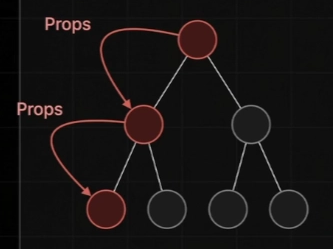

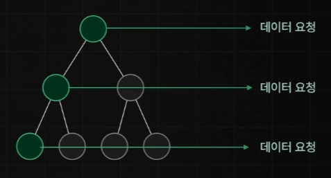

- 데이터가 필요한 경우 **데이터 요청을 직접**할 수 있어 Props를 반복적으로 내려줄 필요가 없어짐.
  

#### 실습

- `NEXT_PUBLIC_API_SERVER_URL=http://localhost:12345`로 .env 파일 설정 시 **NEXT_PUBLIC**을 붙이지 않으면 해당 환경변수를 서버측에서만 활용할 수 있게 **Private**으로 설정해버림. → 클라이언트에서 접근 불가 (백엔드 서버 URL 굳이 감출 필요 X)

---

### 4.2

#### 데이터 캐시

데이터 캐시: `fetch` 메서드를 활용해 불러온 데이터를 Next 서버에서 보관하는 기능

- 영구적으로 데이터를 보관하거나, 특정 시간을 주기로 갱신시키는 것도 가능
- 불필요한 데이터 요청 수를 줄여 웹 서비스의 성능을 크게 개선할 수 있음

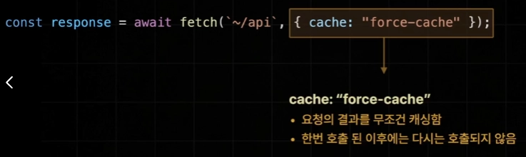

- fetch 함수의 두번째 인자로 데이터 캐시 설정 가능
- 다양한 데이터 캐시 옵션 존재: `cache: “force-cache”`, `cache: “no-store”`, `next: { revalidate: 10 }`, `next: { tags: [’a’] }`
- 오직 **fetch** 메서드에서만 활용 가능

#### 1. `cache: “no-store”`

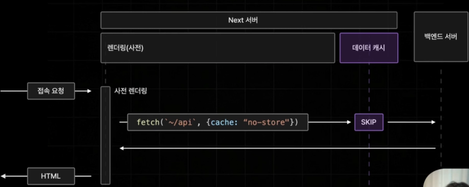

- 데이터 패칭의 결과를 저장하지 않는 옵션
- 캐싱을 아예 하지 않도록 설정하는 옵션

#### Next 앱에서 발생하는 모든 데이터 패칭이 로그로서 콘솔에 자동으로 출력

```jsx
// next.config.mjs
const nextConfig = {
  logging: {
    fetches: {
      fullUrl: true,
    },
  },
};

export default nextConfig;
```

- 이는 데이터 캐싱 여부를 확인하기 위함
  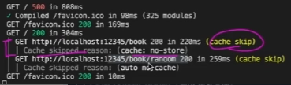
- 두번째 fetch 요청의 경우 자동으로 데이터 캐싱이 이루어지지 않는데, 이는 두번째 옵션 미설정 시 default가 캐싱을 하지 않는 것이기 때문.

#### 2. `cache: “force-cache”`

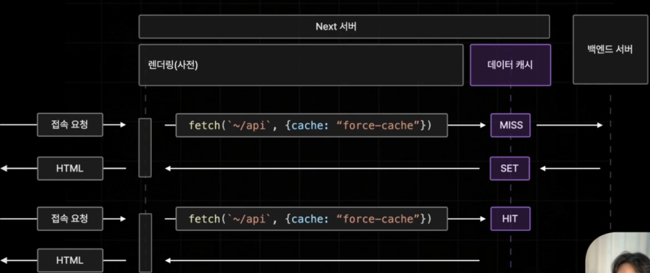

- 요청의 결과를 무조건 캐싱함
- 한 번 호출된 이후에는 다시는 호출되지 않음

**과정**: 먼저 저장된 데이터를 찾아보고 존재하지 않으면 **MISS** → 백엔드 서버에게 데이터 요청(**SET**) → 이후부터 들어오는 요청에 한해 데이터 요청이 들어오면 **HIT**가 되어 캐싱된 데이터 불러옴

#### 3. `next: { revalidate: 3 }`

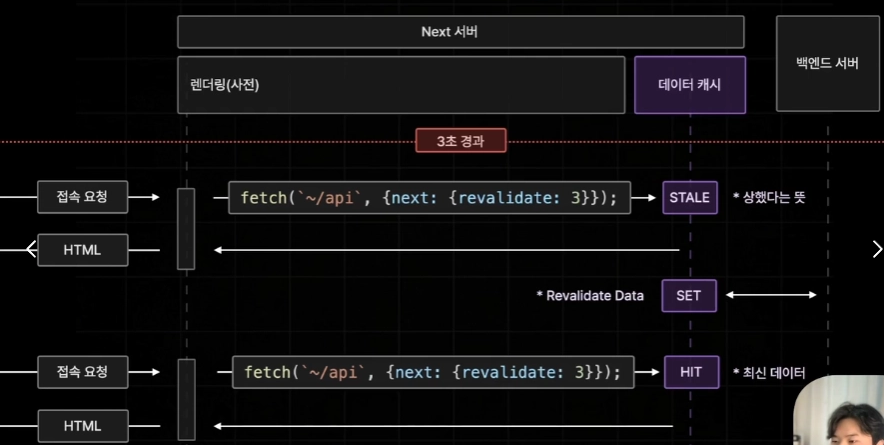

- 특정 시간을 주기로 캐시를 **업데이트** 함
- 마치 `Page Router`의 **ISR** 방식과 유사함

과정: 설정한 시간 이후부터 접속 요청이 들어오면 캐시된 데이터를 반환하기 위해서 데이터를 **STALE**(상한) 상태로 설정 → 상한 데이터라도 빠르게 응답 → 서버측에서 최신 데이터를 불러오고(**SET**) → 그 이후 요청부터는 **HIT**되어 최신 데이터 반환

#### 4. `next: { tags: [’a’] }`

- On-Demand Revalidate(On-Demand ISR 같은 방식)
- 요청이 들어왔을 때 데이터를 최신화 함
- Server Action이나 Router Handler 등등의 추가 개념이 필요! → 추후 정리

---

### 4.3

#### Request Memoization

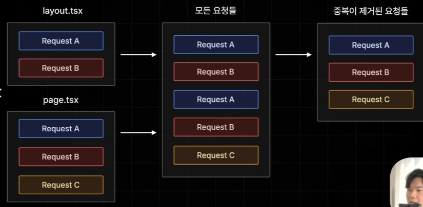

Request memoization: 요청을 기억한다

- 하나의 페이지를 이루고 있는 여러 컴포넌트에서 발생하는 다양한 API 요청 중 중복적으로 발생하는 요청을 캐싱해서 자동으로 데이터 패칭 최적화해주는 기능!
- 동일한 주소로 동일한 데이터를 불러오고 있는 경우

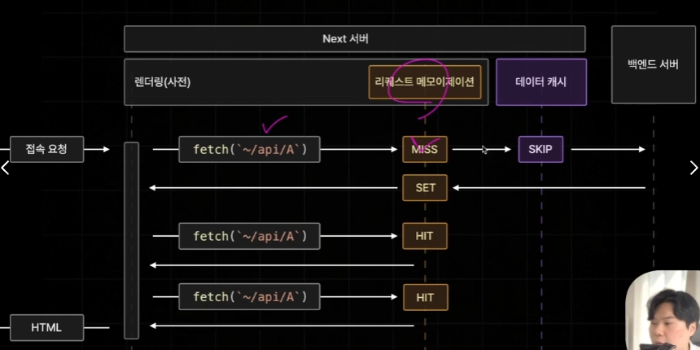

1. 첫 요청 시 캐싱된 데이터가 존재하지 않아 MISS → 이후 SKIP되어 서버로부터 SET하여 데이터를 불러와 저장됨
2. 두번째 요청 시 캐시가 존재해 HIT가 되어 캐시된 데이터를 그대로 사용하여 페이지 렌더링(요청 발송X)
3. 똑같은 요청이 와도 그대로 사용

#### Request Memoization은 데이터 캐시와는 엄연히 다름

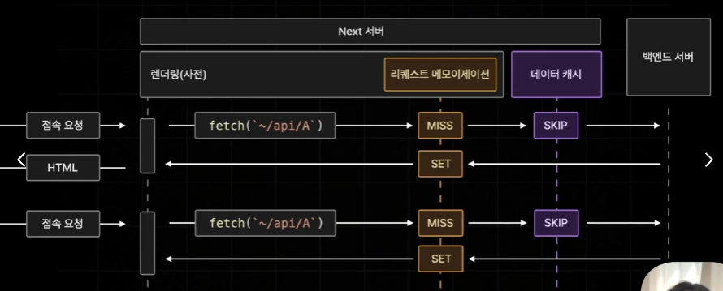

- 하나의 페이지를 렌더링하는 동안에 중복된 API 요청을 캐싱하기 위해 존재
- 렌더링이 종료되면 모든 캐시가 소멸됨
- 반면, 데이터 캐시는 백엔드 서버로부터 불러온 데이터를 거의 영구적으로 보관하기 위해 사용되므로 서버 가동중 영구적으로 보관됨

Next가 Request Memoization을 자체적으로 제공해주는 이유? 중복된 요청 안보내되면 되지 않나?

→ 서버 컴포넌트의 도입 때문!

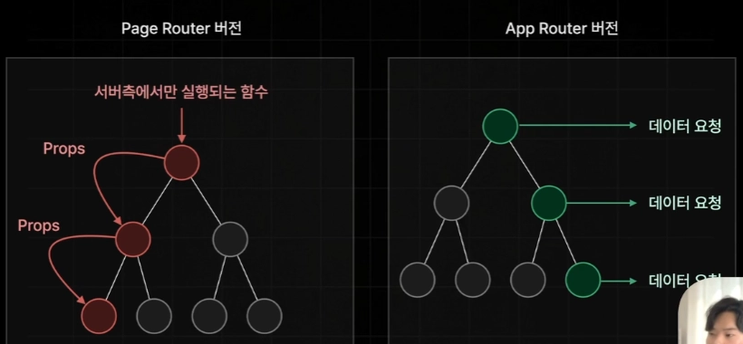

서로 다른 컴포넌트에서 동일한 데이터를 필요로하는 예외적인 경우가 존재

#### 어떠한 경우 사용할까?

- `Layout.tsx`와 `Page.tsx`에서 동일하게 모든 도서를 불러오는 API 호출

```jsx
async function Footer() {
  const response = await fetch(
    `${process.env.NEXT_PUBLIC_API_SERVER_URL}/book`
  );

  if (!response.ok) {
    return <footer>제작 @winterlood</footer>;
  }

  const books: BookData[] = await response.json();
  const bookCount = books.length;

  return (
    <footer>
      <div>제작 @winterlood</div>
      <div>{bookCount}개의 도서가 등록되어 있습니다</div>
    </footer>
  );
}
```

```jsx
async function AllBooks() {
  const response = await fetch(
    `${process.env.NEXT_PUBLIC_API_SERVER_URL}/book`,
    { cache: "no-store" }
  );

  if (!response.ok) {
    return <div>오류가 발생했습니다 ...</div>;
  }

  const allBooks: BookData[] = await response.json();

  return (
    <div>
      {allBooks.map((book) => (
        <BookItem key={book.id} {...book} />
      ))}
    </div>
  );
}
```


- 위와 같이 자동으로 `Request Memoization`이 이루어짐!

#### 결론

1. App Router 버전의 Next 앱에서는 직접 데이터를 패칭해오는 패턴으로 개발을 진행하기 때문에 API 중복 호출이 자주 발생함 → `Request Memoization`라는 추가적인 캐싱 기능을 자동으로 제공
2. `Request Memoization` 은 데이터 캐시와 다르기 때문에 페이지의 렌더링이 종료되면 자동으로 캐시된 데이터들이 소멸됨!

---

#### 데이터 캐시와 Request Memoization의 차이

사용자가 페이지를 새로고침했을 때:

1. **데이터 캐시**는 서버에 여전히 남아있어서 외부 API를 호출하지 않고 빠르게 데이터를 가져옵니다.
2. **리퀘스트 메모이제이션**은 새로고침과 함께 초기화되지만, 그 페이지를 그리는 찰나에 발생하는 수십 개의 중복 호출은 깔끔하게 하나로 합쳐줍니다.
