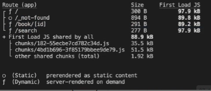
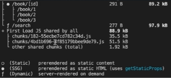

## 5장. 풀 라우트 캐시와 라우트 세그먼트 옵션

### 5.1

#### 풀 라우트 캐시


Next 서버측에서 빌드 타임에 특정 페이지의 렌더링 결과를 **캐싱**하는 기능


- 페이지 단위 저장
- 어떤 기능을 사용하냐에 따라 자동으로 나뉨


- **정적 페이지**에만 **캐시** 적용 → **정적페이지**: 동적 함수를 사용하지 않고, 데이터 캐시가 이루어지는 경우 ⇒ 풀 라우트 캐시가 적용되면 매번 새롭게 렌더링하지 않아도 되서 정적 페이지를 권장함

#### 동적페이지

1. 접속 요청 시 마다 변화가 생기는 경우(서버 컴포넌트만 해당되며 클라이언트 컴포넌트는 페이지 유형에 영향을 미치지 않음.)
2. **동적 함수**(쿠키, 헤더, 쿼리스트링)을 사용하는 컴포넌트가 있을때

```jsx
async function Comp() {
  const cookieStore = cookies();
  const theme = cookieStore.get("theme");

  return <div>...</div>;
}
```

#### revalidate 옵션이 붙어있는 데이터 패칭 존재


- **revalidate time**에 따라서 데이터 캐시와 풀라우트 캐시 또한 업데이트 됨
- `ISR`과 유사하게 동작

---

### 5.2

#### 풀 라우트 캐시 실습

빌드 타임에 클라이언트 컴포넌트 내부에 쿼리스트링 값을 불러오는 함수를 실행하게 되면 값을 알 수 없어 오류를 발생시킴 → `SearchBar` 컴포넌트를 클라이언트 측에서만 실행되도록 **사전 렌더링에서 배제**

배제 방법: `Searchbar`를 렌더링하고 있는 상위 **layout.tsx**에서 `<Suspense fallback={<div>Loading …</div>}>`로 감싸기

**Suspense**: 비동기 작업이 종료될 때(브라우저에 마운트되었을때)까지 미완성 상태로 남아있게 함

#### 각 페이지의 유형



- `npm run build` 후 확인
  - **f** (Dynamic): 동적 페이지
  - **o** (Static): 정적 페이지

#### JS Bundle 크기를 줄이기 위한 정적 페이지화

1. Dynamic → Static: 동적 함수나 캐싱되지 않는 데이터 패칭 존재 여부 확인
2. `layout` 페이지 내부 `fetch` 함수(default)가 데이터를 캐싱하지 않아 동적 페이지를 포함함
3. `fetch(…/..., { cache: “force-cache” })`로 변경(새 도서 추가 또는 수정 X → 기능상 문제 X)
4. `revalidate`: 페이지를 dynamic하게 설정하지 않아 건드리지 않아도 됨
5.

---

### 5.3

#### 풀 라우트 캐시

`Search` 페이지는 **searchParams** Props를 받고 있으므로 동적 함수를 사용함

- 동적 함수를 제거하면 검색어 역할을 하는 쿼리스트링을 꺼낼 수 X
- 검색 결과도 불러올 수 없음 → 어쩔 수 없이 풀 라우트 캐시
- 조금이나마 최적화 가능 - 데이터 캐시만 따로 적용

#### 데이터 캐싱을 통한 최적화

1. `fetch(…/..., { cache: “force-cache” })`로 변경(브라우저로부터 접속 요청을 받았을 때 페이지는 재생성되지만 검색 결과는 캐싱이 이루어져 한 번 검색한 경우 페이지를 빠르게 응답)

`book` 페이지는 **id**라는 url 파라미터를 갖는 여러 개의 동적 경로에 대응하는 페이지이므로 동적 페이지

#### 동적 경로를 갖는 페이지를 빌드 타임에 생성되도록 설정

빌드 타임에 서버가 book 페이지에 어떠한 경로가 존재할 수 있는지 알아야함

```jsx
export function generateStaticParmas() {
  return [{ id: "1" }, { id: "2" }, { id: "3" }];
}
```

- `generateStaticParmas`: 정적인 파라미터를 생성하는 함수
- **Page Router의** `getStaticPaths` ↔ App Router의 `generateStaticParmas`
- **데이터 캐싱**이 설정되지 않은 데이터 패칭(매번 새 데이터)이 존재하더라도 강제로 **Static** 설정\
- URL 파라미터값 명시하는 경우 문자열 데이터(`id: "1"`)로만 작성해야 함
- ex) book/1, book/2, book/3



- **SSG**가 되어 빌드 타임에 파라미터에 해당하는 `book` 페이지를 정적으로 생성
- 만들어두지 않은 **book/4**의 경우도 실시간으로 서버 요청이 들어왔을 때 Dynamic페이지로서 만들어짐
- 이렇게 한 번 만들어둔 경우 **풀 라우트 캐시**에 저장되어 빠른 속도로 페이지 반환

#### 데이터가 없는 경우 404 페이지로 보내주는 게 훨씬 더 괜찮은 방법

```jsx
if (!response.ok) {
  if (response.status === 404) {
    notFound();
  }
  return <div>오류가 발생했습니다...</div>;
}
```

#### 설정해둔 URL 파라미터 외에 404 보내기

```jsx
export const dynamicParams = false;
```

- book/4 경로는 `NotFound` 페이지로!

---

### 5.4

#### 라우트 세그먼트 옵션

대부분의 페이지를 **Static**으로 변경하면서 특정 페이지에 존재하는 모든 컴포넌트가 **동적 함수**를 사용하거나 **캐싱**되지 않는 **데이터 패칭**을 하고 있는 지 면밀히 체크 → 컴포넌트 개수가 증가하면 복잡!

#### 페이지의 동작을 강제로 설정할 수 있는 라우트 세그먼트 옵션

- 모든 컴포넌트들을 체크하지 않아도 강제로 특정 페이지를 **Static/Dynamic** 페이지로 설정
- 페이지의 **revalidate time**을 강제로 설정

```jsx
// 라우트 세그먼트 옵션의 일환
export const dynamicParams = false;
```

- 예시
  - dynamic
  - **revalidate**
  - 페이지의 캐싱을 설정하는 옵션
  - 서버의 region을 설정하는 옵션

```jsx
// 특정 페이지의 유형을 강제로 Static 페이지로 설정
export const dynamic = "force-static";
```

- 강제로 해당 페이지 **Static/Dynamic** 페이지로 설정

1. `auto` : 기본값, 아무것도 강제하지 않음
2. `force-dynamic` : 페이지를 강제로 Dynamic 페이지로 설정
3. `force-static` : 페이지를 강제로 Static 페이지로 설정
4. `error`: 페이지를 강제로 Static 페이지 설정(설정하면 안되는 이유(동적함수/캐싱X) 존재 → 빌드 오류)

부작용: 쿼리스트링 값에 의존하고 있는 `Search` 페이지를 **dynamic**이라는 **라우트 세그먼트 옵션**으로 강제로 **Static**으로 설정 → 검색 기능이 동작 X

동적 함수의 값이 빈 값으로 설정 → `search` 페이지 내부에서 현재 검색어가 무엇인지 알 수 X → 검색 결과 빈 값

#### 결론

- 특별한 상황이 아니면 라우트 세그먼트 옵션 사용 권장 X → `Next`에서 이미 각 모든 컴포넌트들이 어떻게 동작하느냐에 따라 세밀하게 컴포넌트 단위로 페이지를 자동 설정해주는 메커니즘을 무시하며 **부작용 발생 가능성 O**
- 그럼에도 이러한 옵션들을 추후 개발 진행 시에 페이지 캐싱을 실험하거나 무조건 `Dynamic/Static`으로 설정되어야 하는 페이지에 빠르게 **라우트 세그먼트 옵션** 설정 가능
