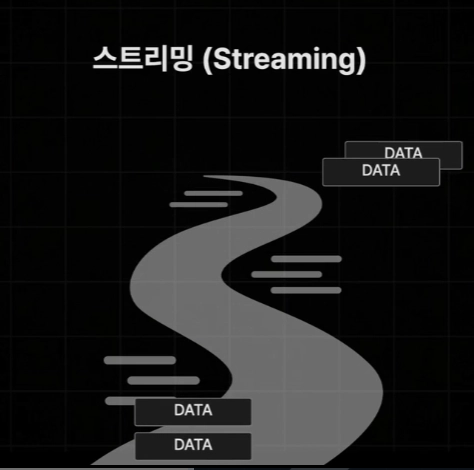
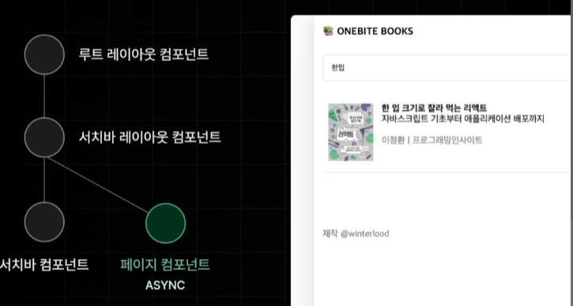
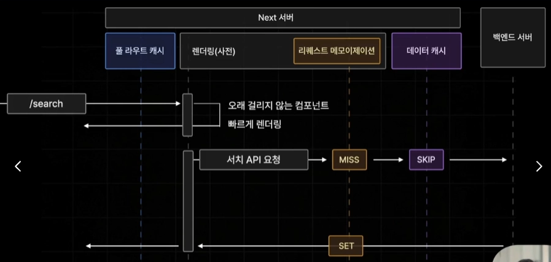
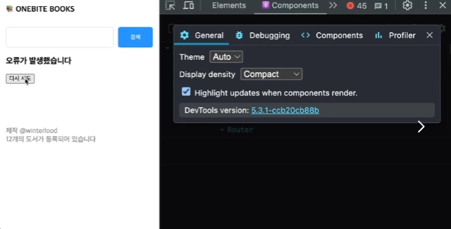
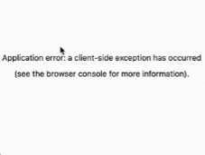

## 6장. 스트리밍과 에러 핸들링

### 6.1

#### 스트리밍


OTT 서비스: 큰 용량의 동영상을 아주 빠른 속도로 시청할 수 있게 해 줌.



**스트리밍**: 서버에서 클라이언트로 데이터를 넘겨줘야하는 경우 데이터 크기가 크거나 서버측에서 준비 시간이 길어 데이터를 빠르게 전송하기 어려울 때 데이터를 조각으로 쪼개 하나씩 전송

스트림: 개천

#### 클라이언트 입장

- 모든 데이터가 다 불러와지지 않은 상태에서도 지금까지 전달받은 데이터에 접근 가능 → 사용자에게 긴 로딩없이 좋은 경험을 제공 가능

`Next`는 동영상 뿐아니라 웹 서비스에서도 동일하게 누릴 수 있게끔 **자체적으로 스트리밍 기능**을 제공

사용자가 특정 페이지에 접속 시 빠르게 렌더링이 오래 걸리지 않는 단순한 컴포넌트부터 보여주고, 렌더링이 오래 걸릴 것 같은 컴포넌트들은 로딩바 같은 대체 UI를 보여준 후 서버측에서 전달 시 뒤늦게 띄움



ex) `Search` 페이지는 스트리밍 미적용 시 모든 컴포넌트들을 렌더링마치고 나서야 브라우저에게 페이지를 응답하므로 페이지 컴포넌트의 **비동기 작업**이 오래 걸리는 경우 페이지의 응답이 전체적으로 느려짐

→ 빠르게 렌더링되는 컴포넌트들만 즉시 브라우저에 응답해주고 렌더링이 오래 걸리는 컴포넌트를 늦게 보내주는 동작 방식

#### 사용 용도

**Dynamic Page**에 자주 사용!



- **Dynamic Page**는 빌드 타임에 생성되지 않아 **풀 라우트 캐시**에는 저장 X → 브라우저로부터 접속 요청이 들어올때마다 페이지를 매번 새롭게 렌더링해야함 ⇒ 특정 API 요청이 길어지는 경우 전체 페이지 응답이 느려져 **좋지 않은 사용자 경험**을 제공
- 식당에서 메인 메뉴가 나오기 전 밑밭찬을 먼저 내보내는 것과 동일
- 오래 걸리는 컴포넌트의 렌더링을 사용자가 보다 좋은 환경에서 기다릴 수 있도록! 빠르게 렌더링 가능한 컴포넌트들을 밑반찬처럼 내주는 것

---

### 6.2

#### 스트리밍 실습1 - 페이지 스트리밍

동적 페이지인 `Search` 페이지에 페이지 스트리밍 적용

특정 **page** 컴포넌트를 스트리밍하도록 설정하려면 해당 `page.tsx`와 동일한 위치에 `loading.tsx`를 두어 대체 UI 컴포넌트 역할을 주어 자동으로 스트리밍

- 이때 `loading.tsx`는 동일한 경로뿐 아니라 **layout**처럼 하위 모든 페이지 컴포넌트들이 스트리밍되도록 설정
- `loading.tsx`가 모든 페이지 컴포넌트들을 스트리밍되도록 설정하는 것이 아니라 `async` 키워드가 붙어 비동기로 작동하도록 설정된 페이지 컴포넌트들에만 스트리밍이 적용시킴(비동기가 아니라면 데이터를 불러오지 않고 있으므로 정해진 UI를 렌더링하기 위해 사용이 되므로)
- 또한 **page** 컴포넌트가 아닌 일반적인 컴포넌트들에는 **loading** 컴포넌트로 스트리밍 적용 불가

---

### 6.3

#### 스트리밍 실습2 - 컴포넌트 스트리밍

페이지 단위 → 컴포넌트 단위 스트리밍

#### `Suspense` 컴포넌트로 일반적인 컴포넌트들에도 세밀하게 스트리밍 적용

1. page 컴포넌트 내부 비동기 작업 코드를 하위 컴포넌트로 분리
2. Suspense 컴포넌트로 감싸기(비동기 컴포넌트를 미완성 상태로 )

```jsx
export default function Page({ searchParams, } : { searchParams: { q?: string; }; }) {
	return (
		<Suspense key={searchParms.q || ""} fallback={<div>Loading ...</div>}>
			<SearchResult q={searchParams.q || ""} />
		</Suspense>
	);
}
```

- fallback: 대체제
- `Suspense` 방식도 **query string**만 변경되었을 경우에는 로딩 상태가 표시되지 않는 문제 발생 - `Loading` 파일 방식의 경우 해결 불가
- `Suspense` 방식에서는 **key** props의 변화마다 다시 로딩상태로 돌아가도록 설정

기본적으로 `Suspense` 컴포넌트는 최초로 1번 내부 컴포넌트 로딩 완료 이후 컨텐츠 변경이 되어도 새롭게 로딩 상태로 돌아가지 않음 → 아예 **key** 값을 바꿔버려서 새로운 컴포넌트로 인식하도록 설정

`Suspense`는 하나의 페이지 내에서 여러 개의 비동기 컴포넌트들을 동시다발적으로 스트리밍 가능!

#### index 페이지에 다중 스트리밍 적용

1. **Static** 페이지 → **Dynamic** 페이지로 전환 (빌드 타임에 모든 비동기 작업을 끝내놓기 때문)

```jsx
export const dynamic = "force-dynamic";
```

1. 각 비동기 작업에 **delay** 적용
2. **Suspense** 컴포넌트로 감싸기

```jsx
<Suspense fallback={<div>도서를 불러오는 중입니다 ...</div>}>
	<RecoBooks />
</Suspense>
...
<Suspense fallback={<div>도서를 불러오는 중입니다 ...</div>}>
	<AllBooks />
</Suspense>
```

---

### 6.4

#### 스켈레톤 UI 적용하기


스켈레톤 = 뼈대

스켈레톤 UI : 뼈대 역할을 하는 UI

- 훨씬 좋은 사용자 경험 제공

#### 실습

1. components/skeleton에 book-item-skeleton.tsx 생성
2. book-item-skeleton.module.css 생성

```jsx
import style from "./book-item-skeleton.module.css";

export default function BookItemSkeleton() {
  return (
    <div className={style.container}>
      <div className={style.cover_img}></div>
      <div className={style.info_container}>
        <div className={style.title}></div>
        <div className={style.subtitle}></div>
        <br />
        <div className={style.author}></div>
      </div>
    </div>
  );

```

1. 스켈레톤 스타일 적용

```jsx
.container {
  display: flex;
  gap: 15px;
  padding: 20px 10px;
  border-bottom: 1px solid rgb(220, 220, 220);
}

.cover_img {
  width: 80px;
  height: 105px;
}

.info_container {
  flex: 1;
}

.title, .subtitle, .author {
	width: 100%;
	height: 20px;
}

@keyframes pulse { /* Tailwind의 animate-pulse와 동일한 키프레임 */
  0%, 100% {
    opacity: 1;
  }
  50% {
    opacity: 0.5;
  }
}

.cover_img,
.title,
.subtitle,
.author {
  background-color: rgb(230, 230, 230);
  /* Tailwind의 animate-pulse는 보통 2초 주기로 부드럽게 깜빡입니다 */
  animation: pulse 2s cubic-bezier(0.4, 0, 0.6, 1) infinite;
}
```

1. 스켈레톤 리스트 컴포넌트 적용

```jsx
import BookItemSkeleton from "./book-item-skeleton";

export default function BookListSkeleton({ count }: { count: number; }) {
  return (
    <>
      {new Array(count).fill(0).map((_, idx) => (
        <BookItemSkeleton key={`book-item-skeleton-${idx}`} />
      ))}
    </>
  );
}
```

- 0이 **count**개 들어있는 빈 배열 생성하여 배열의 개수만큼 반복 작업 실행

```jsx
<Suspense fallback={<BookListSkeleton count={3} />}>
  <RecoBooks />
</Suspense>
```

- `React Loading Skeleton`이라는 **자동으로 스켈레톤 UI 생성해**주는 라이브러리 존재

---

### 6.5

#### 에러 핸들링

백엔드 서버를 가동하지 않은 상태로 index 페이지에 접근하게 되면 **추천 도서를 불러오는 API**의 경우 **에러** 발생 → try catch 문으로 오류 해결가능하지만 모든 코드 블럭마다 try catch문을 적용하기 귀찮고 예상치 못한 상황에 발생할 수 있어 신경써야할 부분 많음

`Next`는 특정 경로에서 발생한 모든 오류들을 **한꺼번에 처리** 가능한 **에러 핸들링** 기능 제공 !

- 이전에 `loading.tsx`로 **스트리밍**을 담당하는 컴포넌트를 생성했던 것처럼 에러 핸들링을 담당할 `error.tsx`를 동일 위치에 생성

```jsx
"use client";

import { useEffect } from "react";

export default function Error({ error, reset } : { error: Error; reset: () => void;  }) { // 에러 원인 또는 메시지
	useEffect(() => {
		console.error(error);
		console.error(error.message);
	}, [error]);

	return (
		<div>
			<h3>오류가 발생했습니다.</h3>
			<button onClick={()=> reset()}>다시 시도</button>
		</div>
	);
}
```

- 에러 파일과 같은 경로 또는 하위 페이지에서 에러 컴포넌트가 페이지 컴포넌트 대신 화면에 출력
- `“use client”`로 설정해야하는 이유: 오류는 어떤 환경에서든 발생할 수 있기 때문에 서버/클라이언트 오류던 모두 대응할 수 있도록 하기 위함(클라이언트는 서버/클라이언트 모두에서 실행됨)

→ 특정 경로의 페이지 컴포넌트에서 발생하는 에러들을 **효과적으로 핸들링**할 수 있게 됨

- 이때, 에러의 원인이나 메시지를 출력하고자 하면 제공하는 **error** **prop**를 이용하면 됨.
- 또한 **reset prop**은 에러 발생 페이지 복구하기 위해 다시 한 번 컴포넌트 렌더링하는 기능



- highlight updates when components render 체크를 통해 다시 시도 클릭마다 하이라이트가 계속 들어옴.
- 백엔드 서버를 켜서 에러를 해결해도 다시 시도 클릭해봤자 계속 에러가 발생함 → 이유?: reset 메서드는 브라우저 측에서만 서버에서 데이터를 이용해서 화면을 다시 한 번 더 렌더링 해보기만 하고 서버측에서 실행되는 서버 컴포넌트를 다시 실행하지는 않는 기능(데이터 패칭 재실행 X)

⇒ 가장 쉬운 방법: 브라우저를 강제 새로고침 (window.location.reload())

```jsx
<div>
  <h3>오류가 발생했습니다.</h3>
  <button onClick={() => window.location.reload()}>다시 시도</button>
</div>
```

#### 우아한 방법 2

```jsx
const router = useRouter();
...
<div>
		<h3>오류가 발생했습니다.</h3>
		<button onClick={()=>
			router.refresh(); // 현재 페이지에 필요한 서버 컴포넌트들을 다시 불러옴
		  reset() // 에러 상태를 초기화, 컴포넌트들을 다시 렌더링
		}>다시 시도</button>
</div>
```

- **router** 객체의 `refresh` 메서드는 일반적인 리프레쉬와 다르게 현재 페이지에 필요한 서버 컴포넌트들을 다시 불러올 것을 요청함 → **index** 페이지의 서버 컴포넌트들을 다시 실행해서 요청해달라

→ 그럼 `router.refresh()`만 쓰면되지 않나? : 에러 상태도 초기화 시켜주어야 페이지의 에러가 더이상 발생하지 않는지 확인 가능

#### refresh의 비동기

- 문제 상황
  1. 다시 시도로 서버 컴포넌트를 다시 불러오고 에러 상태를 초기화해도 에러 존재
  2. 서버 컴포넌트들은 잘 불러오고 있음
- 원인
  1. `router.refresh()`가 비동기적으로 동작하는 메서드이기 때문
  2. `reset()`가 먼저 실행되어서 새 서버 컴포넌트의 결과 없이 화면 그림
- 해결
  - 간단하게 **async**를 화살표 함수에 추가하고 `router.refresh()` 앞에 await을 붙이면 되지 않나? ← 해결 안됨.
    → React18부터 추가된 `startTransition()` 사용(하나의 콜백함수를 인수로 받아콜백 함수 내부 UI 변경 작업 일괄 처리)

  ```jsx
  <div>
  		<h3>오류가 발생했습니다.</h3>
  		<button onClick={()=>
  		startTransition(() => {
  			router.refresh(); // 현재 페이지에 필요한 서버 컴포넌트들을 다시 불러옴
  		  reset() // 에러 상태를 초기화, 컴포넌트들을 다시 렌더링
  		}
  		}>다시 시도</button>
  </div>
  ```

  - `router.refresh()`와 `reset()` 작업이 일괄적으로 동시에 처리되어 에러 상태를 일관성있게 복구 가능
    
  - 이때 버튼 클릭 시 위와 같은 에러 발생 가능 → 새로고침 버튼

#### 하위 컴포넌트만을 위한 에러 컴포넌트 생성

- 특정 컴포넌트 내부에 `error.tsx` 생성
- 해당 페이지와 동일한 경로에 따로 에러 컴포넌트 생성하여 상위 에러 컴포넌트 대체
- `error.tsx`는 현재 자기와 같은 경로에있는 **layout**까지만 렌더링 시켜줌
- 귀찮더라도`error.tsx` 버전부터는 layout을 살리기 위해 `error.tsx`를 각각의 경로 별로 생성해줘야하는 경우가 생길 수 있음
