## 7장. 서버 액션과 재검증 방식

### 7.1

#### 서버 액션이란?

브라우저에서 호출할 수 있는 서버에서 실행되는 비동기 함수

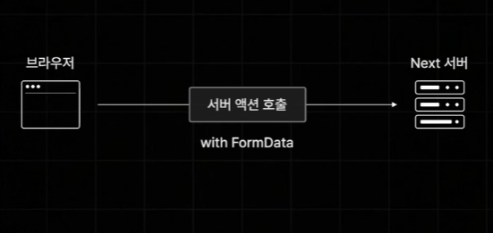

- 별도의 API 생성없이 간단한 함수 하나만으로도 브라우저에서 Next 서버측에서 실행되는 함수를 직접 호출 가능

#### 서버 액션 과정

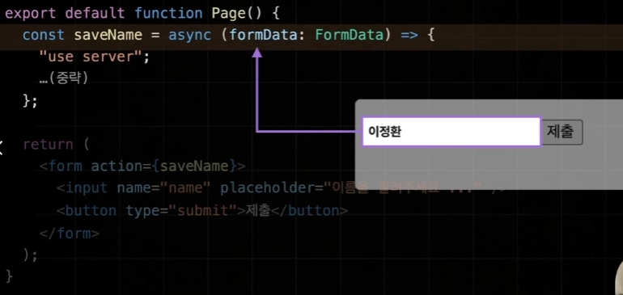

```jsx
export default function Page() {
  // 서버에서만 실행될 비동기 함수 (Server Action)
  const saveName = async (formData: FormData) => {
    "use server";

    // 1. input의 name 속성값을 통해 데이터를 가져옵니다.
    const name = formData.get("name");

    // 2. SQL 쿼리를 통해 데이터베이스에 삽입합니다.
    // (이 예시는 Vercel Postgres 같은 환경을 가정하고 있습니다)
    await sql`INSERT INTO Names (name) VALUES (${name})`;
  };

  return (
    <form action={saveName}>
      <input name="name" placeholder="이름을 알려주세요 ..." />
      <button type="submit">제출</button>
    </form>
  )
}
```

1. 이름 입력 후 제출 버튼 클릭
2. `form` 태그에 **action** props로 설정해둔 **saveNam**e 함수가 실행됨
3. `“use server”` 지시자가 포함되어있으면 next 서버에서만 실행되는 서버 액션으로 설정됨
4. 모든 값들이 **formData** 형식으로 묶여서 **saveName** 함수의 매개변수로 전달됨
5. `get` 메소드로 현재 사용자가 입력한 **name** 값 꺼내와 특정 함수로 데이터베이스에 데이터를 직접 저장하거나 **sql**문 직접 실행해 데이터 추가하는 등의 서버에서만 할수 있는 **다양한 동작 수행 가능**

- 기존에는 API로만 진행해야하는 서버간 데이터 통신을 JS 함수 하나만으로 간결하게 설정 가능 → 서버 액션은 현재 상당히 강력하고 훌륭한 기능으로 많은 주목을 받음

#### 실습

- `formDataEntryValue: string`이나 파일 타입을 의미 → `formData.get(”content”)?.toString();`으로 타입 추론

```jsx
function ReviewEditor() {
  // 서버에서 실행될 리뷰 생성 함수
  async function createReviewAction(formData: FormData) {
    "use server";

    // 1. formData에서 값을 가져온 뒤, 존재할 경우 문자열로 변환
    // ?.toString()을 사용해 null/undefined 에러를 방지하는 안전한 코드
    const content = formData.get("content")?.toString();
    const author = formData.get("author")?.toString();

    console.log(content, author);
  }

  return (
    <form action={createReviewAction}>
      <textarea name="content" placeholder="리뷰 내용을 입력하세요" />
      <input name="author" placeholder="작성자 이름" />
      <button type="submit">리뷰 등록</button>
    </form>
  );
}
```

- 의문🤔❓: **서버 액션**을 활용해야하는 이유? → 클라이언트 컴포넌트로 만들던가 별도의 API를 만들어서 호출하도록 할 수 있는데 ⇒ API로 이런 기능을 생성하려면 별도의 파일을 추가하고 경로를 설정하는 부가적인 작업들이 매 번 하기에 **번거로울 수 있어** 단순한 기능만하는 경우 **서버 액션 활용**하기!
- 서버 액션은 서버측에서만 실행되는 코드이기 때문에 클라이언트인 브라우저에서는 호출만 할 수 있을 뿐 이 코드를 전달받지는 않아 **보안상으로 민감**하거나 **중요한 데이터**를 다룰 때 유용하게 활용 가능

---

### 7.2

#### 도서 리뷰 추가 기능 구현하기(with 서버액션)

- 백엔드 서버에서 제공하고 있는 리뷰와 관련된 API들을 빠르게 이용

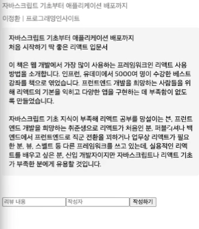

```jsx
function ReviewEditor({ bookId }: { bookId: string }) {
  async function createReviewAction(formData: FormData) {
    "use server";

    // 1. 입력값 추출 및 문자열 변환
    const content = formData.get("content")?.toString();
    const author = formData.get("author")?.toString();

    // 2. 간단한 유효성 검사 (필수 값 확인)
    if (!content || !author) { // 서로 완전히 믿을 수 없으므로 동시에 예외 처리
      return;
    }

    try {
      // 3. 백엔드 서버 API로 POST 요청 전송
      const response = await fetch(
        `${process.env.NEXT_PUBLIC_API_SERVER_URL}/review`,
        {
          method: "POST",
          body: JSON.stringify({ bookId, content, author }),
        }
      );

      // 4. 결과 상태 코드 확인 (서버 터미널에 출력)
      console.log(response.status);
    } catch (err) {
      // 5. 네트워크 에러 등 예외 처리
      console.error(err);
      return;
    }
  }

  return
	  <section>
	    <form action={createReviewAction}>
	      <input required name="content" placeholder="리뷰 내용" />
	      <input required name="author" placeholder="작성자" />
	      <button type="submit">작성하기</button>
	    </form>
	  </section>
	);
}

// app/book/[id]/page.tsx
export default function Page({ params }: { params: { id: string } }) {
  return (
    <div className={style.container}>
      <BookDetail bookId={params.id} /> {/* 상세 정보 컴포넌트 */}
      <ReviewEditor bookId={params.id} /> {/* 리뷰 작성 에디터 컴포넌트 */}
    </div>
  );
}
```

#### 데이터 조회 대시보드

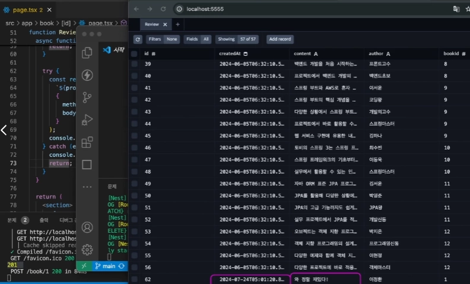

- 백엔드 서버에서 `npx prisma studio`로 현재 데이터 베이스의 데이터 조회 대시보드 확인 가능

#### 서버 액션 분리

- **actions** 폴더 아래 `create-review.action.ts`
- `“use server”` 지시자를 파일 최상단으로 이동 가능
- 파일 이동으로 **bookId** 값을 직접 받아와야하는 과정 존재 → 하지만 사용자에게 **bookId** 값을 폼에 입력하라고 할 수 없으므로 아래와 같이 전달

```jsx
function ReviewEditor({ bookId } : { bookId: string }) {
	 return (
	  <section>
	    <form action={createReviewAction}>
		    <input name=”bookId” value={bookId} hidden readOnly /> // 감춰줌
	      <input required name="content" placeholder="리뷰 내용" />
	      <input required name="author" placeholder="작성자" />
	      <button type="submit">작성하기</button>
	    </form>
	  </section>
	);
}
```

- 24년 10월 기준 **hidden** 속성 적용 시 에러 발생 → **value** 속성은 있는 **onChange** 속성이 없는데 잘못 만든거아니야? 라고 생각해서 `Next`에서 에러 발생시킴 ⇒ 읽기 전용 명시를 위한 `readOnly` 추가

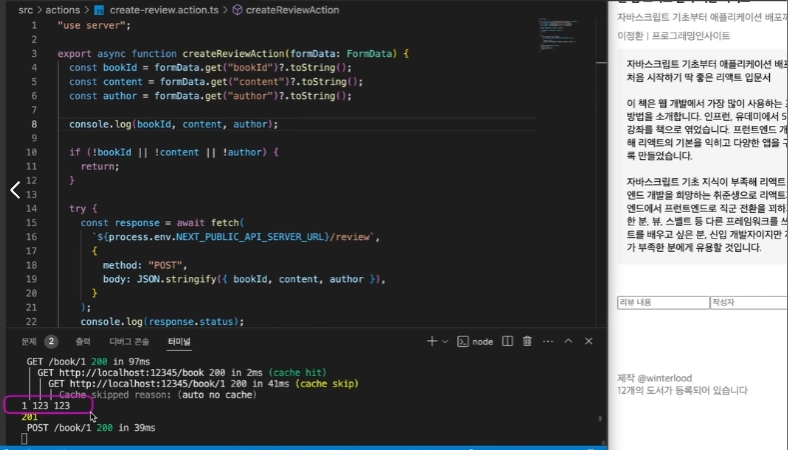

#### 결론

- 이런 식으로 서버 액션을 별도의 파일로 분리할 수 있고 **bookId** 처럼 고정적으로 제공되어야하는 값이 있다면 **hidden/readOnly** 속성을 지닌 `input` 태그로 받아올 수 있음

---

### 7.3

#### 리뷰 조회 기능 구현하기 & 스타일링

#### **전개 연산자**를 리액트 Props에 응용한 문법

```jsx
export default function ReviewList() {
  return (
    <section>
      {reviews.map(
        (
          review, // review 객체 안의 id, content, author 등을 통째로 풀어서 전달
        ) => (
          <ReviewItem key={`review-item-${review.id}`} {...review} />
        ),
      )}
    </section>
  );
}
```

`{...review}`: 객체 안에 들어있는 모든 내용을 하나하나 꺼내서 컴포넌트에게 전달해라

#### 1. 코드 의미 분석

만약 `review`라는 객체가 아래와 같이 생겼을 때

```jsx
const review = {
  id: 1,
  content: "정말 유익한 책이네요!",
  author: "유진",
  createdAt: "2026-04-11",
};
```

`{...review}`를 쓰면 리액트는 내부적으로 코드를 이렇게 해석합니다.

```jsx
// {...review}는 아래와 똑같이 동작합니다.
<ReviewItem
  id={review.id}
  content={review.content}
  author={review.author}
  createdAt={review.createdAt}
/>
```

1. **코드 간결화:** 객체 안에 전달해야 할 속성이 10개라면, 일일이 `name={review.name}`, `date={review.date}`... 처럼 쓰는 건 매우 번거롭고 `{...review}` 한 줄이면 끝남
2. **유연성:** `review` 객체에 나중에 새로운 속성(예: `rating`)이 추가되어도, `ReviewItem` 컴포넌트만 수정하면 될 뿐 부모 쪽 코드는 수정할 필요가 없음

---

### 7.4

#### 리뷰 재검증 구현하기

리뷰 작성 후 작성하기 버튼 클릭 시 추가딘 리뷰가 화면에 바로 나타나지 않아 새로고침 해야 확인 가능

→ 사용자가 리뷰 작성시 작성 리뷰가 바로 보이도록 설정

1. `ReviewList` **컴포넌트**를 서버 측에서 다시 한번 렌더링해서 그 결과를 브라우저에게 보내주기
2. 아예 `book` **페이지** 자체를 다시 한 번 렌더링해서 클라이언트에 보내기

#### RevalidatePath 함수

```jsx
revalidatePath(`/book/${bookId}`);
```

- 이 함수가 호출되면 `Next` 서버가 자동으로 인수로 전달한 이 경로에 해당하는 페이지를 **재검증**(재생성)하게 됨.

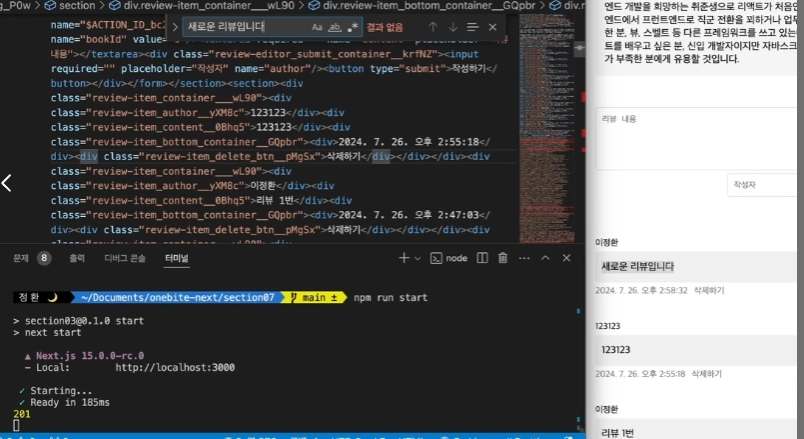

- 주의할 점
  1. `revalidatePath()` 는 서버측에서만 호출 가능 → 서버 액션/서버 컴포넌트 내부에서만 호출
  2. `revalidatePath()` 는 해당 페이지 전부 재검증시켜 모든 **캐시도 무효화**시켜버림. → `ReviewList`컴포넌트에 `{ cache: “force-cache” }`를 설정해도 데이터 캐시가 삭제됨
  3. `revalidatePath()`가 호출되면 페이지 자체를 캐싱하는 **풀 라우트 캐시**까지 함께 **삭제**됨

#### 자세한 설명

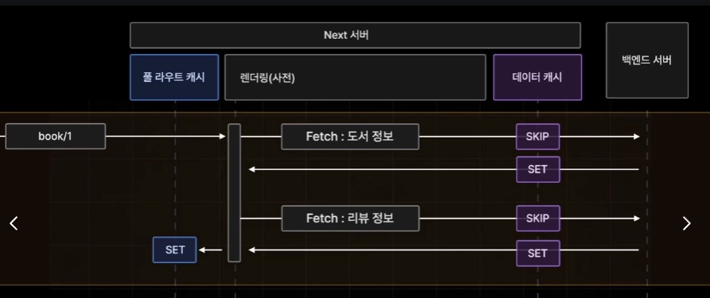

1. 빌드 타임에 `book/1`과 같은 **Static** 페이지를 생성하게 되면 도서 상세 정보를 백엔드 서버로부터 불러와 데이터 캐시에 보관
2. 리뷰 데이터 또한 백엔드 서버로부터 불러와 데이터 캐시에 보관
3. 필요한 데이터를 전부 불러와 렌더링을 마쳤다면 완성된 페이지를 풀 라우트 캐시에 보관하게 됨

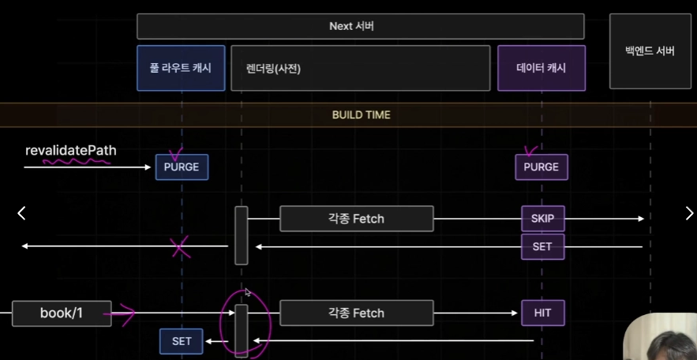

1. 빌드타임 이후 프로젝트가 가동되어 `revalidatePath()`가 서버 액션으로부터 호출되어 `book/1` 페이지를 **재검증**하게 되는 경우 이 페이지의 **풀 라우트 캐시**와 **데이터 캐시**를 **제거**하게 됨(purge: 숙청하다)
2. 사용자가 현재 보고 있는 페이지를 업데이트하기 위해 새롭게 페이지를 생성하지만 앞서 purge된 상태이기 때문에 백엔드 서버로부터 다시 데이터를 불러와 **데이터 캐시**에 저장하게 됨(이때, 풀 라우트 캐시에는 페이지가 업데이트되지 않음)
3. 브라우저로부터 다음 번 요청이 들어왔을 때 실시간으로 다시 한 번 페이지를 생성하여 이때 **풀 라우트 캐시에 저장**됨

#### 결론

- 따라서 이 경우 **Dynamic** 페이지처럼 실시간으로 페이지가 생성되어야 하기 때문에 이때에는 비교적으로 느린 응답이 이루어질 수 있음
- 이러한 동작이 이루어지는 이유: `revalidatePath()` 이후 브라우저에서 접속하게 되었을 때 무조건 **최신의 데이터를 보장**하기 위해서

---

### 7.5

#### 다양한 재검증 방식 살펴보기

`revalidatePath()`에는 두 번째 인수로 전달 가능한 **layout**과 **page** 옵션 존재 → 5가지 유형

#### 1. 특정 주소의 해당하는 페이지만 재검증

```jsx
revalidatePath(`/book/${bookId}`);
```

- 두 번째 인수 생략

#### 2. 특정 경로의 모든 동적 페이지를 재검증

```jsx
revalidatePath("/book/[id]", "page");
```

- 해당 페이지 컴포넌트가 작성된 폴더 또는 경로를 명시해주어야 함

#### 3. 특정 레이아웃을 갖는 모든 페이지 재검증

```jsx
revalidatePath("/(with-searchbar)", "layout");
```

- 특정 레이아웃을 기준으로 해당하는 **layout**을 갖는 모든 페이지들을 한꺼번에 재검증

#### 4. 모든 데이터 재검증

```jsx
revalidatePath("/", "layout");
```

- 모든 페이지가 한 번에 재검증

#### 5. 태그 기준, 데이터 캐시 재검증

```jsx
revalidateTag(`review-${bookId}`);
```

- 이러한 태그 값을 갖는 모든 데이터 캐시가 다시 재검증
- 모든 데이터 캐시를 삭제하지 않아도되서 훨씬 효율적으로 페이지 재검증

---

### 7.6

#### 클라이언트 컴포넌트에서의 서버 액션

서버 액션을 서버 컴포넌트가 아닌 클라이언트 컴포넌트에서 호출해서 로딩 상태를 설정하거나 에러를 핸들링하는 추가적인 방법 확인

#### 리뷰 추가 서버 액션이 오래 걸리는 작업인 경우

- 사용자에게 다음과 같은 피드백이 제공되어야 함.
  1. 서버 액션이 실행 중인 동안에 버튼이 비활성화
  2. 로딩 바가 표시
- 문제
  - 사용자에게 답답함을 줄 수 있음
  - 버튼 클릭 후 여러 번 클릭하여 중복 제출하는 것을 방지하지 않음 → 100번까지 클릭된다면?
- 해결: 컴포넌트를 클라이언트 컴포넌트로 변경

#### 실습

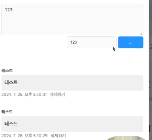

**React19** 부터 추가되는 폼 태그의 상태를 쉽게 핸들링하게 도와주는 훅

```jsx
const [state, formAction, isPending] = useActionState(createReviewAction, null);
```

- 첫번째 인수: 핸들링하려는 폼의 액션 함수
- 두번째 인수: 폼의 상태의 초깃값
- 훅 호출 시 배열 형태로 3개의 값을 반환하게 됨

이때 아래처럼 되어있는 폼 태그의 액션 함수를 `useActionState`로 부터 반환받은 **formAction**을 사용해야 함

```jsx
... <form action={createReviewAction} ...> -> <form action={formAction} ...> ...
```

#### 서버 액션의 결과 값을 state에 담기

```jsx
if (!bookId || !content || !author) {
  return {
    status: false,
    error: "리뷰 내용과 작성자를 입력해주세요",
  };
}
```

```jsx
try {
  // ... fetch 로직 (생략)
  if (!response.ok) {
    // 1. 응답이 실패하면 에러를 던져 catch 블록으로 보냅니다.
    throw new Error(response.statusText);
  }

  // 2. 데이터 캐시 갱신: 특정 태그가 달린 캐시만 선택적으로 삭제합니다.
  // 이 덕분에 새로고침 없이도 사용자는 최신 리뷰 목록을 보게 됩니다.
  revalidateTag(`review-${bookId}`);

  return {
    status: true,
    error: "",
  };
} catch (err) {
  return {
    status: false,
    error: `리뷰 저장에 실패했습니다: ${erㄱ}`,
  };
```

- 서버 액션에게 자동으로 첫번째 인수로 **state** 값이 전달되기 때문에 서버 액션의 **첫 파라미터**로 \*\*\*\*`state` 를 전달받도록 해야함.

```jsx
export async function createReviewAction(
	state: any, // 이때 state 값을 사용하지 않는다면 _: any로 설정 가능
	formData: FormData
) { ... }
```

`isPending`: **useActionState**가 관리하는 서버 액션이 현재 실행중인 값인지 여부 확인

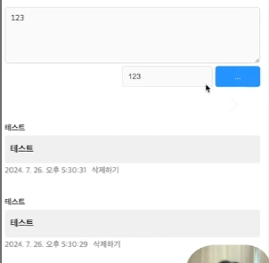

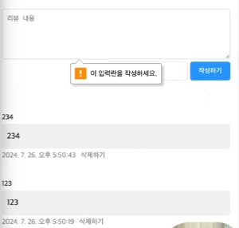

```jsx
<textarea disabled={isPending} required name="content" palceholder="리뷰 내용" />
...
<input disabled={isPending} required name="author" placeholder="작성자" />
<button disabled={isPending} type="submit">
	{isPending ? "..." : "작성하기"}
</button>
```

- 작성하기 버튼 클릭 시에 disabled를 통해 **로딩 상태**가 잘 반영되고 여러 번 클릭해도 **중복 제출 방지**

#### 서버 액션이 실패한 경우 에러 핸들링

서버 액션 실패 시 `state`에 담아 반환하도록 설정해둠 → **state** 변경 시 에러 발생 여부 검증

```jsx
useEffect(()=> {
	if(state && !state.status) } // state의 값이 존재는 하고 status값이 false이면
		alert(state.error); // 요청 실패
	}
}, [state]);
```

#### 결론

- 현재 폼의 로딩 상태와 중복 제출 → `isPending`
- 에러 핸들링 → `state`

---

### 7.7

#### 리뷰 삭제 기능 구현하기

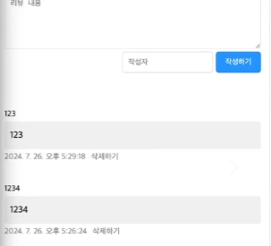

1. 서버 액션을 호출할 폼 태그(<form>) 생성하기
2. `ReviewItem` 컴포넌트를 전부 **form** 태그로 감쌀 수 있지만, 굳이 삭제하기 버튼 하나를 만드는데 전체를 클라이언트 컴포넌트로 전환하기에 사용자와 상호작용하는 요소가 아닌 경우가 많아 삭제하기 버튼 하나만 분리하기

```jsx
export default function ReviewItem({
  id,
  content,
  author,
  createdAt,
  bookId,
}: ReviewData) {
  return (
    <div>
      <div>{author}</div>
      <div>{content}</div>
      <div>
        <div>{new Date(createdAt).toLocaleString()}</div>
        <div> {/* 삭제 기능을 담당하는 별도의 컴포넌트를 호출합니다 */}
          <ReviewItemDeleteButton />
        </div>
      </div>
    </div>
  );
}
```

#### ReviewItemDeleteButton

```jsx
"use client";

import { useRef } from "react";

export default function ReviewItemDeleteButton() {
  const formRef = useRef < HTMLFormElement > null;

  return (
    // 2. form 요소에 ref를 연결합니다.
    <form ref={formRef}>
      {/* 3. button 대신 div를 클릭했을 때 폼을 제출하고 싶다면,
         formRef.current?.requestSubmit()을 사용
         (submit()보다 requestSubmit()이 HTML 유효성 검사 등을 거치기 때문에 권장됨.) */}
      <div onClick={() => formRef.current?.requestSubmit()}>삭제하기</div>
    </form>
  );
}
```

- div 태그에 `type=”submit”`을 붙인다고 해서 클릭 시 폼이 제출되지 않음 → programmatic하게 폼을 제출
  1. `useRef` 훅을 사용해 **formRef** 변수를 **form** 태그에 연결
  2. div 태그에 **onClick** 핸들러로 클릭 시 폼 태그 강제 제출 설정
