## 8장. Parallel Route & Intercepting Route

### 8.1

#### Parallel Route(패럴렐 라우트)

병렬 라우트


하나의 화면에 여러 개의 페이지 컴포넌트들을 한꺼번에 렌더링하는 라우팅 패턴

#### 사용 예

- 소셜 미디어 서비스나 관리자의 대시보드처럼 굉장히 복잡한 구조로 이루어져있는 서비스들을 구축하는 데에 상당히 유용함

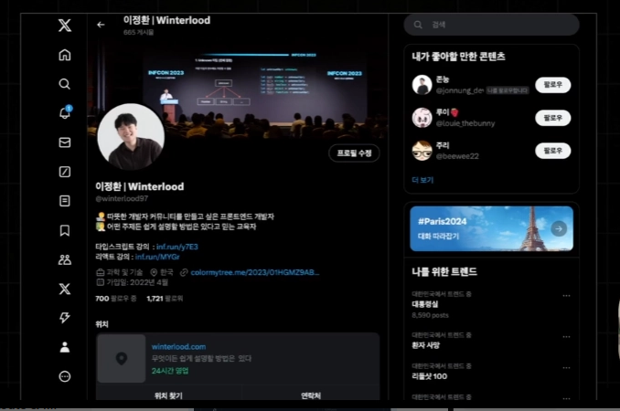

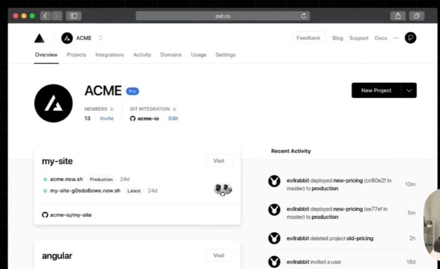

#### Parallel Route 적용

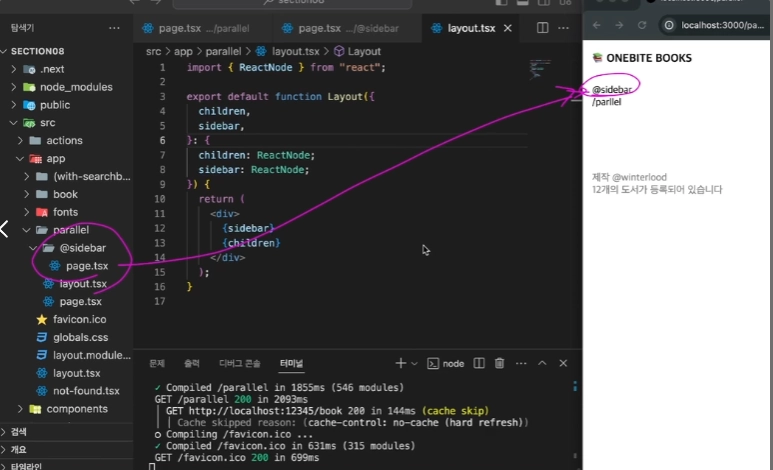

1. 슬롯 생성 - `@sidebar`와 같은 폴더 생성 및 **page** 컴포넌트 작성

- **sidebar** 슬롯 안에 보관된 **page** 컴포넌트는 자신의 부모 **layout** 컴포넌트에게 props로서 자동으로 전달됨 - 이때 props의 이름은 슬롯 이름(sidebar)

1. 슬롯은 URL 경로에는 아무런 영향을 미치지 않음. Like Route Group → [**localhost:3000/parallel/@sidebar**](http://localhost:3000/parallel/@sidebar는)는 **NotFound**
2. 슬롯에는 개수제한 X

**Next**의 버그로 `Parallel Route`가 적용되지 않는 경우 개발 모드 종료 후 **.next** 폴더 제거 후 `npm run dev`로 다시 한 번 가동하기!

1. 슬롯 안에 새로운 페이지 생성 가능 - setting 폴더를 생성하여 페이지 추가 가능

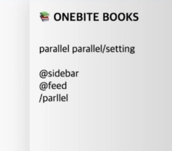

- `parallel` 경로 **Link** 이동

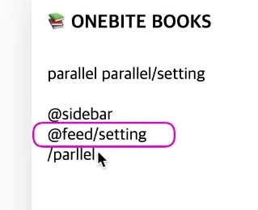

- `parallel/setting` 경로 **Link** 이동

#### **parallel/setting** 경로로 이동

- feed 슬롯의 경우
  - setting 폴더 아래에 페이지 컴포넌트가 존재하므로 `@feed` → `@feed/setting`으로 변경됨
- sidebar 슬롯의 경우
  - setting 폴더가 존재하지 않아 없는 페이지로 NotFound와 동일하지만 **Next**에서 이전의 페이지를 유지하도록 설정
- children의 경우
  - setting 폴더가 존재하지 않아 sidebar와 동일하게 이전 페이지 유지

중요: 각각의 슬롯들이 **이전의 페이지를 유지**하게 되는건 `Link` 컴포넌트를 이용해 브라우저 측에서 **클라이언트 사이드 렌더링** 방식으로 페이지를 이동할 때에만 **한정**됨

#### 페이지를 새로고침하여 parallel/setting 경로 접속

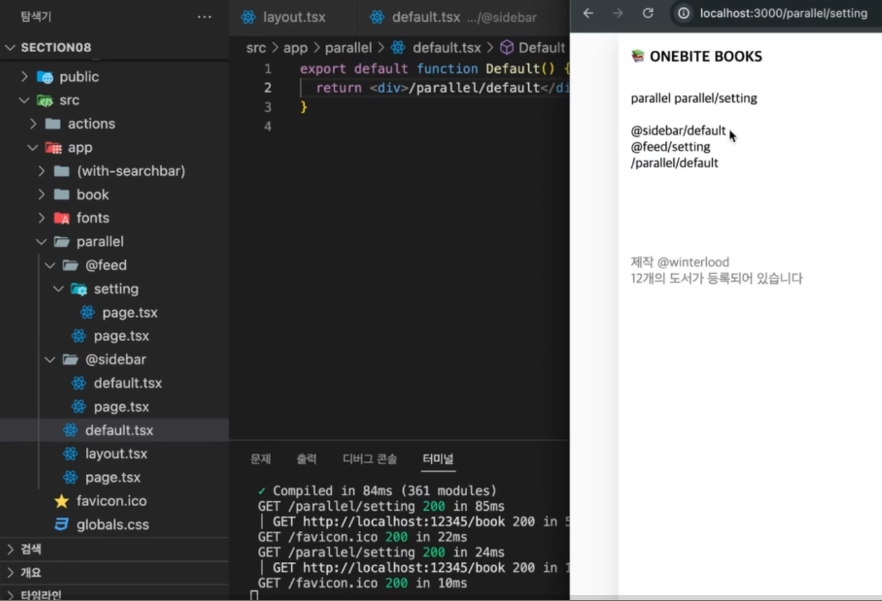

`layout` 컴포넌트에서 각각의 슬롯의 페이지를 렌더링할 때 **초기 접속**을 하기 때문에 이전의 페이지를 모르기 때문에 **NotFound** 페이지를 반환

**→ 이를 방지**: 슬롯 별로 현재 렌더링할 페이지가 없을 때 대신 **렌더링할** `default` 페이지 생성(default.tsx)

#### 결론

특정 슬롯 밑에 특정 페이지를 추가하는 경우에는 **404** 페이지로 보내지는 문제를 방지하기 위해 `default` 페이지를 추가하는 것이 좋다!

---

### 8.2

#### Intercepting Route(인터셉팅 라우트)

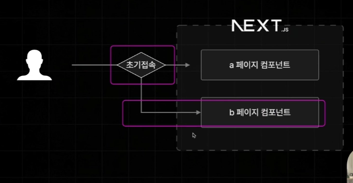

intercepting: 가로채다, 뺏어가다

- 초기 접속이 아닐 때만 인터셉팅 라우트 동작
- 초기 접속이 아닌 경우
  - Link 태그로 경로 이동
  - Router객체의 Push

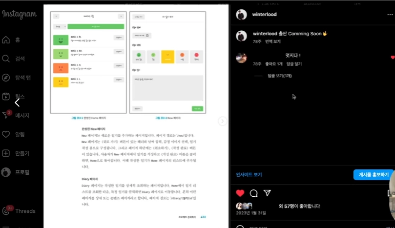

- 대표적인 **예시**: 인스타그램 (피드 탐색 시 게시글 클릭 시 피드 페이지 위로 게시글의 상세페이지를 띄워줌)
- 언제든지 뒤로가기 하면 **이전 페이지로 이동**
- 이때, 게시글 상세 페이지에서 새로고침하여 **초기 접속** 요청으로 접속 시 게시글의 상세페이지로 완전히 이동!

#### 인터셉팅 라우트 적용

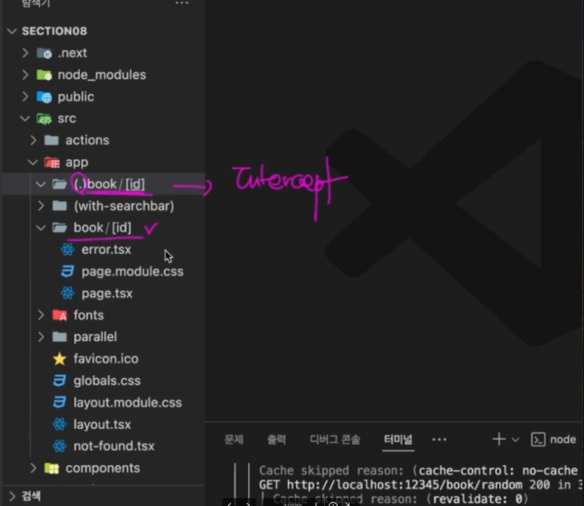

1. book/[id] → (.)book/[id]

- 폴더 이름 앞에 (.)을 붙여줌
- 이때 .은 상대 경로에서 동일한 경로에 있음을 의미 → 아래와 같은 폴더 위치에서는 (**..)**으로 작성

```jsx
app
|- test
|	 |-(..)book/[id]
|- book/[id]
```

#### 두 단계 위에 타겟 폴더가 있는 경우

```jsx
app
|- test
|	 |- example
|       |- (..)(..)book/[id]
|- book/[id]
```

- `(..)(..)`: 두 단계 위
- `(…)`: app 폴더 바로 밑에 있는 어떠한 폴더를 인터셉팅하겠다.

#### createPortal

- **Next dom**으로부터 제공되는 메소드

```jsx
return createPortal( // components/modal.tsx
	<dialog ref={dialogRef}>{children}</dialog>,
	document.getElementById('modal-root') as HTMLElement
);
```

- 브라우저에 존재하는 `modal-root`라는 **id**를 갖는 돔 요소 아래에 **dialog** 태그가 렌더링되게 함!
- `return <dialog></dialog>`라고 적어주게 되면 어쩔 수 없이 모달 컴포넌트를 포함하는 페이지 컴포넌트 안의 하위 요소로서 렌더링이 될 것이기 때문에 전체화면을 뒤덮는 글로벌 요소가 되기에 어색함

#### 1. 왜 단순히 속성(State)이 아니라 Ref일까?

`<dialog>`를 열고 닫는 방식에는 두 가지가 있습니다.

- **방법 A (속성):** `<dialog open>`을 사용한다. (단순히 화면에 보이기만 함, 배경 클릭 방지 안 됨)
- **방법 B (메서드):** `dialogElement.showModal()` 함수를 호출한다. (**정석**)

방법 B를 쓰면 브라우저가 자동으로 **배경을 어둡게 처리(Backdrop)**해주고, **ESC 키로 닫기** 같은 필수 기능을 제공합니다. 그런데 이 `showModal()`이라는 함수는 실제 DOM 요소에만 존재하는 함수입니다. 그래서 리액트가 그 DOM 요소를 직접 건드릴 수 있도록 **`useRef`**로 연결통로를 만드는 것!

→ `createPortal` 메소드로 브라우저에 존재하는 돔 요소 아래에 모달 요소들을 렌더링하도록 설정

```jsx
// layout.tsx
return (
	<html>
		...
		<Footer />
		<div id="modal-root"></div>
		...);
```

- `Modal` 컴포넌트가 렌더링하는 **dialog** 태그가 위 **div** 태그 아래에 추가될 예정!

```jsx
// app/(.)book/[id]/page.tsx
<div>
  가로채기 성공!
  <Modal>
    <BookPage {...props} />
  </Modal>
</div>
```

- `Modal` 컴포넌트가 도서 상세 페이지를 감싸도록 설정해주면 해당 페이지에서 모달에 접근 가능

> **dialog** 태그는 모달의 역할을 하기에 기본적으로 꺼져있는 상태로 렌더링이 되므로 처음 렌더링될 때 모달이 화면에 보이지 않는 상태로 렌더링됨 → **reference** 객체를 만들어서 이 숨겨진 모달을 언제 깨울 것인가를 결정할 수 있음

```jsx
/* <dialog> 태그가 showModal()로 열렸을 때 나타나는 배경 스타일 */
.modal::backdrop {
  /* 검은색 바탕에 70% 투명도를 주어 뒤쪽 콘텐츠를 어둡게 가립니다. */
  background: rgba(0, 0, 0, 0.7);
}
```

- backdrop - 배경이라는 뜻

```jsx
<dialog
	onClose={() => router.back()}
	onClick={(e) => {
		// 모달의 배경이 클릭됨 -> 뒤로가기
		if ((e.target as any).nodeName === "DIALOG") {
			router.back();
		}
	}}
	ref={dialogRef}
>
	{children}
</dialog>
```

- e.target.nodeName === `“DIALOG”`라고만 해주면 타입 오류가 발생함 → **TS**에서 아직 **onClick** 이벤트 발생 시 nodeName 속성을 지원하지 않기 때문에 as any 타입으로 단언 해주기!
- `onClose`: 사용자가 **ESC**로 모달을 껐을 때도 뒤로가기가 발생하도록 적용

#### 결론

- 인터셉팅 라우트는 클라이언트 사이드 렌더링(Link/router.push)로 페이지가 이동할 때에만 동작하기 때문에 페이지를 새로고침해서 초기 접속 요청을 날리게 되면 동작하지 않음.

---

### 8.3

#### Intercepting & Parallel Route

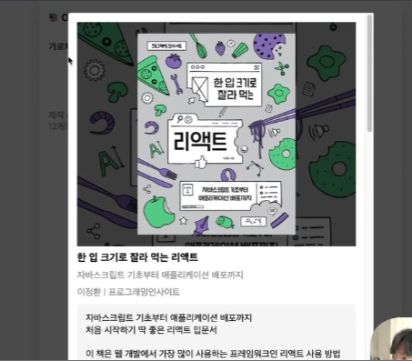

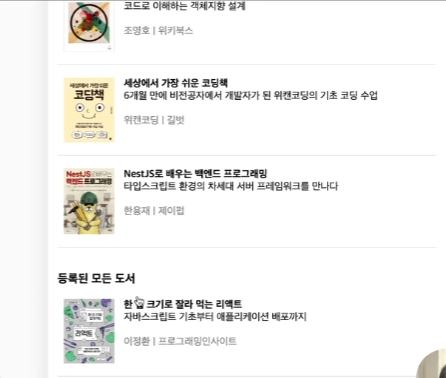

- 인터셉팅 라우트 기능을 활용해 유저가 클라이언트 사이드에서 방문하게 되었을 때에 모달로 표시해주는 기능을 구현했었음 → 모달의 뒷 배경이 인덱스 페이지가 아닌 인터셉팅 페이지가 띄워져 있어 하자가 있었음

⇒ 문제를 해결해 완성도 있는 모달 페이지 구현

```jsx
<Modal>
  <BookPage {...props} />
</Modal>
```

- 여기에 `index`나 `search` 페이지가 병렬로 함께 렌더링되어야 함 → 병렬로 페이지를 렌더링시키는 **Parallel Route** 이용!

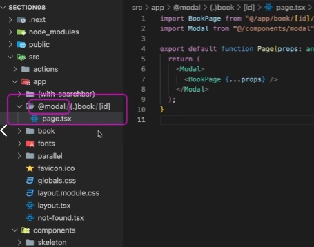

```jsx
app
|
|- @modal
|		| -(.)book/[id]
|
```

- app폴더 바로 하위에 있던 **(.)book/[id]** 폴더의 위치를 `@modal` 폴더로 이동
- 이제 `/(with-searchbar)`와 동일 선상에 위치하게 되어 index 페이지와 병렬 렌더링이 가능해짐

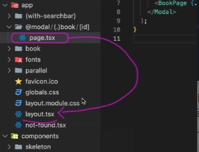

- 이 컴포넌트는 **modal** 슬롯의 부모 레이아웃 컴포넌트인 루트 `layout` 컴포넌트에게 **modal**이라는 **props**로 전달이 되어 아래와 같이 인터셉팅되는 페이지 컴포넌트를 병렬로 받아올 수 있게됨.

```jsx
export default function RootLayout({
	children,
	modal,
}: ReadOnly<{
	children: React.ReactNode;
	modal: React.ReactNode;
}>) {
	return (
		...
		<main>{children}</main>
		<Footer/>
	</div>
	{modal}
	<div id="modal-root"></div>
	...
```

- 이렇게 모달 속의 페이지와 일반적인 페이지들이 병렬로 잘 렌더링됨
- 사용자가 `“/”`라는 경로로 요청을 보내게 되면 모달 슬롯 안에 인덱스 경로에 해당하는 페이지가 존재하지 않아 **404** 페이지로 리다이렉션됨 → `bookPage`의 모달이 없는 경우도 설정해줘야함(**default.tsx**)

#### Default.tsx 설정

```jsx
export default function Default() {
  return null;
}
```

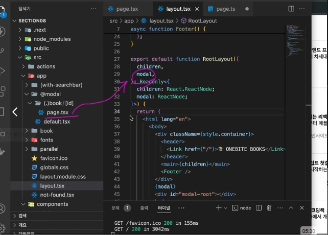

- 사용자가 `“/”` 경로로 방문 → **루트 레이아웃의 children = 인덱스 페이지 컴포넌트(page)가 됨**
- 이때 `modal`은 인덱스 페이지를 위한 컴포넌트가 없어 **default.tsx**인 빈 페이지를 반환

#### 🤔❓`@modal` 하위에 page.tsx를 만드는 게 아닌 default.tsx를 만드는 이유는?

`default.tsx`는 "상태의 부재"를 뜻함

> 모달 슬롯은 **특정 상황**(가로채기 등)에서만 내용이 나타나야 합니다. 그 외의 모든 평범한 상황에서는 **"아무것도 보여주지 마"**라는 기본값이 필요하죠.

- `page.tsx`를 만들면: "특정 경로에서 이걸 보여줘"라는 뜻
- `default.tsx`를 만들면: "경로가 매칭되지 않는 모든 순간에 이걸 보여줘"라는 뜻

#### 사용자가 도서 아이템 클릭

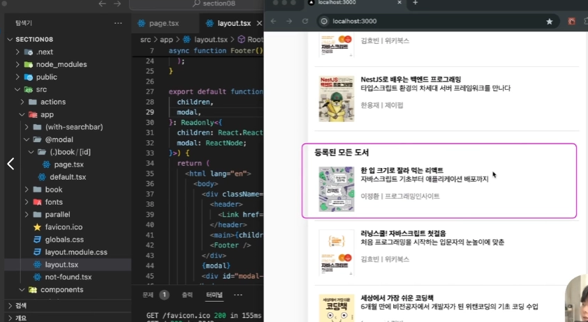

- 원래라면 `book/1` 페이지 접속 → **children**으로 `book`폴더 내부 페이지 컴포넌트가 전달
- 지금은 인터셉팅 라우트가 동작하여 경로를 가로채 children은 기존 인덱스 페이지를 유지하며, **modal** props로 인터셉팅된 `(.)book/[id]` 하위 **page.tsx** 컴포넌트가 들어옴
- 이때 인덱스 페이지와 모달로서 book 페이지가 함께 병렬로 렌더링됨

#### 결론

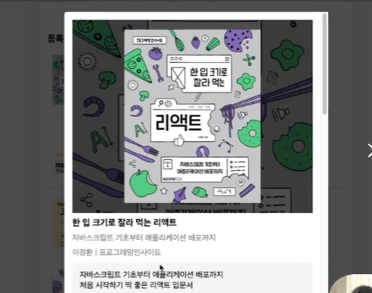

> **Parallel Route**와 **Intercepting Route**를 함께 활용하게 되면 **인터셉팅**되어 모달로 나타나게 되는 도서의 상세 페이지를 **병렬**로 이전의 페이지와 함께 보여주는 기능 생성 가능

⇒ 향후 프로젝트 진행 시 **Parallel Route**와 **Intercepting Route**를 결합해 사용함으로써 특정 아이템의 상세 페이지를 모달로서 띄워주어 굉장히 **좋은 사용자 경험 제공**
