#### 9.1

#### 이미지 최적화

이미지는 웹 페이지 대부분의 용량 차지 - http archive 연구기관

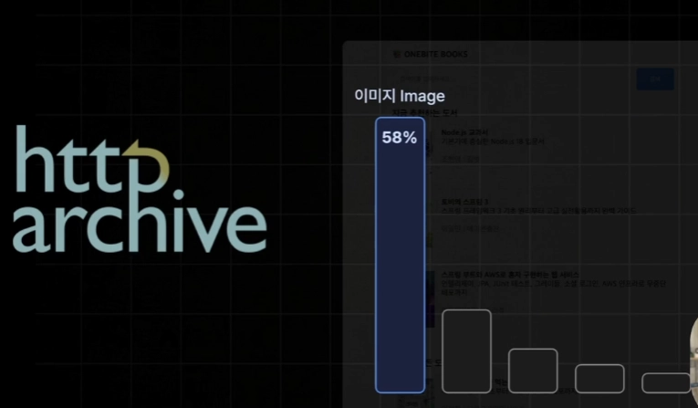

→ 이미지를 최적화하는 것이 피할 수 없는 숙명


- Next에서 자체적으로 제공!

#### 이미지 컴포넌트

```jsx
import Image from "next/image";

export default function Page() {
  return (
    <Image
      src="/profile.png"
      width={500}
      height={500}
      alt="Picture of the author"
    />
  );
}
```

- 이미지 컴포넌트를 통해 이미지 최적화 기법들이 자동으로 적용되어 굉장히 편리

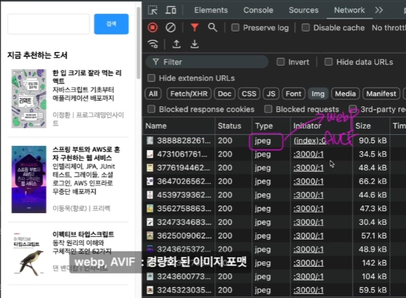

#### 문제점

1. jpeg 형식도 나쁜 것까지는 아니지만 webp나 AVIF라는 경량화된 이미지 포맷 활용 추세
2. 화면에 포함된 3개의 이미지를 제외한 렌더링될 필요없는 이미지까지 렌더링되고 있음

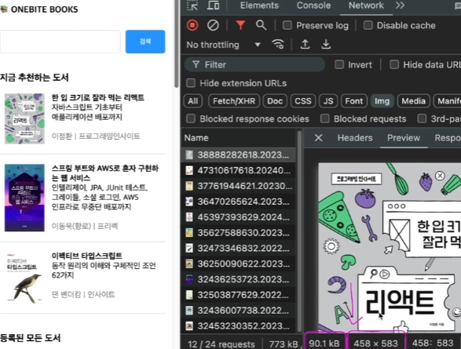

이미지 클릭 후 Preview 탭에서 이미지의 용량과 크기를 알 수 있음

1. 실제 화면에서는 80x105 px 크기로 렌더링되는데 4배 가까이 큰 이미지를 불러와 용량 또한 높아짐을 알 수 있음
   - 이런 이미지들이 하나둘 씩 쌓이다보면 큰 성능 악화로 이어질 수 있음

```jsx
import Image from 'next/image';

export default function BookItem({...}) {
  return (
    <Link href={`/book/${id}`} className={style.container}>
      <Image
        src={coverImgUrl}
        width={80}
        height={105}
        alt={`도서 ${title}의 표지 이미지`}
      />
			...
    </Link>
  );
}
```

- 기본적으로 기존 `img` 태그와 사용법이 동일함
- **width**와 **height**를 직접 명시하여 크기를 줄여 용량을 줄일 수 있음
- `alt`는 사용자의 디바이스가 이미지를 렌더링할 수 없는 상황이거나 시각장애인 분들을 위한 스크린리더 구동 시 대신 표시됨
  - 이때 `alt` 속성은 서비스의 성능에는 직접적인 영향을 미치지는 않지만 접근성을 위해 꼼꼼히 체크하기

#### 외부 사이트의 이미지 사용을 위한 설정

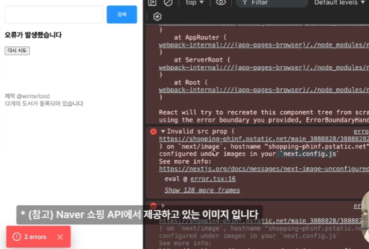

- 문제: 유효하지 않은 **src prop**이라는 에러가 뜨게 됨
- 원인: 이미지 최적화 시 해당 이미지가 현재 **Next** 프로젝트에 저장된 이미지가 아닌 외부 서버에 보관된 이미지 사용하는 방식인 경우 보안 때문에 자동으로 **차단**됨
- 해결: 이미지 컴포넌트에서 사용하려면 `next.config.js`에 몇가지 설정이 필요함

#### next.config.js 설정

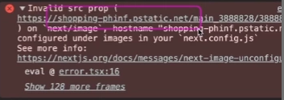

```jsx
/** @type {import('next').NextConfig} */
const nextConfig = {
  logging: {
    fetches: {
      fullUrl: true,
    },
  },
  images: {
    domains: ["shopping-phinf.pstatic.net"],
  },
};

export default nextConfig;
```

- 이미지를 불러오려고 하는 서버의 도메인 명시
  - 도메인: [`https://`](https://의)의 뒤부터 다음 `/` 전 내용

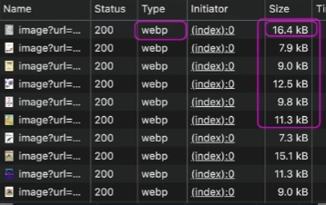

- 변경점
  - 해당 도메인으로부터 제공되는 이미지 파일들은 안전하다 평가하여 최적화에 포함시켜줌
  - 불러오고 있는 이미지의 타입이 jpeg → webp로 경량화된 형태로 변환
  - 이미지의 용량이 작아짐
  - 이미지를 뒤늦게 불러오는 기능이 더해져 드래그를 내리면 하위 이미지들이 불러와지게 됨

#### 9.2

#### 검색 엔진 최적화


**검색 엔진 최적화(SEO)**: 포털 사이트들에서 우리가 제작한 서비스에 어떠한 페이지가 있고 이에 어떠한 정보가 있는지 수집하게 하여 검색 결과에 잘 노출되도록 하는 것

- 다 해보기엔 시간이 부족하여 메타 데이터 설정만 실습

```jsx
export const metadata: Metadata = {
  title: "한입 북스",
  description: "한입 북스에 등록된 도서를 만나보세요",
  openGraph: {
    title: "한입 북스",
    description: "한입 북스에 등록된 도서를 만나보세요",
    images: ["/thumbnail.png"],
  },
};
```

**export**로 파일로부터 내보내 주게 되면 이 **메타데이터** 변수에 설정된 값이 자동으로 `index` 페이지의 메타데이터로 설정이 됨!

#### 검색 페이지 메타 데이터

```jsx
export const metadata: Metadata = {
  title: "한입북스 : 검색어",
  description: "~~",
  openGraph: {},
};
```

- **문제**: 페이지 컴포넌트에게 **props**로서 전달되는 검색어를 바깥 변수인 메타데이터에서 검색어에 **접근 불가**
- **해결**: 동적인 값으로 메타데이터를 설정할 수 있는 **generateMetadata**라는 약속된 이름의 함수에서 리턴으로 객체 형태로 내보내 주면됨.

```jsx
export async function generateMetadata({
  searchParams,
}: {
  searchParams: Promise<{ q?: string }>;
}): Promise<Metadata> {
  // 현재 페이지 메타 데이터를 동적으로 생성하는 역할을 합니다.
  const { q } = await searchParams;

  return {
    title: `${q} : 한입북스 검색`,
    description: `${q}의 검색 결과입니다`,
    openGraph: {
      title: `${q} : 한입북스 검색`,
      description: `${q}의 검색 결과입니다`,
      images: ["/thumbnail.png"],
    },
  };
}
```

- 함수의 반환 값 타입을 설정하고 싶다면 **Promise<Metadata>**로 설정
- `generateMetadata`가 반환하는 값의 타입은 비동기적으로 metadata라는 객체 값을 반환하겠다라는 정의

#### 동적 id 페이지 메타 데이터

```jsx
export async function generateMetadata({ params }: { params: Promise<{ id: string }> }) {
  const { id } = await params;
  const response = await fetch(
    `${process.env.NEXT_PUBLIC_API_SERVER_URL}/book/${id}`,
    { cache: "force-cache" }
  );

  if (!response.ok) {
    throw new Error(response.statusText);
  }

  const book: BookData = await response.json();

  return {
    title: `${book.title} - 한입북스`,
    description: `${book.description}`,
    openGraph: {
      title: `${book.title} - 한입북스`,
      description: `${book.description}`,
      images: [book.coverImgUrl],
    },
  };
}
```

- 상황: **book** 페이지의 경우에는 현재 조회하고 있는 도서의 데이터가 메타데이터에 포함되면, 현 도서의 상세정보와 썸네일 이미지를 도서의 커버로 사용할 수 있어 **메타데이터** 함수 내부에서 접속한 페이지의 도서 정보를 불러올 수 있어야함!

→ api를 호출하여 도서의 정보 불러오기

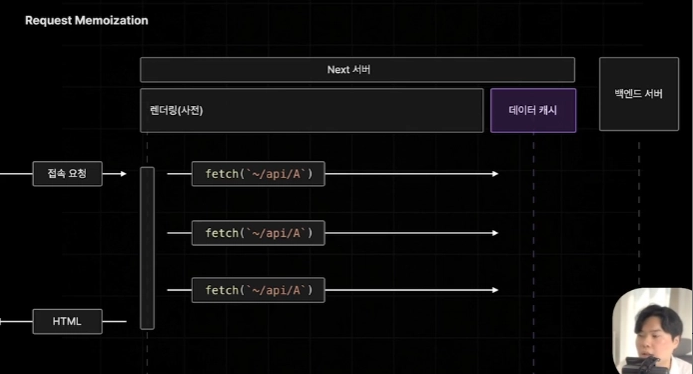

- **의문**: **중복**으로 동일 **api 호출**하면 문제가 생기지 않나? → 앞서 **request Memoization** 기능을 통해 하나의 페이지를 렌더링할 때 중복으로 발생하는 api는 한 번만 호출하도록 **캐싱**이 됨!

#### favicon 설정

- app 폴더 아래에 **favicon.ico**라는 이름으로 이미지 넣기

#### 9.3

#### 배포하기

지금까지 작성한 페이지를 웹 상에 배포하기

#### 1. Vercel 설치

window

```jsx
npm i -g vercel
```

mac

```jsx
sudo npm i -g vercel
```

#### 2. Vercel 로그인

```jsx
vercel login
```

#### 백엔드 서버 배포

- 프론트엔드 서버 배포 전, 백엔드 서버를 먼저 배포해야함!

```jsx
vercel;
```

#### 3. 프론트엔드 서버 배포

```jsx
vercel;
```

#### 에러 해결

- 백엔드 서버로 부터 데이터를 불러오게 설정해두었는데 백엔드 서버를 PC에서 이루어지는 것이 아닌 Vercel 서버에서 이루어지고 있음 → .env로 가보면 경로 변경이 필요함
- 해당 경로는 배포 환경에서 접근 불가!

```jsx
NEXT_PUBLIC_API_SERVER_URL=http://localhost:12345
```

#### 앞서 배포한 백엔드 서버 주소인 도메인을 복사하여 환경변수로 설정하기

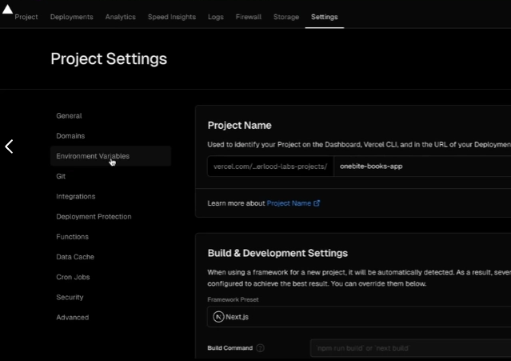

1. Settings → Environment Variables

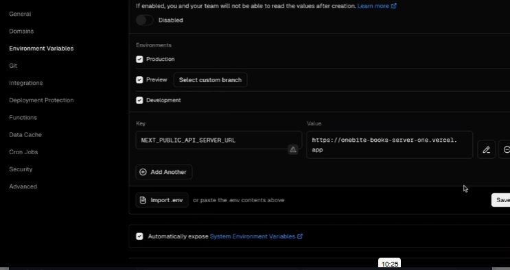

- Key와 Value 탭에 키와 값을 일치시켜 작성

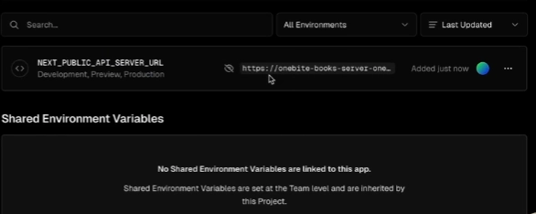

- 또한 화면을 내려 잘 설정되었는지 확인 가능

#### 9.4

#### 재배포

페이지 새로고침 및 상세페이지 이동 시 생각했던 것보다 느리게 동작하는 것을 확인할 수 있음

- Vercel이 무료 플랜이기도 하지만 코드 상에 실습 목적으로 스트리밍이나 서버 액션 설정 시 딜레이를 걸어두었거나 dynamic이 필요없는 페이지를 dynamic으로 설정한 경우가 있음

→ 성능을 개선하여 재배포

#### Index 페이지

1. 불필요한 import문 제거
2. delay 함수 제거
3. **dynamic** 강제화 제거

```jsx
export const dynamic = "force-dynamic";
```

1. Static 페이지의 경우 `Suspense` 컴포넌트도 불필요

#### Search 페이지

1. delay 함수 제거

#### book 페이지

1. generateStaticParams로 3개의 페이지만 정적으로 생성 → 현재 존재 모든 페이지 정적으로 생성

```jsx
export function generateStaticParams() {
  return [{ id: "1" }, { id: "2" }, { id: "3" }];
}
```

```jsx
export async function generateStaticParams() {
  const response = await fetch(
    `${process.env.NEXT_PUBLIC_API_SERVER_URL}/book`
  );

  if (!response.ok) {
    throw new Error(response.statusText);
  }

  const books: BookData[] = await response.json();

  return books.map((book) => ({
    id: book.id.toString(),
  }));
}
```

- api 호출을 통해 book 데이터를 가져와 id를 문자열로 변환하여 return

#### 서버 액션

1. 불필요한 import문 제거
2. delay 함수 제거

#### 재배포

- 프로덕션 모드로 이 프로젝트 재배포해라

```jsx
vercel --prod
```

#### 성능 차이

- 새로고침 상당히 빠르고 페이지 이동도 속도가 이전보다 빠름

#### 성능 최적화 방법

1. Vercel로 프로젝트 배포한 경우 코드 상에서 가능한 최적화말고도 Vercel 플랫폼에서 최적화할 수 있는 기능 존재

- Setting → Functions로 이동 시 Function Region 선택이 가능함

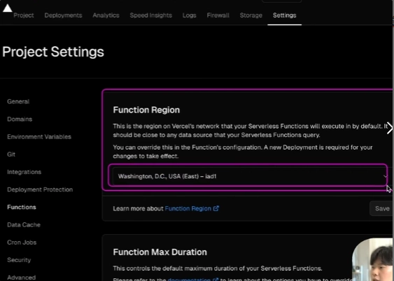

- 우리 Next 프로젝트의 페이지들이 어떠한 장소에서 제공될 것 인지 결정하는 섹션
- 아무리 광케이블을 타고 온다하더라도 미국(워싱턴)에서 우리나라까지 거리가 상당히 멂

→ Seoul, South Korea로 변경

⇒ 우리가 만든 페이지들이 워싱턴부터가 아닌 서울에서부터 오기때문에 비교적 빠른 속도로 오게 됨

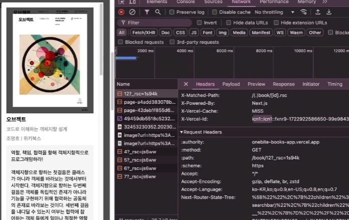

- 여기서 icn1이 서울을 의미!

#### 9.5

#### 마치며

평균 온라인 강의 완강률 : 10~20%

우리는 상위 10% 안에 듦으로 뿌듯하게 여기기!

#### 마지막 부탁

- 강의에 미흡한 점, 조언할 점을 링크의 구글폼으로 알려주기
- 좋았던 점 → 강의평으로

#### 커뮤니티 참여

- 옵챗이나 디스코드 참여
