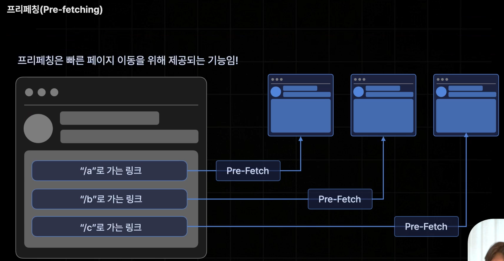
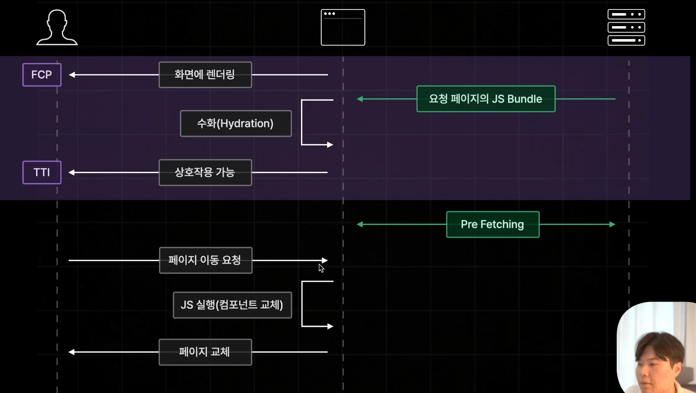
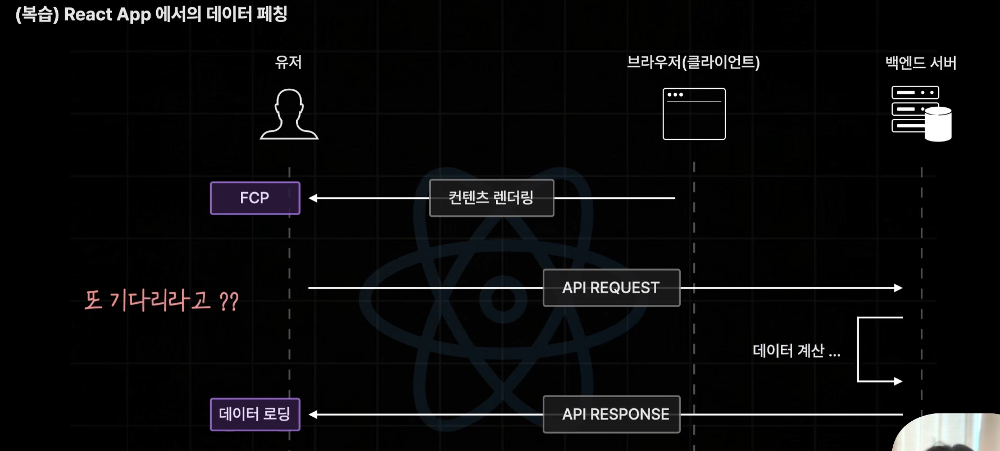
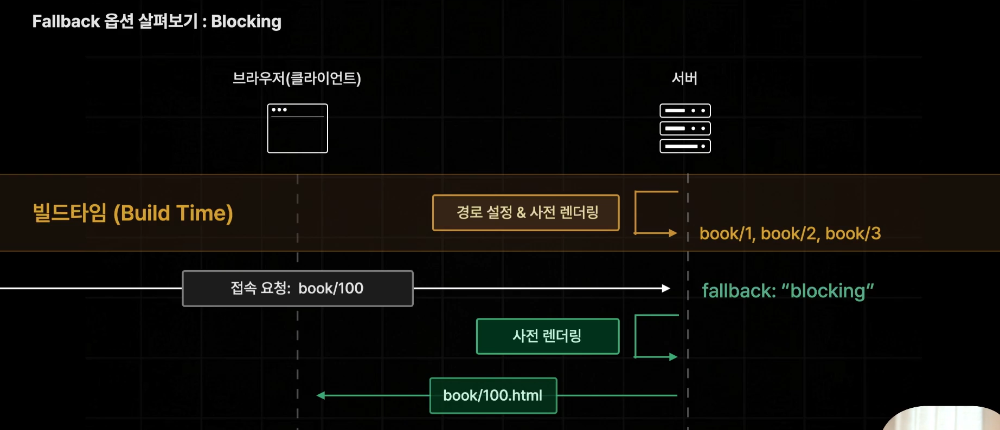
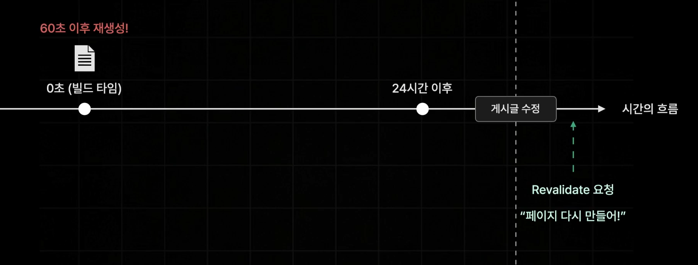

# 페이지 라우터

- pages 폴더 구조를 기반으로 페이지 라우팅을 제공
- query string `?q=` 은 페이지 경로에 영향주지 않는다. useRouter에서 꺼내와서 쓴다.
  - useRouter from next/router → 페이지 라우터
  - useRouter from next/navigation → 앱라우터
- 넥스트는 query string을 읽는 과정에서 컴포넌트를 한번 더 렌더링한다.
  - 콘솔로 router 객체 출력해보면 첫번째로 출력된 router객체에는 아직 query string을 읽어오지 못해서 query: 가 빈객체.
- 슬러그
  - 페이지의 고유한 주소를 만들기 위해 사용되는 식별자 문자열
  - 파일 이름에 대괄호 []를 사용해 만든 변수를 슬러그라고 부릅니다.
  - 파일명이 [id].tsx이므로, 여기서 슬러그의 이름은 id가 됩니다.
  - router.query.id를 통해 이 슬러그 자리에 들어온 값을 읽을 수 있습니다.
- catch all segment
  - segment: /로 구분되는 하나의 구간
  - [...id]: 연속적인 url parameter e.g.book/1/2/34/5/...
  - `...`: book이라는 경로 뒤에 여러개의 id가 연달아 들어올 수 있다.
- optional catch all segment
  - [[...id]]: 해당 파일의 index.tsx까지 포함한 경로

## Navigation (페이지 이동)

- Link: 사용자가 링크를 클릭했을때 이동
- programmatic navigation: 특정 버튼이 클릭되거나 특정 조건을 만족했을때 함수 내부에서 페이지 이동
  - useRouter().push("/"): 인수로 전달받은 경로로 CSR 방식 이동
  - useRouter().replace("/"): 뒤로가기 방지하며 이동
  - useRouter().back(): 뒤로가기

### Pre-Fetching

- Link 컴포넌트로 구현된 경로만 pre fetching
  - programmatic navigation은 pre fetching이 안된다.
  - 만약 programmatic navigation을 사용하면서 pre fetching하고 싶다면 useRouter()가 제공하는 prefetch 메서드 사용
    - useEffect를 사용해 마운트됐을때 실행하도록하고 useEffect안에서 `useRouter().prefetch('/경로')`
- 현재 뷰포트에 링크가 있다면 해당 페이지를 미리 불러놓는 기능
- 현재 사용자가 보고 있는 페이지 내에서 이동할 가능성이 있는 모든 페이지를 사전에 미리 다 불러 놓는 기능
- 그런데 초기 렌더링 이후에는 JS bundle을 어차피 받고 hydration해서 TTI하는데 왜 pre fetching으로 또 데이터를 받는걸까?
  - 넥스트는 JS bundle을 받을 때 페이지별로 code splitting해서 받는다. 즉, 모든 페이지를 받는게 아닌 현재 페이지에 필요한 JS bundle만 전달된다.
  - 모든 페이지의 번들파일을 전달할 경우 용량이 너무 커져 하이드레이션이 늦어지기 때문
- 때문에 페이지 이동할때 해당 페이지 JS 번들 받아야하는데 초기렌더링 처럼 받으면 이동 속도 이점이 없으므로 pre fetching
- 단, 개발모드일때는 pre fetching 이 동작하지 않는다.




- Link컴포넌트의 프리페칭을 강제로 해제하고 싶다면 `<Link href={"/search"} prefetch={false}>`
  - 기본 동작 (true): 링크가 브라우저 뷰포트(화면) 내에 들어오면, 사용자가 아무것도 하지 않아도 Next.js가 백그라운드에서 해당 페이지의 자바스크립트 번들을 미리 다운로드합니다.
  - 설정 시 (false): 화면에 링크가 노출되어도 자동으로 다운로드하지 않습니다. 하지만 사용자가 링크에 커서를 올리면(hover), 클릭할 확률이 매우 높다고 판단하여 그 시점에 즉시 프리페칭을 시작합니다.

## API Routes

- Next에서 API를 구축할 수 있게 해주는 기능
- api/\* 해당 경로로 요청했을때 보낼 응답 정의

## 스타일링

- page router에서는 \_app 컴포넌트가 아닌 다른 컴포넌트에서 CSS 파일을 import 할 수 없다.
- Next가 기본적으로 제공하는 CSS Module 활용 e.g. 파일명 index.module.css.
  - CSS module의 경우는 다른 컴포넌트에서 import 가능

## 글로벌 레이아웃 설정하기

- components/global-layout.tsx로 분리한 후 \_app 에 적용

## 페이지별 레이아웃 설정하기

- Next.js의 전통적인 레이아웃 패턴(Per-Page Layouts)
  - App Router에서는 layout.tsx 파일을 통해 시스템적으로 지원하지만, Pages Router에서는 getLayout이라는 사용자 정의 메서드를 사용하는 것이 사실상의 표준으로 통용되었습니다.
  - 페이지 컴포넌트를 하나의 객체로 취급하여, 그 객체에 레이아웃을 그리는 함수(getLayout)를 속성으로 주입하는 방식.
  - 반드시 \_app.tsx에서 아래와 같이 수신하는 코드가 있어야 합니다.

  ```ts
  // _app.tsx 예시
  export default function App({ Component, pageProps }) {
    // 컴포넌트에 getLayout 메서드가 있으면 그걸 쓰고, 없으면 그냥 페이지를 반환합니다.
    const getLayout = Component.getLayout || ((page) => page);

    return getLayout(<Component {...pageProps} />);
  }
  ```

## 사전렌더링과 데이터 fetching

### 리액트 data fetching

- 리액트에서 데이터 패칭은 컴포넌트 마운트 시점에 호출. 즉 컴포넌트가 렌더링 된 이후에 호출되니까 애초에 데이터 요청 자체가 늦다.
- 가뜩이나 csr이라 초기렌더링이 늦는데 데이터 패칭도 늦게 요청
  
  

### 넥스트 data fetching

- 넥스트는 다양한 pre rendering 방식 제공
  - 사전 렌더링 중 요청이 들어왔을 때 JS 렌더링 단계에서 data fetching도 미리 하도록 설정 가능
    
  - 만약 데이터 용량이 엄청 크거나 서버 이상 등으로 fetch 시간이 오래걸리면 유저는 그동안 빈화면을 보게됨
    → 넥스트는 빌드타임에 사전렌더링을 하도록 설정할 수도 있다. SSG
    
    

### SSR

- 요청이 들어오면 실행. 페이지 내부 데이터를 항상 최신으로 유지
- getServerSideProps 선언, export → 해당 페이지는 SSR 사전렌더링이 이뤄진다.
  - 페이지 역할하는 컴포넌트보다 먼저 실행. 필요한 데이터를 불러오는 등 기능
  - 사전렌더링하는 과정에서 한번만 실행. 서버측에서만 실행
  - getServerSideProps의 리턴값은 props 프로퍼티를 포함하는 하나의 객체여야함
    <br/>그래야 next가 props를 페이지 역할하는 컴포넌트에 전달
- SSR하는 페이지 역할 컴포넌트는 서버에서 한번 실행된(사전렌더링) 후 브라우저에서도 실행(하이드레이션)
  <br/>→ 콘솔 서버랑 브라우저 둘 다 출력. window객체 사용 불가
- 브라우저에서만 실행하는 코드는 useEffect사용
- 검색 페이지 같이 query string, url parameter 등을 읽어와서 해당 q 데이터 받아와야하는 경우 context 매개변수 사용
  - context 매개변수: 브라우저로부터 받은 모든 정보 포함

### SSG Static Site Generation

- 빌드타임에 한번 사전렌더링하고 다시는 새로 생성하지 않는다.
- 프로덕션 모드에서만 확인 가능
- getStaticProps 사용
- 데이터 패칭 과정이 오래걸려도 서버 가동전인 빌드타임에 일어나기 때문에 사용자 경험에는 아무런 영향이 없다.
- 사전 렌더링에 많은 시간이 소요되는 페이지더라도 빌드타임에 미리 만들어 두기 때문에 사용자의 요청에는 매우 빠른속도로 응답 가능
- 매번 같은 페이지만 응답함. 최신 데이터 반영은 어렵다.

  
  

- getStaticProps에 전달되는 context에는 query string이 없다. 정적인 페이지에서 query string을 써야한다면 getStaticProps가 아닌 페이지 컴포넌트 안에서 useRouter().query.q 와 useEffect사용. state에 보관. 즉, 기본 SSG 방식(getStaticProps없는)으로 동작.
- 동적 경로를 갖는 페이지를 getStaticProps로 SSG로 만들고 싶다면 getStaticPaths 필요
  - 동적 페이지를 사전렌더링 하려면 경로도 미리 알아야함
  - getStaticPaths에서 경로를 아래처럼 반환
  ```tsx
  {
    path: [
      { params: { id: "1" } },
      { params: { id: "2" } },
      { params: { id: "3" } },
    ];
  }
  ```
  
- fallback 옵션
  - false: paths에 미리 설정하지 않은 경로는 not found 반환
  - blocking: 즉시 생성(SSR처럼)
    - 만들어진 이후에는 SSG 처럼 작동
  - true: 즉시 생성(SSR처럼) + 페이지만 미리 반환
    - blocking은 SSR의 단점과 마찬가지로 사전렌더링이 오래걸리면 사용자가 로딩을 기다려야한다.
    - true는 props(페이지에 필요한 데이터)없는 페이지만 일단 바로 반환. 즉, getStaticProps함수 호출은 생략하고 페이지 컴포넌트만 먼저 보냄 → 사용자가 긴 로딩시간 대신 데이터 없는 페이지 먼저 본다.




#### 빌드 후 콘솔에 찍히는 기호

- 빈동그라미: 해당 페이지에 getStaticProps나 getServerSideProps가 없는 그냥 기본값으로 설정된 SSG 페이지
  - 넥스트에서는 아무것도 적용되지 않은 페이지들을 static으로 빌드타임에 사전 렌더링한다.
  - 즉, default 사전 렌더링 방식
- 채운동그라미: SSG
- f: SSR (next api는 기본적으로 SSR)

### ISR (Incremental Static Regeneration)

- SSG방식으로 생성된 정적 페이지를 일정 시간을 주기로 다시 생성하는 것
- 60초로 설정하면 60초 이후 첫번째 요청 발생시 이전 버전 먼저 반환하고 동시에 서버 뒷단에서 새로운 버전 만듦.
- SSG장점(빠르게 응답)+SSR장점(최신 데이터 업데이트)
- getStaticProps의 return에 `revalidate: 초` 추가
  

#### 주문형 재검증 on-Demand-ISR

- 시간과 관계없이 사용자의 행동 또는 특정 조건에 따라 데이터가 업데이트되는 페이지는 ISR로 구현하기 어렵다.(e.g. 게시글 수정, 삭제)
  - SSR은 요청이 들어올때마다 실행되니까 응답이 늦어질수도 있고 사용자가 많으면 서버 부하
- 요청을 받을때마다 페이지를 다시 생성하는 ISR인 on-Demand-ISR 사용
  
- api route에서 특정 경로에대한 revalidate 처리. 이 route로 요청하면 그 페이지가 revalidate됨.

## SEO 설정하기

- 리액트와 달리 각 페이지별 메타태그 설정 가능
  - import Head from "next/head" 사용. `<Head>` 안에 html 메타태그 적듯이 작성
  - import Head from "next/document": \_document파일에서만 사용되는 컴포넌트
- dynamic SSG fallback: true 인 경우, 미리 static에 등록한 경로가 아닌 경로로 요청한다면, 데이터 채우기 전 html을 먼저 사용자에게 보내기때문에 설정한 메타태그가 적용되지 않는다.s
  <br/>또한 조건문 `if(router.isFallback) return "로딩중입니다"`같은 처리가 되어있어도 메타태그 적용 안됨. 하지만 조건문 여부와 관계없이 위와같은 이유로 적용안됨.
  <br/>→ 이럴때는 위 조건문의 return 값으로 기본 메타태그라도 넣는다.

## Vercel에 배포하기

- `npm install -g vercel` `sudo npm install -g vercel``pnpm add -g vercel`: vercel package 설치
- `vercel login`
- `vercel` 터미널로 배포
- 백엔드 서버도 같이 배포해서 배포된 백엔드 서버로부터 데이터를 불러와야함.
  - 프론트엔드(Next.js)만 Vercel에 배포하면 다음과 같은 문제가 생깁니다.
    - 연결 끊김: 배포된 Next.js 사이트는 인터넷 세상에 떠 있지만, 백엔드 서버는 로컬 안에만 있습니다. 외부 사용자가 접속하면 localhost를 찾을 수 없어 에러가 납니다.
    - SSG/ISR 빌드 실패: 빌드 타임에 데이터를 가져와야 하는데, 배포 서버(Vercel 등)가 로컬에 접속할 방법이 없으므로 빌드 단계에서 에러가 발생합니다.
  - 만약 별도의 백엔드 서버(Node.js, Spring 등)를 운영하기 부담스럽다면 아래 방법들을 쓸 수 있습니다.
    - Next.js API Routes: src/pages/api 폴더를 사용해 Next.js 내부에 서버 로직을 작성합니다. 이 경우 프론트와 백엔드가 한 몸이라 추가 배포가 필요 없습니다.
    - Firebase / Supabase: 서버를 직접 짜는 대신, 이미 배포되어 있는 데이터베이스 서비스(BaaS)를 연결합니다.
    - Mock Data: 데이터가 바뀔 일이 없다면 public 폴더에 json 파일을 넣어두고 불러오기만 해도 됩니다.
  - 백엔드를 배포했다면, Next.js 코드 안의 API 주소를 수정해야 합니다. 이때 환경 변수를 활용하는 것이 정석입니다.

    ```TypeScript
    // .env.local (로컬 환경)
    NEXT_PUBLIC_API_URL=http://localhost:4000

    // Vercel 설정 (배포 환경)
    NEXT_PUBLIC_API_URL=https://your-backend-api.com
    ```

- 백엔드 경로에서 `vercel`: 백엔드 서버도 vercel에 배포
  - vercel production deployment Domains 주소로 url(lib폴더)들 변경

- 프론트 다시 배포 `vercel --prod` 프로덕션 모드로 배포
- 배포 후 SEO(오픈그래프 등)도 잘 작동하는지 확인해보기

- 참고
  - 강의에서 백엔드를 별도로 배포한 이유는 직접 만든 백엔드 서버 코드(Node.js, Express 등)가 있었기 때문
  - 백엔드 배포가 필요 없는 경우 (Direct Connection)
    - 대부분의 수파베이스 사용자가 선택하는 방식. 프론트엔드(Next.js)에서 수파베이스 라이브러리(@supabase/supabase-js)를 사용해 직접 DB에 쿼리를 날리는 방식
    - 구조: Next.js ↔ Supabase (DB + Auth + API)
    - 이유: 수파베이스가 이미 인증, 데이터베이스, API 서버 역할을 모두 대신해주고 있기 때문. 수파베이스 자체가 이미 배포된 '백엔드 서비스'입니다.
    - 결과: 백엔드 배포가 전혀 필요 없습니다. Vercel에 Next.js만 올리면 끝입니다.
  - 백엔드 배포가 필요한 경우 (Middleware Server)
    - 수파베이스와 프론트엔드 사이에 내가 직접 짠 별도의 서버가 꼭 있어야만 하는 특수한 상황입니다.
    - 구조: Next.js ↔ 내 백엔드 서버 ↔ Supabase
    - 이유: 데이터 가공 로직이 너무 복잡해서 수파베이스만으로는 해결이 안 되거나, 외부 유료 API와의 통신을 내 서버에서 숨겨서 처리해야 할 때 사용합니다.
    - 결과: 이때는 강의처럼 내 백엔드 서버 코드를 Vercel이나 다른 곳에 배포해야 합니다.
  - 요즘 트렌드: Next.js API Routes (중간 지점)
    - 백엔드 로직이 조금 필요하긴 한데, 서버를 따로 배포하기 귀찮을 때 쓰는 방식입니다.
    - Next.js 프로젝트 내부의 app/api (또는 pages/api) 폴더에 서버 로직을 작성합니다.
    - 이 코드는 Next.js와 함께 Vercel에 한꺼번에 배포됩니다. 즉, 따로 백엔드를 배포할 필요가 없습니다.

## 페이지 라우터 단점

### 1. 페이지별 레이아웃 설정이 번거롭다.

### 2. 데이터 페칭이 페이지 컴포넌트에 집중된다.

- 서버에서 불러오는 모든 데이터는 page 컴포넌트에게 props로서 전달되는 구조. 즉, 사전 렌더링에서 불러온 데이터가 페이지 컴포넌트에만 전달. page 컴포넌트 아래 자식컴포넌트들이 그 데이터를 활용 해야하면 페이지 컴포넌트로부터 전달받아야함. 상태관리 도구 등을 사용할수 있지만 애초에 상태관리를 도입해야하는 것 자체가 이 부분이 문제라는 것

### 3. 불필요한 컴포넌트들도 JS Bundle에 포함된다.

- 불필요한 컴포넌트: 상호작용 기능이 없어서 브라우저에서 한 번 더 실행이 되어 하이드레이션 될 필요 없는 컴포넌트들
  - 넥스트 컴포넌트들 2번 실행
    - 서버 측에서 사전 렌더링을 진행하기 위해 최초로 한번 실행
    - 브라우저 측에서 하이드레이션을 위해 한번 더 실행
      
- FCP 이후에 hydration을 위해 JS bundle을 서버가 브라우저로 보낼때 JS상호작용에 필요하지 않은 컴포넌트들도 같이 묶어서 보낸다.
  - 참고로 Link 태그 페이지 이동은 하이퍼링크로 동작하는 HTML 고유의 기능이지 JS가 동작해서 이벤트를 처리해주는 상호작용 기능이 아니다.
- 넥스트의 컴포넌트들은 상호작용이 있는 컴포넌트와 없는 컴포넌트들이 있는데 없는 컴포넌트들이 더 많다. 상호작용 없는 컴포넌트들은 단순히 UI만 렌더링. 상호작용이 없는 컴포넌트들은 사전 렌더링에서 HTML로 변환만 되면 됨. JS Bundle에 포함되어 브라우저에서 한번 더 실행될 필요가 없다.
  <br/>→ JS bundle 용량이 커져서 하이드레이션도 느려지고 결국 TTI 늦어짐

- 앱 라우터에서는 상호작용이 없는 컴포넌트들은 서버측에서만 실행되는 컴포넌트라 해서 "서버 컴포넌트" 라는 부류로 나눠서 개발 진행 → 서버 컴포넌트들은 JS bundle에 포함 안됨
