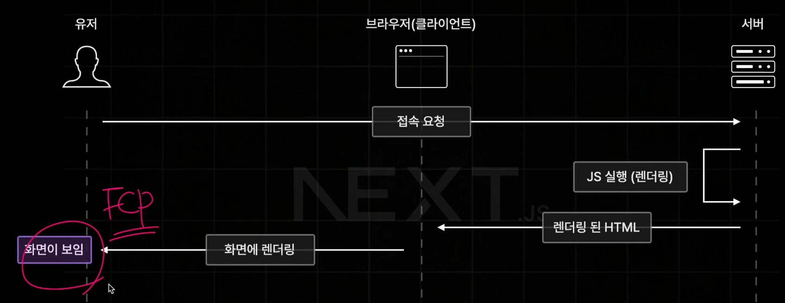
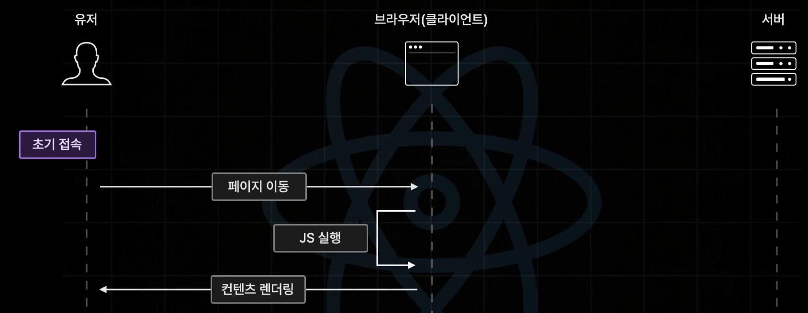

# pre-rendering

- 브라우저의 요청에 사전에 렌더링이 완료된 HTML을 응답하는 렌더링방식
- CSR의 단점을 효율적으로 해결
  - CSR: 브라우저에서 직접 화면을 렌더링.
  - 장점: 이미 초기에 JS bundle을 브라우저가 다 받기 때문에 페이지 이동할때 서버에 요청을 할 필요없어 페이지 이동이 빠르다.
  - 단점: 초기 접속 느림 FCP






- 넥스트 서버는 첫 화면 렌더링 이후 곧바로 브라우저에게 우리가 작성한 모든 JS코드를(리액트 앱 번들링해서) 넘겨준다.
  
- hydration → TTI(Time to Interactive)
  

- 초기 렌더링 이후 페이지 렌더링
  


# 개발 모드(dev) vs 프로덕션 모드(start)

- 빌드 후 실행(npm run build && npm run start)을 해도 기본적으로는 localhost:3000에서 실행됩니다.
- 하지만 개발 모드(npm run dev)와는 내부 동작 방식이 완전히 다릅니다.
- 만약 두 모드를 동시에 띄우고 싶거나 포트를 바꾸고 싶다면 아래와 같이 실행할 수 있습니다.

```
# 프로덕션 모드를 3001번 포트에서 실행
npm run start -- -p 3001
```

- 개발 모드 (npm run dev)
  - 코드를 수정하면 즉시 반영되는 HMR(Hot Module Replacement) 기능이 작동하며, 에러 메시지가 상세하게 출력됩니다.
- 프로덕션 모드 (npm run start)
  - 빌드(npm run build)를 통해 최적화된 결과물을 실행합니다. 코드를 수정해도 서버를 끄고 다시 빌드하기 전까지는 반영되지 않으며, 실행 속도가 훨씬 빠릅니다.
