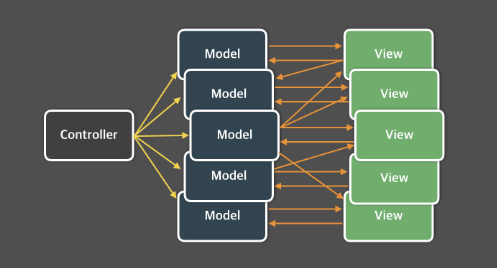
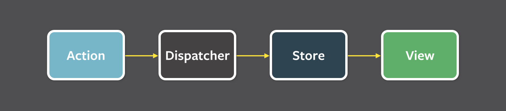

# 05. 리액트와 상태관리 라이브러리

## 5.1 상태 관리는 왜 필요한가?

- 상태란 어떠한 의미를 지닌 값이며 애플리케이션의 시나리오에 따라 지속적으로 변경될 수 있는 값을 의미
- 웹 서비스에서 점차 다양한 기능이 제공됨에 따라 웹 내부에서 관리해야 할 상태도 점차 증가하게됨
- 이에 따라 상태를 어떻게 효율적으로 관리해아 하는가에 대한 고민이 시작

### 리액트 상태 관리의 역사

1. Flux 패턴의 등장

- 2014에 리액트의 등장과 비슷한 시기에 해당 패턴을 기반으로한 라이브러리 Flux 출시 [당시 페이스북 발표 자료](https://www.youtube.com/watch?v=nYkdrAPrdcw&list=PLb0IAmt7-GS188xDYE-u1ShQmFFGbrk0v&t=692s)

**기존 MVC 패턴의 문제점**


- 위 이미지와 같이 웹 애플리케이션이 비대해지고 상태도 많아짐에 따라 상태가 어떻게 변하는지 추적하고 이해하기가 어려워짐

**Flux 패턴의 등장**

- 페이스북팀은 해당 문제의 원일을 양방향 데이터 바인딩으로 보게됨

1. 뷰(HTML)가 모델(JavaScript)을 변경할 수 있으며, 반대에 경우 모델도 변경이 가능

2. 코드를 작성하는 입장은 간단하지만 코드의 양이 증가하고 변경 시나리오가 복잡해질수록 관리가 어려워짐

- 이를 해결하기 위해 양방향을 단방향으로 변경하는 것으로 제안하게 되는데 이 때가 Flux 패턴의 시작이됨.

**Flux 패턴**


**용어 정의**

- action: 어떠한 작업을 처리할 액션과 그 액션 발생 시 함께 포함시킬 데이터를 의미. 액션타입과 데이터를 각각 정의해 이를 디스페처로 보낸다.

- dispatcher: 액션을 스토어에 보낸는 역할을 한다. 콜백 함수 형태로 앞서 액션이 정의한 타입과 데이터를 모두 스토어에 보낸다.

- store: 여기에서 실제 상태에 따른 값과 상태를 변경할 수 있는 메서드를 가지고 있다. 액션의 타입의 따라 어떻게 이를 변경할지가 정의돼 있다.

- view: 리액트의 컴포넌트에 해당하는 부분으로, 스토어에서 만들어진 데이터를 가져와 화면을 렌더링 하는 역할. 또한 뷰에서도 사용자 입력이나 행위에 따라 상태를 업데이트 하고자 하면 다음 그림처름 뷰에서 액션을 호출하는 구조로 구성됨
  
- 하지만 이런 흐름 방식도 당연하게 불편함은 존재한다.
- 사용자의 입력에 따라 데이터를 갱신하고 화면을 어떻게 업데이트 해야하는지도 코드로 작성해야 해서 코드의 양이 증가한다.
- 하지만 데이터의 흐름은 한 방향으로 줄어들므로 데이터의 흐름을 추적하기 쉽고 코드를 이해하기도 좋아진다.

**시장 지배자 리덕스의 등장**

- 이런 리액트의 단방향 데이터 흐름이 점점 두각을 드러낼 때 등장한 것이 바로 리덕스(Redux)이다.
- 리덕스의 특별한 점은 바로 Flux 패턴 + Elm 아키텍처를 도입한 것이다.

**Elm 아키텍처란?**

- 웹 페이지를 선언적으로 작성하기 위한 언어
- Elm의 핵심 요소로 model, update, view가 존재한다.

**핵심 요소**

- model: 애플리케이션의 상태
- view: 모델을 표현하는 HTML
- update: 모델을 수정하는 방식

**작동 방식**

- 리덕스는 위와 같은 아키텍처의 영향을 받아 작성됨

  1. 하나의 상태 객체를 스토어에 저장
  2. 이를 업데이트 하는 작업을 디스패치해 업데이트를 수행

- 이러한 작업을 `reducer`함수로 발생
- 함수 실행 시 상태에 대한 새로운 복사본을 반환 후, 애플리케이션에 새롭게 만들어진 상태를 전파

**왜 시장을 지배 했을까?**

- 이러한 작동 방식으로 하나의 글로벌 상태 객체를 하위 컴포넌트에 전파할 수 있기 때문에 prop 내려주기 문제를 해결하게 됨

- 스토어가 필요한 컴포넌트라면 `connect`만 쓰면 바로 스토어에 접근이 가능함

**그러면 단점이 없을까?**

- 그렇지는 않다 리덕스도 아래와 같은 단점이 존재한다.

  - 단순히 하나의 상태를 바꾸고 싶어도 어떠한 액션인지 타입 선언 후 이 액션을 수행할 `creator` 함수를 만들어야 함.

  - `dispatcher`, `selector`도 필요하고 새로운 상태가 어떻게 기존의 리듀서 내부에서 어떤 식으로 변경돼야 할 지, 혹은 새로 만들어야 할지도 새로 정의해야 했다.

- 결국 하고자 하는 일에 비해 보일러플레이트가 너무 많다는 비판이 있었다 (현재는 많이 간소화됨)

```tsx
import React from "react";
import ReactDOM from "react-dom/client";
import { createStore } from "redux";
import { Provider, connect } from "react-redux";

/* ================================
    1) Action type
================================ */
const INCREMENT = "INCREMENT";

/* ================================
    2) Action creator
================================ */
const increment = () => ({
  type: INCREMENT,
});

/* ================================
    3) Reducer
================================ */
const initialState = { count: 0 };

function counterReducer(state = initialState, action) {
  switch (action.type) {
    case INCREMENT:
      return { count: state.count + 1 };
    default:
      return state;
  }
}

/* ================================
    4) Store
================================ */
const store = createStore(counterReducer);

/* ================================
    5) React Component
================================ */
function Counter({ count, increment }) {
  return (
    <div style={{ padding: 20 }}>
      <h1>{count}</h1>
      <button onClick={increment}>+1</button>
    </div>
  );
}

/* ================================
    6) connect()로 상태/액션 바인딩
================================ */
const mapStateToProps = (state) => ({
  count: state.count,
});

const mapDispatchToProps = { increment };

const ConnectedCounter = connect(mapStateToProps, mapDispatchToProps)(Counter);

/* ================================
    7) Provider로 스토어 전달
================================ */
const root = ReactDOM.createRoot(document.getElementById("root"));
root.render(
  <Provider store={store}>
    <ConnectedCounter />
  </Provider>
);
```

**ContextAPI와 useContext**

- 리액트 팀은 처음 출시 뒤에도 상태를 어떻게 적절하게 주입해야 하는지에 대한 고민은 이어짐
- 리덕스가 있엇었지만 단순히 상태를 참조학 싶을 뿐인데 준비해야 하는 보일러플레이트도 부담이 됨 => 컴포넌트 설계의 커다란 제약

**ContextAPI의 등장**

- 리액트 팀은 리액트16.3에서 전역 상태를 하위 컴포넌트에 주입할 수 있는 새로은 ContextAPI를 출시하게 됨.
- 이는 props로 상태를 넘겨주지 않더라도 ContextProvider가 주입하는 상태를 사용할 수 있게 되었다.

**과거의 context**

- 과거에는 `getChildContext()`를 사용했었다.

```tsx
import React from "react";
import PropTypes from "prop-types";

class Parent extends React.Component {
  // 1) 내려보낼 context 타입 선언
  static childContextTypes = {
    message: PropTypes.string,
  };

  // 2) 실제 context 값 제공
  getChildContext() {
    return { message: "Hello from Parent!" };
  }

  render() {
    return <Child />;
  }
}

// 3) 함수 컴포넌트에서 context 받기
function Child(props, context) {
  return <div>{context.message}</div>;
}

// 4) 함수 컴포넌트에서도 contextTypes 지정 가능
Child.contextTypes = {
  message: PropTypes.string,
};

export default Parent;
```

**해당 방식의 문제점**

- 상위 컴포넌트가 렌더링되면 `getChildContext`도 호출됨과 동시에 생명주기 메서드 중 하나인 `shouldComponentUpdate`가 항상 `true`를 반환하여 불필요한 렌더링이 일어나게 됨
- `getChildContext` 사용하기 위해 `context`를 인수로 받을 경우 컴포넌트와 결합도가 높아지는 단점이 있음

**Context API 사용 예시**

```jsx
import React, { createContext, Component } from "react";

// 1) Context 생성
const ThemeContext = createContext();

// 2) Provider를 포함한 클래스 컴포넌트
export default class App extends Component {
  state = {
    theme: "light",
  };

  toggleTheme = () => {
    this.setState(({ theme }) => ({
      theme: theme === "light" ? "dark" : "light",
    }));
  };

  render() {
    return (
      <ThemeContext.Provider
        value={{
          theme: this.state.theme,
          toggleTheme: this.toggleTheme,
        }}
      >
        <Child />
      </ThemeContext.Provider>
    );
  }
}

// 3) 클래스 컴포넌트에서 Context 사용 방법 #1 (Context.Consumer)
class Child extends Component {
  render() {
    return (
      <ThemeContext.Consumer>
        {({ theme, toggleTheme }) => (
          <div style={{ padding: 20 }}>
            <h1>현재 테마: {theme}</h1>
            <button onClick={toggleTheme}>테마 변경</button>
          </div>
        )}
      </ThemeContext.Consumer>
    );
  }
}
```

- 하지만 `Context API`는 상태 관리가 아닌 주입을 도와주는 기능이니, 렌더링을 막아주는 기능 또한 존재하지 않아 주의가 필요하다.

**훅의 탄생, 그리고 React Query와 SWR**

- 16.8 버전에서 함수 컴포넌트에 사용할 수 있는 다양한 훅 API가 추가됨.

- 기존 무상태 컴포넌트를 선언하기 위해서만 제한적으로 사용됐던 함수 컴포넌트가 클래스 컴포넌트 이상의 인기를 구가할 수 있도록 많은 기능이 제공됨.

- 이 방식 덕분에 외부에 데이터를 불러오는 fetch를 관리하는데 특화된 라이브러리 SWR, React Query가 등장하게됨.

```jsx
import React from "react";
import {
  QueryClient,
  QueryClientProvider,
  useQuery,
} from "@tanstack/react-query";

// 1. Query Client 생성
const queryClient = new QueryClient();

// 2. API 호출 함수
async function fetchUser() {
  const res = await fetch("https://jsonplaceholder.typicode.com/users/1");
  return res.json();
}

// 3. React Query 사용 컴포넌트
function User() {
  const { data, isLoading, isError } = useQuery({
    queryKey: ["user"],
    queryFn: fetchUser,
  });

  if (isLoading) return <div>로딩 중...</div>;
  if (isError) return <div>에러 발생</div>;

  return (
    <div>
      <h1>유저 정보</h1>
      <p>이름: {data.name}</p>
      <p>이메일: {data.email}</p>
    </div>
  );
}

// 4. Provider로 감싸기
export default function App() {
  return (
    <QueryClientProvider client={queryClient}>
      <User />
    </QueryClientProvider>
  );
}
```

**Recoil, Zustand, Jotai, Valtio에 이르기까지**

- 훅의 등장에 따라 기존 상태 관리 라이브러리와는 다르게 훅을 이용하여 작은 크기의 상태를 효율적으로 관리할 수 있게 되었다.
- 함수 컴포넌트에서도 손 쉽게 사용할 수 있다.

## 5.2 리액트 훅으로 시작하는 상태 관리

### 가장 기본적인 방법: useState와 useReducer

- 이러한 형태의 커스텀 훅이 있다고 가정해보자

```tsx
function useCounter(initCount: number = 0) {
  const [counter, setCounter] = useState(initCount);

  function inc() {
    setCounter((prev) => prev + 1);
  }

  return { counter, inc };
}
```

- 만약 각 컴포넌트에 해당 커스텀 훅이 없는 경우 각각의 컴포넌트에 위와 같은 내용을 구현해야 했을 것이다.

```tsx
function useStateWithUseReducer(initialValue) {
  const [state, dispatch] = useReducer(
    (prevState, action) =>
      typeof action === "function" ? action(prevState) : action,
    initialValue
  );

  return [state, dispatch];
}

function useReducerWithUseState(reducer, initialState, initializer) {
  // Lazy initialization
  const [state, setState] = useState(
    initialState ? initializer(initialState) : initialState;
  );


  const dispatch = useCallback((action) =>
    setState((prev) => reducer(prev, action)),
    [reducer],)


  return [state, dispatch];
}
```

- useState와 useReducer는 약간의 구현 차이가 있을 뿐 두 훅 모두 지역 상태 관리를 위해 만들어졌다.

**useState와useReducer의 한계**

- 훅을 사용할 때마다 컴포넌트별로 초기화 되므로 컴포넌트에 따라 서로 다른 상태를 가질 수 밖에 없다.
- 이를 해결하기 위하여 상태를 컴포넌트 밖으로 한 단계 끌어 올리는 방법이 있다

```tsx
function Parent() {
  const { counter, inc } = useCounter();

  return (
    <>
      <Counter1 counter={counter} inc={inc} />
      <Counter2 counter={counter} inc={inc} />
    </>
  );
}
```

- 지역 상태의 `useCounter`를 부모 컴포넌트로 끌러올려 하위 컴포넌트에서 참조해 재사용하게끔 만들 수 있다.

- 하지만 이러한 방법도 여전히 prop 형태로 필요한 컴포넌트에 제공해야 한다는 단점이 있다

## 지역 상태의 한계를 벗어나보자:u useState의 상태를 바깥으로 분리하기

**리액트 클로저가 아닌 자바스크립트로 관리하면 어떨까?**

- 결국 useState의 한계는 리액트가 만든 만든 클로저 내부에서 관리되어 지역 상태로 생성되기 때문에 해당 컴포넌트에서만 사용할 수 있는 단점이 존재

```tsx
export type State = { counter: number };

// 상태를 아예 컴포넌트 밖에 선언
let state: State = {
  counter: 0,
};

export function get(): State {
  return state;
}

// useState와 동일하게 구현하기 위해 게으른 초기화 함수나 값을 받을 수 있게 했다.
type Initializer<T> = T extends any ? T | ((prev: T) => T) : never;

export function set<T>(nextState: Initializer<T>) {
  state = typeof nextState === "function" ? nextState(state) : nextState;
}

function Counter() {
  const state = get();

  function handleCilck() {
    set((prev: State) => ({ counter: prev.counter + 1 }));
  }

  return (
    <>
      <h3>{state.counter} </h3>
      <button onClick={handleCilck}>+</button>
    </>
  );
}
```

- 하지만 결론적으로는 상태는 업데이트 할 수 있지만 상태가 업데이트 되었을 때 이를 컴포넌트에 반영시키기 위한 리렌더링을 이르킬 수 없어 작동하지 않는다.

**useState의 인수로 컴포넌트 밖에서 선언하는 state를 넘겨보자**

```tsx
function Counter1() {
  const [count, setCount] = useState(state)

  function handleClick() {
    set((prev: State)) => {
      const newState = { counter: prev.counter + 1}
      setCount(newState)
      return newState
    })
  }

  return (
    <h3>{count.counter}</h3>
    <button onclick={handleClick} />
  )
}
```

- 이 코드는 억지로 전역에 있는 상태를 참조하게 만들었다.
- `handleClick`을 이용하여 외부의 상태를 수정하고 `useState`의 두 번째 인수로 인하여 컴포넌트도 리렌더링이 가능해져 계속해서 외부의 값을 안정적으로 가져올 수 있다.

**단점**

- 외부 의 상태가 있음에도 불구하고 함수 컴포넌트의 렌더링을 위해 함수의 내부에 동일한 상태를 관리하는 `useState`가 필요

- 버튼을 누르면 해당 컴포넌트가 렌더링 되면서 원하는 값을 안정적으로 렌더링 하지만 같은 상태를 바라보는 반대쪽 컴포넌트는 렌더링 되지 않는다.

**그러면 어떠한 조건을 만족해야 할까?**

1. 꼭 window나 global에 있어야 할 필요는 없지만 컴포넌트 외부 어딘가에 상태를 두고 여러 컴포넌트가 같이 쓸 수 있어야 함

2. 이 외부에 있는 상태를 사용하는 컴포넌트는 상태의 변화를 알아챌 수 있어야 하고 상태가 변화될 때마다 리렌더링이 일어나서 컴포넌트를 최신 상태값 기준으로 렌더링해야 한다.

3. 상태가 원시값이 아닌 객체인 경우에 그 객체에 내가 감지하지 않는 값이 변한다 하더라도 리렌더링이 발생해서는 안된다.

**Store**

```tsx
type Initializer<T> = T extends any ? T | ((prev: T) => T) : never

type Store<State> = {
  get: () => State
  set: <T>(nextState: Initializer<T>) => void
  subscribe: (listener: () => void) => () => void
}

export function createStore<State extends unknown>(
  initialState: State
): Store<State> {
  // useState와 마찬가지로 초깃값을 게으른 초기화를 위한 함수 또한
// 그냥 값을 받을 수 있도록 한다.
// state의 값은 스토어 내부에서 보관해야 하므로 변수로 선언
  let state = typeof initialState !== 'function' ? initialState : initialState()

  // callbacks는 자료형에 관계없이 유일한 값을 저장할 수 있는 Set을 사용
  const callbacks = new Set<() => void>();
  // 언제든 get이 호출되면 최신값을 가져올 수 있도록 함수로 만든다
  const get = () => state;
  const set = (nextState: State | ((prev: State)) => {
    // 인수가 함수라면 함수를 실행해 새로운 값을 받고
    // 아니라면 새로운 값을 그대로 사용
    state = typeof nextSate === 'function' ? (nextState as (prev: State) => State)(state) : nextState

    // 값의 설정이 발생하면 콜백 목록을 순회하면서 모든 콜백을 실행
    callback.forEach((callback) => callback())

    return state
  })

  // subscribe는 콜백을 인수로 받는다.
  const subscribe = (callback: () => void) => {
    // 받은 함수를 콜백 목록에 추가한다.
    callbacks.add(callback)
    // 클린업 실행 시 이를 삭제하면서 반복적으로 추가되는 것을 막는다.
    return () => {
      callbacks.delete(callback)
    }
  }

  return { get, set, subscribe }

}

```

**작동 원리**

1. 먼저 store의 초깃값을 state 또는 게으른 초기화 함수를 받아 store의 기본값을 초기화할 수 있게 해뒀다.

2. 1번에서 받은 인수를 바탕으로 함수를 실행하거난 초깃값 자체를 할당해 state 초기값을 할당

3. 컴포넌트로 넘겨받는 콜백 함수를 저장하기 위해 callbacks를 Set으로 선언 (Set은 원시값이나 객체에 관계없이 유일한 값을 저장 가능해 중복 없이 저장 가능)

4. get을 함수로 만들어 매번 최신 값을 가져올 수 있게 만든다.

5. set을 만들어 새로운 값을 넣을 수 있도록 만든다. useState의 두 번째 인수와 마찬가지로 함수일 수도, 단순히 값을 받을 수도 있다. 그리고 값을 설정한 이후에 callbacks를 순회해 등록된 모든 콜백을 실행한다. set으로 값을 설정하는순간 콜백을 모두 실행해 컴포넌트의 렌더링을 유도할 것이다.

6. subscribe는 callbacks Set에 callback을 등록할 수 있는 함수다. callbacks.add와 더불어, 반환값으로는 등록되는 callback을 삭제하는 함수를 반환한다. 이는 callbacks에 callback이 무한히 추가되는 것을 방지(useEffect의 클린업 함수와 동일한 역할)

7. 마지막 으로 get, set, subscribe를 객체로 반환해 외부에서 사용할 수 있도록 한다.

요약 : 자신이 관리해야 하는 상태를 내부 변수로 가진 다음, get 함수로 해당 변수의 최신값을 제공하며, set 함수로 내부 변수 최신화하며, 이 과정에서 등록된 콜백을 모조리 실행하는 구조

**useStore**

- 이제 위 코드로 값을 참조할 수 있으니 해당 값의 변화에 따라 컴포넌트 렌더링을 유도할 사용자 훅이 필요

```tsx
export const useStore = <State,>(store: Store<State>) => {
  const [state, setState] = useState(store.get());

  useEffect(() => {
    const unsubscribe = store.subscribe(() => setState(store.get()));
    return unsubscribe;
  }, [store]);

  return [state, store.set] as const;
};
```

**훅 구성**

1. 훅의 인수로 store를 받는다

2. 이 스토어의 값을 초깃값으로 하는 useState를 만든다. 이제 이 useState가 컴포넌트의 렌더링을 유도한다.

3. useEffect는 store의 현재 값을 가져와 setState를 수행하는 함수를 store의 subscribe로 등록해두었다.
   createStore 내부에서 값이 변경될 때마다 subscribe에 등록된 함수를 실행하므로 useStore 내부에서는 store의 값이 변결될 떄마다 state의 값이 변경되는 것을 보장받을 수 있다.

4. 마지막으로 useEffect의 클린업 함수로 unsubscribe를 등록해 둔다. useEffect의 작동이 끝난 이후에는 callback에서 해당 함수를 제거해 callback이 계속해서 쌓이는 현상을 방지

**문제점**

- 원시 값은 상관없지만 객체인 경우 일부 값만 변경될 경우에 useState가 실행되어 어떤 값이 바뀌더라도 무조건 리렌더링이 발생함

**개선 방법**

- 기존 방법에서 두 번쨰 인수로 selector라는 함수를 받는다.
- 해당 함수는 store에서 어떤 값을 가져올 지 정의하는 함수로 이 함수를 활용해 `store.get()`을 수행한다.
- 이를 통하여 store의 값이 변경됐다 하더라도 selector의 값이 변경되지 않는 다면 리렌더링이 발생하지 않는다.

**주의점**

- selector를 컴포넌트 밖에 선언하거나, 이것이 불가능 하다면 useCallback을 사용해 참조를 고정 시켜야 함\

**useSubscription**

- 페이스 북에서 만든 외부 데이터 소스(external store)의 변경을 React가 안전하게 구독(subscribe)하도록 만든 공식 훅

**useStore와 차이점**

- useStore는 의존성 배열에 store가 들어가 있어 객체가 임의로 변경되면 불필요한 리렌더링 발생
- useSubscription는 내부에 예외 처리를 추가해 한정적으로 원하는 값을 반환 가능

## useState와 Context를 동시에 사용해보기

- 훅과 스토어를 사용하는 구조는 반드시 하나의 스토어만 가지게 된다. 하나의 스토어를 가지면 이 스토어는 마치 전역 변수처럼 작동하게 되어 동일한 형태의 여러 개의 스토어를 가질 수 없게 된다.

**훅을 사용하는 서로 다른 스코프에서 스토어의 구조는 동일하되, 여러 개의 서로 다른 데이터를 공유해 사용하고 싶다면?**

```tsx
// store.js
import React, { createContext, useContext, useState } from "react";

// Context 생성
// StoreContext는 상태를 저장하고 컴포넌트 트리 전체에 상태를 제공하는 컨텍스트 객체임
const StoreContext = createContext(null);

// Provider 컴포넌트
// StoreProvider는 상태를 생성하고, 이를 하위 컴포넌트에 제공하는 역할을 함
export const StoreProvider = ({ children, initialState }) => {
  // useState 훅을 사용하여 상태를 생성함. 초기 상태는 initialState임
  const [state, setState] = useState(initialState);

  // Provider를 사용하여 하위 컴포넌트에 상태와 setState 함수를 제공함
  return (
    <StoreContext.Provider value={{ state, setState }}>
      {children}
    </StoreContext.Provider>
  );
};

// Custom Hook
// useStore 훅은 StoreContext의 값을 반환함
export const useStore = () => {
  const context = useContext(StoreContext);
  // useStore가 StoreProvider 내에서 호출되지 않으면 에러를 던짐
  if (!context) {
    throw new Error("useStore must be used within a StoreProvider");
  }
  return context;
};
```

**상태 관리 라이브러리의 작동 방식**

- useState, useReducer가 가지고 있는 한계, 컴포넌트 내부에서만 사용할 수 있는 지역상태라는 점을 극복하기 위해 외부 어딘가에 상태를 둔다.

- 이 외부의 상태 변경을 각자의 방식으로 감지해 컴포넌트의 렌더링을 일으킨다.

### 상태 관리 라이브러리 Recoil, Jotai, Zustand 살펴보기

**Recoil**

- 페이스북에서 개발한 상태 관리 라이브러리
- 리액트에서 훅의 개념으로 상태 관리를 시작한 최초의 라이브러리

**RecoilRoot**

- Recoil의 애플리케이션을 감싸는 최상위 컴포넌트
- Recoil 에서 생성되는 상태 값을 저장하기 위한 스토어를 생성

```jsx
import { RecoilRoot } from "recoil";

function App() {
  return <RecoilRoot>{/* 하위 컴포넌트들 */}</RecoilRoot>;
}
```

- Recoil의 상태값은 RecoilRoot로 생성된 Context의 스토어에 저장된다.

- 스토어의 상태값에 접근할 수 있는 함수들이 있고, 이 함수를 활용해 상태값에 접근하거나 상태값을 변경할 수 있다.

- 값의 변경이 발생하면 이를 참조하고 있는 하위 컴포넌트에 모두 알린다.

**atom**

- 상태를 나타내는 Recoil의 최소 상태 단위
- atom은 key값을 필수로 가지며, 이 키는 다른 atom과 구별하는 식별자가 되는 필수 값이다. (유일한 값)

```jsx
import { atom } from "recoil";

const countState = atom({
  key: "countState", // 고유 식별자
  default: 0, // 초기값
});
```

**useRecoilValue**

- atom의 값을 읽어오는 훅
- 값이 변경될 때마다 리렌더링 한다.

```jsx
import { useRecoilValue } from "recoil";

function Counter() {
  const count = useRecoilValue(countState);

  return <div>Count: {count}</div>;
}
```

**useRecoilState**

- useState와 유사하게 값을 가져오고, 이 값을 변경할 수 있는 훅

```jsx
import { useRecoilState } from "recoil";

function Counter() {
  const [count, setCount] = useRecoilState(countState);

  const increment = () => setCount(count + 1);
  const decrement = () => setCount(count - 1);

  return (
    <div>
      <p>Count: {count}</p>
      <button onClick={increment}>Increment</button>
      <button onClick={decrement}>Decrement</button>
    </div>
  );
}
```

**Recoil에서 영감을 받은, 그러나 조금 더 유연한 Jotai**

- 상향식 접근법 (작은 단위의 상태를 위로 전파할 수 있는 구조)

- context의 문제점인 불필요한 리렌더링이 일어난다는 문제를 해결하고자 설계돼 있고, 추가적으로 개발자들이 메모이제이션이나 최적화를 거치지 않아도 리렌더링이 발생되지 않도록 설계돼 있다.

**atom**

- 최소 단위의 상태
- atom 하나만으로도 상태를 만들 수도, 아예 파생된 상태를 만들 수 있다.

```jsx
import { atom } from "jotai";

// atom 정의
export const countAtom = atom(0); // 초기값 0을 가진 countAtom
```

**useAtomValue**

- 특정 atom값을 읽어오는 훅
- 이 훅으로 atom의 현재 값에 접근할 수 있다.

```jsx
import { useAtomValue } from "jotai";
import { countAtom } from "./atoms";

function CounterComponent() {
  const count = useAtomValue(countAtom);

  return (
    <div>
      <p>Count: {count}</p>
    </div>
  );
}
```

**useAtom**

- useState와 동일한 형태의 배열을 반환한다.

  - 첫 번째: atom의 현재 값을 나타내는 useAtomValue 훅의 결과

  - 두 번째: useSetAtom훅 반환 (atom을 수정할 수 있음)

```jsx
import { useAtom } from "jotai";
import { countAtom } from "./atoms";

function CounterComponent() {
  const [count, setCount] = useAtom(countAtom);

  const increment = () => setCount((prevCount) => prevCount + 1);
  const decrement = () => setCount((prevCount) => prevCount - 1);

  return (
    <div>
      <p>Count: {count}</p>
      <button onClick={increment}>Increment</button>
      <button onClick={decrement}>Decrement</button>
    </div>
  );
}
```

**작고 빠르며 확장에도 유연한 Zustand**

- 리덕스에 영감을 받음
- atom이 아닌 Zustand에서는 하나의 스토어를 중앙 집중형으로 활용해 이 스토어 내부에서 상태를 관리하고 있다.

**간단한 사용법**

```jsx
import { create } from 'zustand';

export const useCountStore = create((set) => ({
  count: 0,
  increase: () => set((state) => ({ count: state.count + 1 })),  /
  decrease: () => set((state) => ({ count: state.count - 1 })),
}));

import { useCountStore } from '@/store/countStore';

export function Counter() {
  const { count, increase, decrease } = useCountStore();

  return (
    <div>
      <h1>Count: {count}</h1>
      <button onClick={decrease}>-1</button>
      <button onClick={increase}>+1</button>
    </div>
  );
}
```

- create를 이용하여 스토어를 만들고, 반환 값을 컴포넌트 내부에서 훅으로 사용할 수 있다.

- 해당 훅을 사용하면 스토어 내부에 있는 getter와 setter 모두 접근해 사용이 가능하다.
