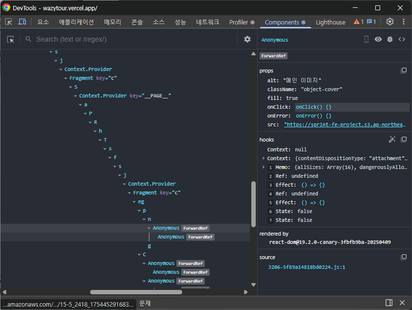
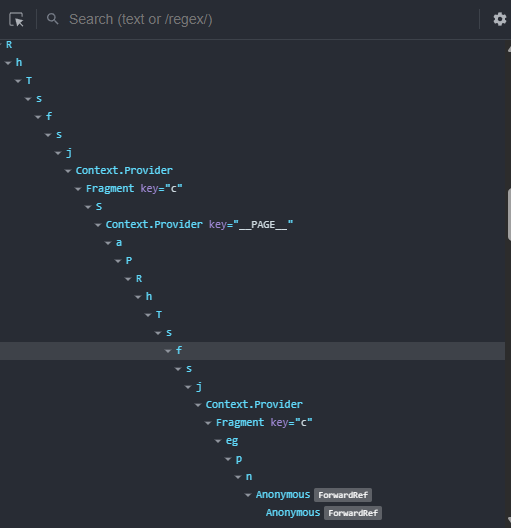
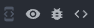
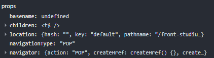
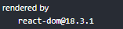
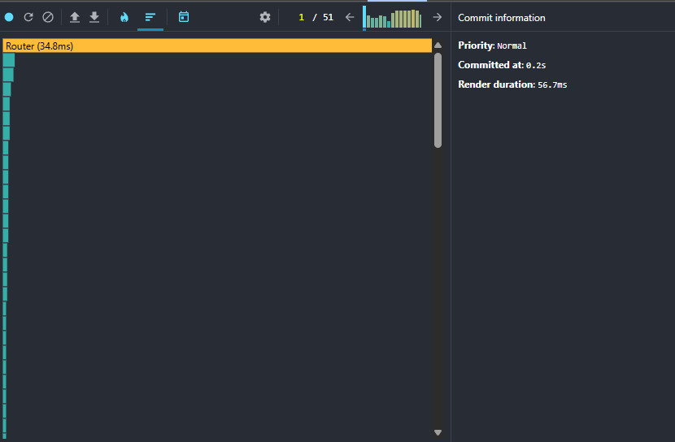
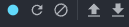
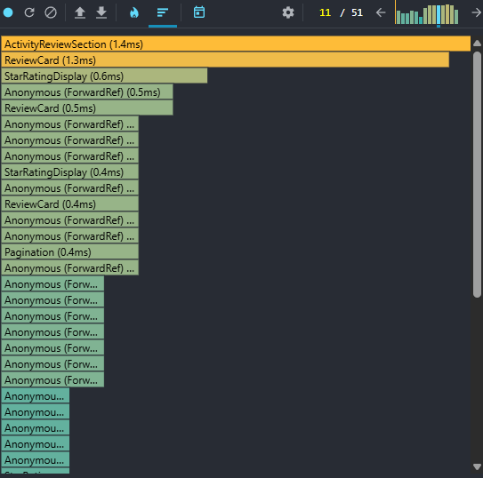
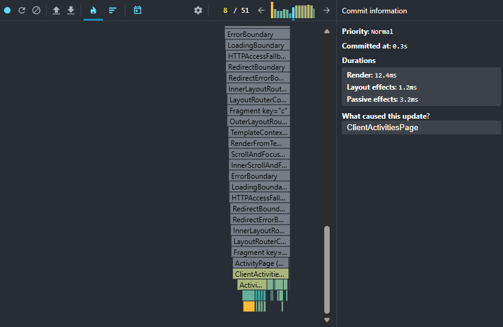

# 리액트 개발 도구로 디버깅하기

## 6.1 리액트 개발 도구란

- `react-dev-tools`: 리액트로 만들어진 다양한 애플리케이션을 디버깅하기 위해 만들어진 개발 도구

## 6.3 리액트 개발 도구 활용하기

### 컴포넌트

- 현재 리액트 애플리케이션의 컴포넌트 트리를 확인할 수 있다.
- 컴포넌트 구조, props, 내부 hooks 정보 확인 가능

**컴포넌트 트리**

- 이미지 왼쪽이 해당 페이지의 컴포넌트 트리를 나타낸다.
- 리액트 전체의 트리 구조를 한 번에 볼 수 있다.
- 기명함수 = 컴포넌트명 O | 익명함수 = Anonymous로 표기

**주의점**

- 함수 선언식 또는 표현식으로 선언되지 않을 경우 Anonymous가 표시됨 (익명 함수, memo, 고차 컴포넌트 등)
- 익명 함수에 대한 컴포넌트 명칭을 제대로 추론 X => 16.9 버전에서 개선

**해결법**

- 컴포넌트를 기명 함수로 선언
- 함수에 displayName 속성 추가

### 컴포넌트명과 props

- 컴포넌트 트리에서 컴포넌트를 선택했을 때 해당 컴포넌트에 대한 자세한 정보를 보여주는 영엿
- 빨간색 경고 이모티콘이 있을 경우 strict mode로 렌더링 되지 않았다는 뜻

**컴포넌트 도구**

- 왼쪽 위 3개의 아이콘
- `눈 아이콘`: 해당 컴포넌트가 HTML의 어디에서 렌더링됐는지 확인할 수 있다.
- `벌레 아이콘`: 콘솔 탭에 해당 컴포넌트 정보가 기록된다. -`소스코드 아이콘`: 해당 컴포넌트의 소스코드를 확인할 수 있다.

**컴포넌트 props**

- 컴포넌트가 받은 props를 확인할 수 있다.
- 단순한 원시값뿐만 아니라 함수도 포함되어 있다.

- `Copy value to clipboard`: 클립보드 복사
- `Store as global variable`: `widow.$r`에 해당 정보가 담김
  - 콘솔로 갈 경우 해당 변수의 정보가 담겨 있다.
- `Go to definition` 해당 변수가 선언된 코드로 이동

**컴포넌트 hooks**

- 컴포넌트에서 사용 중인 훅 정보를 확인할 수 있다.
- `useState`는 `use` 생략된 이름으로 나타난다.
- 기명 함수로 넘겨줄 경우 해당 함수 이름을 확인할 수 있다.

**컴포넌트를 렌더링한 주체, rendered by**

- 컴포넌트를 렌더링한 주체를 확인할 수 있다.
- 프로덕션 모드: react-dom 버전만 확인 가능
- 개발 모드: 해당 컴포넌트를 렌더링한 부모 컴포넌트 확인 가능

### 프로파일러

- 렌더링 과정에서 발생하는 상황을 확인하기 위한 도구
- 프로덕션 모드는 사용 X

**설정 변경하기**

- `Highlight updates when components render`: 컴포넌트 렌더링 시 해당 컴포넌트에 하이라이트 표시

- `Debugging -> Hide logs during additional invocations in 
Strict Mode`: Strict Mode로 인한 두 번 출력을 한 번 출력으로 바꿀 수 있다.(프로덕션은 정상적으로 한 번 출력)
- `Profiler -> Record why each component rendered while profiling`: 프로 파일링 도중 무엇 때문에 컴포넌트가 렌더링됐는지 기록

**프로파일링 메뉴**

- 왼쪽 순으로 시작, 새로고침 후 시작, 종료, 프로파일 불러오기, 프로파일 저장

**Flamegraph**

- 렌더 커밋별로 어떠한 작업이 일어났는지 나타낸다.
- 커서를 가져다 대면 해다 컴포넌트의 렌더링과 관련된 정보를 확인할 수 있다.
- 렌더링되지 않은 컴포넌트는 회색으로 표기

**Ranked**

- 해당 커밋에서 렌더링하는 데 오랜 시간이 걸린 컴포넌트를 순서대로 나열한 그래프

### 타임라인

- 시간이 지남에 따라 컴포넌트에서 어떤 일이 일어났는지를 확인할 수 있다. (18 버전 이상만 가능)
- 시간의 흐름에 따라 리액트가 작동하는 내용을 추적하는데 유용

### 프로파일러로 렌더링 원인 파악해서 수정해보기

- Flamegraph, Ranked, Timeline을 활용해서 수정할 수 있다.

**1. 문제의 렌더링 확인**

- Flamegraph로 해당 렌더링 정보 확인

**2. `What caused this update?` 확인**

임시 사진으로 예시를 들자면 현재 `ClientActivitiesPage`로 인해 렌더링 됨

- `What caused this update?`으로 렌더링된 이유 파악

**3. 문제 발견 후 판단에 맞게 수정**

- 이후 문제가 확인된 컴포넌트를 수정해서 해결하면 된다.
