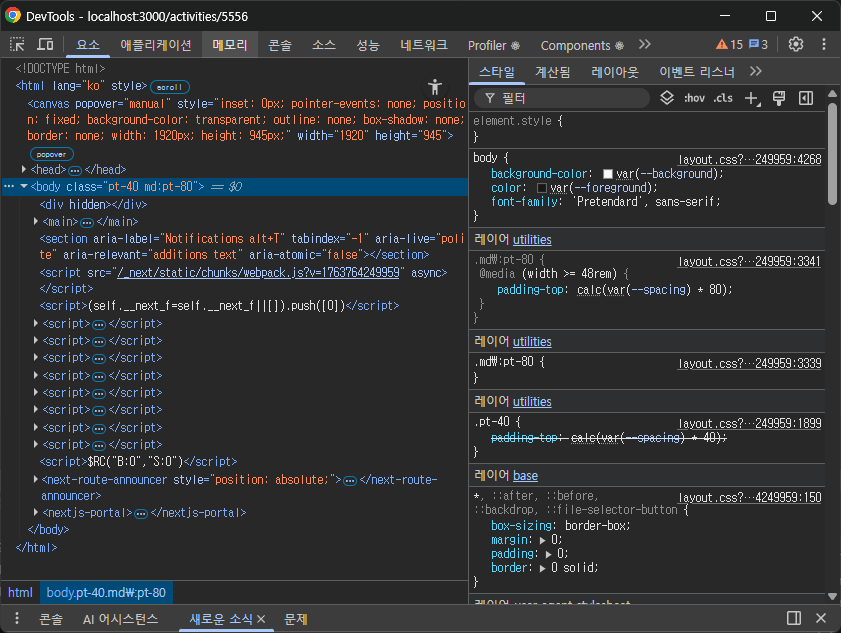
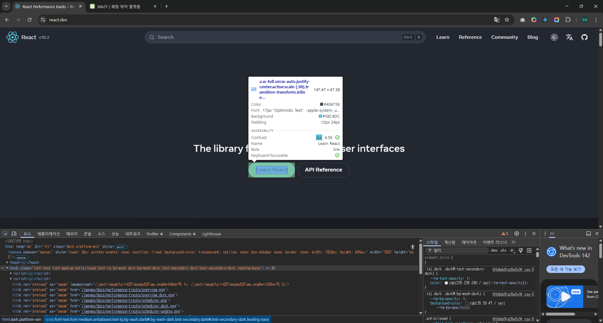
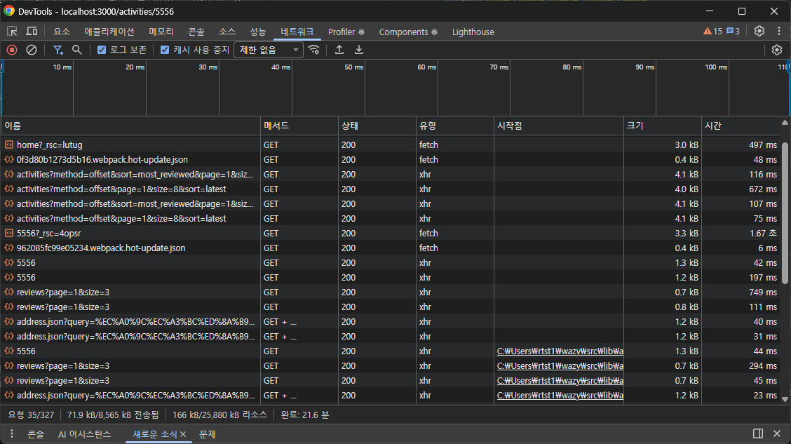
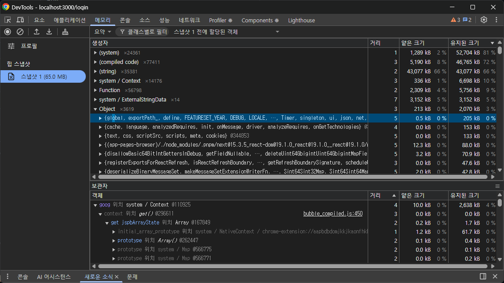

# 07 크롬 개발자 도구를 활용한 애플리케이션 분석

## 7.1 크롬 개발자 도구란?

- 크롬에서 제공하는 개발자용 도구
- 시크릿 모드 or 개인정보 보호 모드에서 키는 것을 권장
  - 확장 프로그램으로 인해 전역 변수나 HTML 요소에 다른 정보가 포함될 수 있기 때문

## 7.2 요소 탭

- 웹페이지를 구성하고 있는 HTML, CSS 등의 정보를 확인할 수 있다.

### 요소 화면

- 왼쪽 화면은 페이지를 구성하는 HTML을 나타낸다
- 이 중에서 원하는 태그를 클릭하면 브라우저 페이지의 요소 강조 + 해당 태그와 관련된 정보 확인 가능
- `중단 위치`: 좌클릭으로 설정 가능, 중단과 관련된 작업이 일어나면 해당 요소 변경을 일으킨 소스 코드를 보여주게 됨

### 요소 정보

- 스타일 : 요소와 관련된 스타일 정보를 나타낸다.
- 계산됨: 해당 요소의 크기, 패딩, 보더, 마진과 각종 CSS 적용 결괏값을 알 수 있다.
- 레이아웃: CSS 그리드나 레이아웃과 관련된 정보를 확인할 수 있다.
- 이벤트 리스너: 현재 요소에 부착된 각종 이밴트 리스너 확인 가능, 이벤트 버블링으로 발생된 이벤트는 확인 X
- DOM 중단점: 중단점이 있는지 알려준다.
- 속성: 해당 요소가 가지고 있는 모든 속성값을 나타낸다.
- 접근성: 웹 이용에 어려움을 겪는 장애인, 노약자를 위한 스크린리더기 등이 활용하는 값

## 7.3 소스 탭

- 웹 애플릴케이션을 불러오기 위해 실행하거나 참조된 모든 파일을 확인할 수 있다.
- 개발 모드로 생성된 다양한 파일을 찾아볼 수 있다.
- DOM 중단점을 만들어 DOM이 변경 되는 과정을 디버깅할 수 있다.
- 소스 중단점으로 자바스크립트 실행을 중단시키고 디버깅할 수 있다.
- `감시 -> 워치`: 현재는 워치로 표기, 감시하고 싶은 변수 선언 후 해당 정보를 확인할 수 있는 메뉴
- `중단점`: 웹사이트에서 추가한 중단점을 확인할 수 있다.
- `범위`: 현재 중단점에서의 스코프
- `호출 스택`: 중단점의 콜스택 확인 가능
- `전역 리스너`: 전역 스코프에 추가된 리스너 목록을 확인할 수 있다.
- `XHR/가져오기, DOM, 이벤트 리스너, CSP 위반 중단점`: 소스의 중단점 이외에 다양한 중단점을 확인할 수 있다.

## 7.4 네트워크 탭

- 모든 네트워크 관련 작동이 기록되는 곳

**집중적으로 봐야 하는 부분**

- 불필요한 요청 또는 중복되는 요청이 없는지
- 웹페이지 구성에 필요한 리소스 크기가 너무 크지 않은지
- 리소스를 불러오는 속도는 적절한지 또는 너무 속도가 오래 걸리는 리소스가 없는지
- 리소스가 올바른 우선순위로 다운로드되어 페이지를 자연스럽게 만들어가는지

## 7.5 메모리 탭

- 현재 웹페이지가 차지하고 있는 메모리 관련 정보를 확인할 수 있다.

- `힙 스냅샷`: 메모리 상황을 촬영할 수 있다.
- `타임라인의 할당 계측`: 로딩이 되는 과정의 메모리 변화 또는 페이지에서 어떠한 상호작용을 했을 때 메모리의 변화 과정을 알고 싶을 때 사용
- `할당 샘플링`: 메모리 공간을 차지하고 있는 자바스크립트 함수를 볼 수 있다.

### 자바스크립트 인스턴스 VM 선택

- 현재 실행 중인 자바스크립트 VM 인스턴스를 확인할 수 있다.
- 페이지의 자바스크립트 힙 점유율을 나타낸다.

### 힙 스냅샷

- 현재 페이지의 메모리 상태를 확인해 볼 수 있는 메모리 프로파일 도구

### 타임라인 할당 계측

- 시간의 흐름에 따라 메모리 변화를 확인할 수 있는 기능

### 할당 샘플링

- 타임라인 할당 계측과 비슷하지만 추가적으로 자바스크립트 실행 스택별로 분석할 수 있으며, 분석을 함수 단위로 한다.

## 7.6 Next.js 환경 디버깅하기

**1. Next.js 프로젝트를 디버그 모드로 실행하기**

**2. Next.js 서버에 트래픽 유입시키기**

- SSR의 경우는 서버가 실행한 뒤 사용자가 유입되면서 메모리 누수가 발생하는 경우가 많다.
- 오픈소스 도구 ab를 사용한다.

**3. Next.js의 메모리 누수 지점 확인하기**
