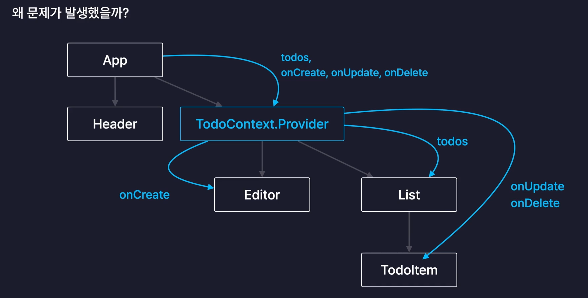
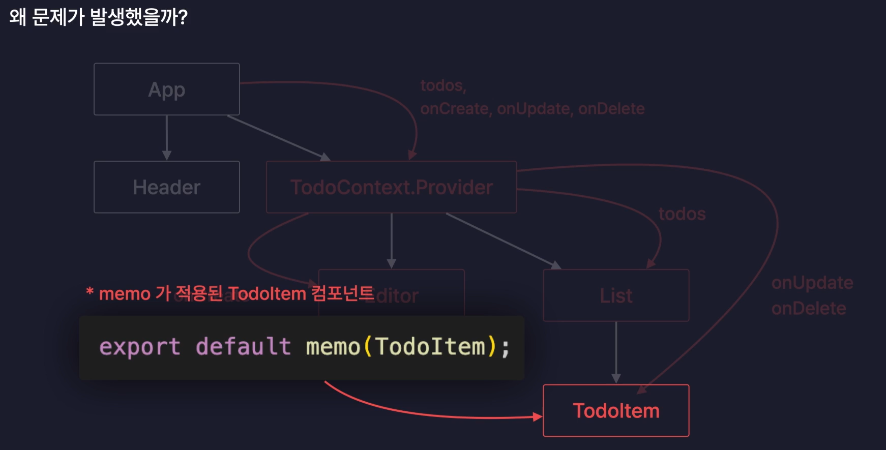
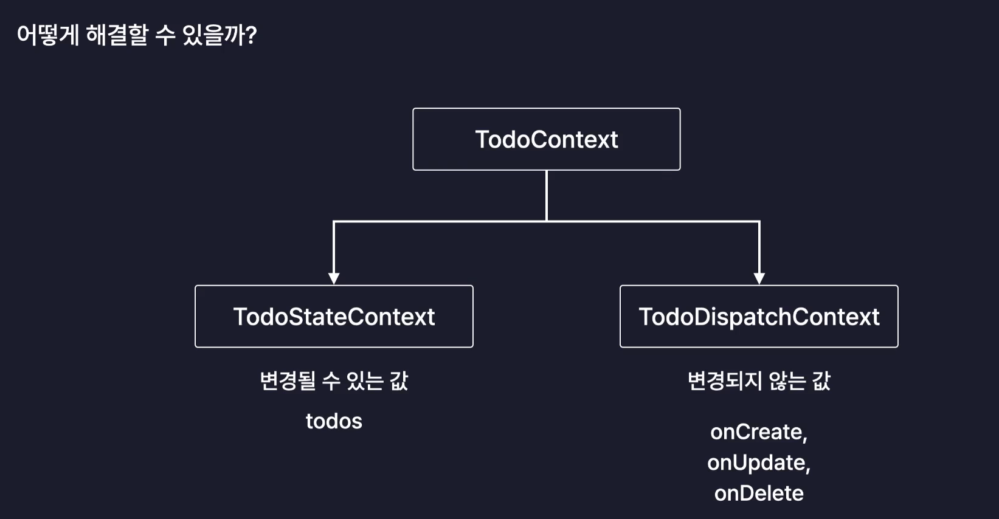
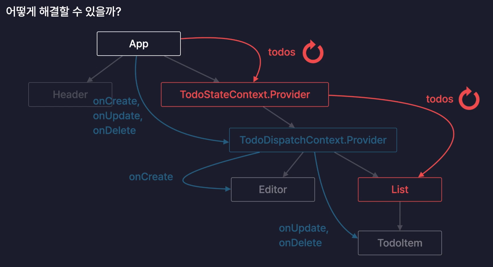

- context 객체는 보통 컴포넌트 외부에 선언(createContext). 컴포넌트가 리렌더 할때마다 계속 새로 선언되는 것을 방지하기 위해
  - context 객체의 provider 프로퍼티
    - provider 컴포넌트다. `<todoContext.Provider value={todos, onCreate, onUpdate, onDelete}>` 형태로 사용. 하위 컴포넌트들은 todoContext 데이터를(value) 공급받을 수 있다.
    - context가 공급할 데이터를 설정하거나 컨텍스트의 데이터를 공급받을 컴포넌트들을 설정
- useContext로 사용
  - `useContext(todoContext)` 형태로 사용. todoContext의 value값을 반환한다.

- provider컴포넌트도 App컴포넌트로부터 제공받는 value props(todos, onCreate, onUpdate, onDelete를 감싸고 있는 객체)가 변경될 때마다 리렌더링이 발생한다.
- 새로운 todo 아이템을 추가, 수정, 삭제하면 todos state가 바뀌면서 객체를 다시 생성해 넘겨주기 때문에 props로 받는 객체가 바뀐다.
   → provider 컴포넌트 리렌더 → provider 컴포넌트의 자식 컴포넌트들도 리렌더 → 최적화가 제대로 작동 안하는 문제 발생

- 그런데 사진처럼 TodoItem에 memo로 최적화했기 때문에 받는 props가 바뀌지 않으면 리렌더링이 발생하지 않아야 하는데 현재 안바뀐 item까지 리렌더링이 발생 → 그 이유는 새로운 todo추가 등 하면 App컴포넌트의 todos state가 바뀌면서 App 컴포넌트가 리렌더되고, 그때 provider 컴포넌트로 넘겨주는 객체가 새로 생성되면서 provider 컴포넌트도 리렌더 → provider 컴포넌트에 value props로 전달하는 객체 자체가 다시 생성

- memo를 적용했더라도 useContext로 부터 불러온 값이 변경되면 props가 바뀌는 것과 마찬가지로 리렌더링이 발생한다.

- 이 문제는 todoContext를 2개로 분리해 해결할 수 있다. 메모 적용한 변하지 않는 context, 메모 적용하지 않은 변하는 context.
  
  
