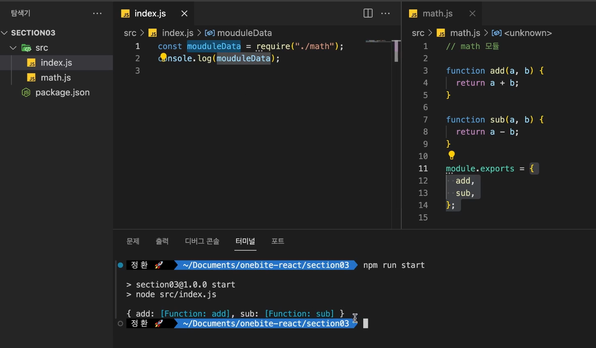

# Node.js

## Node.js 란?

- 자바스크립트는 웹 브라우저에 내장된 자바스크립트 엔진에 의해 실행됩니다.
  <br/>또한 자바스크립트를 실행하는 웹 브라우저를 자바스크립트의 구동 환경이라는 뜻에서 ‘자바스크립트 런타임’이라고도 표현합니다.
- Node.js는 자바스크립트 런타임의 하나입니다.
  <br/>Node.js 등장 이전에는 웹 브라우저가 유일한 자바스크립트 런타임이었습니다. 따라서 자바스크립트는 웹 브라우저 외에서는 사용할 수 없었습니다. 그러나 독립적인 자바스크립트 런타임인 Node.js가 등장한 이후에는 어떤 환경에서도 자바스크립트를 실행할 수 있게 되었습니다.
  <br/>결국 자바스크립트를 이용해 웹 서버나 데스크탑 애플리케이션, 모바일 애플리케이션을 개발하는 등 자바스크립트의 활용 범위가 넓어졌고, 이를 사용하는 개발자도 많이 늘어나게 되었습니다.
- Node.js는 웹 브라우저가 아닌 컴퓨터에서 자바스크립트를 실행할 수 있도록 만들어진 런타임입니다.
- Node.js를 서버 개발 기술로 잘못 알고 있는 경우가 꽤 있습니다. 하지만 Node.js는 단순 자바스크립트 런타임입니다.
  <br/>게임과 게임기에 비유하자면 자바스크립트는 게임이고 Node.js는 게임을 구동하는 게임기에 비유할 수 있습니다.

- Node.js에는 리액트를 효율적으로 다루는 여러 도구들이 내장되어 있을 뿐만 아니라, 궁극적으로 Node.js가 리액트로 만든 자바스크립트 애플리케이션을 구동

- Node.js 버전은 X.Y.Z 형태로 유지되며 X가 짝수인지 홀수인지에 따라 버전 수명이 크게 달라집
  니다. 18.12.1 버전처럼 X가 짝수인 버전은 LTS 버전으로, 최소 3년 이상 지원되는 안정적인 버
  전이므로 특별한 이유가 없는 한 대다수 기업에서는 LTS 버전을 사용합니다. 19.1.0 버전처럼 X
  가 홀수인 버전은 실험 버전입니다. 이 버전은 평균 1년 또는 그 이하의 짧은 기간만 지원합니다.

- node로 자바스크립트 파일을 실행할 때는 경로 확인하고 명시 `node src/index.js`

## Node.js 패키지

- Node.js를 설치하면 npm이라는 도구도 함께 설치됩니다.
  <br/>npm(Node Package Manager)은 Node.js의 프로젝트 단위인 ‘패키지’를 관리하는 도구입니다.
- 패키지를 생성하려면 npm을 이용해야 합니다. npm에서는 패키지를 관리하기 위한 유용하고 간편한 명령어와 기능들을 제공합니다.
- 패키지는 여러 파일을 마치 하나의 파일처럼 다룰 수 있게 해주는 관리 단위입니다. 패키지 단위로 여러 파일을 관리하려면 최상위 폴더인 ‘루트 폴더’가 필요합니다.
- package.json: 패키지의 메타 정보를 저장하는 파일. Node.js는 package.json에서 패키지 정보를 확인하여 적절한 방식으로 프로그램을 가동합니다.
- node_modules 폴더: 패키지에서 사용하는 외부 라이브러리를 저장하는 폴더입니다. npm을 이용해 설치한 라이브러리는 모두 node_modules 폴더에 저장됩니다.
- npm install 명령어로 패키지에 필요한 라이브러리를 설치할 수 있습니다. 예를 들어, npm install react 명령어는 React 라이브러리를 설치합니다.
  - package.json > scripts: 복잡한 명령어를 간단한 명령어로 변경하는 일종의 매크로 기능을 지원
  ```js
    {
    (...)
    "scripts": {
    "start": "node src/index.js",
    "test": "echo \"Error: no test specified\" && exit 1"
    },
    (...)
  }
  ```

## Node.js 모듈 시스템

- 모듈: 독립적으로 존재하는 재사용이 가능한 프로그램의 일부.
  <br/>프로그램을 구성하는 여러 파일 중에서 독립된 하나의 파일을 모듈이라고 합니다. 모듈은 다른 모듈에서 불러와 사용할 수 있습니다.
  <br/>자바스크립트 모듈은 대개 특정 정보를 담은 하나의 객체거나 특정 목적을 지닌 복수의 함수로 구성하는 경우가 많습니다.
- 모듈 시스템: 여러 파일로 구성된 프로그램에서 파일 간의 의존 관계를 관리하는 시스템입니다. 모듈을 사용하는 방법.
  <br/>여러개의 파일로 이루어진 패키지에서 각각의 파일이 다른 파일을 불러와 사용하는 모듈 시스템
  <br/>자바스크립트에는 다양한 모듈 시스템이 있습니다. 이 책에서는 리액트에서 사용하는 ES 모듈 시스템을 중심으로 살펴보겠습니다.



### ES 모듈 시스템 (ECMAScript 모듈 시스템 = ESM)

- 가장 최근에 개발된 모듈 시스템으로, 리액트, Vue와 같은 최신 프론트엔드 기술은 모두 ESM을 채택하고 있습니다.
- Node.js는 기본적으로 ESM이 아닌 CJS 모듈 시스템을 사용합니다. 따라서 ESM 모듈 시스템을 사용하려면, package.json에서 설정을 변경해야 합니다.

```json
{
  "type": "module"
}
```

- ES 모듈을 사용할때는 모듈의 확장자를 명시해야 합니다. 예를 들어, `import { add } from './math.js';`처럼 확장자 .js를 명시해야 합니다.
- ESM 모듈 시스템에서는 import와 export 키워드를 사용하여 모듈을 불러오고 내보냅니다.
  - export로 내보낸 값은 중괄호로 내보낸 이름과 동일한 이름으로 불러와야 하지만,
    <br/>export default 기본값으로 내보내면 자유롭게 이름을 지정해 불러올 수 있습니다.

## 라이브러리 사용하기

- Node.js 패키지에서는 외부 패키지를(=라이브러리) 설치해 사용할 수 있습니다.
  <br/>외부 패키지란 자신이 만든 Node.js 패키지를 서버에 올려 다른 사람도 사용할 수 있도록 배포한 파일입니다.
- npmjs.com
- npm i 다음에 필요한 라이브러리 이름을 입력하면 npmjs.com 서버에서 불러와 패키지를 자동으로 설치합니다.
- 라이브러리를 설치하면 패키지에는 다음과 같은 3가지 변화가 일어납니다.
  - 패키지 루트에 해당 라이브러리를 저장하는 ‘node_modules’ 폴더가 생성됩니다. node_modules 폴더에 라이브러리가 설치됩니다.
  - package.json 파일의 dependencies 항목에 라이브러리가 추가되고 해당 라이브러리의 정보를 저장합니다.
  - 패키지 루트 아래에 package-lock.json이라는 이름의 파일이 생성되거나 업데이트됩니다.

### node_modules 폴더

- 패키지에 설치된 라이브러리가 실제로 저장되는 곳
- 설치한 라이브러리 폴더에는 해당 라이브러리의 소스 코드 파일들이 있습니다.

### package.json > dependencies

- 이 패키지에 설치한 라이브러리의 이름과 버전이 표시되어 있습니다.
  <br/>Node.js패키지에서 dependencies란 이 패키지를 실행하기 위해 필요한 추가 라이브러리라는 뜻 입니다.
- 라이브러리 버전 ^X.Y.Z 의^는 캐럿 이라고 부르며, 캐럿과 함께 표기된 버전은 버전의 범위(Version Range)를 뜻합니다.
  - ^0.6.2: 0.6.2 이상, 0.7.0 미만의 버전

### package-lock.json

- package-lock.json은 설치된 라이브러리의 버전을 정확히 밝히기 위해 존재하는 파일입니다.
  <br/>이 파일을 별도로 생성하는 이유는 package.json의 dependencies에는 설치된 라이브러리의 정확한 버전이 아니라 버전의 범위(Version Range)만 있기때문입니다.

### 라이브러리 다시 설치하기, 사용하기

- node_modules 폴더는 외부 라이브러리가 실제로 설치되는 곳이기 때문에 Node.js 패키지 중에서 용량이 가장 큽니다. Node.js 패키지를 인터넷에 올리거나 공유할 때는 보통 이 폴더는 제외하고 공유합니다.
- 공유한 패키지에 node_modules가 존재하지 않으므로 이 라이브러리를 사용하기 위해서는 자신의 터미널에서 npm install 명령을 수행해야 합니다. 그럼 공유받은 package.json과 package-lock.json에 있는 정보를 토대로 node_modules를 다시 만듭니다.
- npm install 명령어는 공유한 패키지에서 package.json의 dependencies에 표시한 버전 범위와 package-lock.json에 표시한 정확한 버전 이름을 이용해 node_modules 폴더에 필요한 패키지를 자동으로 설치합니다.
  만약 이 패키지에 package-lock.json이 없다면 package.json의 버전 범위를 기반으로 라이브러리를 설치합니다.
- 라이브러리를 불러올 때는 경로와 확장자를 명시하지 않아도 됩니다.
  <br/>예를 들어, import React from 'react'는 node_modules 폴더에서 react라는 이름의 라이브러리를 찾아 불러옵니다.
  <br/>lodash 라이브러리를 불러와 내보내기한 기본값을 변수 lodash에 저장합니다. `import lodash from "lodash";`
