# 리액트

## 리액트 특징

### 컴포넌트 기반의 유연한 구조

- 리액트는 모듈화를 이용해 중복 코드를 제거합니다.
  <br/>즉, 여러 페이지에서 공통으로 사용하는 코드를 ‘컴포넌트’ 단위의 모듈로 만들어 놓고 필요할 때 호출해 사용합니다.
- HTML 요소를 반환하는 함수를 리액트에서는 ‘컴포넌트’라고 합니다.

### 쉽고 간단한 업데이트

- 선언형 프로그래밍: 과정은 생략하고 목적만 간결히 명시하는 방법. 리액트
  - 리액트는 state를 활용해 선언형 프로그래밍을 실현. 업데이트를 위한 복잡한 동작을 직접 정의할 필요없이 특정 변수 값을 바꾸는 것 만으로도 화면 업데이트
- 명령형 프로그래밍: 목적을 이루기 위한 모든 일련의 과정을 설명하는 방식. 자바스크립트

- 돔: HTML 코드를 트리 형태로 변환한 구성물입니다.
  <br/>돔은 웹 브라우저가 직접 생성하며, HTML 코드를 렌더링하기 위해 만듭니다.
  <br/>돔은 돔 API(DOM API)를 제공하는데, 자바스크립트는 이 API로 돔에 접근해 요소를 수정, 추가, 삭제할 수 있습니다.

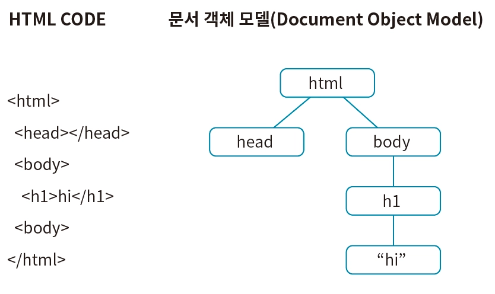

- 렌더링: 브라우저가 웹의 3가지 언어 HTML, CSS, 자바스크립트를 해석해 페이지의 요소를 실제로 그려내는 과정입니다.
- 자바스크립트로 돔을 조작하면 페이지를 새롭게 렌더링하여 업데이트합니다.
  <br/>그런데 돔은 트리 구조로 이루어져 있기 때문에 구성이 복잡하면 정확히 원하는 요소를 찾기 어렵습니다.
- 리액트를 이용하면 어떤 부분을 어떻게 업데이트할지 고민하지 않아도 간단하게 페이지를 업데이트할 수 있습니다. 그래서 복잡한 인터렉션을 지원하는 웹 서비스 개발에 더 집중할 수 있습니다.
  <br/>사용자의 특정 행동(예를 들어 좋아요 버튼 클릭)이 일어나거나 데이터가 바뀌어 업데이트가 필요하면, 어떤 요소를 어떻게 업데이트할지 고민하지 않습니다.
  <br/>교체가 필요한 요소는 삭제하고 새롭게 수정 사항을 반영한 요소를 다시 만들어 통째로 업데이트합니다.

### 빠른 업데이트

- 업데이트는 결국 브라우저가 페이지를 다시 렌더링하는 행위입니다.
  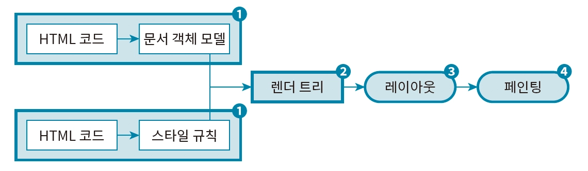

1. HTML 코드를 해석해 돔으로 변환합니다. 마찬가지로 CSS 코드도 해석해 스타일 규칙(Style Rules)으로 변환합니다.
2. 페이지에 어떤 요소가 있고 어디에 있는지를 아는 돔과 돔 각각의 요소에 스타 일을 정의하는 스타일 규칙을 합쳐 렌더 트리(Render Tree)를 만듭니다.
3. 렌더 트리 정보를 바탕으로 요소의 위치를 픽셀(px) 단위로 계산합니다. 이 과정을 레이아웃이라고 합니다. 레이아웃은 렌더링 과정에서 가장 많은 연산을 요구하는 작업입니다.
4. 레이아웃 작업을 거치면 해당 정보를 바탕으로 요소를 실제로 페이지에 그립니다. 이 과정을 페인팅이라고 합니다. 페인팅 역시 레이아웃과 더불어 렌더링 과정에서 가장 많은 연산을 요구하는 작업입니다.

- 랙(lag): 컴퓨터 통신이 일시 적으로 지연되는 것을 나타낼 때 사용하는 용어지만, 웹에서 페이지의 응답이 느려지는 현상을 지칭하기도 합니다.

### 버추얼 돔을 이용한 효율적인 업데이트

- 페인팅과 레이아웃을 여러 번 수행하지 않으려면 여러 번의 업데이트를 모았다가 업데이트가 필요할 때 한 번에 처리하는 편이 효율적입니다. 리액트는 이를 위해 버추얼 돔(Virtual DOM)을 활용합니다. 버추얼 돔은 실제 돔을 자바스크립트 객체로 복사한 것입니다.
- 리액트에서는 페이지에서 변경 사항이 발생하면 먼저 버추얼 돔을 업데이트하는 식으로 변경 사항을 모았다가 한 번에 실제 돔을 업데이트합니다.
- 버추얼 돔을 3번 변경할 동안 실제 돔에는 아무런 변화가 없습니다. 변경 사항이 모두 종료되면, 변경 사항을 모았다가 한 번에 실제 돔을 업데이트합니다. 결과적으로 리액트에서는 여러 번의 업데이트를 모아 한 번에 수행 하므로, 업데이트가 잦아도 브라우저의 성능을 떨어뜨리지 않습니다.
  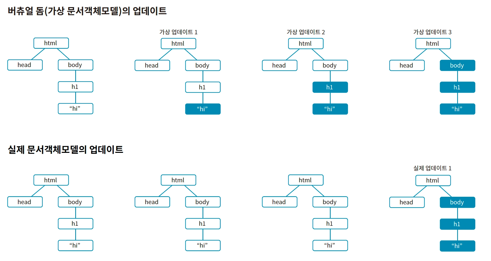

## 리액트 앱의 동작 원리

- 리액트 앱은 리액트로 만든 웹 서비스입니다. 리액트 웹이 아닌 앱으로 부르는 까닭은 리액트로 만든 웹 서비스는 마치 애플리케이션처럼 다양한 상호작용을 제공하기 때문입니다. 다시 말해 페이스북의 채팅 또는 좋아요 버튼 같은 서비스는 마치 사용자와 실시간으로 상호작용하는 응용 프로그램(Application, App)과 흡사하기 때문입니다.
- Create React App:
  - Node.js 라이브러리
  - 보일러 플레이트입니다. Create React App처럼 복잡한 설정 없이 쉽게 프로젝트를 생성하도록 돕는 개발 도구를 보일러 플레이트라고 합니다.

- npx
  - npx는 Node.js 라이브러리를 실행하는 명령어입니다. npx를 이용하면 특정 라이브러리를 항상 최신 버전으로 실행할 수 있습니다. Create React App 같은 보일러 플레이트는 새로운 리액트 앱을 생성하려는 목적으로 사용하므로 특정 패키지에 설치해 두고 사용할 필요가 없습니다. 또 시간이 지나 업그레이드되면 새 버전이 npmjs.com에 출시됩니다. 따라서 항상 최신 버전의 리액트 앱을 생성하기 위해서는 npx 명령을 이용해야 합니다.

### 리액트 앱에는 어떻게 접속하는 걸까?

- Create React App으로 만든 리액트 앱에는 웹 서버가 내장되어 있습니다.
  <br/>즉, npm run start 명령을 실행하면 브라우저가 리액트 앱에 접속하도록 앱에 내장된 웹 서버가 동작합니다. 결국 내장된 웹 서버 주소로 브라우저가 자동으로 접속합니다.

- 웹 서버: 브라우저의 요청에 따라 필요한 웹 페이지를 보내주는 컴퓨터입니다.
  <br/>예를 들어 네이버 웹 서버는 사람들이 접속할 수 있는 http://naver.com이라는 주소를 갖고 있습니다. 해당 주소로 접속 요청이 들어오면 웹 서버에서 네이버의 웹 페이지를 보내줍니다.
  네이버 웹 서버에 접속하려면 https://naver.com이라는 주소를 입력하듯이 웹 서버에는 자신만의 주소가 있습니다.
  <br/>Create React App으로 생성한 리액트 앱의 주소는 기본적으로 http://localhost:3000으로 설정되어 있습니다.
  그러므로 이 주소로 요청 해야 앞에서 생성한 리액트 앱에 접속할 수 있습니다.

- 그렇다면 localhost:3000이라는 주소는 어떤 의미일까요?
  - localhost는 내 컴퓨터의 주소를 가리킵니다. localhost 주소로 무언가를 요청하면, 해당 요청은 여러분의 컴퓨터에 전달됩니다. 이것은 마치 우체국에 가서 여러분의 집 주소로 편지를 보내는 것과 같은 원리입니다.
  - 포트 번호는 컴퓨터에서 실행되고 있는 서버를 구분하는 번호입니다. 컴퓨터에는 기본적으로는 하나의 주소가 있는데, 이 주소로 요청을 받습니다. 그런데 컴퓨터에 여러 개의 서버가 실행되고 있다면, 요청을 받았을 때 어떤 서버에 대한 요청인지 모호할 수 있습니다. 따라서 서버별로 포트 번호를 정해놓으면, 해당 포트 번호에 대한 요청이 들어올 때만 응답하는 식으로 작업을 선별해 처리할 수 있습니다.

- 결국 npm run start 명령으로 리액트 앱을 실행하면 내장된 웹 서버가 실행되면서 http://localhost:3000 주소로 접속하게 됩니다.

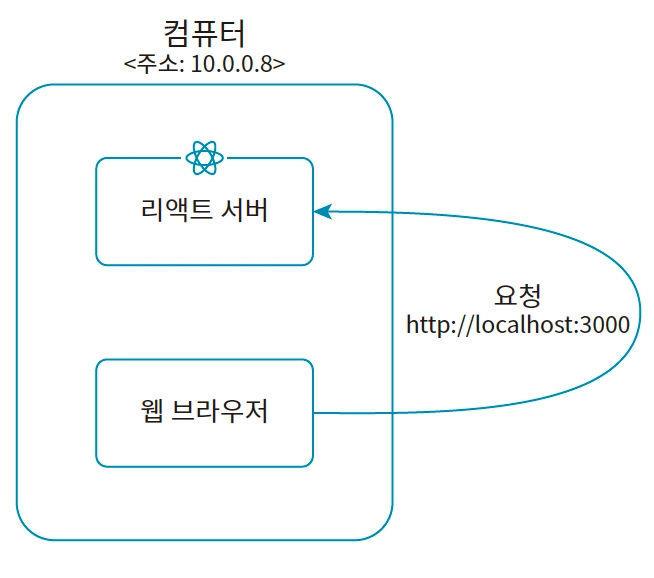
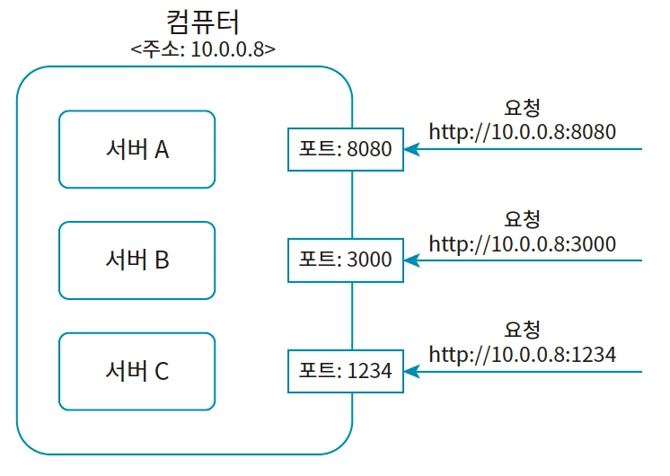

- 사용자가 주소 http://localhost:3000으로 리액트 앱에 대한 서비스를 요청하면, 리액트 앱 서버는 우선 웹 페이지 파일인 public 폴더의 index.html을 보냅니다. 일반적으로 특정 웹 서비스에 접속하면 처음 만나는 페이지는 대체로 index.html 파일 입니다.
- bundle.js는 src 폴더에 있는 자바스크립트 파일을 한데 묶어놓은 번들 파일입니다.
  <br/>bundle.js는 src 폴더에 있는 index.js와 이 파일이 불러온 모듈을 하나로 묶어놓은 파일입니다.

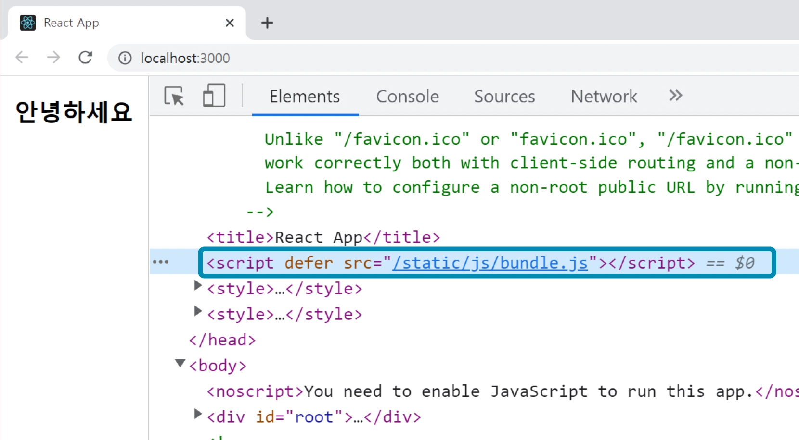

- CRA 리액트 앱의 동작 방식을 다시 한번 정리하면 다음과 같습니다.

1. localhost:3000으로 접속을 요청하면 public 폴더의 Index.html을 반환합니다.
2. index.html에는 src 폴더의 index.js와 해당 파일이 가져오는 자바스크립트 파일을 한데 묶어 놓은 bundle.js를 불러옵니다. `<script>` 태그에서 자동으로 추가합니다.
3. bundle.js가 실행되어 index.js에서 작성한 코드가 실행됩니다. Index.js는 ReactDOM.createRoot 메서드로 돔에서 리액트 앱의 루트가 될 요소를 지정합니다. render 메서드를 사용해 돔의 루트 아래에 자식 컴포넌트를 추가합니다. 결과적으로 App 컴포넌트가 렌더링됩니다.

## 리액트의 기본 기능

### 컴포넌트

- 개발자들은 리액트를 컴포넌트 기반의 UI 라이브러리(Component-Based UI Library) 라고 소개합니다. 페이지의 모든 요소를 컴포넌트 단위로 쪼개어 개발하고, 완성된 컴포넌트를 마치 레고 조립하듯이 하나로 합쳐 페이지를 구성하기 때문입니다.
- 리액트 컴포넌트는 주로 자바스크립트의 클래스나 함수를 이용해 만듭니다.
  <br/>클래스로 컴포넌트를 만드는 방식은 기본 설정 코드를 작성하는 등 함수로 만드는 컴포넌트에 비해 단점이 많아 지금은 선호하지 않습니다. 리액트 공식 문서에서도 클래스보다는 함수로 컴포넌트를 만들 것을 권장하고 있습니다.

- 함수를 선언하고 해당 함수가 HTML 요소를 반환하도록 만들면 됩니다.
- 리액트에서 부모는 자식 컴포넌트의 모든 HTML을 함께 반환합니다.

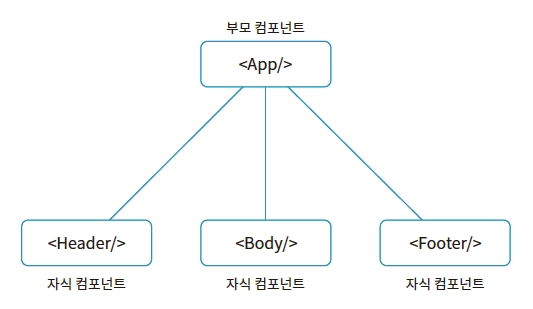

- 리액트에서는 보통 하나의 파일에 하나의 컴포넌트를 만듭니다. 하나의 파일에 여러 컴포넌트를 만들면 코드의 가독성이 떨어지기 때문입니다.
- 하나의 컴포넌트는 단 하나의 역할만 수행한다.

### JSX

- JSX는 자바스크립트 XML(JavaScript XML)의 약자로, 자바스크립트에서 HTML과 같은 문법을 사용할 수 있도록 하는 문법입니다.
  <br/>리액트에서 컴포넌트는 자바스크립트 함수로 만드는데, 특이하게도 이 함수는 HTML 값을 반환합니다.
  <br/>JSX는 자바스크립트의 확장 문법입니다.
  <br/>JSX를 이용하면 자바스크립트 코드 안에서 HTML과 같은 문법으로 UI를 정의할 수 있습니다. 또한 HTML 태그에서 중괄호를 사용해 자바스크립트의 표현식을 직접 사용할 수 있습니다.
  <br/>중괄호 내부에는 자바스크립트 표현식만 넣을 수 있다.
  <br/>숫자, 문자열, 배열 값만 렌더링 된다.
  <br/>객체 자료형은 렌더링되지 않는다.
- JSX는 자바스크립트로 변환되어 실행됩니다.

- 표현식: 값으로 평가되는 식
  - 논리 표현식의 결과인 불리언 값은 숫자나 문자열과 달리 페이지에 렌더링되지 않습니다. 만일 불리언 값을 페이지에 렌더링하고 싶다면 형 변환 함수를(String()) 이용해 문자열로 바꿔 주어야 합니다.
  - JSX에서는 객체 자료형을 지원하지 않습니다. 객체 자료형에 속하는 함수나 배열도 JSX 표현식으로 사용하면 오류가 발생합니다.
    <br/>JSX는 원시 자료형에 해당하는 숫자, 문자열, 불리언, null, undefined를 제외한 값을 사용하면 오류가 발생합니다.
    <br/>만약 객체 자료형의 값을 페이지에 렌더링하고 싶다면, 프로퍼티 접근 표기법으로 값을 원시 자료형으로 바꿔 주어야 합니다.

  ```jsx
  function Body() {
    const objA = {
      a: 1,
      b: 2,
    };
    return (
      <div>
        <h1>body</h1>
        <h2>a: {objA.a}</h2> ①<h2>b: {objA.b}</h2> ②
      </div>
    );
  }
  export default Body;
  ```

  - `<React.Fragment>`는 페이지에서 렌더링되지 않습니다. 개발자 도구의 [Element] 탭에서도 확인할 수 없습니다.

  - if 조건문은 표현식에 해당하지 않기 때문에 JSX와 함께 사용할 수 없지만, 표현식인 삼항 연산자를 이용하면 조건에 따라 다른 값을 렌더링할 수 있습니다.

- JSX 인라인 스타일링
  - JSX의 인라인 스타일링은 style={{스타일 규칙들}}과 같은 문법으로 작성합니다.
  - 문자열로 작성 하는 HTML의 인라인 스타일링과는 달리, JSX의 인라인 스타일링은 객체를 생성한 다음 각각의 스타일을 프로퍼티 형식으로 작성합니다.
  - 또한 리액트의 JSX는 background-color처럼 CSS에서 속성을 표시할 때 사용하는 스네이크 케이스 표기법 대신 backgroundColor와 같이 카멜 표기법으로 작성해야 합니다.
  ```jsx
  function Body() {
    return (
      <div style={{ backgroundColor: "red", color: "blue" }}>
        {" "}
        <h1>body</h1>
      </div>
    );
  }
  export default Body;
  ```
- JSX에서는 HTML 문법과는 달리 요소의 이름을 지정할 때 class 선택자가 아닌 className을 사 용합니다. class가 자바스크립트의 예약어 이기 때문입니다.

### Props, 컴포넌트에 값 전달하기

- 리액트에서는 부모가 자식 컴포넌트에 단일 객체 형태로 값을 전달할 수 있습니다. 이 객체를 Props(Properties)라고 합니다.
- 리액트에서는 보통 재사용하려는 요소를 컴포넌트로 만듭니다. 내용은 다르지만 구조가 같은 요소를 주로 컴포넌트로 만듭니다.
- Props는 부모만이 자식 컴포넌트에 전달할 수 있습니다. 그 역은 성립하지 않습니다.
- 보통 리액트에서 컴포넌트에 값을 전달하는 경우는 세부 사항들, 즉 컴포넌트의 속성을 지정하는 경우가 대부분입니다.
  <br/>따라서 컴포넌트에 값을 전달하는 속성들 이라는 점에서 Properties라고 부르며, 이를 간단히 줄여 Props라고 합니다.
  - 여러 게시물 리스트를 페이지에 표시할 때는 이 컴포넌트를 반복해 렌더링하고, 게시물 각각의 내용은 Props로 전달합니다.
  - 그림과 같이 App가 Props로 작성일, 일기내용, 감정 상태를 전달 하면, 일기 컴포넌트는 전달된 Props를 토대로 일기 리스트를 페이지에 렌더링합니다.
    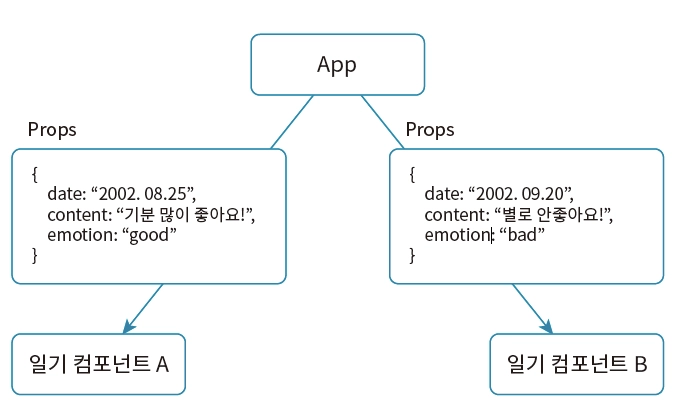

```jsx
function App() {
  const name = "이정환";
  return (
    <div className="App">
      <Header />
      <Body name={name} location={"서울시"} /> // Props를 전달하려는 자식
      컴포넌트 태그에서 이름={값} 형식으로 작성하면 됩니다.
      <Footer />
    </div>
  );
}

export default App;
```

```jsx
function Body(props) {
  // 부모 컴포넌트에서 전달된 객체 Props는 함수의 매개변수 형태로 저장됩니다.
  console.log(props);
  return <div className="body">{props.name}</div>;
}
export default Body;
```

- 전달하는 Props는 단일객체입니다. 따라서 객체 Props에는 name, location 프로퍼티가 추가됩니다.
- Props는 객체이므로 구조 분해 할당하면 간편하게 사용할 수 있습니다.

```jsx
function Body(props) {
  const { name, location } = props;
  return (
    <div className="body">
      <h1>{name}</h1>
      <h2>{location}</h2>
    </div>
  );
}
export default Body;
```

```jsx
// 매개변수에서 구조 분해 할당하면 더 간결한 코드를 작성할 수 있습니다.
function Body({ name, location }) {
  return (
    <div className="body">
      {name}은 {location}에 거주합니다
    </div>
  );
}
export default Body;
```

- 부모 컴포넌트에서 Props로 전달할 값이 많으면, 값을 일일이 명시해야 하므로 불편할 뿐만 아니라 가독성도 떨어집니다.
  <br/>이때 Props로 값을 하나의 객체로 만든 다음, 스프레드 연산자를 활용해 전달하면 훨씬 간결하게 코드를 작성할 수 있습니다.

```jsx
function App() {
  const BodyProps = {
    name: "이정환",
    location: "부천시",
    favorList: ["파스타", "빵", "떡볶이"],
  };

  return (
    <div className="App">
      <Header />
      <Body {...BodyProps} />
      <Footer />
    </div>
  );
}
export default App;
```

- defaultProps
  - 컴포넌트에 Props로 전달된 값이 없을 때, 기본값을 지정하는 기능입니다. defaultProps로 지정한 값은 Props로 전달된 값이 없을 때만 사용됩니다. 따라서 Props로 전달된 값이 있으면 defaultProps로 지정한 값은 무시됩니다.
  - 실무에서는 백엔드 서버에서 Props로 데이터를 주고받는 경우가 많습니다. 이때 예상치 못한 서버 오류로 인해 정상적인 값을 받지 못하면 오류가 발생합니다. defaultProps를 이용하면 효율적으로 이런 오류를 방지할 수 있습니다
  - 구조 분해 할당 시 기본값을 설정하는 방식이나 선택적 체이닝(?.)을 상황에 맞게 조합하는 것이 더 권장되는 추세입니다. 리액트 공식 문서에서도 클래스 컴포넌트가 아닌 함수형 컴포넌트에서는 defaultProps 지원을 점진적으로 중단하려는 움직임이 있습니다. 자바스크립트 자체의 문법(기본 매개변수)으로 충분히 대체 가능하기 때문입니다.

```jsx
function Body({ name, location, favorList }) {
  console.log(name, location, favorList);
  return (
    <div className="body">
      {name}은 {location}에 거주합니다.
      <br />
      {favorList.length}개의 음식을 좋아합니다.
    </div>
  );
}

Body.defaultProps = {
  favorList: [],
};

export default Body;
```

#### Props로 컴포넌트 전달하기: children

- Props로는 자바스크립트 값뿐만 아니라 html요소나 컴포넌트도 전달할 수 있습니다.
- 리액트에서는 자식 컴포넌트에 또 다른 컴포넌트를 배치하면, 배치된 컴포넌트는 자동으로 Props의 children 프로퍼티에 저장되어 전달됩니다.

```jsx
function ChildComp() {
  return <div>child component</div>;
}

function App() {
  return (
    <div className="App">
      <Header />
      <Body>
        <ChildComp /> // App에서 Body로 컴포넌트를 하나 전달
      </Body>
      <Footer />
    </div>
  );
}

export default App;
```

- App에서 Body 컴포넌트의 자식으로 배치한 ChildComp는 children 프로퍼티로 전달되어 매개 변수 children에 저장됩니다.
- Props의 children 프로퍼티로 전달되는 자식 컴포넌트는 값으로 취급하므로 JSX의 자바스크립트 표현식으로 사용할 수 있습니다.

```jsx
function Body({ children }) {
  console.log(children);
  return <div className="body">{children}</div>;
}
export default Body;
```

- children 컴포넌트를 개발자 도구의 콘솔에서 출력하면 객체 형식의 값을 출력합니다. 앞서 JSX에서는 자바스크립트 표현식이 객체를 평가할 경우 오류가 발생한다고 했지만, 이 객체는 리액트 컴포넌트를 표현한 것이므로 오류가 발생하지 않습니다.

### 이벤트 처리하기

- 이벤트: 웹 페이지에서 일어나는 사용자의 행위입니다. 버튼 클릭, 페이지 스크롤, 새로고침 등이 이런 행위에 해당합니다.
- 이벤트 핸들링: 이벤트가 발생하면 특정 코드가 동작하도록 만드는 작업입니다. 버튼을 클릭했을 때 경고 대화상자를 브라우저에 표시하는 동작이 이벤트 핸들링의 대표적인 예입니다.
- 이벤트 핸들러: 이벤트를 처리하는 함수. 이벤트가 발생했을 때 실행되는 코드입니다.

```jsx
// 리액트를 사용하지 않고 HTML과 자바스크립트만으로 이벤트를 핸들링하는 예
<script>
  function handleOnClick() {
    alert("버튼을 클릭하셨군요!");
  }
</script>

<button onclick="handleOnClick()">
	클릭하세요
</button>
```

- 이벤트 핸들러 표기에서 HTML은 onclick이지만 리액트는 카멜 케이스 문법에 따라 onClick으로 표기합니다.
- Props로 전달할 값을 지정할 때처럼 onClick={} 문법으로 이벤트 핸들러를 설정합니다.
- 또한 이벤트 핸들러를 설정할 때는 함수 호출의 결괏값을 전달하는 것이 아니라 콜백 함수처럼 함수 그 자체를 전달합니다.

```jsx
// 리액트로 이벤트를 핸들링하는 예
function Body() {
  function handleOnClick() {
    alert("버튼을 클릭하셨군요!");
  }

  return (
    <div className="body">
      <button onClick={handleOnClick}>클릭하세요</button>
    </div>
  );
}
export default Body;
```

#### 이벤트 객체 사용하기

- 리액트에서는 이벤트가 발생하면 이벤트 핸들러에게 이벤트 객체를 매개변수로 전달합니다.
  <br/>이벤트 객체에는 이벤트가 어떤 요소에서 어떻게 발생했는지에 관한 정보가 상세히 담겨 있습니다.

- 이벤트 객체의 target 프로퍼티에는 이벤트가 발생한 페이지의 요소(여기서는 버튼)가 저장됩니다.

```jsx
function Body() {
  function handleOnClick(e) {
    console.log(e.target.name);
  }
  return (
    <div className="body">
      <button name="A버튼" onClick={handleOnClick}>
        A 버튼
      </button>
      <button name="B버튼" onClick={handleOnClick}>
        B 버튼
      </button>
    </div>
  );
}

export default Body;
```

- Cross Browsing Issue: 브라우저 별 스펙이 달라 발생하는 문제
  - 리액트는 모든 웹 브라우저의 이벤트 객체를 하나로 통일한 형태인 합성 이벤트(Synthetic Event)를 제공합니다. 합성 이벤트는 리액트에서 자체적으로 구현한 이벤트 시스템입니다. 따라서 리액트에서는 브라우저 별로 다른 이벤트 객체 대신 합성 이벤트 객체를 사용해 일관된 방식으로 이벤트를 처리할 수 있습니다.
- 합성 이벤트: 모든 웹 브라우저의 이벤트 객체를 하나로 통일한 형태. synthetic base event

### 컴포넌트와 상태

#### State

- 리액트에서는 함수 useState로 State를 생성합니다.
- set 함수를 호출해 State 값을 변경하면, 변경값을 페이지에 반영하기 위해 컴포넌트를 다시 렌더링합니다.
  <br/>컴포넌트가 페이지에 렌더링하는 값은 컴포넌트 함수의 반환값 입니다. 따라서 컴포넌트를 다시 렌더링한다고 함은 컴포넌트 함수를 다시 호출한다는 의미와 같습니다. 컴포넌트는 자신이 관리하는 State 값이 변하면 자동으로 다시 호출됩니다. 그리고 변경된 State 값을 페이지에 다시 렌더링(리렌더링)합니다.

#### State로 사용자 입력 관리하기

- 일반 변수는 컴포넌트를 리렌더 하지 않는다. 따라서 일반 변수에 저장된 값이 변경되어도 페이지에는 반영되지 않습니다. 반면 State는 컴포넌트를 리렌더하기 때문에 State에 저장된 값이 변경되면 페이지에도 반영됩니다.

```jsx
import { useState } from "react";

function Body() {
  const handleOnChange = (e) => {
    console.log(e.target.value);
  };
  return (
    <div>
      <input onChange={handleOnChange} />
    </div>
  );
}
export default Body;
```

- 위 상태로도 텍스트 입력 폼을 이용해 사용자에게 입력을 받을 수 있습니다. 그러나 지금은 사용자가 입력한 텍스트가 리액트 컴포넌트가 관리하는 State에 저장되어 있지는 않습니다. 따라서 만약 버튼을 클릭했을 때 사용자가 입력한 텍스트를 콘솔에 출력하는 등의 동작을 수행하게 하려면 돔 API를 이용하는 등 번거로운 작업이 별도로 요구됩니다.

- 따라서 State를 하나 만들고 사용자가 폼에서 입력할 때마다 텍스트를 State 값으로 저장하겠습니다.

```jsx
import { useState } from "react";

function Body() {
  const [text, setText] = useState("");

  const handleOnChange = (e) => {
    setText(e.target.value);
  };

  return (
    <div>
      <input value={text} onChange={handleOnChange} />
      <div>{text}</div>
    </div>
  );
}

export default Body;
```

- ① 빈 문자열을 초깃값으로 하는 State 변수 text를 생성합니다.
- ② 폼에 입력한 텍스트를 변경할 때마다 set 함수를 호출해 text 값을 현재 입력한 텍스트로 변경합니다.
- ③ input 태그의 value 속성에 변수 text를 설정합니다.
- ④ 변수 text의 값을 페이지에 렌더링합니다

입력 폼에서 사용자가 텍스트를 입력하면 onChange 이벤트가 발생해 이벤트 핸들러 handleOnChange를 호출합니다.
handleOnChange는 내부에서 set 함수를 호출하는데, 인수로 현재 사용자가 입력한 텍스트를 전달합니다.
그 결과 사용자가 폼에서 입력한 값은 text에 저장되면서 State 값을 업데이트합니다.
State 값이 변경되면 컴포넌트는 자동으로 리렌더됩니다. 따라서 페이지에서는 현재의 State 값을 다시 렌더링합니다.

- 왜 value={text}를 명시해야 할까?
  - 데이터의 단일 원천(Single Source of Truth)을 유지하기 위해서입니다.
    <br/>만약 value={text}를 쓰지 않고 onChange만 연결한다면, input은 자기 스스로 타이핑한 값을 보여주는 동시에 리액트의 text 상태도 별개로 업데이트됩니다. 즉, 값의 주인이 input 엘리먼트 자신과 리액트 상태, 이렇게 둘이 되어버립니다.
    <br/>하지만 value={text}를 넣어주면 상황이 달라집니다.
    <br/>동기화: 이제 input에 보이는 값은 오로지 리액트의 text 상태값만 보여줍니다.
    <br/>통제권: 리액트가 input에 무엇이 그려질지 완전히 결정합니다. 예를 들어, 사용자가 숫자를 입력했는데 리액트에서 강제로 빈 문자열로 setText("")를 해버리면 화면의 input 창도 즉시 비워집니다.
  - 데이터가 흐르는 과정 (단방향 데이터 흐름)
    - 사용자 입력: 키보드를 누릅니다.
    - 이벤트 발생: onChange가 감지되어 handleOnChange 함수가 실행됩니다.
    - 상태 업데이트: setText(e.target.value)가 호출되어 text 값이 변합니다.
    - 리렌더링: 리액트가 Body 컴포넌트를 다시 그립니다.
    - 화면 반영: `<input value={text} />` 부분에 업데이트된 text 값이 들어가면서 우리 눈에 바뀐 글자가 보입니다.
  - 내부적인 활용 (제어)
    - 입력값에 제한을 두고 싶을 때 매우 유용합니다.
    ```jsx
    const handleOnChange = (e) => {
      // 5글자 이상은 입력 안 되게 막고 싶다면
      if (e.target.value.length <= 5) {
        setText(e.target.value);
      }
    };
    // value={text}가 없다면 사용자는 계속 타이핑할 수 있지만, 넣어두었기 때문에 5글자에서 멈추는 제어가 가능해집니다.
    ```

- input태그에서 type을 date로 설정하면 onChange 이벤트가 발생했을 때 이벤트 객체의 e.target.value에는 문자열로 이루어진 yyyy-mm-dd 형식의 날짜가 저장됩니다.

- select 태그는 option과 함께 사용합니다. 이 태그를 사용하면 드롭다운 메뉴로 여러 목록을 나열해 보여 주는 입력 폼이 만들어집니다.
  - select 태그는 기본적으로 맨 위의 옵션을 초기값으로 설정합니다.
  - select 태그의 경우 화면에 표시되는 선택지와 실제 코드상에서 사용할 value값을 다르게 설정할 수 있다.

```jsx
import { useState } from "react";

function Body() {
  const [option, setOption] = useState("");

  const handleOnChange = (e) => {
    console.log("변경된 값: ", e.target.value);
    setOption(e.target.value);
  };

  return (
    <div>
      <select value={option} onChange={handleOnChange}>
        // state에는 one이 저장되고 화면에는 1번이 보입니다.
        <option key={"1번"} value="one">
          1번
        </option>{" "}
        <option key={"2번"}>2번</option>
        <option key={"3번"}>3번</option>
      </select>
    </div>
  );
}
export default Body;
```

- 드롭다운 입력 폼에서 사용자가 옵션을 변경하면 onChange 이벤트가 발생합니다.
  <br/>이때 이벤트 핸들러에 제공되는 이벤트 객체 e.target.value에는 현재 사용자가 선택한 옵션의 key 속성이 저장됩니다.
  <br/>따라서 이 값으로 현재 State에 저장된 값을 변경합니다.

- 사용자로부터 여러 입력 정보를 받아 State로 처리하는 경우, 관리할 State의 개수가 많아지면 코드의 길이 또한 길어집니다.
  <br/>객체 자료형을 이용하면 입력 내용이 여러 가지라도 하나의 State 에서 관리할 수 있어 더 간결하게 코드를 작성할 수 있습니다.

```jsx
import { useState } from "react";

function Body() {
  const [state, setState] = useState({
    name: "",
    gender: "",
    birth: "",
    bio: "",
  });

  const handleOnChange = (e) => {
    console.log("현재 수정 대상:", e.target.name);
    console.log("수정값:", e.target.value);
    setState({
      ...state,
      [e.target.name]: e.target.value,
    });
  };

  return (
    <div>
      <div>
        <input
          name="name"
          value={state.name}
          onChange={handleOnChange}
          placeholder="이름"
        />
      </div>
      <div>
        <select name="gender" value={state.gender} onChange={handleOnChange}>
          <option key={""}></option>
          <option key={"남성"}>남성</option>
          <option key={"여성"}>여성</option>
        </select>
      </div>
      <div>
        <input
          name="birth"
          type="date"
          value={state.birth}
          onChange={handleOnChange}
        />
      </div>
      <div>
        <textarea name="bio" value={state.bio} onChange={handleOnChange} />
      </div>
    </div>
  );
}

export default Body;
```

- 동적으로 변하는 값인 리액트의 State 역시 일종의 값이므로 Props로 전달할 수 있습니다.

- 리액트에서는 부모 컴포넌트가 리렌더하면 자식도 함께 리렌더됩니다.
  <br/>자식 컴포넌트는 부모로부터 받는 props의 값이 변경될 때마다 리렌더됩니다. 부모의 State 값이 변하면 해당 State를 Props로 받은 자식 컴포넌트 역시 리렌더됩니다.
  <br/>부모 컴포넌트가 자식에게 State를 Props로 전달하지 않는 경우에도 부모가 리렌더되면 자식도 함께 리렌더됩니다. → 이 경우, 자식 컴포넌트는 변한 게 없기 때문에 리렌더될 이유도 없이 리렌더되는 것 → 이런 경우를 방지하기 위해 관련 없는 두개의 state는 분리된 각각의 컴포넌트에서 관리하는 것이 좋습니다.

- 리액트는 State 값이나 set함수를 여러 컴포넌트에서 사용하는 경우, 이들을 상위 컴포넌트에서 관리합니다.
  <br/>리액트에서는 이 기능을 다른 말로 ‘State 끌어올리기(State Lifting)’라고 합니다.

- 리액트에서 컴포넌트 간에 데이터를 전달할 때는 Props를 사용하는데, 전달 방향 은 언제나 부모로부터 자식에게 전달하는 방식입니다. <br/>리액트의 이러한 데이터 전 달 특징을 ‘단방향 데이터 흐름’이라고 합니다.

- 반면 State를 변경하는 이벤트는 자식에서 부모를 향해 역방향으로 전달되어야 합니다.

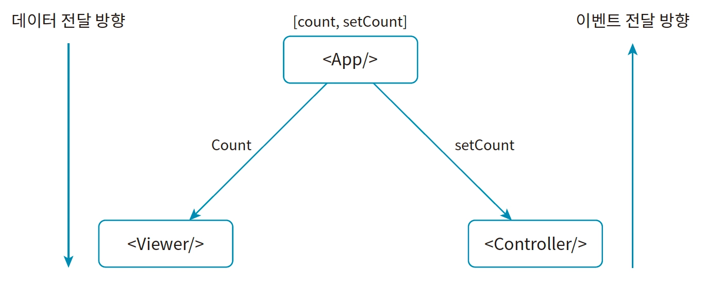

- 리액트의 setState는 비동기적으로 작동하는 것처럼 보이지만 비동기는 아니고 정확히 말하면
  <br/>성능 최적화를 위해 여러 개의 상태 업데이트를 하나로 묶어서 처리하는 배칭(Batching) 과정을 거칩니다.
  상태를 변경하자마자 바로 다음 줄에서 그 값을 확인하려고 하면, 변경 전의 값이 출력되는 이유가 바로 이것입니다.
- batching: 리액트는 상태가 바뀔 때마다 매번 화면을 다시 그리면 성능이 떨어진다고 판단합니다. 그래서 짧은 시간 동안 발생하는 여러 상태 업데이트를 모아서 단 한 번만 리렌더링을 수행합니다.

```jsx
const [count, setCount] = useState(0);

const handleClick = () => {
  setCount(count + 1);
  console.log(count); // 여기서 1이 아닌 0이 출력됨!
};

// 함수 실행이 모두 끝난 뒤에야 리액트가 예약된 업데이트들을 처리하고 화면을 다시 그립니다.
```

- 최신 값을 즉시 사용하고 싶을 때는 → 함수형 업데이트
  <br/>이전 상태값을 기반으로 여러 번 업데이트를 해야 하거나, 비동기적인 특성 때문에 발생하는 문제를 해결하려면 함수형 업데이트를 사용해야 합니다.

```js
// 기존 방식 (위험할 수 있음)
setCount(count + 1);
setCount(count + 1); // 리액트는 두 번의 요청을 하나로 합쳐서 결국 +1만 됨

// 함수형 업데이트 (권장)
setCount((prev) => prev + 1);
setCount((prev) => prev + 1); // 이전 상태(prev)를 기반으로 계산하므로 정확히 +2가 됨
```

- 위 두 방식의 차이는 리액트가 업데이트를 예약하는 방식과 클로저(Closure)라는 자바스크립트의 특성 때문에 발생합니다.
  1. 기존 방식: setCount(count + 1): 이 방식은 함수가 실행되는 시점의 스냅샷(Snapshot) 값을 사용합니다.
  - 상황: 현재 count가 0인 상태에서 버튼을 누릅니다.
  - 첫 번째 호출: setCount(0 + 1) → 리액트에게 "다음 렌더링 때 count를 1로 바꿔줘"라고 예약합니다.
  - 두 번째 호출: 여전히 이 함수 안에서 count는 0입니다. 따라서 다시 setCount(0 + 1)이 호출됩니다.
  - 결과: 함수가 끝나고 리렌더링이 일어날 때 count는 1이 됩니다.
  2. 함수형 업데이트: setCount(prev => prev + 1): 이 방식은 값이 아니라 업데이트 로직(함수)을 큐(Queue)에 쌓아둡니다.
  - 상황: 현재 count가 0인 상태에서 버튼을 누릅니다.
  - 첫 번째 호출: 리액트의 업데이트 큐에 (prev) => prev + 1이라는 함수를 넣습니다.
  - 두 번째 호출: 다시 업데이트 큐에 (prev) => prev + 1이라는 함수를 추가합니다.
  - 리액트의 처리: 이제 리액트는 큐에 쌓인 함수들을 순서대로 실행합니다.
    <br/>첫 번째 함수 실행: 0(현재값) + 1 = 1
    <br/>두 번째 함수 실행: 1(직전 계산 결과) + 1 = 2
  - 결과: 최종적으로 계산된 2를 새로운 상태로 결정하고 리렌더링합니다.

### Ref

- Ref를 이용하면 돔(DOM) 요소들을 직접 조작할 수 있습니다.

#### useRef

- 리액트에서는 useRef라는 리액트 함수를 이용해 Ref 객체를 생성합니다. useRef는 인수로 전달한 값을 초깃값으로 하는 Ref 객체를 생성합니다.
- Ref 객체는 current라는 프로퍼티에 현재 보관할 값을 담아두기만 하는 단순한 객체입니다. Ref 객체의 current 프로퍼티에 저장된 값은 컴포넌트가 리렌더될 때도 유지됩니다.
- useRef는 어떤 경우에도 컴포넌트를 리렌더하지 않습니다. Ref 객체의 current 프로퍼티에 저장된 값이 변경되어도 컴포넌트는 리렌더되지 않습니다.

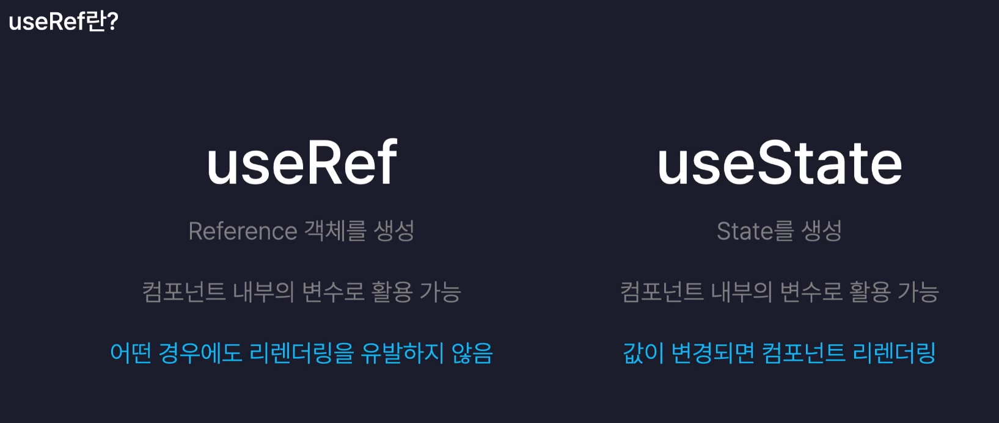

- 포커스 처리: 무조건 useRef
  - 입력창에 포커스를 주는 기능은 DOM 요소에 직접 접근해야 하는 작업입니다.
  - useState로 불가능한 이유: 상태를 바꾼다고 해서 브라우저가 자동으로 특정 인풋에 커서를 깜빡이게 해주지는 않습니다.
  - useRef를 쓰는 이유: inputRef.current.focus()처럼 실제 HTML 요소의 메서드를 직접 호출해야 하기 때문입니다.

  ```jsx
  import { useRef, useState } from "react";

  function Body() {
    const [text, setText] = useState("");
    const textRef = useRef();

    const handleOnChange = (e) => {
      setText(e.target.value);
    };

    const handleOnClick = () => {
      if (text.length < 5) {
        textRef.current.focus();
      } else {
        alert(text);
        setText("");
      }
    };

    return (
      <div>
        <input ref={textRef} value={text} onChange={handleOnChange} />
        <button onClick={handleOnClick}>작성 완료</button>
      </div>
    );
  }
  export default Body;
  ```

- 리액트의 useState, useRef로 만든 상태는 컴포넌트가 리렌더링되어도 리셋되지 않고 그 값을 유지합니다.
  - 컴포넌트 외부에 변수를 사용하는 것은 특별한 경우가 아니라면 별로 권장되지 않는다. 두개 이상의 컴포넌트가 하나의 상태를 공유하게 되기 때문이다.

- 리액트 훅: 함수로 만든 리액트 컴포넌트에서 클래스로 만든 리액트 컴포넌트의 기능을 이용하도록 도와주는 함수들입니다.
  - State와 Ref 모두 원래는 함수로 만든 컴포넌트에서는 사용할 수 없는 기능이지만 이 훅 기능 덕분에 사용할 수 있습니다.
  - 함수 컴포넌트, 컴스텀 훅 내부에서만 호출 가능
  - 조건문, 반복문 내에서는 호출 불가능 → 서로 다른 훅들의 호출 순서가 엉망이 되기 때문
  - 컴포넌트마다 반복되는 로직이 있고, 해당 로직이 useState같은 훅을 사용한다면 커스텀 훅을 만들어서 재사용할 수 있습니다.

### 리액트 컴포넌트와 라이프 사이클

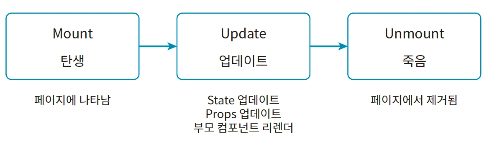

- 라이프 사이클 제어 (Lifecycle Control): 라이프 사이클을 이용하면 컴포넌트가 처음 렌더링할 때 특정 동작을 하도록 만들거나, 업데이트할 때 적절한지 검사하거나, 페이지에서 사라질 때 메모리를 정리 하는 등 여러 유용한 작업을 단계에 맞게 할 수 있습니다.

#### useEffect

- 함수 useEffect는 어떤 값이 변경될 때마다 특정 코드를 실행하는 리액트 훅입니다. 이를 “특정 값을 검사한다”라고 표현합니다.
- 의존성 배열에 아무것도 전달하지 않으면, useEffect는 컴포넌트를 렌더링할 때마다 콜백 함수를 실행합니다.
- useEffect에서 마운트 시점은 제외하고 업데이트 시점에만 콜백 함수를 실행(페이지에 처음 렌더링할 때는 콜백 함수를 실행하지 않고 리렌더될 때만 실행)하려면 useRef를 이용

```jsx
import { useRef, useState, useEffect } from "react";

function App() {
  const didMountRef = useRef(false);

  useEffect(() => {
    if (!didMountRef.current) {
      didMountRef.current = true;
      return;
    }
    console.log("컴포넌트 업데이트!");
  });
}
export default App;
```

- 현재 App 컴포넌트를 페이지에 마운트했는지 판단하는 변수 didMountRef를 Ref 객체로 생성합니다. 초깃값으로 false를 설정합니다. Ref 객체는 돔 요소를 참조하는 것뿐만 아니라 컴포넌트의 변수로도 자주 활용됩니다.

#### 클린업 함수

- useEffect의 콜백 함수가 반환하는 함수를 클린업 함수라고 합니다. return 뒤에 오는 함수가 바로 클린업(Cleanup) 함수.
- 클린업 함수는 직접 호출하지 않아도 React가 정해진 시점에 대신 호출해 줍니다.
  <br/>이 함수는 콜백 함수를 다시 호출하기 전이나(리렌더) 컴포넌트가 언마운트하는 시점에 실행됩니다.
  <br/>첫 콜백함수 호출 전에는(첫 렌더링) 정리할 과거가 없기 때문에 클린업 함수는 실행되지 않습니다.
- 아래 예시에서 콘솔을 리턴하는 함수도 클린업함수

```jsx
import { useEffect } from "react";

function Even() {
  useEffect(() => {
    return () => {
      console.log("Even 컴포넌트 언마운트");
    };
  }, []);

  return <div>현재 카운트는 짝수입니다</div>;
}
export default Even;

// useEffect에 의존성 배열로 빈 배열을 전달하고,
// 콜백 함수가 함수를 반환하면(클린업함수) 이 함수는 컴포넌트의 언마운트 시점에 실행됩니다.
```

## useReducer와 상태관리

- 컴포넌트 내부에 새로운 state를 생성하는 리액트 훅
- 모든 useState는 useReducer로 대체 가능
- useState와는 달리 상태를 관리하는 코드들을 컴포넌트 외부로 분리할 수 있다.
- 컴포넌트의 주된 역할은 UI 렌더링인데 내부에 state를 관리하는 코드가 많아지면 컴포넌트의 역할이 UI 렌더링에서 상태 관리로 흐려질 수 있습니다. useReducer를 사용하면 상태 관리 코드를 컴포넌트 외부로 분리할 수 있기 때문에 컴포넌트는 UI 렌더링에만 집중할 수 있습니다.

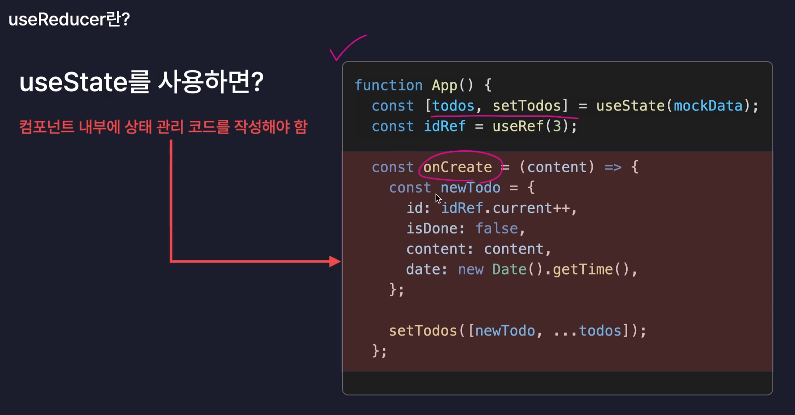
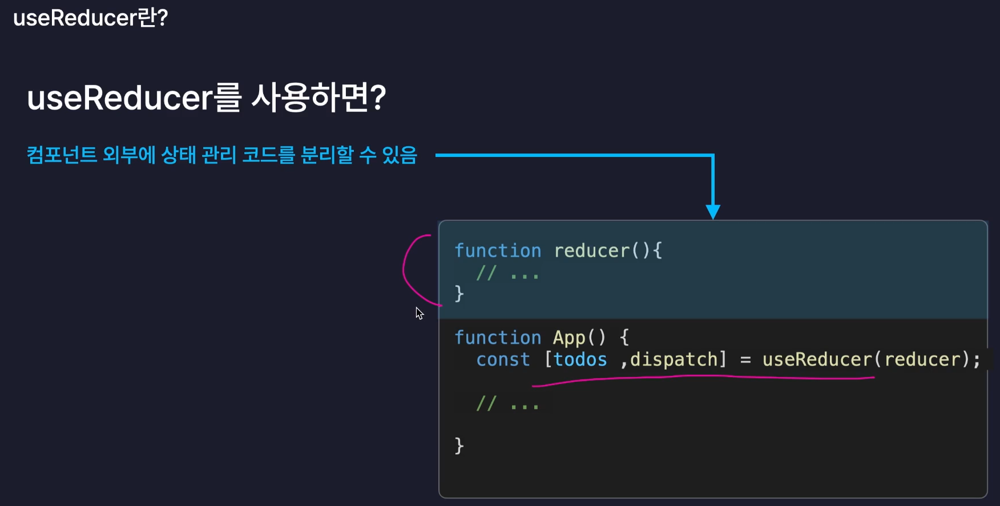

```jsx
function reducer(state, action) {
  switch (action.type) {
    case "INCREMENT":
      return state + action.data;
    case "DECREMENT":
      return state - action.data;
    default:
      return state;
  }
}

const Exam = () => {
  const [state, dispatch] = useReducer(reducer, 0);

  const onClickPlus = () => {
    dispatch({ type: "INCREMENT", data: 1 }); // 상태 변화 요청
  };

  const onClickMinus = () => {
    dispatch({ type: "DECREMENT", data: 1 });
  };

  return (
    <div>
      <h1>Count: {state}</h1>
      <button onClick={onClickPlus}>Increment</button>
      <button onClick={onClickMinus}>Decrement</button>
    </div>
  );
};
```

- dispatch: 상태 변화가 있어야 한다는 사실을 알리는, 발송하는 함수
  - 컴포넌트 내부에서 dispatch함수를 호출하면 상태 변화가 요청되고,
    <br/>useReducer가 상태 변화를 실제로 처리할 reducer 함수를 호출합니다. reducer함수는 우리가 직접 만듭니다.
    <br/>dispatch함수 호출 → reducer함수 호출 → 상태 변화 처리
  - 인수로는 상태가 어떻게 변화되길 원하는지 알려주는 action 객체를 전달합니다.
- reducer: 상태 변화가 어떻게 일어나야 하는지를 정의하는 함수. 상태를 실제로 변화시키는 함수
