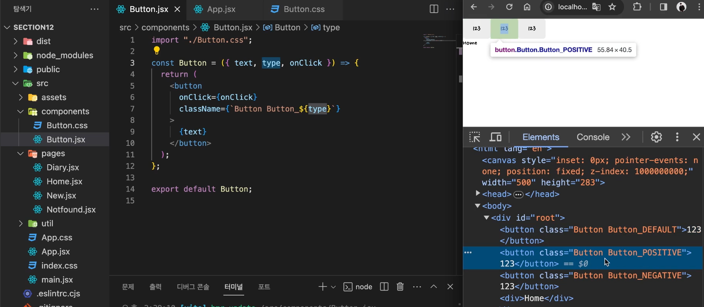

- App 컴포넌트는 자신이 관리하는 State를 변경하는 함수를 Props로 전달해 자식이 부모의 State를 대신 업데이트하게 했습니다.
- 현실의 사물이나 개념을 프로그래밍 언어의 객체와 같은 자료구조로 표현 하는 행위를 ‘데이터 모델링’. 자바스크립트에서는 보통 현실의 사물이나 개념을 표현할 때 객체를 사용합니다. 현실의 사물은 일반적으로 여러 속성을 동시에 가지고 있기 때문입니다.
- e.keyCode 에는 현재 사용자가 누른 키보드의 키가 숫자로 변환되어 저장되어 있는데, 13은 Enter 키를 의미합니다.

- 공통 컴포넌트
  

- 복잡한 로직을 가진 함수가 있을 때 해당 함수가 매개변수만으로도 필요한 데이터를 다 제공받을 수 있다면 컴포넌트 외부에 선언해도 괜찮다.

- useNavigate(-1) : 뒤로가기
- useNavigate(1) : 앞으로가기

- 사용자 정의 컴포넌트의 경우 이벤트 객체가 자동으로 전달되지 않는다. 때문에 인수로 직접 이벤트 객체를 만들어서 전달해야한다.

```jsx
<EmotionItem
  onClick={() =>
    onChangeInput({
      target: { name: "emotionId", value: item.emotionId },
    })
  }
/>
```
