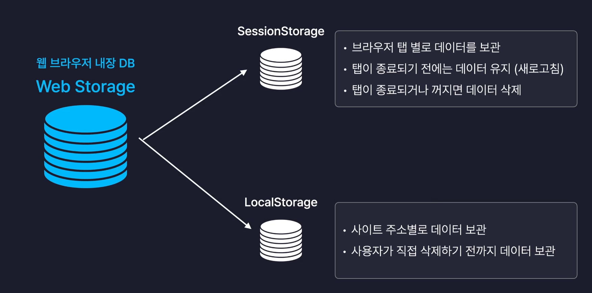

- webStorage는 기본적으로 모든 값을 문자열로 저장한다. 객체나 배열 등 객체 타입을 저장하려면 JSON.stringify(객체)를 사용하여 문자열로 변환해야 한다. (반대로 문자열을 객체로 변환하려면 JSON.parse(문자열)을 사용해야 한다.)
  - JSON.parse()는 인수로 전달하는 값이 undefined나 null인 경우 에러를 발생시킨다.
- 데이터 삭제는 removeItem() 메서드를 사용한다. 모든 데이터를 삭제하려면 clear() 메서드를 사용한다.
   또는 개발자도구 Application 탭에서 백스페이스를 눌러 삭제할 수도 있다.
