# 변수와 상수

- var를 이용한 변수 선언은 let과는 달리 이름을 중복해 선언해도 실행할 수 있습니다.
- 선언과 동시에 할당하는 초기화 과정이 필요치 않은 변수와 달리, 상수는(const) 선언과 동시에 값을 할당하는 과정이 꼭 필요합니다.

```js
let name = 1;
let name = 2; // 오류 : name은 이미 선언되었습니다.

var age = 25;
console.log(age); // 출력 : 25

var age = 30;
console.log(age); // 출력 : 30
```

# 자료형

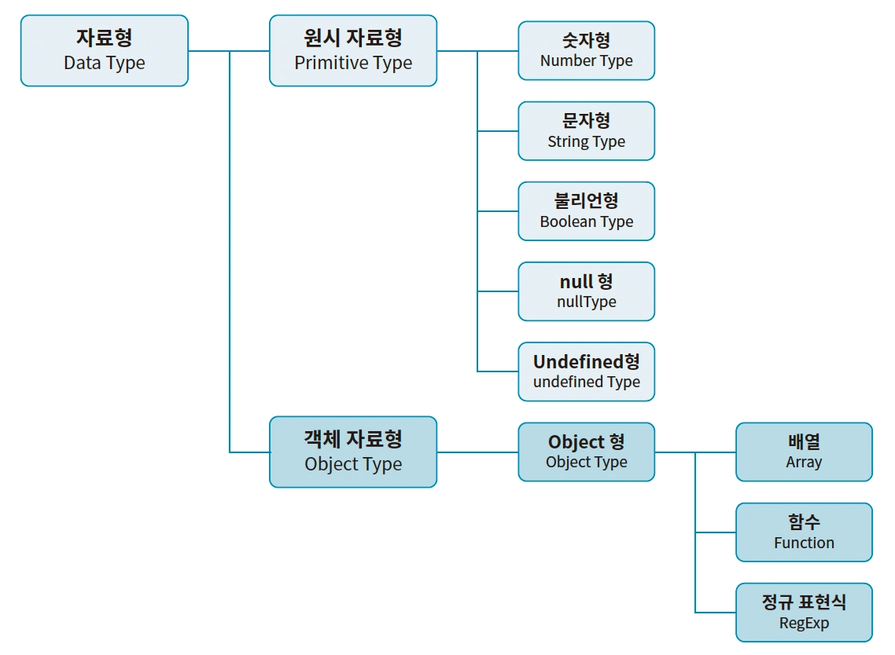

## 객체와 참조

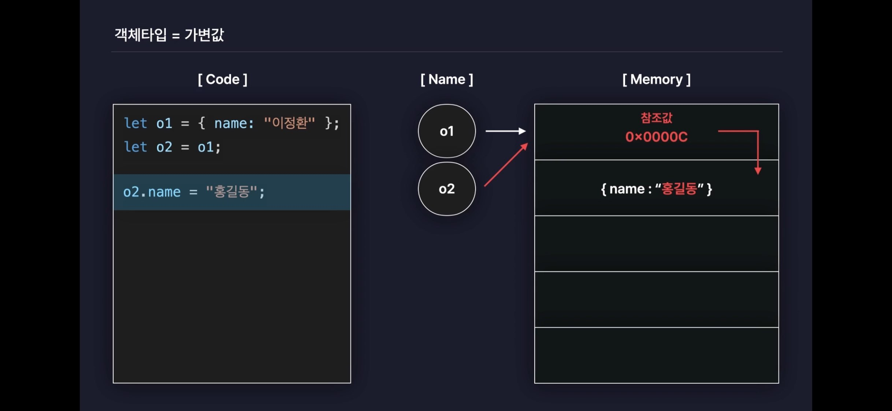
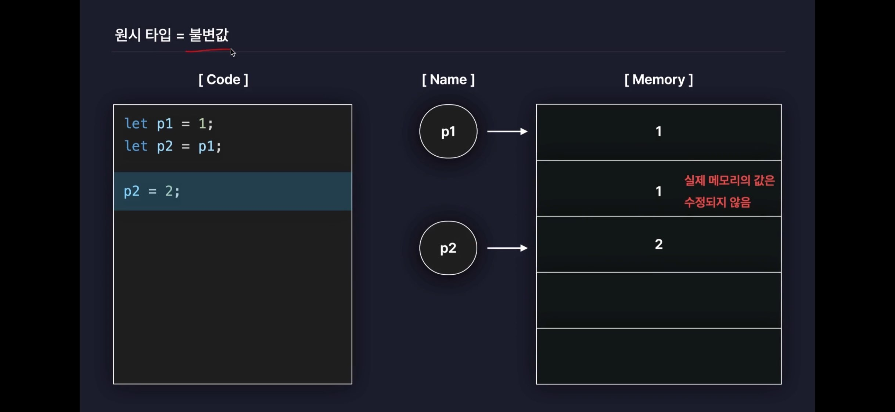
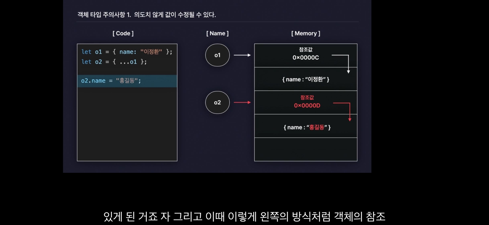
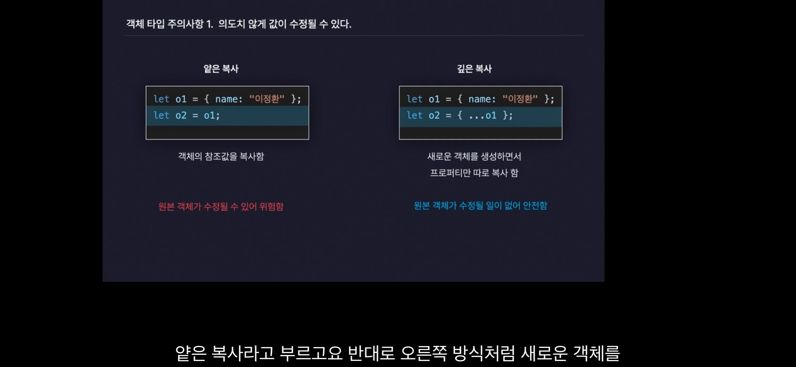

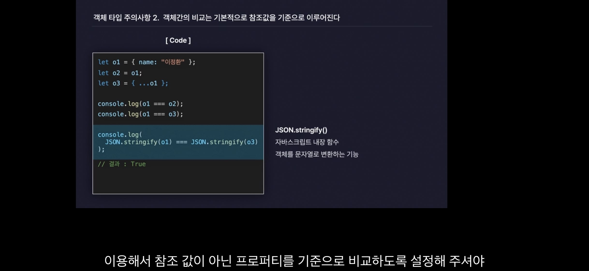
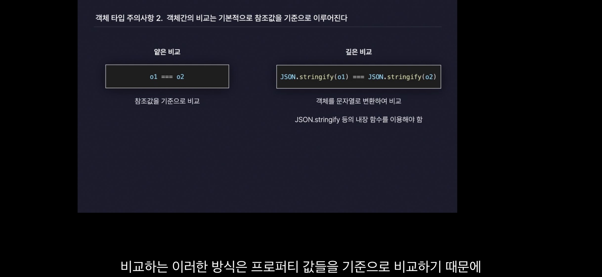

# 형변환

- 숫자 뿐만 아니라 문자도 함께 포함된 문자열을 숫자로 변환하고 싶다면, 함수 parseInt를 사용합니다.
  - 함수 parseInt는 문자열에서 숫자만 추려 반환하기 때문에 문자와 숫자가 섞여 있는 문자열도 숫자로 변환할 수 있습니다.
  - 첫 번째 인수는 변환하려는 문자열이고, 두 번째 인수는 진수입니다.
  - 단 함수 parseInt가 동작할 때는 문자열의 첫 문자부터 숫자로 변환하므로, 문자열이 숫자가 아닌 문자로 시작한다면 NaN을 반환하게 되니 주의해야 합니다.

```js
let strA = "10";
let strB = "10개";

let numA = parseInt(strA, 10);
let numB = parseInt(strB, 10);

console.log(numA); // 10
console.log(numB); // 10

let str = "파이팅 2022";
let num = parseInt(str, 10);

console.log(num); // NaN
```

# 연산자

- null 병합 연산자(Nullish Coalescing Operator ??): null 또는 undefined인 경우에만 오른쪽 피연산자를 반환합니다. 왼쪽 피연산자가 null이나 undefined가 아닌 경우에는 왼쪽 피연산자를 반환합니다.

```js
let name;
let nickname = "winterlood";
let user = name ?? nickname;

console.log(user); // winterlood
```

# 함수

- 콜백 함수를 이용하면 상황에 맞게 하나의 함수가 여러 동작을 수행하도록 만들 수 있습니다. 중복되는 로직은 하나의 함수에 두고 달라지는 부분은 인수로 콜백을 넘김.

# 스코프

- 스코프: 변수나 함수가 유효한 범위
- 지역 스코프
  - 블록 스코프 let, const
  - 함수 스코프 var

# 단락 평가

- 논리 연산에서 첫 번째 피연산자의 값만으로 해당 식의 결과가 확실할때, 두 번째 값은 평가하지 않는 것을 ‘단락 평가(Short-Circuit Evaluation)’라고 합니다. 단락 평가는 다른 표현으로 ‘지름길 평가’라고도 합니다.

# 객체

- in 연산자 왼쪽에 존재 여부를 확인하려는 프로퍼티의 key를 문자열로 명시하고, 오른쪽에 객체를 명시하면 프로퍼티의 존재를 확인할 수 있습니다.

## 객체 순회

1. Object.keys() : 객체의 키를 배열로 반환

```javascript
let person = { name: "John", age: 30, city: "New York" };
let keys = Object.keys(person); // ["name", "age", "city"]

for (let key of keys) {
  const value = person[key];
  console.log(key, value); // name John, age 30, city New York
}
for (let i = 0; i < keys.length; i++) {
  console.log(keys[i]); // name, age, city
}
```

2. Object.values() : 객체의 값을 배열로 반환

```javascript
let person = { name: "John", age: 30, city: "New York" };
let values = Object.values(person);

for (let value of values) {
  console.log(value); // John, 30, New York
}
```

3. Object.entries() : 객체의 키-값 쌍을 배열로 반환

```javascript
let person = { name: "John", age: 30, city: "New York" };
let entries = Object.entries(person);
console.log(entries); // [["name", "John"], ["age", 30], ["city", "New York"]]

for (let [key, value] of entries) {
  console.log(key, value); // name John, age 30, city New York
}
```

4. for...in 루프 : 객체의 열거 가능한 속성을 반복

```javascript
let person = { name: "John", age: 30, city: "New York" };

for (let key in person) {
  const value = person[key];
  console.log(key, value); // name John, age 30, city New York
}
```

# 배열과 메서드

## 배열 요소 추가, 삭제 메서드

- push: 배열의 끝에 하나 이상의 요소를 추가하고, 새로운 배열의 길이를 반환합니다.
- pop: 배열의 마지막 요소를 제거하고, 제거된 요소를 반환합니다. 빈 배열에서 pop 메서드를 사용하면, 제거할 요소가 없기 때문에 undefined를 반환합니다.
- unshift: 배열의 맨 앞에 하나 이상의 요소를 추가하고, 새로운 배열의 길이를 반환합니다.
- shift: 배열의 첫 번째 요소를 제거하고, 제거된 요소를 반환합니다. 빈 배열에서 shift 메서드를 사용하면, 제거할 요소가 없기 때문에 undefined를 반환합니다.

```
shift와 unshift는 느립니다
unshift 메서드로 배열 맨 앞에 요소를 추가하면, 새 요소가 인덱스 0이 되어 나머지 배열 요소의 인덱스는 모두 하나씩 뒤로 밀립니다.
또한 shift 메서드로 0번 인덱스 요소를 제거하면, 기존 요소의 인덱스는 모두 하나씩 앞으로 당겨져야 합니다.
반면 push나 pop 메서드는 배열의 마지막 요소를 추가 또는 제거하는 것이므로 기존 요소들의 인덱스는 변함이 없습니다.
따라서 이들 메서드가 shift나 unshift보다 성능이 더 좋습니다.
```

- slice: 마치 가위처럼 기존 배열에서 특정 범위를 잘라 새로운 배열을 반환합니다. 원본 배열은 변경되지 않습니다.
  - `arr.slice(startIdx, endIdx);` 범위는 end 인덱스 전까지입니다.
  - start만 전달하고 end를 전달하지 않으면, start부터 배열 끝까지 잘라낸 새 배열을 반환합니다.
  - 음수값을 인덱스로 전달해도 됩니다. 만약 end 없이 start만 음수 인덱스로 전달하면, 배열 맨 끝부터 전달한 음수의 절댓값만큼 잘라낸 새 배열을 반환합니다. 인덱스 번호는 기본적으로 0에서 시작하지만, 뒤에서부터 셀 때는 -1이 첫 번째 인덱스 번호입니다.

  ```js
  const arr = [1, 2, 3, 4, 5];

  console.log(arr.slice(-1)); // [5]
  console.log(arr.slice(-2)); // [4, 5]
  console.log(arr.slice(-3)); // [3, 4, 5]
  console.log(arr.slice(-4)); // [2, 3, 4, 5]
  console.log(arr.slice(-5)); // [1, 2, 3, 4, 5]
  ```

- concat: 두 개 이상의 배열을 합쳐 새로운 배열을 반환합니다. 원본 배열은 변경되지 않습니다.
  - `arr1.concat(arr2, arr3, ...);`
  - concat 메서드에서 인수로 배열을 전달하면 요소를 모두 이어 붙이지만, 객체는 하나의 요소로 인식해 삽입됩니다.

  ```js
  const arr1 = [1, 2];
  const arr2 = [3, 4];
  const arr3 = { a: 5, b: 6 };

  const result = arr1.concat(arr2, arr3);
  console.log(result); // [1, 2, 3, 4, { a: 5, b: 6 }]
  ```

- splice: 배열에서 요소를 추가하거나 제거할 때 사용됩니다. 원본 배열이 변경됩니다.
  - `arr.splice(start, deleteCount, item1, item2, ...);`

## 배열 순회 메서드

- 일반적으로 배열을 순회할 때는 앞서 살펴본 for of 반복문을 많이 이용합니다.
- forEach: 배열의 각 요소에 대해 제공된 함수를 한 번씩 실행합니다. 원본 배열은 변경되지 않습니다.
  - `arr.forEach(callback(currentItem, index, array), thisArg);`
  - forEach 메서드는 배열 요소 각각을 순회하면서, 인수로 전달한 콜백 함수가 정의한 대로 요소를 동작 시킵니다.
  - 콜백 함수에는 3개의 매개변수가 제공됩니다.
    - currentItem: 현재 순회하는 배열 요소입니다.
    - index: 현재 순회하는 배열 요소의 인덱스입니다.
    - array: forEach 메서드를 호출한 배열 자체입니다. 순회 중인 배열
  - forEach 메서드는 반환값이 없습니다. 즉, undefined를 반환합니다.

  ```js
  const arr = [1, 2, 3];

  // 배열 arr의 모든 요소에 대해 콜백함수를 실행합니다. 그 결과 콜백함수는 총 3번 실행
  arr.forEach((item, idx) => {
    console.log(`${idx}번째 요소: ${item}`);
  });

  // 0번째 요소: 1
  // 1번째 요소: 2
  // 2번째 요소: 3
  ```

## 배열 탐색 메서드

- indexOf: 배열에서 특정 요소의 첫 번째 인덱스를 반환합니다. 요소가 배열에 없으면 -1을 반환합니다.
  - `arr.indexOf(searchElement, fromIndex);`
  - fromIndex: 탐색을 시작할 인덱스. 생략하면 0부터 시작합니다. 음수값을 전달하면 배열의 끝에서부터 탐색을 시작합니다. 예를 들어, fromIndex로 -1을 전달하면 배열의 마지막 요소부터 탐색을 시작합니다.
  - indexOf는 엄격한 비교 연산자(===)로 요소를 비교하므로 자료형이 다르면 다른 값으로 평가합니다.
  - indexOf 메서드로는 객체 자료형의 값을 탐색할 수 없습니다. indexOf는 ===로 값을 비교하기 때문에 특정 조건을 만족하는 객체를 탐색할 수 없습니다. 앞서 살펴보았듯이 객체 자료형은 값을 비교하는 게 아니라 참좃값을 비교하기 때문입니다. → findIndex 메서드로 객체 탐색

  ```js
  // 동일한 프로퍼티를 가진 객체가 배열 arr에 있지만
  // 객체 간에는 참좃값을 비교하기 때문에 탐색에 실패하며 -1을 반환합니다.
  let arr = [{ name: "이정환" }, 1, 2, 3];

  console.log(arr.indexOf({ name: "이정환" })); // -1
  ```

- includes: 배열이 특정 요소를 포함하는지 여부를 반환합니다.
  - `arr.includes(searchElement, fromIndex);`

- findIndex: 배열에서 콜백 함수(판별 함수)를 만족하는 첫 번째 요소의 인덱스를 반환합니다. 즉, 콜백함수가 true를 반환하는 첫번째 요소의 인덱스. 만족하는 요소가 없으면 -1을 반환합니다.
  - `arr.findIndex(callback(element, index, array), thisArg);`
  - callback 함수는 배열의 각 요소에 대해 실행되며, 요소가 조건을 만족하면 true를 반환해야 합니다. findIndex 메서드는 조건을 만족하는 첫 번째 요소의 인덱스를 반환합니다.
  - 판별 함수는 배열 arr 각 요소에 대해 순차적으로 실행하며 판별 결과를 true나 false로 반환합니다.
    findIndex 메서드가 true를 반환하면 탐색에 성공한 것이므로 탐색을 멈춥니다.
    이때 findIndex는 탐색을 멈춘 인덱스 번호를 반환합니다.

  ```js
  let arr = [1, 3, 5, 6, 8];
  let index = arr.findIndex((item) => (item % 2 === 0 ? true : false));

  console.log(index); // 3

  // 더 간단히 작성할 수도 있습니다.
  let index = arr.findIndex((item) => item % 2 === 0);
  ```

  - indexOf는 엄격한 비교 연산자 ‘===’를 사용하므로(얕은비교) 객체 자료형은 찾아내기 어렵지만, (객체값은 참조값을 기준으로 비교)
    findIndex는 판별 함수를 이용해 배열에서 조건과 일치하는 객체 요소를 찾아냅니다.

  ```js
  let arr = [
    { name: "이종원" },
    { name: "이정환" },
    { name: "신다민" },
    { name: "김효빈" },
  ];

  let index1 = arr.indexOf({ name: "이정환" }); // -1
  let index2 = arr.findIndex((item) => item.name === "이정환");
  console.log(index2); // 1
  ```

- find: 판별 함수를 만족하는 첫 번째 요소를 반환합니다. 만족하는 요소가 없으면 undefined를 반환합니다.
  - `arr.find(callback(element, index, array), thisArg);`

- filter: 배열의 각 요소에 대해 콜백함수를 호출하여 true를 반환하는 요소만 모아 새로운 배열을 반환합니다.
  - `arr.filter(callback(element, index, array), thisArg);`

## 배열 변형 메서드

- map: 배열의 각 요소에 대해 콜백함수를 호출한 결과를 모아 새로운 배열을 반환합니다.
  - `arr.map(callback(currentItem, index, array), thisArg);`

- sort: 배열의 요소를 정렬합니다. 기본적으로 문자열로 정렬하지만, 비교 함수를 제공하여 원하는 방식으로 정렬할 수 있습니다.
  - `arr.sort(compareFunction);`
  - sort 메서드는 정렬된 새로운 배열을 반환하는 게 아니라, 기존 배열 자체를 정렬.
  - 하나의 콜백 함수를 인수로 전달합니다. 이 함수는 비교 함수로 사용되는데, 필수 사항은 아닙니다. 비교 함수를 생략하면 사전 순, 오름차순으로 정렬합니다.
  - sort 메서드는 기본적으로 요소를 문자열로 취급해 사전순으로 정렬 → 숫자를 정렬하려면 비교 함수(콜백) 필요
  - 자바스크립트의 sort 함수가 동작하는 핵심 원리는 compare 함수의 리턴값(결과값)에 따라 두 요소의 순서를 바꿀지 말지 결정하는 데 있습니다. 비교 함수는 배열 요소 두 개를 인수로 전달하는데, 이 함수의 반환값에 따라 정렬 방식이 달라집니다.
    - 비교 함수가(콜백) 양수를 반환 → 두 번째 인수로 들어온 값(b)을 첫 번째 인수로 들어온 값(a)보다 앞에 배치합니다.
      - a와 b 중 b의 위치가 a보다 앞이어야 한다는 것을 의미.
    - 비교 함수가 음수를 반환 → 첫 번째 인수로 들어온 값(a)을 두 번째 인수로 들어온 값(b)보다 앞에 배치합니다.
      - a와 b 중 a의 위치가 b보다 앞이어야 한다는 것을 의미.
    - 비교 함수가 0을 반환
      - a와 b는 정렬 순서가 동일하다는 것을 의미.

  ```js
  // 배열의 모든 요소에 대해 비교 함수를 실행하면 배열은 오름차순으로 정렬됩니다.
  function compare(a, b) {
    if (a > b) {
      return 1; // 양수 반환 → b가 앞
    } else if (a < b) {
      return -1; // 음수 반환 → a가 앞
    } else {
      return 0;
    }
  }

  let arr = [10, 5, 3];
  arr.sort(compare);

  console.log(arr); // [3, 5, 10]

  // 내림차순
  function compare(a, b) {
    if (a > b) {
      return -1; // 음수 반환 → a가 앞
    } else if (a < b) {
      return 1; // 양수 반환 → b가 앞
    } else {
      return 0;
    }
  }
  ```

- toSorted: sort 메서드와 동일한 방식으로 배열을 정렬하지만, 원본 배열은 변경하지 않고 정렬된 새로운 배열을 반환합니다.
  - `arr.toSorted(compareFunction);`

- join: 배열의 모든 요소를 하나의 문자열로 연결하여 반환합니다. 구분자를 지정할 수 있습니다. 생략하면 콤마(,)를 기본값으로 제공합니다.
  - `arr.join(separator);`

  ```js
  let arr = ["안녕", "나는", "이정환"];

  console.log(arr.join()); // 안녕,나는,이정환
  console.log(arr.join("-")); // 안녕-나는-이정환
  ```

- reduce: 배열의 각 요소에 대해 콜백함수를 실행하여 단일한 값으로 줄입니다.
  - `arr.reduce(callback(accumulator, currentValue, index, array), initialValue);`
  - reduce 메서드는 호출할 때 2개의 인수를 전달합니다. 첫 번째 인수로 콜백 함수를 전달하며, 두 번째 인수로는 initial(초깃값)을 전달합니다.
  - reduce 메서드의 첫 번째 인수로 전달하는 콜백 함수를 특별히 ‘리듀서’라고 부릅니다.
  - reducer 함수는 4개의 매개변수를 제공받습니다.
    - accumulator: 누산기. reducer 함수의 반환값이 누적되어 저장되는 변수입니다. 배열의 각 요소에 대해 reducer 함수가 실행될 때마다, reducer 함수의 반환값이 누산기에 저장됩니다.
    - currentValue: 현재 순회하는 배열 요소입니다.
    - index: 현재 순회하는 배열 요소의 인덱스입니다.
    - array: reduce 메서드를 호출한 배열 자체입니다.
  - acc의 초깃값인 인수 initial은 필수 사항은 아니며, 전달하지 않으면 배열의 첫 번째 요소가 acc의 초깃값이 됩니다.
  - reducer 메서드의 호출 결과는 마지막으로 반복했을 때의 acc 값입니다.

- reverse: 배열의 요소 순서를 반대로 뒤집습니다. 원본 배열을 변형

# Date 객체와 날짜

- Date는 배열이나 함수처럼 특수한 목적을 수행하기 위해 기능이 추가된 객체입니다.
- Date 객체는 날짜와 시간을 저장하며 이와 관련한 유용한 메서드도 함께 제공합니다.
- 협정 세계시라고 부르는 UTC(Universal Time Coordinated)를 기준으로 동작

## 협정 세계시(UTC)

- 협정 세계시는 시간의 시작을 1970년 1월 1일 0시 0분 0초를 기준으로 하며, 이 시작 시각을 UTC+0시라고 표현합니다.
- Date 객체에는 특정 시간을 ‘타임 스탬프’를 기준으로 저장하고 수정하는 기능이 있습니다.
  따라서 Date 객체를 생성할 때 생성자에 인수로 0을 전달하면, UTC+0시를 기준으로 0밀리초 후의 시간을 Date 객체로 생성해 반환합니다.

```js
let Jan01_1970 = new Date(0);
console.log(Jan01_1970);

// Thu Jan 01 1970 09:00:00 GMT+0900 (한국 표준시)
// 한국 표준시가 UTC보다 9시간이 빠르기 때문에 한국 표준시 기준으로는 UTC+09:00로 표현합니다.
```

## 타임스탬프

- 타임 스탬프란 특정 시간이 UTC+0시인 1970년 첫날을 기점으로 흘러간 밀리초(ms)의 시간입니다.
- Date 객체의 getTime 메서드는 해당 객체에서 시간에 해당하는 타임 스탬프를 반환합니다.

```js
let Jan02_1970 = new Date(24 * 60 * 60 * 1000);
console.log(Jan02_1970); // Fri Jan 02 1970 09:00:00 GMT+0900 (한국 표준시)
console.log(Jan02_1970.getTime()); // 86400000
// 변수 Jan02_1970에는 1970년 1월 1일부터 24 * 3600 * 1000 밀리초 후의 시간을 Date 객체가 저장
```

## 원하는 날짜로 Date 객체 생성하기

- UTC+0부터 2000년 10월 10일을 밀리초 단위로 계산하여 인수로 전달하는 것은 매우 어렵고 비효율적인 방법입니다.

### 문자열로 특정 날짜 전달하기

- Date 객체 생성자에 문자열로 표현된 날짜를 인수로 전달하면, 해당 날짜를 기준으로 Date 객체를 만들어 반환합니다.
- Date 객체 생성자는 전달 형식이 다른 문자열을 자동으로 분석해 적절한 날짜를 설정합니다. 보통은 ①~④ 형태의 날짜로 많이 작성하는데, 모든 형태의 문자열을 자동으로 분석할 수 있는 것은 아닙니다. 분석 가능한 다른 형태를 더 알고 싶다면 다음 [링크](https://developer.mozilla.org/ko/docs/Web/JavaScript/Reference/Global_Objects/Date/parse)를 참고하길 바랍니다.

```js
// 2000년 10월 10일이 저장된 4개의 Date 객체를 생성합니다.
// 4개의 Date 객체 생성자에 인수로 전달하는 날짜는 각각 다른 형식의 문자열입니다.

let date1 = new Date("2000-10-10/00:00:00"); ①
let date2 = new Date("2000.10.10/00:00:00"); ②
let date3 = new Date("2000/10/10/00:00:00"); ③
let date4 = new Date("2000 10 10/00:00:00"); ④

console.log("1:", date1); // 1: Tue Oct 10 2000 00:00:00 GMT+0900 (한국 표준시)
console.log("2:", date2); // 2: Tue Oct 10 2000 00:00:00 GMT+0900 (한국 표준시)
console.log("3:", date3); // 3: Tue Oct 10 2000 00:00:00 GMT+0900 (한국 표준시)
console.log("4:", date4); // 4: Tue Oct 10 2000 00:00:00 GMT+0900 (한국 표준시)
```

### 숫자로 특정 날짜 전달하기

- 밀리초가 아니라 year, month, date, hours, minutes, seconds, milliseconds 순서로, 날짜와 시간에 해당하는 숫자를 전달해 원하는 Date 객체를 생성할 수도 있습니다.
- Date 객체 해당 월의 시작은 1이 아니라 0부터 시작. 따라서 1월은 0, 12월은 11로 전달해야 원하는 출력 결과를 얻을 수 있습니다.

```js
let date1 = new Date(2000, 10, 10, 0, 0, 0, 0);
let date2 = new Date(2000, 9, 10);

console.log("1:", date1); // 1: Fri Nov 10 2000 00:00:00 GMT+0900 (한국 표준시)
console.log("2:", date2); // 2: Tue Oct 10 2000 00:00:00 GMT+0900 (한국 표준시)
```

### 타임 스탬프로 날짜 생성하기

- 타임 스탬프를 이용해 날짜를 생성하는 것도 가능합니다. 타임 스탬프는 숫자로 표현되어 있기 때문에 문자열이나 객체보다 저장 공간을 훨씬 적게 차지하여 빠른 비교와 탐색이 가능합니다. 따라서 데이터베이스에서 날짜와 시간을 저장할 때는 타임 스탬프 형태로 저장합니다.

```js
let date = new Date(2000, 9, 10);
let timeStamp = date.getTime(); // ①
console.log(timeStamp); // 971103600000

let dateClone = new Date(timeStamp); // ②
console.log(dateClone); // Tue Oct 10 2000 00:00:00 GMT+0900 (한국 표준시)
```

## Date 객체에서 날짜 요소 얻기, 수정하기

- getFullYear: 네 자릿수의 연도(year)를 반환합니다.
- setFullYear: 네 자릿수의 연도(year)를 설정합니다.

```js
let date = new Date(2000, 9, 10);

console.log(date.getFullYear()); // 2000

date.setFullYear(2021);
```

- getMonth: Date 객체에서 0에서 11로 표현되는 월(月)을 반환합니다. (setMonth)
- getDate (setDate)
- getDay: 0부터 6으로 표현되는 요일을 반환합니다. 0은 항상 일요일이며, 6은 토요일입니다. (setDay는 없음)
- getHours, getMinutes, getSeconds, getMilliseconds 메서드 (setHours, setMinutes, setSeconds, setMilliseconds)

```js
let date = new Date(2000, 9, 10);

console.log(date.getHours()); // 0
console.log(date.getMinutes()); // 0
console.log(date.getSeconds()); // 0
console.log(date.getMilliseconds()); // 0
// Date 객체에 시간과 관련해서는 아무런 값도 인수로 전달하지 않았기 때문에 시간, 분, 초, 밀리초가 반환한 값은 0입니다.
```

## Date 객체 출력하기

- toString: Date 객체를 사람이 읽을 수 있는 문자열로 반환합니다. 미국식 영어 포맷으로 날짜를 고정해서 반환합니다.
- toISOString: Date 객체를 ISO 8601 형식의 문자열로 반환합니다.
- toDateString: Date 객체를 시간을 제외하고 날짜 부분만 포함하는 문자열로 반환합니다.

- toLocaleString: Date 객체를 현지에 맞는 문자열로 반환합니다. 사용자의 기기 설정(언어 및 지역)에 맞춰서 날짜를 변환합니다.
- toLocaleDateString: Date 객체를 현지에 맞는 날짜 문자열로 반환합니다.
- toLocaleTimeString: Date 객체를 현지에 맞는 시간 문자열로 반환합니다.

```js
let date = new Date(2000, 9, 10); // 2000년 10월 10일이 저장된 Date 객체를 생성합니다.

console.log(date.toString()); // Tue Oct 10 2000 00:00:00 GMT+0900 (한국 표준시)
console.log(date.toISOString()); // 2000-10-09T15:00:00.000Z
// -> 한국은 UTC보다 9시간이 빠르기 때문에, ISO 형식을 만들 때는 9시간을 뒤로 돌립니다.
console.log(date.toDateString()); // Tue Oct 10 2000

console.log(date.toLocaleString()); // 2000. 10. 10. 오후 12:00:00 (= 00:00:00)
console.log(date.toLocaleDateString()); // 2000. 10. 10.
console.log(date.toLocaleTimeString()); // 오후 12:00:00
```

## Date 객체 응용하기

### n 월 단위로 이동하기

```js
function moveMonth(date, moveMonth) {
  // ①
  const curTimestamp = date.getTime(); // ②
  const curMonth = date.getMonth(); // ③

  const resDate = new Date(curTimestamp); // ④
  resDate.setMonth(curMonth + moveMonth); //⑤

  return resDate;
}

const dateA = new Date("2000-10-10");
console.log("A: ", dateA); // A : Tue Oct 10 2000 09:00:00 GMT+0900 (한국 표준시)

const dateB = moveMonth(dateA, 1);
console.log("B: ", dateB); // B : Fri Nov 10 2000 09:00:00 GMT+0900 (한국 표준시)

const dateC = moveMonth(dateA, -1);
console.log("C: ", dateC); // C : Sun Sep 10 2000 09:00:00 GMT+0900 (한국 표준시)
```

- ① 함수 moveMonth에는 Date 객체와 이동할 단위 개월인 moveMonth, 두개의 매개변수가 있습니다.
- ② 매개변수 date에 저장된 Date 객체의 타임 스탬프를 변수 curTimestamp에 저장합니다.
- ③ 매개변수 date에 저장된 Date 객체에서 월을 구해 변수 curMonth에 저장합니다.
- ④ 변수 resDate를 만들고 새로운 Date 객체를 생성합니다. Date 객체를 만들면서 ②에서 구한 타임 스탬프값(curTimestamp)을 인수로 전달합니다. 결과적으로 변수 resDate에는 date 객체와 동일한 타임 스탬프값이 들어 있는 Date 객체가 저장됩니다.
- ⑤ 변수 resDate에 저장된 Date 객체에서 setMonth 메서드를 호출해 기존 월에 moveMonth만큼 더 한 월을 새로운 월로 저장합니다. 결론적으로 이 함수를 호출하면 moveMonth만큼 월을 앞으로 또는 뒤로 이동시킵니다.

### 배열에서 이번 달에 해당하는 날짜만 필터링하기

여러 개의 Date 객체를 저장하고 있는 배열에서 이번 달에 해당하는 Date 객체만 필터링해 새 배열로 만들기

- 이번 달에 해당하는 날짜가 있는 Date 객체를 필터링하기 위해서는 다음과 같이 2가지 작업이 필요합니다.
  - 이번 달에서 가장 빠른 시간, 가장 늦은 시간 구하기
  - 1번에서 구한 시간 내에 포함되는 Date 객체를 필터링하기

```js
function filterThisMonth(pivotDate, dateArray) {
  // ①
  const year = pivotDate.getFullYear();
  const month = pivotDate.getMonth();

  const startDay = new Date(year, month, 1, 0, 0, 0, 0); // ②
  const endDay = new Date(year, month + 1, 0, 23, 59, 59); // ③

  const resArr = dateArray.filter(
    (it) =>
      startDay.getTime() <= it.getTime() && // ④
      it.getTime() <= endDay.getTime(),
  );
  return resArr;
}

const dateArray = [
  new Date("2000-10-1"),
  new Date("2000-10-31"),
  new Date("2000-11-1"),
  new Date("2000-9-30"),
  new Date("1900-10-11"),
];

const today = new Date("2000-10-10/00:00:00");
const filteredArray = filterThisMonth(today, dateArray);

console.log(filteredArray);

// 0: Sun Oct 01 2000 00:00:00 GMT+0900 (한국 표준시)
// 1: Tue Oct 31 2000 00:00:00 GMT+0900 (한국 표준시)
```

- ① dateArray는 코드에서 작성한 Date 객체 배열이며, pivotDate는 필터링 할 월이 있는 Date 객체입니다.
- ② 이번 달의 가장 빠른 시간은 1일 0시 0분 0초로 설정하여 구합니다.
- ③ 이번 달의 가장 늦은 시간은 다음 달 0일의 23시 59분 59초(이번 달의 가장 마지막 날을 의미)로 설정해 구합니다.
  - 왜 이달의 가장 늦은 시간이 다음 달 0일 23시 59분 59초인가요?
    <br/>자바스크립트의 Date 객체에서 date, 즉 일을 0으로 설정하면 해당 월 바로 이전 월의 마지막 날을 의미합니다.
    즉 2000년 10월 0일은 2000년 9월의 마지막 날입니다.
- ④ filter 메서드를 이용해 dateArray에서 이번 달에 속하는 요소만 필터링합니다.
  <br/>서로 다른 Date 객체를 비교할 때는 getTime 메서드로 타임 스탬프를 기준으로 비교합니다.
  <br/>특정 Date 객체가 더 크다는 것은 이 객체가 더 미래에 있는 시간이라는 뜻입니다.

# 비동기 처리

## 동기와 비동기

- 자바,c# 멀티스레드
- 자바스크립트는 싱글스레드 언어입니다. 즉, 한 번에 하나의 작업만 처리할 수 있습니다. 하지만 자바스크립트는 비동기 처리를 지원하여, 긴 작업이 완료될 때까지 기다리지 않고 다른 작업을 계속할 수 있습니다.
- 자바스크립트의 비동기 작업들은 자바스크립트 엔진이 아닌 Web APIs라는 브라우저가 관리하는 별도의 공간에서 실행. 때문에 싱글스레드이지만 동시에 여러 작업을 처리할 수 있습니다.

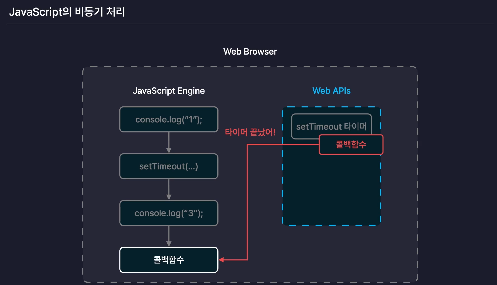

- 비동기함수 발견시 web apis로 타이머와 콜백함수를 넘기고, 타이머(비동기작업)가 끝나면 web apis는 콜백함수를 (테스크 큐)이벤트 큐에 넣고, 이벤트 루프가 호출 스택이 비어있을 때 테스크 큐에서 콜백함수를 꺼내 호출 스택으로 넘기고, 자바스크립트 엔진은 이를 실행합니다.

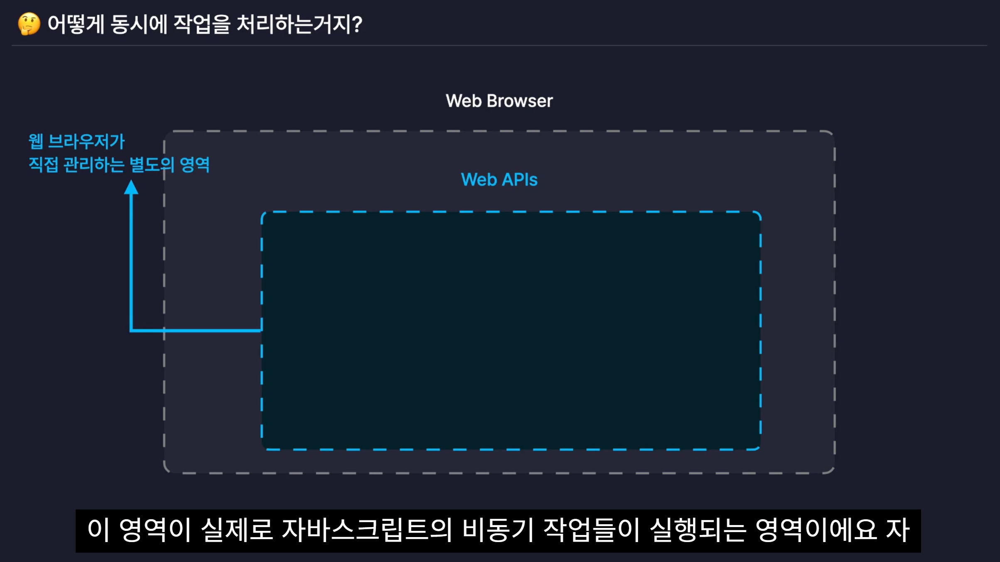

- 동기: 순차적으로 코드를 실행하는 것. 자바스크립트는 기본적으로 동기적으로 동작합니다.
- 비동기: 특정 작업을 다른 작업과 관계없이 독립적으로 동작하게 만드는 것. 특정 작업이 완료될 때까지 기다리지 않고 다음 코드를 실행하는 것. 자바스크립트는 비동기 처리를 위해 콜백 함수, 프로미스 객체, async/await 등의 기능을 제공합니다.

## 콜백함수로 비동기 처리하기

- 함수 setTimeout은 타이머의 식별 번호를 반환합니다.
- setTimeout은 콜백 함수가 무엇을 반환하든 이를 받아서 처리하거나 어딘가로 전달하지 않고 그냥 버립니다. 따라서 콜백함수의 반환값은 어디에도 닿지 못하고 소멸합니다.
  - 호출 스택: double(10)이 호출되면 setTimeout을 실행하고 즉시 종료됩니다.
  - 반환 시점: double 함수는 1초를 기다리지 않고 곧바로 타이머 ID를 반환하며 종료됩니다.
  - 실행 시점: 1초 뒤에 콜백 함수가 실행될 때는 이미 double 함수도, res 변수 할당도 모두 끝난 상태입니다.

- 비동기 작업을 하는 함수의 결과 값을 함수 외부에서 이용하고 싶다면 콜백 함수를 이용해 비동기 함수 안에서 콜백함수를 호출
  <br/>→ 콜백헬에 빠질 수 있음

```js
function add(a, b, callback) {
  setTimeout(() => {
    const sum = a + b;
    callback(sum);
  }, 1000);
}

// sum을 add 함수 외부에서 사용하려면 비동기 처리 결과 값을 사용하고자 하는 콜백함수를 인수로 전달
function add(a, b) {
  setTimeout(() => {
    const sum = a + b;
  }, 1000);
}

add(1, 2, (value) => {
  console.log(value);
});
```

```js
function double(num) {
  return setTimeout(() => {
    const doubleNum = num * 2;
    return doubleNum; // 이 반환값은 어디에도 닿지 못하고 소멸합니다.
  }, 1000);
}

const res = double(10);
```

- 비동기 작업의 결과를 외부에서 사용하려면 Promise를 활용해야 합니다. Promise를 사용하면 1초 뒤에 계산된 값을 resolve를 통해 밖으로 꺼내올 수 있습니다.

```js
function double(num) {
  return new Promise((resolve) => {
    setTimeout(() => {
      const doubleNum = num * 2;
      resolve(doubleNum); // 결과값을 resolve를 통해 전달
    }, 1000);
  });
}

// 사용 방법
double(10).then((res) => {
  console.log(res); // 1초 뒤에 20 출력
});

// 또는 async/await 사용
const run = async () => {
  const res = await double(10);
  console.log(res); // 20
};
```

- 결과값을 return으로 받으려 하지 않고, 값이 준비되었을 때 실행할 함수(콜백)를 미리 맡겨두는 방식으로도 비동기 작업의 결괏값을 사용할 수 있습니다.

```js
function double(num, cb) {
  setTimeout(() => {
    const doubleNum = num * 2;
    cb(doubleNum); // ②
  }, 1000);
}

double(10, (res) => {
  // ①
  console.log(res);
});
```

- ① 함수 double을 호출하며 두 번째 인수로 화살표 함수로 만든 콜백 함수를 전달합니다. 콜백 함수는 함수 double의 매개변수 cb에 저장되며, 호출되면 인수로 전달한 값을 콘솔에 출력합니다.
- ② 비동기 작업이 완료되면 콜백 함수를 호출해 연산의 결괏값을 인수로 전달합니다.

## 프로미스 객체를 이용해 비동기 처리하기

- Promise객체: 비동기 처리를 목적으로 제공되는 자바스크립트 내장 객체. 비동기 작업을 감싸는 객체. 프로미스는 Date 객체처럼 특수한 목적을 위해 다양하게 기능이 추가된 객체. 프로미스를 이용하면 콜백 함수를 이용한 비동기 처리보다 더 쉽게 비동기 작업을 수행할 수 있습니다.
- 프로미스 객체는 비동기 작업에 필요한 거의 모든 기능 제공(감싸고 있는 비동기 작업을 실행, 비동기 작업 상태 관리, 비동기 작업 결과 저장, 여러 미동기 작업 병렬 실행 등)

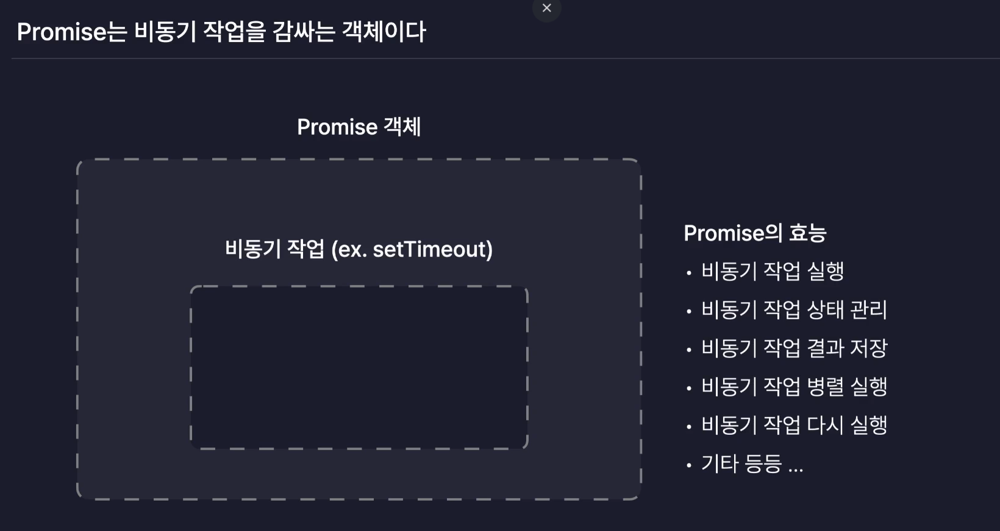

- 프로미스는 비동기 작업을 진행 단계에 따라 3가지 상태로 나누어 관리합니다
  - 대기(Pending) 상태: 작업을 아직 완료하지 않음
  - 성공(Fulfilled) 상태
  - 실패(Rejected) 상태
- 대기 상태에서 작업을 성공적으로 완료하는 것을 해결(resolve)이라고 합니다. 작업을 해결하면 해당 작업은 성공 상태가 됩니다.
- 반대로 대기 상태에서 작업이 모종의 이유(오류 발생 등)로 실패하는 것을 거부(reject)라고 합니다. 작업이 거부되면 해당 작업은 실패 상태가 됩니다.
  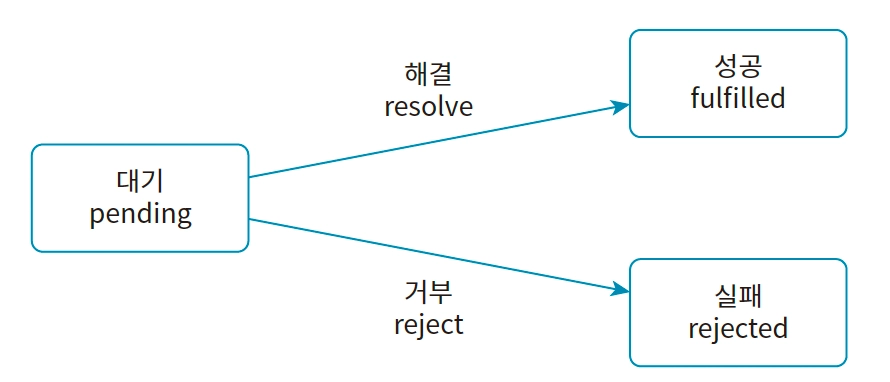
  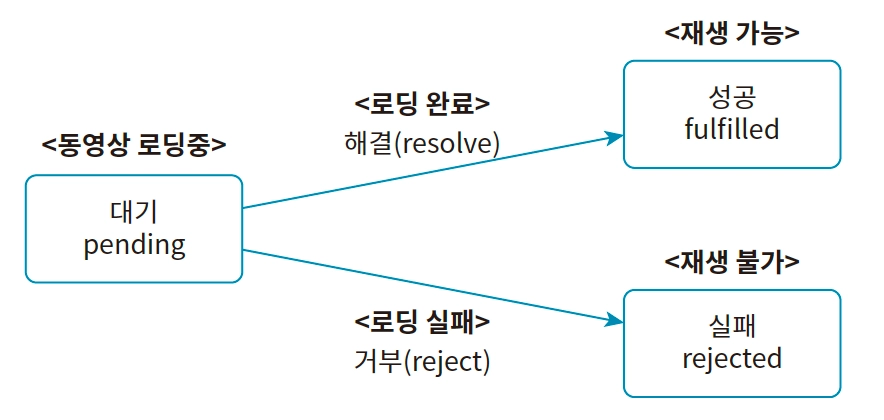

```js
const promise = new Promise(비동기 콜백 함수);

```

- 프로미스 객체를 만들 때 인수로 실행 함수(executor)를 전달합니다. 실행 함수란 비동기 작업을 수행하는 함수입니다.
  <br/>이 함수는 프로미스 객체를 생성함과 동시에 실행되며 2개의 매개변수를(resolve, reject) 제공받습니다.
  <br/>실행 함수가 제공받는 2개의 매개변수는 대기 상태의 비동기 작업을 성공 또는 실패 상태로 변경하는 역할을 합니다.
  - resolve: 비동기 작업의 상태를 성공으로 바꾸는 함수
  - reject: 비동기 작업의 상태를 실패로 바꾸는 함수

```js
// 실행 함수에 매개변수로 제공된 resolve를 호출해 비동기 작업의 성공을 알리며 작업의 결괏값을 인수로 전달합니다.
const promise = new Promise(function (resolve, reject) {
  setTimeout(() => {
    resolve("성공");
  }, 500);
});
```

- 실행 함수는 0.5초 기다린 다음 resolve를 호출해 이 비동기 작업의 상태를 성공 상태로 변경합니다.
  <br/>이때 resolve를 호출하며 인수로 전달한 값 “성공”은 비동기 작업의 결괏값이 됩니다. 이 결괏값을 비동기 작업이 아닌 곳에서 이용하려면 다음과 같이 프로미스 객체의then 메서드를 이용하면 됩니다.
  <br/>then 메서드는 인수로 전달한 콜백 함수의 비동기 작업이 성공했을 때 실행합니다.

```js
const promise = new Promise(function (resolve, reject) {
  setTimeout(() => {
    resolve("성공");
  }, 500);
});

promise.then(function (res) {
  // ① 프로미스가 성공하면 then 메서드에 전달한 콜백 함수가 실행됩니다.
  // res는 결과값 "성공"이 됩니다.
  console.log(res);
});
```

- ① then 메서드를 호출하고 인수로 콜백 함수를 전달합니다.
  <br/>이 콜백 함수는 비동기 작업이 성공했을 때, 즉 실행 함수가 resolve를 호출했을 때 실행됩니다. 이때 콜백 함수의 매개변수에는 "성공"이라는 문자열이 전달됩니다.

- 실행 함수에서 reject를 호출하면 비동기 작업의 상태를 실패로 변경합니다. 이때 then 메서드에 전달한 콜백 함수는 실행되지 않습니다.

```js
const promise = new Promise(function (resolve, reject) {
  setTimeout(() => {
    reject("실패"); // ①
  }, 500);
});

promise.then(function (res) {
  // ②
  console.log(res);
});
```

- ① 실행 함수에서 reject를 호출하여 이 작업이 실패했음을 알리고 인수로 “실패”를전달합니다.
- ② 비동기 작업이 실패했으므로 then 메서드에 인수로 전달한 콜백 함수는 실행되지 않습니다.

- then 메서드는 작업이 성공했을 때 실행할 콜백 함수를 설정합니다.
  <br/>따라서 작업이 실패했을 때 실행할 콜백 함수를 설정하려면 catch 메서드를 사용해야 합니다.

```js
const promise = new Promise(function (resolve, reject) {
  setTimeout(() => {
    reject("실패");
  }, 500);
});

promise.then(function (res) {
  console.log(res);
});

promise.catch(function (err) {
  // ① 프로미스가 실패했을 때 catch 메서드에 전달한 콜백 함수가 실행
  // err은 결과값 "실패"가 됩니다.
  console.log(err);
});

// 실패
```

- ① 비동기 작업이 실패하면 catch 메서드에 인수로 전달한 콜백 함수가 실행됩니다.
  <br/>이때 실행 함수에서 reject에 전달한 인수가 매개변수로 제공됩니다.

- 이렇듯 프로미스의 then과 catch 메서드를 이용하면 작업이 성공하거나 실패했을때 실행할 콜백 함수를 별도로 설정할 수 있어 좀 더 유연하게 비동기 작업을 처리 할 수 있습니다.

- Promise chaining: then, catch메서드의 호출 결과 역시 프로미스 객체를 반환한다. 이때 반환하는 프로미스 객체는 then, catch 메서드를 호출한 프로미스 객체다. 따라서 then, catch 메서드를 연달아 호출할 수 있습니다.

```js
const promise = new Promise(function (resolve, reject) {
  setTimeout(() => {
    resolve("성공");
  }, 500);
});

promise
  .then(function (res) {
    console.log(res);
  })
  .catch(function (err) {
    console.log(err);
  });
```

- then 메서드 안에서 새로운 프로미스 객체를 반환하면 그 객체가 then 메서드 호출의 결과값이 된다.

```js
function add(num) {
  const promise = new Promise((resolve, reject) => {
    setTimeout(() => {
      if (typeof num === "number") {
        resolve(num + 10);
      } else {
        reject("숫자만 입력하세요");
      }
    }, 1000);
  });
  return promise;
}

const p = add(0);
p.then((res) => {
  console.log(res); // 10

  const newP = add(res);
  newP.then((newRes) => {
    console.log(newRes); // 20
  });
  return newP;
});
```

```js
(...)

const p = add(0);
p.then((res) => {
  console.log(res); // 10

  const newP = add(res);
    return newP;
    }).then((newRes) => {
    console.log(newRes); // 20
  });

  // 더 간결하게
  add(0).then((res) => {
    console.log(res);
    return add(res);
  }).then((res) => {
    console.log(res);
    return add(undefined); // 중간에 오류가 발생해도 catch로 잡을 수 있습니다.
  }).then((res) => {
    console.log(res);
    return add(res);
  }).catch((error) => {
    console.log(error);
  });

```

## async/await로 비동기 처리하기

- async: 동기 함수를 비동기 함수로 만들어주는 키워드. 함수가 프로미스를 반환하도록 변환해주는 키워드.
- async를 붙이면 return값을(아래 예시에선 객체) 결과값으로 갖는 새로운 프로미스를 반환하는 함수로 변환된다.

```js
async function getData() {
  return {
    name: "이정환",
    age: 30,
  };
}

console.log(getData()); // Promise { { name: '이정환', age: 30 } }
```

- 만약 async함수가 프로미스 객체를 반환한다면 그냥 그 객체를 반환.

```js
async function getData() {
  return new Promise((resolve) => {
    resolve({
      name: "이정환",
      age: 30,
    });
  });
}

console.log(getData());
```

- await: async 함수 안에서만 사용할 수 있는 키워드. await는 프로미스가 처리될 때까지 기다렸다가 프로미스가 처리된 후의 결과값을 반환합니다. 따라서 await는 프로미스가 처리된 후의 결과값을 then을 사용하지 않고도 변수에 저장하거나 다른 함수의 인수로 전달할 수 있습니다.
