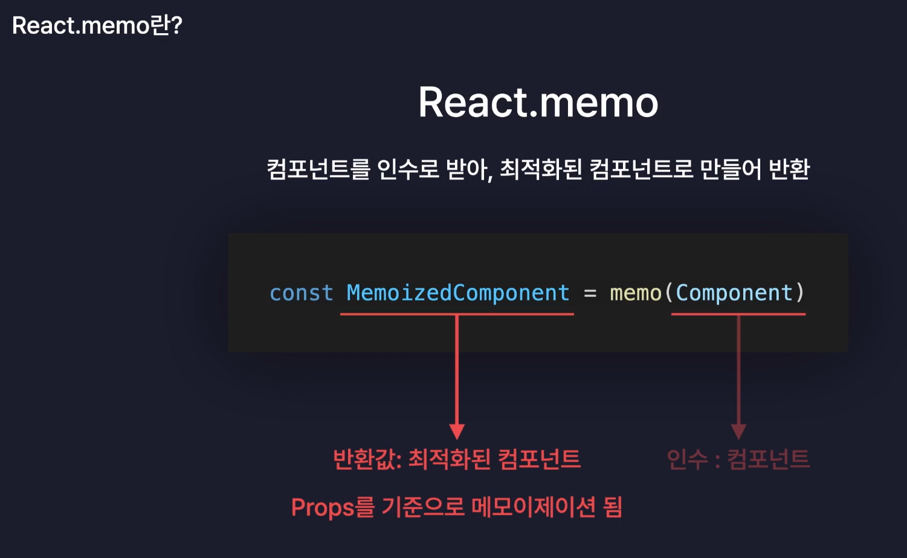

- 기능구현을 먼저 다 한 후에 최적화 적용.

# 불필요한 연산 방지 useMemo

- useMemo는 컴포넌트가 렌더링될 때마다 특정 계산을 다시 실행하는 것을 방지하기 위해 사용됩니다.
- `useMemo(콜백함수, 의존성배열)`
  - 콜백함수: 메모이제이션할 계산을 수행하는 함수입니다. 이 함수는 의존성 배열의 값이 변경될 때만 다시 실행됩니다.

# 불필요한 리렌더링 방지하기 React.memo

- 고차 컴포넌트(Higher-Order Component): 컴포넌트를 인수로 받아 해당 컴포넌트에 최적화 등 추가적인 기능을 덧붙여 새로운 컴포넌트를 반환하는 함수입니다.
- React.memo는 리액트 내장함수로, 컴포넌트를 인수로 받아 최적화된 컴포넌트로 만들어 반환.
- 컴포넌트가 동일한 props로 렌더링될 때 이전 렌더링 결과를 재사용하여 불필요한 리렌더링을 방지하는 고차 컴포넌트입니다.
- 부모컴포넌트가 리렌더되도 자신이 받는 props가 변경되지 않으면 리렌더링이 일어나지 않음.
- memo(컴포넌트, 비교함수)
  - 컴포넌트: 최적화하려는 컴포넌트입니다.
  - 비교함수: 이전 props와 다음 props를 비교하여 리렌더링 여부를 결정하는 함수입니다. 이 함수가 true를 반환하면 리렌더링이 발생하지 않습니다. 보통은 생략되며 기본적으로 얕은 비교를 수행합니다.



- 단, 객체 타입의 값을 props로 전달할 때는 주의가 필요합니다. 객체는 참조 타입이므로, 매 렌더링마다 새로운 객체가 생성되어 props가 변경된 것으로 간주될 수 있습니다.
  - 두번째 인수로 콜백함수(비교함수)를 전달하여, 컴포넌트의 props가 바뀌었는지 스스로 판단하는게 아니라 콜백함수의 매개변수로 이전 props와 현재 props(nextProps)를 전달하여 반환값에 따라 리렌더링 여부를 결정할 수 있습니다.
    - 콜백함수가 true를 반환하면 props가 바뀌지 않았음을 의미하여 리렌더링이 발생하지 않고, false를 반환하면 리렌더링이 발생합니다.

  ```jsx
  const MyComponent = React.memo(TodoItem, (prevProps, nextProps) => {
    // 반환값에 따라 props가 바뀌었는지 안바뀌었는지 판단

    if (prevProps.todo.id !== nextProps.todo.id) return false;

    (...)

    return true;
  });

  ```

  - 또는 useCallback을 사용하여 함수(객체)를 메모이제이션하면, 함수가 불필요하게 재생성되는 것을 방지할 수 있습니다.

# 불필요한 함수 재생성 방지하기 useCallback

- `useCallback(콜백함수, 의존성배열)`
  - 콜백함수: 메모이제이션할 함수를 정의하는 함수입니다. 이 함수는 의존성 배열의 값이 변경될 때만 다시 생성됩니다.
  - 콜백함수를 그대로 생성해 반환한다.
  - 의존성 배열이 빈배열이면 컴포넌트가 처음 렌더링될 때만 콜백함수가 생성되고, 이후에는 동일한 함수를 재사용합니다.

```jsx
const onDelete = useCallback((targetId) => {
  dispatch({ type: "DELETE", targetId });
}, []);
```

```jsx
// ❌ 이렇게 쓰면 최적화 효과가 없습니다.
const onDelete = (targetId) => {
  dispatch({ type: "DELETE", targetId });
};

const memoizedOnDelete = useCallback(onDelete, []);

// 리렌더링이 발생할 때마다 const onDelete 부분에서 새로운 함수 객체가 매번 생성됩니다.
// useCallback에 인자로 매번 새로운 함수를 넘겨주게 되므로, 메모이제이션의 의미가 퇴색됩니다.
// (함수를 생성하고 나서 다시 메모이제이션된 함수를 꺼내오는 중복 작업이 발생합니다.)
```
