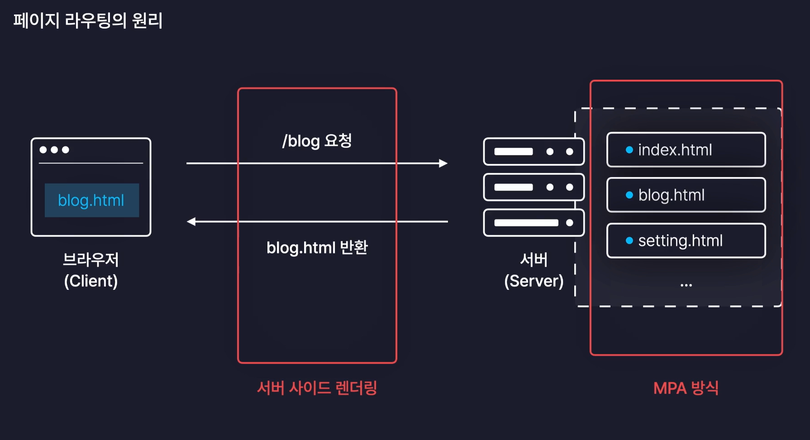
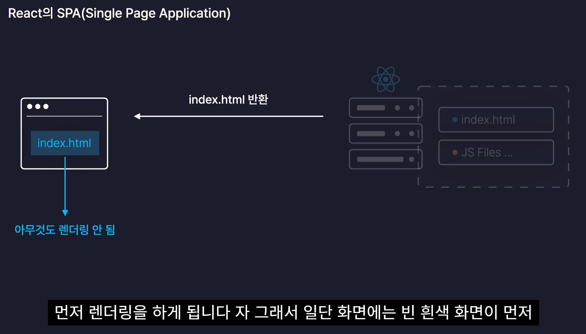
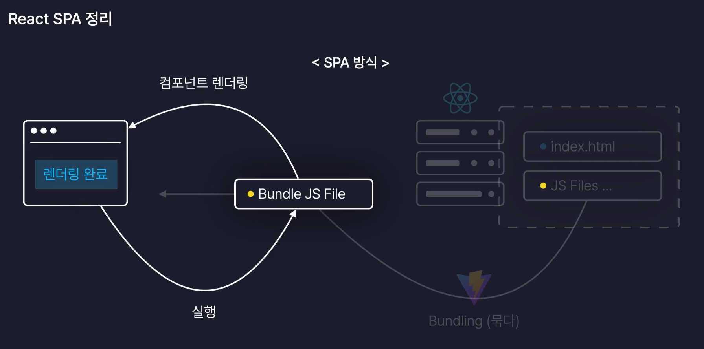
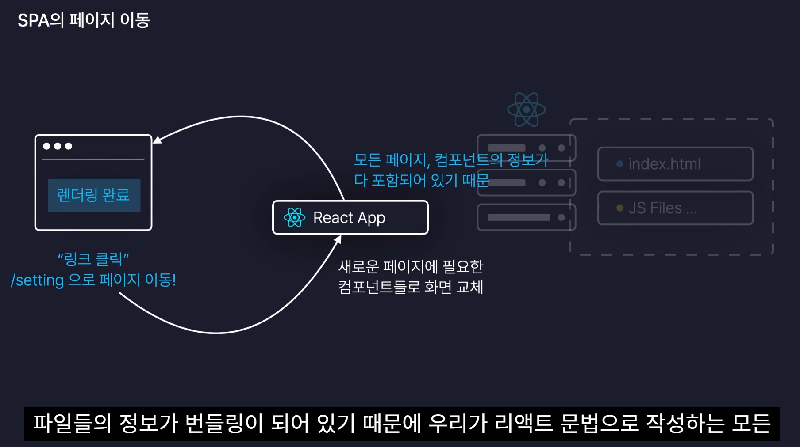
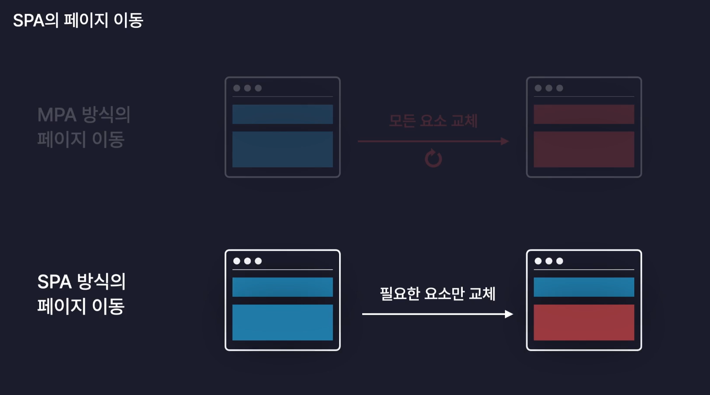
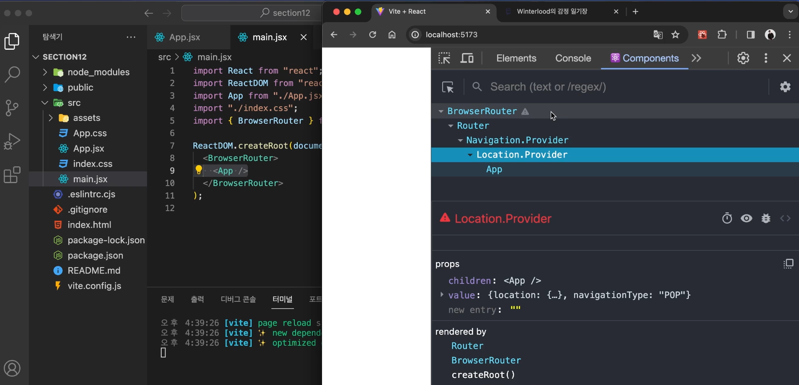
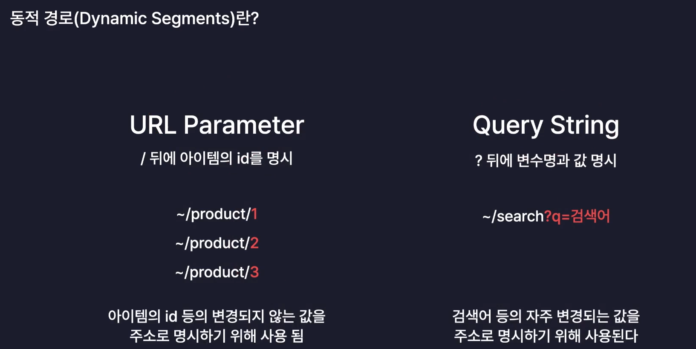

# MPA와 SSR, SPA와 CSR

- MPA: 서버가 여러개의 html 페이지를 가지고 있는 것
- SSR: 서버가 html 페이지를 만들어서 보내주는 것

- SPA: 서버가 하나의 html 페이지를 가지고 있는 것
- CSR: 서버가 자바스크립트 코드와 데이터만 보내주는 것. 브라우저가 화면 렌더링



- MPA는 다수의 사용자 접속시 서버 부하가 심해진다.



- 번들파일은 우리가 작성한 모든 리액트 컴포넌트들이 하나의 파일로 묶여있는 자바스크립트 파일이기 때문에 사실상 React App이라고 부를수 있다.






# 리액트 라우터

- 리액트 라우터의 `BrowserRouter`
  - `BrowserRouter`는 브라우저의 현재 주소를 저장하고 감지하는 역할
  - `BrowserRouter`에 보관되는 모든 데이터들은 context로 자식 컴포넌트가 사용가능



## 페이지 이동

- Link 태그
- `useNavigate` 훅을 이용한 프로그래밍 방식. (마찬가지로 클라이언트 사이드 이동 방식)
- 단순 이동의 경우는 Link 태그, 어떤 로직이 실행된 후 이동 등은 useNavigate.

## 동적 경로(Dynamic Segments)

- URL의 일부가 변하는 경로를 동적 경로라고 한다.
- URL parameter, Query String



```jsx
<Routes>
  <Route path="/users/:id" element={<User />} />
</Routes>
```

- useParams 훅을 이용해서 URL parameter를 읽어올 수 있다.

```jsx
import { useParams } from "react-router-dom";

function User() {
  const { id } = useParams();
}
```

- useSearchParams 훅을 이용해서 Query String을 읽어올 수 있다.

```jsx
import { useSearchParams } from "react-router-dom";

function User() {
  const [searchParams, setSearchParams] = useSearchParams();

  const name = searchParams.get("name");
}
```
