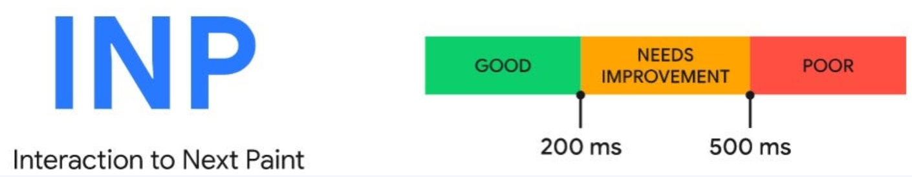

# Takeaways

## 웹사이트와 성능

1. 웹사이트를 방문한 목적을 손쉽게 달성할 수 있어야 한다.
2. 첫번째 목적을 달성하는데 걸리는 시간이 짧아야 한다.
3. 보안이 철저해야 한다.

* 웹사이트의 접근성이 떨어지고 속도가 느리거나 보안 이슈가 있다면 사용자의 외면을 받을 것이다.
* jQuery나 LAMP 스택같은 비교적 오래된 기술로 웹사이트가 구성돼 있어도 웹사이트가 충분히 빠르고 이용하는데 지장이 없다면 사용자들은 어떠한 불편을 느끼지 않을 것이다. 사용자가 느끼는 성능이 제일 중요하다.

### 웹사이트의 성능과 사용자 경험, 비지니스 수익 사이의 상관관계

* 1초 내로 로딩되는 사이트는 5초 내로 로딩되는 사이트보다 전자상거래 전환율이(실제 구매로 이어지는 고객의 비율) 2.5배 더 높다.
* 0 \~ 5초 범위에서 1초 로딩이 늦어질수록 전환율은 4.42%씩 떨어진다. 즉 5초 이상 느려지만 전환율은 20% 가까이 떨어진다.
* 페이지 로드 시간이 0 \~ 2초 사이인 페이지에서 가장 높은 전환율을 달성할 수 있다.

사용자 또한 성능에 매우 민감하다.

* 소비자의 70%는 페이지 속도가 온라인 커머스 사이트를 방문하는데 영향을 미친다고 밝혔다.
* 절반 가까운 사람이 더욱 빠르게 로딩할 수 있다면 애니메이션과 동영상이 필요없다고 밝혔다.

구글의 성능에 관한 통계

* 전체 웹페이지를 표시하는 데 필요한 최적의 평균 리소스 요청 수는 50회 미만이다. (한 페이지를 로딩하는데 50회 미만의 요청이 발생해야 한다.)
* 평균적으로 웹 페이지 전체를 요청하는 데 15.3초가 걸린다.
* 인간의 뇌와 신경계를 분석한 결과, 페이지 로드 시간이 1초에서 10초로 늘어날수록 모바일 사이트를 이탈할 확률이 123% 증가한다.
* 분명 과거에 비해 비교할 수 없이 모바일 기기 성능이 향상되고 네트워크 속도 또한 빨라졌고 IT 서비스 업체가 서비스하는 서버, 통신 등 물리 장비 또한 발전하고 있음에도 여전히 대다수의 웹사이트 방문객들은 속도에 민감하며 느림 속도에 불만.
  *
    1. 현재 웹사이트가 화려해졌고 커졌고 무거워졌다.
  *
    2. 개발자의 기기는 일반적 사용자의 기기보다 대게 성능이 뛰어나고 네트워크 환경도 안정적이기 때문에 이러한 문제를 느끼지 못한다.
  *
    3. 성능을 개선하는 작업은 눈에 띄는 성능 향상을 기대하기 어렵다. 정말 큰 문제가 아닌 이상 성능 개선은 한두 가지 문제를 수정한다고 해결되지 않는다.
  *
    4. 실무에서 개발자들은 항상 많은 양의 업무, 버그와 씨름하고 있고, 대부분 서비스 출시를 최우선 과제로 삼고 있다.

## 핵심 웹 지표(Core Web Vital)

1. 최대 콘텐츠풀 패인트(LCP: Largest Contentful Paint)
2. 최초 입력 지연(FID: First Input Delay)
3. 누적 레이아웃 이동(CLS: Cumulative Layout Shift)

* 최초 바이트까지의 시간(TTFB: Time To First Byte)
* 최초 콘텐츠풀 페인트(FCP: First Contentful Paint)

## 최대 콘텐츠풀 패인트(LCP)

### 정의

* 페이지가 처음으로 로드를 시작한 시점부터 뷰포트 내부에서 가장 큰 이미지 또는 텍스트를 렌더링하는데 걸리는 시간
  * 이미지와 텍스트가 각각 사용자의 시점에 언제 노출됐는지를 확인하는 정확한 시점은 각 엘리먼트가 등장한 시점부터 텍스트 또는 이미지가 완전히 로딩되는 시점(W3C 문서)
  * 뷰포트: 사용자에게 현재 노출되는 화면. 사용자에게 노출되는 영역은 기기에 의존하므로 뷰포트 크기는 기기마다 다르다.
  * 뷰포트 내부에서 큰 이미지와 텍스트(뷰포트 내부에서 가장 큰 영역을 차지하는 요소로 고려되는 것)
    *
    * 내부의
    * poster 속성을 사용하는&#x20;
    * url()을 통해 불러온 배경 이미지가 있는 요소
    *   텍스트와 같이 인라인 텍스트 요소를 포함하고 있는 블록레벨 요소 (,

        등)
  * 실제 크기가 커도 뷰포트 영역 밖에 넘치는 요소가 있다면 해당 영역의 크기는 고려되지 않는다. 즉, 아무리 콘텐츠 높이가 길어도 최대 콘텐츠풀 페인트에 영향을 미치는 부분은 오직 뷰포트 영역뿐이다.

### 의미

* 웹페이지가 로딩이 완료되어 사용자에게 노출되기까지 걸리는 시간
  * DOMContentLoaded: HTML문서를 완전히 불러오고 파싱했을 때 발생하는 이벤트. 페이지의 document를 대상으로 일어나며 단 한번만 호출된다.
  * DomContentLoaded 이벤트는 스타일시트, 이미지, 하위 프레임의 로딩은 기다리지 않기 때문에 DOMContentLoaded가 발생했다고 해서 사용자 또한 페이지가 로딩됐다고 인식할 것이라 기대하기에는 무리가 있다.
  * 때문에 만약 뷰포트 영역이 대부분 이미지로 이뤄져 있고 이미지 크기가 커서 로딩이 오래 걸리면 브라우저가 DOMContentLoaded 이벤트를 실행했더라도 사용자는 페이지의 로딩이 끝났다고 여기지 않을 것이다.
  * 사용자가 페이지 로딩을 체감하기 위해 꼭 페이지가 완전히 로딩될 필요는 없다.
    * 하단 영역은 IntersectionObserver로 구현돼 있어 아직 뷰포트에 걸치지 않아 미처 로딩돼 있지 않다고 해도 일단 사용자에게 노출되는 부분만 로딩돼 있다면 사용자는 페이지 로딩이 오나료 됐다고 느낄 것이다.
    * 즉, 사용자에게 있어 로딩이란 일단 뷰포트 영역에 보이는 부분을 기준으로 할 것이므로 뷰포트에 메인 콘텐츠가 화면에 완전히 전달되는 속도를 기준으로 한다면 사용자는 페이지가 로딩이 완료됐다고 체감하는 시간과 매우 비슷하게 측정할 수 있을 것이다.

### 예제

1. 최초에 헤더가 가장 먼저 노출. LCP는 헤더
2. 그다음 바둑판 메뉴 노출. LCP는 바둑판 메뉴
3. 이런식으로 바뀌다가 LCP 지표가 기록

* LCP는 페이지 로딩에 따라 변화하는 지표.
* 사용자가 이용하는 디바이스 크기에 따라, 그리고 그것이 이미지와 같이 비교적 크기가 큰 리소스라면 실제로 로딩에 필요한 시간에 따라 LCP 지표 값이 달라질 수 있다.

### 기준 점수

* LCP 등 각종 지표 점수를 측정하는 방법
  * 직접 자바스크립트 API를 호출하는 방법
  * 다른 도구를 활용하는 방법 (보통 다른 도구를 활용) 

### 개선 방안

* 텍스트는 언제나 옳다
  * LCP지표에서 좋은 점수를 얻는 가장 확실한 방법은 뷰포트 최대 영역, 즉 LCP 예상 영역에 이미지가 아닌 문자열을 넣는 것이다.
  * 제아무리 이미지를 최정화해도 추가적인 리소스 다운로드가 필요한 이미지보다 텍스트 노출이 훨씬 더 빠르다.
* 이미지는 어떻게 불러올 것인가
  * 개발자가 선택할 수 있는 이미지 노출 방법
    * &#x20;\- 프리로드 스캐너: HTML을 파싱하는 단계를 차단하지 않고 이미지와 같이 빠르게 미리 로딩하면 좋은 리소스를 먼저 찾아 로딩하는 브라우저의 기능 - 이미지는 브라우저의 프리로드 스캐너에 의해 먼저 발견되어 빠르게 요청이 일어난다. -  내부 리소스는 HTML 파싱이 미처 완료되지 않더라도 프리로드 스캐너가 병렬적으로 리소스를 다운로드. JS 리소스가 다운로드 완료 되지 않아도 프리로드 스캐너 덕분에 이미지는 미리 발견되어 병렬로 다운로드. -&#x20;
    * 내부의
      * 내부의 가 로딩 완료 되기 전까지는 LCP가 완료되지 않는다.
      * 와 달리 모든 리소스를 다 불러온 이후에 이미지를 불러온다.
      * 내부의 는 프리로드 스캐너에 의해 발견되지 않아 병렬적으로 다운로드가 일어나지 않는다. 이는 결국 LCP 점수에도 악영향
    * 의 poster (thumbnail 구현)
      * poster는 사용자가 video요소를 재생하거나 탐색하기 전까지 노출되는 요소다.
      * 이 역시 프리로드 스캐너에 의해 조기에 발견.
      * 향후에 poster가 없는 video의 경우 video를 실제로 로딩해 첫번째 프레임을 해당 poster 리소스로 대체할 예정
        * 포스터가 없어도 첫 프레임을 보여주는 기능은 이미 적용되어 있습니다.
        * 하지만 LCP 점수를 잘 받으려면(SEO 최적화) 브라우저가 비디오를 뜯어보기 전에 미리 작고 가벼운 이미지(poster)를 먼저 보여주도록 명시해야 합니다.
      * video가 LCP에 영향을 받을 것 같아면 poster를 반드시 넣어주는 것이 좋다.
    * background-image: url()
      * background-image를 비롯해서 CSS에 있는 리소스는 항상 느리다. 브라우저가 해당 리소스를 필요로 하는 DOM을 그릴 준비가 될 때 까지 리소스 요청을 뒤로 미루기 때문이다. → LCP 에도 별로 좋은 영향을 미치지 않는다.
      * 그러므로 가능하면 background-image는 LCP 같이 중요한 리소스에는 사용하지 않는 것이 좋다.
* 그 밖에 조심해야 할 사항
  * 이미지 무손실 압축
    * 웹으로 서비스할 이미지는 가능한 한 무손실 형식으로 압축해 최소한의 용량으로 서비스
    * WebP
      * 원래 이미지는 수많은 점(픽셀)의 집합이라 그대로 저장하면 용량이 어마어마하게 큽니다. WebP는 이 용량을 줄이기 위해 아주 똑똑한 압축 알고리즘을 사용
      * WebP는 무손실, 손실 두 모드를 모두 지원하는 하이브리드 형식
        * WebP 무손실(Lossless): 데이터를 단 1비트도 삭제하지 않고 압축합니다. PNG보다 약 26% 정도 용량이 작으면서도 화질은 원본과 100% 똑같습니다. 주로 로고, 투명 배경이 필요한 그래픽 등에 씁니다.
        * WebP 손실(Lossy): 눈에 잘 안 보이는 미세한 데이터를 지워서 용량을 획기적으로 줄입니다. JPG보다 25\~34% 정도 더 가볍습니다. 주로 일반 사진이나 풍경 이미지에 씁니다.
  * loading=lazy 주의
    * loading=lazy는 리소스를 중요하지 않음으로 표시하고 필요할 때만 로드하는 전략
    * , 등에 적용할 수 있지만 상재적으로 중요하지 않은 이미지에는 사용해도 좋다.
    * LCP 이미지는 중요하지 않은 리소스로 분류해서는 안되기 때문에 사용하지 않는 것이 좋다.
  * fadein과 같은 각종 애니메이션
    * 이미지가 그냥 뜨는 것 보다 LCP가 늦어짐
  * 클라이언트에서 빌드하지 말 것
    * 서버에서 빌드해온 HTML을 프리로드 스캐너가 바로 읽어서 LCP로 빠르게 가져가는 것이 좋다.
    * LCP에 useEffect코드가 있으면 HTML을 다운로드 한 직후가 아닌 리액트 코드를 파싱하고 읽어서 API요청을 보내고 응답을 받는 만큼 늦어짐.
    * 따라서 서버에서 미리 빌드된 채로 오는 것이 좋다.
  * 최대 콘텐츠풀 리소스는 직접 호스팅
    * 최대 콘텐츠풀 리소스는 같은 도메인에서 직접 호스팅 하는 것이 좋다.
    * 일반적인 경우 Cloudinary같은 이미지 최적화 서비스를 사용해 하나의 이미지에 대해 크기도 줄이고 포맷도 변환하고 압축해서 이미지를 관리하지만 다른 출처(origin)에서 이렇게 정제한 이미지를 가져오는 것은 최적화에 별로 좋은 영향을 미치지 않는다.
    * 왜냐하면 이미 연결이 맺어진 현재 출처와는 다르게, 완전히 새로운 출처의 경우에는 네트워크 커넥션부터 다시 수행해야 하기 때문이다.
    * 가능한 한 중요한 리소스는 직접 다루고 그 외에 덜 중요한 리소스에 대해서만 이미지 최적화 서비스를 사용하는 식으로 관리하는 것이 좋다.

## 최초 입력 지연(FID)

### 정의

* 화면이 최초에 그려지고 난 뒤, 사용자가 웹페이지에서 클릭 등 상호작용을 수행했을 때 메인 스레드가 이 이벤트에 대한 반응을 할 수 있을 때까지 걸리는 시간.
* 이 시간은 메인 스레드가 처리해야 하는 다른 작업이 많을수록 느리다.
* 웹사이트 반응 속도. 웹사이트의 반응성을 측정하는 지표
* 사용자가 페이지와 처음 상호 작용 할 때 (링크 클릭, 버튼 탭, 사용자 지정 JS 기반 컴트롤 사용 등) 부터 해당 상호 작용에 대한 응답으로 브라우저가 실제로 이벤트 핸들러 처리를 시작하기 까지의 시간을 측정
* 사용자가 얼마나 빠르게 웹페이지와의 상호작용에 대한 응답을 받을 수 있는지 측정하는 지표.
* 모든 입력에 대해 측정하는 것이 아니고 최초의 입력 하나에 대해서만 그 응답 지연이 얼마나 걸리는지 판단.
* 페이지 로딩이 빨라도 사용자가 클릭을 비롯한 웹사이트와 상호 작용을 할 수 없다면 사용자는 웹사이트가 느리다고 생각

### 의미

* 웹사이트 내부 이벤트가 반응이 늦어지는 이유는 대부분 해당 입력을 처리해야하는 브라우저의 메인 스레드가 바쁘기 때문.
  * 대규모 렌더링이 일어나고 있거나
  * 대규모 자바스크립트 파일을 분석하고 실행하는 등
* 자바스크립트 실행 환경은 싱글 스레드이기 때문에 자바스크립트가 이벤트 리스너와 같은 다른 작업을 실행할 수 없어 지연 발생
* 때문에 이번트가 발생하는 시점에 최대한 메인 스레드가 다른 작업을 처리할 수 있도록 여유를 만들어 둬야 사용자에게 빠른 반응성을 보장할 수 있다.
* 다양한 이벤트 중에서도 반응성에 해당하는 클릭, 터치, 타이핑 등 사용자의 개별 입력 작업에 초점을 맞춰 측정.
* 스크롤이나 핀치 투 줌 등은 사용자의 입력이 아닌 애니메이션으로 분류해 측정 대상에서 제외

#### RAIL: 구글이 분류한 사용자 경험 4가지

* Response: 사용자의 입력에 대한 반응 속도 50ms 미만으로 이벤트 처리
* Animation: 애니메이션의 각 프레임을 10ms 이하로 생성할 것
* Idle: 유휴 시간을 극대화해 페이지가 50ms 이내에 사용자 입력에 응답하도록 할 것
* Load: 5초 이내에 콘텐츠에 전달하고 인터랙션을 준비할 것

### 예제

* 최초 이벤트 발생으로부터 해당 이벤트 핸들러가 실행되는 순간까지의 시간만 측정.
* 이벤트 핸들러가 완료되는데 걸리는 실행 시간을 측정하고 싶다면 Event Timing API 를 사용

### 기준 점수


### 개선 방안

* 메인 스레드에 이벤트를 실행할 여유를 줘야 한다.
* 실행에 오래 걸리는 긴 작업을 분리
  * 메인 스레드를 오래 점유하는 긴 작업은 FID뿐 아니라 웹페이지 전반에 악영향
  * 대안
    * 꼭 웹페이지에서 해야하는 작업이 아니라면 서버로 옮겨서 처리.
      * 서버에서 처리하면 상대적으로 빠르고 브라우저의 메인 스레드를 오래 점유하지 않게 할 수 있다.
      * 테스트를 위해 메인스레드의 성능을 의도적으로 낮추고 싶다면 개발자 도구 > 성능 탭 에서 CPU 선택. CPU의 성능을 의도적으로 떨어뜨릴 수 있다.
    * 긴 작업을 여러 개로 분리 → code splitting
      * 하나의 긴 작업이 메인 스레드를 계속 점유할 수록 사용자는 페이지에서 응답을 받지 못할 가능성이 크다.
      * 크롬의 경우 일반적으로 50ms이상 걸리면 오래 걸리는 작업으로 간주
      * 최초 로딩에 필요하지 않은 내용은 나중에 불러온다.
        * popup, layer같이 사용자 액션으로 인해 노출되는 요소들은 당장의 로딩에 필요하지 않은 리소스.
        * 이러한 리소스는 서스펜스와 lazy, 혹은 Next.js의 dynamic을 이용해 나중에 불러오게 할 수 있다.
* 자바스크립트 코드 최소화
  * 번들러가 빌드 과정에서 사용하지 않는 코드를 제거해 준다 해도 여전히 경우에 따라 웹페이지를 불러오는데 사용되지 않는 필요 없는 코드가 존재할 수 있다.
  * 개발자도구 > 커버리지 에서 웹페이지에서 사용되지 않은 코드가 얼마나 있는지 확인할 수 있다.
  * 사용되지 않은 것으로 표시됐다고 다 필요없고 삭제해야하는 코드는 아니다. 이 중에는 사용자의 특정 이벤트에 따라 실행되는 코드, 예기치 못한 상황에서 실행될 코드 등 다양한 것들이 존재할 수 있다. 이러한 코드들은 지연 로딩으로 불러오는 것이 좋다.
  * 폴리필(polyfill): 브라우저에서 지원하지 않는 기능을 사용하기 위해 웹페이지에서 직접 구현하고 집어넣는 코드
    * 한 메서드에 들어가는 폴리필의 크기는 제법 크다.
    * 폴리필을 집어넣기 전에 폴리필이 필요한 환경인지, 꼭 필요한지 확인
      * 애플리케이션의 여러 군데에서 자주 사용되는 코드인지 확인. 만약 몇군데 되지 않는다면 폴리필 보다 직접 저수준 자바스크립트 코드를 작성해 구현하는 편이 코드 크기를 줄이는 데 도움
      * 바벨 같은 도구를 사용하고 있다면 @babel/preset-env를 사용해 애플리케이션 코드에서 사용하고 있는 내용만 폴리필에 담을 수 있다.
      * Next.js SWC를 사용하고 있다면 이미 SWC 내부에 구현돼 있기 때문에 별도로 처리하지 않아도 될것으로 보인다.
* 타사 자바스크립트 코드 실행의 지연
  * 개발자가 구축한 애플리케이션에 꼭 개발자가 만든 스크립트만 들어가라는 법은 없다. Google Analytics나 Firebase같이 웹페이지의 통계 집계를 위해 제3자가 만든 타사 스크립트를 넣는 경우도 많다. 이로 인해 메인스레드가 잠시 점유되고 사용자에게 안좋은 반응성을 제공한다면 주객이 전도되는 상황.
  * 이러한 타사 스크립트는 대부분 웹페이지 로드에 중요한 자원이 아니므로의 async, defer 를 이용해 지연 불러오기 하는 것이 좋다.
  * 타사 자바스크립트는 가능하면 async를 더 가능하면 defer로 지연하는 것이 좋다. defer가 더 성능에 좋다.
    * defer: 해당 스크립트를 다른 리소스와 함께 병렬 다운로드
      * 다운로드 하는 중에도 HTML 파싱 등의 메인 스레드 작업은 멈추지 않는다.
      * 다운로드가 완료 되어도 이 스크립트의 실행은 페이지가 완전히 로딩된 이후에 맨 마지막에 실행된다.
    * async: 마찬가지로 해당 스크립트를 다른 리소스와 함께 병렬 다운로드
      * 다운로드가 완료되면 다른 리소스 다운로드가 완료되는 것을 기다리지 않고 바로 실행
      * 다운로드가 완료된 순서대로 실행
    * 둘다 없는 경우
      * script를 만나는 순간 다운로드가 우선된다.
      * 다운로드가 완료되면 코드 실행이 우선된다.
      * 다른 작업은 다운로드와 실행이 끝날때까지 미뤄진다.
    * type="module"은 기본적으로 defer처럼 작동 `<script type="module" src="/src/main.js"></script>`
      * 만약 모듈 스크립트를 defer가 아닌 async처럼 (다운로드되자마자 실행) 동작시키고 싶다면, `<script type="module" async>`라고 명시
  * 광고는 중요하지만 어디까지나 사용자가 좋은 웹사이트 경험을 얻고 페이지에 머물러야만 유의미한 리소스. 따라서 경우에 따라 사용자가 기대하지 않은 추가적인 리소스는 실행을 조금 미뤄두고 실행하는 시점을 최적화하는 것이 좋다.

## INP(Interaction to Next Paint)

* 2024년 3월부터 기존의 \*\*FID(First Input Delay)\*\*를 완전히 대체하여 \*\*코어 웹 바이탈(Core Web Vitals)\*\*의 정식 지표가 되었습니다.

### FID vs INP

* FID (과거): 사용자가 처음 클릭했을 때 브라우저가 그 클릭을 "인식"하기 시작하는 시간만 잽니다.
* INP (현재): 사용자가 페이지에 머무는 내내 발생하는 모든 클릭, 탭, 키보드 입력에 대해 반응 속도를 측정합니다. 또한 단순히 인식을 넘어, 화면이 실제로 바뀔 때(Next Paint)까지의 전체 시간을 측정합니다.

### 정의

* 개념: 사용자가 페이지와 상호작용(클릭, 탭, 키보드 입력 등)을 한 시점부터, 브라우저가 그 결과로 \*\*다음 프레임을 화면에 실제로 그릴 때(Next Paint)\*\*까지 걸리는 총 시간을 측정하는 지표입니다.
* 측정 범위: 페이지가 로드되는 순간부터 사용자가 페이지를 떠날 때까지 발생하는 모든 상호작용을 관찰하며, 그중 가장 지연 시간이 긴 케이스를 점수로 산정합니다.

### 의미

* 사용자 경험의 척도: 단순한 응답 속도를 넘어, 사용자가 "이 사이트는 내 조작에 즉각적으로 반응한다"라고 느끼는 \*\*'체감 반응성'\*\*을 수치화한 것입니다.
* FID의 진화형: 기존 FID(최초 입력 지연)가 첫 번째 클릭만 측정했다면, INP는 페이지 체류 시간 전체를 측정하므로 훨씬 더 포괄적이고 실제적인 지표입니다.
* 비즈니스 영향: INP 점수가 낮을수록 사용자는 답답함을 느끼고 이탈할 확률이 높아집니다. 구글 검색 순위(SEO)에도 직접적인 영향을 미칩니다.

### 기준 점수



### 개선 방안

* 긴 작업(Long Tasks) 분할
  * 브라우저의 메인 스레드를 50ms 이상 점유하는 자바스크립트 코드를 작은 단위로 쪼갭니다.
  * setTimeout이나 requestIdleCallback을 활용해 중요하지 않은 작업은 뒤로 미룹니다.
* 시각적 피드백 우선 제공
  * 복잡한 로직이 실행되기 전이라도, 버튼의 눌림 효과나 로딩 스피너를 즉시 보여줍니다. → Next Paint를 앞당김
  * 브라우저는 \*\*"사용자가 요청한 복잡한 일이 다 끝났는가?"\*\*를 재는 게 아니라, \*\*"사용자의 클릭 이후에 화면이 한 번이라도 바뀌었는가?"\*\*를 기준으로 측정을 멈추기 때문
    * 클릭: 사용자가 버튼을 누르는 순간, INP 스톱워치가 돌아가기 시작합니다.
    * Next Paint (측정 종료): 브라우저가 화면에 스피너를 그리는 순간, INP 스톱워치가 멈춥니다.
    * 스톱워치는 이미 멈췄는데, 그 뒤에서 브라우저는 실제 복잡한 계산을 계속 수행합니다.
* 불필요한 자바스크립트 최적화
  * 사용하지 않는 타사 스크립트(Third-party)를 제거하거나 defer, async로 로딩을 지연시킵니다.
  * 이벤트 리스너 내부의 로직을 최대한 가볍게 유지합니다.
* 레이아웃 복잡도 감소
  * DOM 구조가 너무 복잡하면 브라우저가 화면을 다시 그리는(Re-paint) 시간이 길어집니다. DOM 트리를 간결하게 유지합니다.
* 디바운싱 및 쓰로틀링 적용
  * 검색창 입력이나 스크롤 이벤트처럼 짧은 시간에 반복적으로 발생하는 이벤트가 메인 스레드를 마비시키지 않도록 조절합니다.

## 누적 레이아웃 이동(CLS)

### 정의

* 페이지의 생명주기 동안 발생하는 모든 예기치 않은 이동에 대한 지표를 계산하는 것
* 사용자가 겪는 예상치 못한 레이아웃 이동.
* 적을 수록 더 좋은 웹사이트다.

### 의미

* 최초 렌더링 이후에 실행되는 useEffect가 많을수록, 그리고 이 useEffect가 렌더링에 영향을 미칠수록 CLS에 좋지 못한 점수를 받을 가능성이 크다.
* CLS는 사용자의 가시적인 콘텐츠에 영향을 미쳐야 하기 때문에 뷰포트 내부의 요소에 대해서만 측정한다. 뷰포트 밖의 요소에 대해서는 측정하지 않는다.
* 요소가 추가되도 다른 요소의 시작 위치에 영향을 미치지 않았다면 CLS로 간주되지 않는다.
* 사용자 액션으로 인해 발생한 레이아웃 이동은 점수에 포함되지 않는다. (사용자가 예상할 수 있는 레이아웃 이동이므로)
* 사용자가 아무런 동작을 하지 않았음에도 불구하고 레이아웃 이동이 발생하는 경우, 점수에 포함
* 점수를 계산할 때 포함되는 내용
  * 영향분율: 레이아웃 이동이 발생한 요소의 전체 높이와 뷰포트 높이의 비율
  * 거리분율: 레이아웃 이동이 발생한 요소가 뷰포트 대비 얼마나 이동했는지 의미
* 누적 레이아웃 이동은 기기의 크기에 따라 점수가 다르게 측정될 수 있다.
* 누적 레이아웃 이동을 발생시키는 요소의 크기가 동일하다는 가정하에 뷰포트의 높이가 작을수록 조금 더 유리한 점수를 얻을 수 있다.
* 배너 광고 같이 동적으로 결정되는 요소는 서버에서 미리 결정해서 내려오지 않는다면 누적 레이아웃 이동을 야기. 한편, 이러한 영역까지 서버에서 미리 계산해 렌더링하는 것은 서버에 추가적인 부담이 될수도 있다.

### 예제

### 기준 점수


### 개선 방안

* 삽입이 예상되는 요소를 위한 추가적인 공간 확보
  * useEffect 내부에서 요소에 영향을 미치는 작업, 특히 뷰포트 내부에서 노출될 확률이 높은 작업을 최소화
  * useEffect사용이 불가피 하다면 useLayoutEffect 사용 검토
    * useLayoutEffect는 동기적으로 발생해 브라우저의 페인팅 작업에 영향을 미치기 때문에 사용자에게 로딩이 오래 걸리는 것과 같이 보일 수 있다.
    * 이는 누적 레이아웃 이동을 막으려다 다른 모든 작업에 악영향을 끼칠 수 있으므로 신중히 선택.
  * 스켈레톤 UI
    * 최초 렌더링 시 로딩 상태임을 보여주는 스켈레톤UI로 대략적인 페이지 레이아웃을 고정
    * 미리 무언가 동적으로 뜰 것으로 예상되는 공간을 확보해 두는 것
  * 가장 좋은 방법은 역시 서버 사이드 렌더링
    * 타사 스크립트에 의존해 처리하는 경우 서버 사이드 렌더링이 불가능 할 수도 있으므로 이런 경우에는 앞에서 언급한 방법들 사용
  * 뷰포트 영역은 사용자에게 웹페이지에 대한 첫인상을 주는 중요한 영역이므로 동적인 콘텐츠를 제공할지 신중히 고민.
    * 동적 콘텐츠는 가능한 한 최초 뷰포트에 영향을 미치지 않는 곳으로 미뤄두되 불가피 하다면 위에서 언급한 방법들 사용해 CLS를 피한다.
* 폰트 로딩 최적화
  * 폰트 또한 CLS 원인.
    * 폰트는 각각 고유의 높이와 너비를 가지고 있다.
    * 지정한 폰트가 다운로드 되기 전에 텍스트를 노출하려고 하면 높이와 크기가 다른 기본 폰트를 기반으로 한 텍스트를 노출해서, 혹은 미처 텍스트를 노출하지 못해서 CLS발생
  * 폰트로 인해 발생할 수 있는 문제
    * FOUT(flash of unstyled text): HTML문서에서 지정한 폰트가 보이지 않고 대체 기본 폰트로 보이다가 뒤늦게 폰트가 적용되는 현상
    * FOIT(flash of invisible text): HTML문서에서 지정한 폰트가 보이지 않고 기본 폰트도 없어서 텍스트가 없는 채로 있다가 뒤늦게 폰트가 로딩되면서 페이지에 렌더링되는 현상
  * 사용자 기기의 기본 폰트 이외의 다른 폰트로 웹페이지를 보여주고 싶다면 다음과 같은 점 유념
    * 의 preload 사용 - link요소의 rel=preload는 페이지에서 즉시 필요로 하는 리소스를 명시하는 기능이다. - preload로 지정된 요소는 웹페이지의 생명주기에서 초기에 불러와야하는 중요한 리소스로 간주되므로 브라우저는 리소스를 더 빠르게 사용할 수 있도록 준비해 놓는다. - 따라서 rel=preload로 스타일이나 폰트를 지정하면 페이지의 렌더링을 가로막거나 레이아웃을 방해할 가능성이 줄어든다.
    * font-family: optional
      * 폰트를 불러올 수 있는 5가지 방법
        * auto(기본값)
          * 브라우저가 폰트를 불러오는 방법을 결정한다.
        * block
          * 폰트가 로딩되기 전까지 렌더링 중단한다.(최대3초) 웹폰트의 로딩이 오나료되면 비로소 폰트를 적용한다.
        * swap
          * FOUT방식. 폴백 폰트로 글자를 렌더링한 다음 웹 폰트의 로딩이 완료되면 웹 폰트 적용
        * fallback
          * 100ms간 텍스트가 보이지 않고 그 이후에 폴백 폰트로 렌더링한다. 3초 안에 폰트가 로딩되면 해당 웹 폰트로 전환하고 그렇지 않다면 폴백 폰트를 계속 사용
        * optional: fallback과 유사.
          * 100ms간 텍스트가 보이지 않고 그 이후에 폴백 폰트로 렌더링.
          * 0.1초 이내로 폰트가 다운로드돼 있거나 캐시돼 있지 않으면 폴백 폰트를 사용.
          * 브라우저가 네트워크 상태를 파악해 일정 기간 폰트를 다운로드 하지 못하면 연결을 취소한다.
          * 즉, 0.1초 내로 폰트가 다운로드 되지 않으면 해당 폰트를 보여주지 않고 이후에 해당 폰트 리소스를 사용할 때를 고려해 폰트를 다운로드하긴하나 이마저도 네트워크 상황에 따라 취소될 수 있다.
    * 폰트의 다운로드를 우선순위에 밀어넣고, 이 우선순위를 활용햇음에도 빠르게 로딩하지 못했다면 다음을 기약하고 기본 폰트 노출
* 적절한 이미지 크기 설정

```css
img {
  width: 100%;
  height: auto;
}

- 너비: 기기 너비
- 높이: 이미지가 너비를 가지면 자동으로 비례해서(auto) 설정
```

* 위 예시의 경우 CLS가 커진다.
  * 높이를 이미지가 완전히 다운로드 되기 전까지 알수없기 때문에 높게 잡아 뒀다가 이미지가 완전히 로딩된 이후에 기기의 너비 만큼 높이 계산하기 때문.
  * height: auto는 반응형에 최적화되어 기기의 너비가 어떻든 원본 이미지의 가로세로 비율이 일정해 사용자에게 최적의 이미지를 보여줄 수 있지만, 이미지 높이를 명확히 알지 못해 CLS가 크게 발생한다.
*   해결 방법

    * aspect-ratio 속성
      * width: 100%; height: auto; 와 함께 width, height을 원하는 비율로 지정.
      * 이 속성은 브라우저의 유저 에이전트 스타일시트(브라우저가 기본적으로 제공하는 스타일)

    ```css
    img {
      /* 1. 화면에 꽉 차게 (반응형) */
      width: 100%;

      /* 2. 비율에 맞춰 높이 자동 조절 */
      height: auto;

      /* 3. 로딩 전에도 가로세로 비율만큼 공간 확보 (CLS 방지) */
      aspect-ratio: 16 / 9;

      /* 4. 비율이 살짝 안 맞는 이미지가 와도 찌그러지지 않게 채우기 */
      object-fit: cover;
    }
    ```

    * 만약 사용자 뷰포트 너비에 맞춰 다른 이미지를 제공하는 경우, 즉, 반응형 이미지를 사용하고 싶다면 srcset 속성을 사용하는 것이 좋다.
      * 가로세로 비율이 똑같은, 그러나 크기가 다른 여러개의 이미지를 미리 준비해 둔 다음 브라우저가 상황에 맞게 이미지를 사용할 수 있도록 준비.
      * 반드시 ,(콤마)로 구분돼 있어야 하며 너비를 알려주는 w를 사용해야 한다.

    ```html
    
    ```

## 핵심 웹 지표는 아니지만 성능 확인에 중요한 지표들

### 최초 바이트까지의 시간(TTFB: Time To First Byte)

#### 정의

* 브라우저가 웹페이지의 첫 번째 바이트를 수신하는 데 걸리는 시간
* 페이지를 요청 했을 때 요청이 완료되는데 걸리는 시간이 아니라 최초의 응답이 오는 바이트까지 얼마나 걸리는지 측정하는 지표.
* 600ms이상 걸릴 경우 개선이 필요

#### 의미

* 서버 사이드 렌더링을 하고 있는 애플리케이션에서 주의 깊에 봐야할 지표
  * 서버에서 첫번째 HTML을 만들기 위해 해야하는 작업이 많거나 느리면 TTFB가 길어진다.
  * 이는 사용자가 페이지를 요청했을 때 빈 화면이 뜨는 것 의미

#### 기준 점수


#### 개선 방안

* 서버 사이드 렌더링을 수행하고 있다면
  * 로직을 최적화해 페이지를 최대한 빨리 준비. 페이지를 만드는데 필요한 작업 최소화하고 페이지 그리는데 중요한 내용만 서버 사이드 렌더링에서 준비
  * 서버 사이드 렌더링 시에 API 호출이 필요하다면 API 호출 또한 최적화. 호출 횟수와 가져오는 정보 크기를 최소화해서 최대한 API 응답 속도를 빠르게 하고 크기를 줄인다.
* 리액트 서버 사이드 렌더링이라면 renderToNodeStream, renderToStaticNodeStream 같은 스트리밍 API사용
* 웹페이지의 주된 방문객의 국적을 파악해 최대한 해당 국적과 가깝게 서버를 위치시킨다.
  * 응답해야 할 서버가 사용자와 가까울수록 응답 속도가 빨라지기 때문
  * 아마존 웹 서비스를 예로 들면 한국 사용자에게는 us-east-\_ 보다 ap-\_(아시아)가, 그리고 한국에서 가장 가까운 ap-northeast-2(서울)이 더 낫다.

### 최초 콘텐츠풀 페인트(FCP: First Contentful Paint)

#### 정의

* 페이지가 로드되기 시작한 시점부터 페이지 콘텐츠의 일부가 화면에 렌더링될 때까지의 시간 측정. 즉, 웹사이트에 접속한 순간 부터 페이지에 뭐라도 뜨기 시작한 시점까지의 시간. (텍스트, 이미지, svg 등)

#### 기준 점수


#### 개선 방안

* TTFB 개선
  * 일단 뭐라도 다운로드가 시작돼야 렌더링을 할 수 있다.
* 렌더링을 막는 리소스 최소화
  * JS, CSS 같은 렝더링을 가로막는 리소스를 최소화
  * 렌더링을 방해하는 리소스를 비동기적으로 로드
* Above the Fold에 대한 최적화
  * Above the fold: 가장 먼저 보이는 영역(신문). 웹에서는 최초에 스크롤 하지 않아도 보이는 영역
  * 이 영역은 사용자에게 최대한 빠르게 무언가를 보여줘야 하는 영역이므로 리소스를 게으른 로딩을 하거나 스크립트에 의존해 요소가 렌더링되는 것을 피해야 한다.
  * 리소스를 게으른 로딩이나 스크립트에 의존하는 것은 FCP에 도움이 안된다.
* 페이지 리다이렉트 최소화
  * 다른 페이지로 리다이렉트 하면 그만큼 사용자에게 무언가를 보여줄 수 있는 시간이 지연된다.
* DOM 크기 최소화
  * HTML 크기(DOM)가 복잡하고 크다면 렌더링 시간이 오래 걸림
  * 구글의 기준에 따르면 전체 DOM 노드는 1500개 미만으로 깊이는 32단계 정도만, 부모 노드는 자식노드를 60개 정도만 가지고 있어야 한다. 이 이상으로 DOM이 크고 복잡해지면 브라우저가 이를 파악해 렌더링하는데 시간이 오래 걸린다.
  * 웹페이지를 소스보기로 확인했을 때 DOM이 필요 이상으로 많고 복잡하면 이를 줄일 방법을 고민해야 한다.

## 기타

* : "Inline Frame"의 줄임말로, 현재 웹 페이지 안에 또 다른 웹 페이지를 삽입할 때 사용하는 HTML 태그 - 유튜브 영상 삽입: 내 블로그나 사이트에서 유튜브 영상을 보여줄 때 사용합니다. - 구글 지도: 웹사이트의 '오시는 길' 페이지에 지도를 넣을 때 사용합니다. - SNS 포스트: 페이스북이나 트위터(X)의 게시물을 내 글 중간에 담아올 때 사용합니다. - 결제창: 쇼핑몰에서 결제 버튼을 눌렀을 때 나타나는 보안 결제 화면 중 일부가 iframe 방식입니다. - 광고: 웹사이트 곳곳에 배치된 배너 광고들이 별도의 서버에서 불러와지는 iframe인 경우가 많습니다.
* E2E 도구:
  * 실제 사용자가 웹사이트를 사용하는 것과 똑같은 환경에서, 처음부터 끝까지의 과정을 자동으로 테스트해 주는 도구를 말합니다.
  * 사람이 직접 클릭하고 입력해야 할 일을 컴퓨터(로봇)가 대신하게 만드는 도구입니다.
  * cypress, playwright 등
* 코드의 레이지 로딩과 리소스의 레이지 로딩을 구분해서 봐야 한다.
  * 라우터 수준의 레이지 로딩은 "필수"에 가깝습니다
  * "레이지 로딩을 피하라"고 하는 대상은 주로 \*\*'이미지'\*\*와 \*\*'핵심 컴포넌트 내부의 로직'\*\*입니다.
