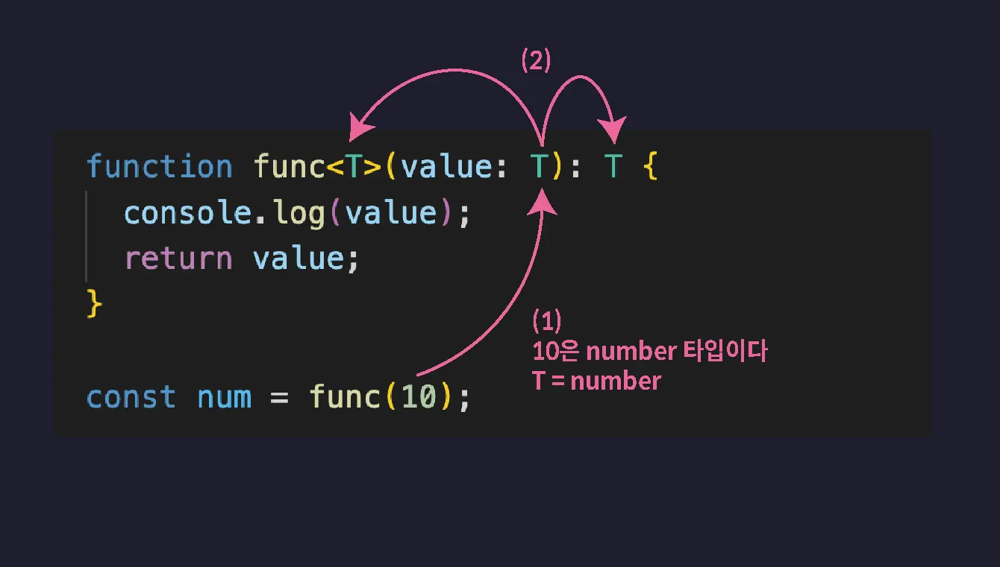

# 제네릭

- 함수나 인터페이스, 타입 별칭, 클래스 등을 다양한 타입과 함께 동작하도록 만들어 주는 타입스크립트의 기능

## 제네릭이 필요한 상황

- 인수로 Number 타입의 값을 전달하면 반환 타입이 Number가 되고, 인수로 String 타입의 값을 전달하면 반환값의 타입도 String 타입이 되도록 만들고 싶을 때 제네릭 사용

- 아래 num과 str의 타입은 any 타입이 됩니다. func 함수의 반환값 타입이 return 문을 기준으로 추론되었기 때문입니다.
- any 타입으로 추론되어 버렸기 때문에 toUpperCase 등의 String 타입의 메서드를 사용해도 타입스크립트가 오류를 감지하지 못합니다.

```typescript
function func(value: any) {
  return value;
}

let num = func(10);
// any 타입

let str = func("string");
// any 타입

num.toUpperCase(); // 정적 오류 발생하지 않음 -> 런타임 오류 발생
```

- 매개변수의 타입을 unknown 타입으로 정의하면 toUpperCase 같은 메서드 호출은 방지할 수 있습니다.
- 그러나 toFixed 같은 Number 타입의 메서드 호출도 함께 오류로 판단하게 됩니다.

```ts
function func(value: unknown) {
  return value;
}

let num = func(10);
// unknown 타입

let str = func("string");
// unknown 타입

num.toUpperCase(); // ❌정적 오류
num.toFixed(); // ❌오류(실제 숫자 10이 들어있음에도)
```

- 따라서 num에 10이 저장될 것이 분명한데도 이 값을 사용하려면 비효율적으로 타입 좁히기를 이용해야 합니다.

```ts
function func(value: unknown) {
  return value;
}

let num = func(10);
// unknown 타입

let str = func("string");
// unknown 타입

if (typeof num === "number") {
  num.toFixed(); // 이제 오류 없음
}
```

## 제네릭 함수

- 제네릭 함수: 두루두루 모든 타입의 값을 다 적용할 수 있는 그런 범용적인 함수
- 함수 이름 뒤에 꺽쇠를 열고 타입을 담는 변수인 타입 변수 T를 선언합니다.
  <br/>그리고 매개변수와 반환값의 타입을 이 타입변수 T로 설정합니다.

- T에 어떤 타입이 할당될 지는 함수가 호출될 때 결정됩니다.
- 제네릭 함수를 호출할 때 타입 변수에 할당할 타입을 직접 명시하는 것도 가능합니다.
- 타입스크립트는 타입을 추론할 때 항상 일반적이고 좀 더 범용적인 타입으로 추론합니다.
  <br/>때문에 타입 변수에 할당하고 싶은 특정 타입이 존재한다면 함수 호출과 함께 꺽쇠를 열고 직접 명시해주는게 좋습니다.
  - 아래 코드에서 타입 변수에 할당할 타입을 튜플 타입으로 설정하지 않았다면 T가 number[] 타입으로 추론 되었을 것 입니다.

```ts
function func<T>(value: T): T {
  return value;
}

// 매개변수 T가 number 타입으로 추론 -> 반환값 T도 number 타입
let num = func(10);

// T에 [number, number, number] 튜플 타입 명시적 할당
let arr = func<[number, number, number]>([1, 2, 3]);
/*
1. T에 [Number, Number, Number] 튜플 타입이 할당됨
2. 매개변수 value와 반환값 타입이 모두 튜플 타입이 됨
*/
```



## 타입 변수 응용하기

### 사례1

- 2개의 타입 변수가 필요한 상황

```ts
function swap<T, U>(a: T, b: U) {
  return [a, b];
}

const [a, b] = swap("1", 2);
```

### 사례2

- 다양한 배열 타입을 인수로 받는 제네릭 함수

```ts
function returnFirstValue<T>(data: T[]) {
  return data[0];
}

// number -> 함수 반환값 타입 Number 타입
let num = returnFirstValue([0, 1, 2]);

// number | string -> 함수 반환값 타입 number | string 타입
let str = returnFirstValue([1, "hello", "mynameis"]);
```

### 사례3

- 만약 반환값의 타입을 배열 첫번째 요소의 타입이 되도록 하려면 튜플 타입과 rest parameter를 이용하면 됩니다.
- 매개변수 타입을 정의할 때 튜플 타입을 이용해 첫번째 요소의 타입은 T,
  <br/>나머지 요소의 타입은 …unknown[] 으로 길이도 타입도 상관 없도록 정의합니다.
- 함수를 호출하고 [1, “hello”, “mynameis”] 같은 배열 타입의 값을 인수로 전달하면
  <br/>T는 첫번째 요소의 타입인 Number 타입이 됩니다. 따라서 함수 반환값 타입 또한 Number 타입이 됩니다.

```ts
function returnFirstValue<T>(data: [T, ...unknown[]]) {
  return data[0];
}

let str = returnFirstValue([1, "hello", "mynameis"]);
```

### 사례4

- extends를 이용해 타입 변수를 제한. 타입 변수를 제한할 때에는 확장(extends)을 이용합니다.
  <br/>타입 변수를 제한한다는 것은 인수로 전달할 수 있는 값의 범위에 제한을 두는 것을 의미합니다.

```ts
// 타입 변수를 적어도 length 프로퍼티를 갖는 객체 타입으로 제한한 예시
function getLength<T extends { length: number }>(data: T) {
  return data.length;
}

getLength("123"); // ✅

getLength([1, 2, 3]); // ✅

getLength({ length: 1 }); // ✅

getLength(undefined); // ❌

getLength(null); // ❌
```

- `T extends { length : number }` 라고 정의하면 T는 이제 `{ length : number }`객체 타입의 서브 타입이 됩니다.
  <br/>T는 무조건 Number 타입의 프로퍼티 length 를 가지고 있는 타입이 되어야 한다는 것 입니다.
  - 1번 호출은 인수로 length 프로퍼티가 존재하는 String 타입의 값을 전달 했으므로 허용됩니다.
  - 2번 호출은 인수로 length 프로퍼티가 존재하는 Number[] 타입의 값을 전달 했으므로 허용됩니다.
  - 3번 호출은 인수로 length 프로퍼티가 존재하는 객체 타입의 값을 전달 했으므로 허용됩니다.
  - 4번 호출은 인수로 undefined을 전달했으므로 오류가 발생합니다.
  - 5번 호출은 인수로 null을 전달했으므로 오류가 발생합니다.

## map, forEach 메서드 타입 정의하기

### map 메서드 타입 정의하기

- map 메서드를 직접 일반 함수로 만들고 타입도 정의해봄

```ts
function map(arr: unknown[], callback: (item: unknown) => unknown): unknown[] {}
```

- 메서드를 적용할 배열을 매개변수 arr로 받고, 콜백 함수를 매개변수 callback으로 받습니다.
- map 메서드는 모든 타입의 배열에 적용할 수 있기 때문에 arr의 타입은 unknown[]으로 정의합니다.
- callback의 타입은 배열 요소 하나를 매개변수로 받아 특정 값을 반환하는 함수로 정의합니다. 함수 타입 표현식을 이용했습니다.
- 마지막으로 map 메서드 반환값의 타입은 배열 타입으로 정의합니다.
- 다음으로는 이 함수에 타입 변수를 선언하여 제네릭 함수로 만듭니다. 모든 unknown 타입을 타입 변수 T로 대체합니다.

```ts
function map<T>(arr: T[], callback: (item: T) => T): T[] {}
```

```ts
const arr = [1, 2, 3];

function map<T>(arr: T[], callback: (item: T) => T): T[] {
  let result = [];
  for (let i = 0; i < arr.length; i++) {
    result.push(callback(arr[i]));
  }
  return result;
}

map(arr, (it) => it * 2); // number[] 타입의 배열을 반환 // 결과 : [2, 4, 6]

map(arr, (it) => it.toString()); // ❌
```

- 콜백함수가 모든 배열 요소를 String 타입으로 변환하도록 수정하면 오류가 발생합니다.
- 첫번째 인수로 arr을 전달했을 때 타입 변수 T에는 number 타입이 할당되었기 때문에
  <br/>콜백 함수의 반환값 타입도 number 타입이 되어야 하기 때문입니다.

- 그런데 map 메서드는 원본 배열 타입과 다른 타입의 배열로도 변환할 수 있어야 합니다.
- 원본 배열의 타입과 새롭게 반환하는 배열의 타입을 다르게 설정 -> 타입 변수 2개 선언

```ts
const arr = [1, 2, 3];

function map<T, U>(arr: T[], callback: (item: T) => U): U[] {
  (...)
}

map(arr, (it) => it.toString()); // string[] 타입의 배열을 반환 // 결과 : ["1", "2", "3"]
```

### forEach 메서드 타입 정의하기

- forEach 메서드: 배열의 모든 요소에 콜백함수를 한번씩 수행

```ts
function forEach<T>(arr: T[], callback: (item: T) => void) {
  for (let i = 0; i < arr.length; i++) {
    callback(arr[i]);
  }
}
```

- 첫번째 매개변수 arr에는 순회 대상 배열을 제공받고
- 두번째 매개변수 callback에는 모든 배열 요소에 수행할 함수를 제공 받습니다.
- 이때 아까 Map 메서드의 타입 정의와는 달리 forEach 메서드는 반환값이 없는 메서드이므로 콜백 함수의 반환값 타입을 void로 정의합니다.

## 제네릭 인터페이스

- 객체의 타입을 제네릭 인터페이스로 정의
- 주의해야 할 점: 제네릭 인터페이스는 제네릭 함수와는 달리 변수의 타입으로 정의할 때 반드시 꺽쇠와 함께 타입 변수에 할당할 타입을 명시해주어야 합니다.
- 그 이유는 제네릭 함수는 매개변수에 제공되는 인수 값으로 타입 변수의 타입을 추론할 수 있지만 인터페이스는 마땅히 추론할 수 있는 값이 없기 때문입니다.

```ts
// 제네릭 인터페이스 예시
interface KeyPair<K, V> {
  key: K;
  value: V;
}

// 변수 keyPair의 타입으로 KeyPair<string, number>를 정의 -> 값으로 해당 타입의 객체를 저장
let keyPair: KeyPair<string, number> = {
  key: "key",
  value: 0,
};

// 변수 keyPair2의 타입으로 KeyPair<boolean, string[]>를 정의 -> 값으로 해당 타입의 객체를 저장
let keyPair2: KeyPair<boolean, string[]> = {
  key: true,
  value: ["1"],
};
```

```ts
// 제네릭 함수 예시
function identity<T>(arg: T): T {
  return arg;
}

// 1. 타입 추론
// 인수가 문자열이므로 T를 string으로 알아서 판단합니다.
let output = identity("hello");

// 2. 타입 명시
// 복잡한 타입이거나 추론이 꼬일 때 직접 적어줍니다.
let output2 = identity<number>(123);
```

### 인덱스 시그니쳐와 함께 사용하기

- 제네릭 인터페이스는 인덱스 시그니쳐와 함께 사용하면 훨씬 더 유연한 객체 타입을 정의할 수 있습니다.

```ts
// 인터페이스로 객체 타입 V 정의
interface Map<V> {
  [key: string]: V;
}

let stringMap: Map<string> = {
  key: "value",
};

let booleanMap: Map<boolean> = {
  key: true,
};
```

## 제네릭 타입 별칭

- 타입 별칭에도 역시 제네릭을 적용할 수 있습니다.
- 제네릭 인터페이스와 마찬가지로 타입으로 정의될 때 반드시 타입 변수에 설정할 타입을 명시해 주어야 합니다.
- 학생만 할 수 있는 기능이 점점 많아진다고 가정하면 매번 기능을 만들기 위해 함수를 선언할 때 마다 조건문을 이용해 타입을 좁혀야 하기 때문에 매우 불편해 질 것 입니다. 게다가 타입을 좁히는 코드는 중복 코드가 될 것 입니다.
- 이럴 때 바로 제네릭 인터페이스를 이용하면 좋습니다.

```ts
type Map2<V> = {
  [key: string]: V;
};

let stringMap2: Map2<string> = {
  key: "string",
};
```

## 제네릭 인터페이스 활용 예

```ts
interface Student {
  type: "student";
  school: string;
}

interface Developer {
  type: "developer";
  skill: string;
}

interface User {
  name: string;
  profile: Student | Developer;
}

function goToSchool(user: User) {
  if (user.profile.type !== "student") {
    console.log("잘 못 오셨습니다");
    return;
  }

  const school = user.profile.school;
  console.log(`${school}로 등교 완료`);
}

const developerUser: User = {
  name: "이정환",
  profile: {
    type: "developer",
    skill: "typescript",
  },
};

const studentUser: User = {
  name: "홍길동",
  profile: {
    type: "student",
    school: "가톨릭대학교",
  },
};
```

- 다음과 같이 User 인터페이스를 제네릭 인터페이스로 업그레이드 합니다.
- 함수 내부에서 타입을 좁힐 필요가 없어지므로 코드가 훨씬 간결해집니다.

```ts
interface Student {
  type: "student";
  school: string;
}

interface Developer {
  type: "developer";
  skill: string;
}

interface User<T> {
  name: string;
  profile: T;
}

function goToSchool(user: User<Student>) {
  const school = user.profile.school;
  console.log(`${school}로 등교 완료`);
}

const developerUser: User<Developer> = {
  name: "이정환",
  profile: {
    type: "developer",
    skill: "TypeScript",
  },
};

const studentUser: User<Student> = {
  name: "홍길동",
  profile: {
    type: "student",
    school: "가톨릭대학교",
  },
};
```

## 제네릭 클래스

- 클래스는 생성자를 통해 타입 변수의 타입을 추론할 수 있기 때문에 생성자에 인수로 전달하는 값이 있을 경우
  <br/>타입 변수에 할당할 타입을 생략해도 됩니다.

```ts
class List<T> {
  constructor(private list: T[]) {}

  push(data: T) {
    this.list.push(data);
  }

  pop() {
    return this.list.pop();
  }

  print() {
    console.log(this.list);
  }
}

const numberList1 = new List([1, 2, 3]);
const stringList1 = new List(["1", "2"]);

// 타입변수의 타입을 직접 설정
const numberList2 = new List<number>([1, 2, 3]);
const stringList2 = new List<string>(["1", "2"]);
```

## 프로미스와 제네릭

- Promise는 제네릭 클래스로 구현되어 있습니다.
- 따라서 새로운 Promise를 생성할 때 타입 변수에 할당할 타입을 직접 설정해 주면 해당 타입이 바로 resolve 결과값의 타입이 됩니다.
- 아쉽게도 reject 함수에 인수로 전달하는 값 즉 실패의 결과값 타입은 정의할 수 없습니다. 그냥 unknown 타입으로 고정되어 있기 때문에 catch 메서드에서 사용하려면 타입 좁히기를 통해 안전하게 사용하는걸 권장합니다.

```ts
const promise = new Promise<number>((resolve, reject) => {
  setTimeout(() => {
    // 결과값 : 20
    resolve(20);
  }, 3000);
});

promise.then((response) => {
  // response는 number 타입
  console.log(response);
});

promise.catch((error) => {
  if (typeof error === "string") {
    console.log(error);
  }
});
```

- 어떤 함수가 Promise 객체를 반환한다면 함수의 반환값 타입을 위해 다음과 같이 할 수 있습니다.

```ts
function fetchPost() {
  return new Promise<Post>((resolve, reject) => {
    setTimeout(() => {
      resolve({
        id: 1,
        title: "게시글 제목",
        content: "게시글 본문",
      });
    }, 3000);
  });
}
```

- 또는 더 직관적으로 다음과 같이 반환값 타입을 직접 명시해도 됩니다.

```ts
function fetchPost(): Promise<Post> {
  return new Promise((resolve, reject) => {
    setTimeout(() => {
      resolve({
        id: 1,
        title: "게시글 제목",
        content: "게시글 본문",
      });
    }, 3000);
  });
}
```
