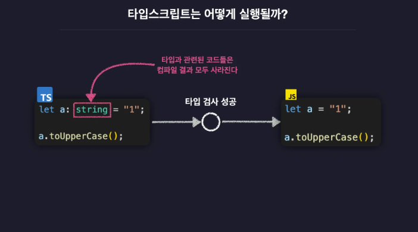
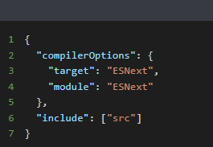

Node.js 가 등장하며 브라우저 말고 어디서나 자바스크립트를 사용 → 타입스크립트의 필요성 대두

## 타입 시스템

- 정적 타입 시스템: 코드 **실행전에** 모든 변수의 타입을 고정적으로 결정. C, Java
- 동적 타입 시스템
  - 코드를 실행하기 전에는 타입을 결정하지 않고 코드를 실행하고 나서 그때 그때 유동적으로 변수의 타입을 결정. Javascript, Python
  - 현재 변수에 담긴 값에 따라서 변수의 타입이 달라진다.
    → 변수 하나로 돌려가면서 여기저기 다 활용할 수 있다.
    → 타입이 달라도 코드가 실행되며 에러가 발생해 프로그램이 멈춘다.
  - 애초에 실행 전에 검사해 실행이 안되게 해야한다.

### 타입스크립트

- 정적 타입 시스템 + 동적 타입 시스템 = **점진적 타입 시스템**(Gradual Type System)
  - 동적 타입 시스템의 타입 안전 문제를 해결하면서도 정적 타입 시스템의 귀찮음도 동시에 해결
  - 변수의 타입을 **코드 실행 전에 결정**하고 타입 오류가 없는지 **프로그램 실행전에 검사**
  - 변수의 타입을 우리가 직접 **정의 하지 않아도** 변수에 담기는 **초기값을 기준으로 자동으로 타입 추론**

## 타입스크립트의 동작 원리

컴파일: 프로그래밍 언어 → 기계어(바이트코드) 변환

일반적 컴파일 과정
컴파일러가 JS코드를 먼저 AST로 변환하고, AST를 바이트 코드로 변환

```
JS → AST → 바이트코드 → 컴퓨터가 실행
      ↑
공백, 주석 등 코드 실행에 관계없는 요소 전부 제거 후 트리 형태의 자료구조에 코드를 쪼개어 저장
```

타입스크립트 컴파일 과정
타입스크립트 코드를 컴파일하면 JS코드가 만들어진다. (타입 관련 코드들은 컴파일 결과 모두 사라진다.)
이렇게 타입검사를 통과한(타입 오류가 발생할 가능성이 낮은 안전한) 자바스크립트 코드를 Node.js나 웹브라우저로 실행하면 위와 동일한 과정을 거쳐 컴파일 되어 실행

```
TS → AST → 타입 검사 → JS (컴파일 종료)
               ↑
     코드 상에 타입 오류가 없는지 검사
     - has오류 컴파일 중단
```




## 세팅

새로운 타입스크립트 프로젝트(패키지) 시작

1. `npm init` `pnpm init` 패키지 초기화 → package.json 생성

- `npm init -y` `pnpm init -y` 기본값으로 패키지 자동 초기화

2. `npm i @types/node` `pnpm add -D typescript @types/node` Node.js 내장 기능들의 타입 선언, 정보를 담고있는 @types/node 패키지 설치
   → package.json > dependencies 에 설치
   → @types/node가 성공적으로 설치되면 패키지의 node_modules 폴더에 @types 폴더가 생성
   → Node.js가 기본적으로 제공하는 기능(내장 함수 등)들에 대한 타입이 선언되어 있는 여러개의 폴더와 파일들이 존재


3. `npm i -g typescript` (window -오류 발생시 관리자 권한으로 실행)
   `sudo npm i -g typescript` (mac -macOS일 경우 sudo(관리자 권한) 옵션을 사용하므로 PC 패스워드를 물어볼 수 있다.)
   `pnpm add -D typescript` 로 전역이 아닌 로컬에 설치 권장
   타입스크립트 패키지 설치(**타입스크립트 컴파일러(TSC) 설치**)
   TSC는 npm의 TypeScript 패키지에 동봉되어 있다.

- -g(global 옵션)
  -g 없이 설치하면 SECTION1이라는 패키지 안에 설치
  -g 로 설치하면 컴퓨터 모든 곳에서 사용
  npm이나 pnpm에서 -g 옵션은 패키지를 특정 프로젝트 폴더가 아닌 **시스템의 공통 디렉토리**에 설치하겠다는 의미입니다.
  - 지역 설치 (Local): 현재 작업 중인 **프로젝트 폴더의 node_modules 안에 설치**됩니다.
    해당 프로젝트 내부에서만 코드로 불러와 사용할 수 있습니다.
  - 전역 설치 (Global): 운영체제(OS) 환경 변수에 등록된 공통 경로에 설치됩니다. 덕분에 터미널(CMD, 터미널 등) 어디에서든 해당 패키지의 명령어(예: tsc)를 바로 입력해 실행할 수 있습니다.
    TypeScript의 경우, 코드를 작성할 때 쓰는 도구라기보다 작성한 코드를 자바스크립트로 변환해주는 도구(컴파일러)로 활용하기 때문에 보통 컴퓨터 어디서나 쓸 수 있도록 전역으로 설치하는 편입니다.
    하지만 버전 관리를 위해서는 -D로 프로젝트 각각 설치하는 것 권장.
    한 번만 설치: TypeScript를 -g로 설치했다면, A라는 프로젝트를 하든 B라는 프로젝트를 하든 터미널에 tsc 명령어를 입력해 바로 사용할 수 있습니다.

- pnpm
  pnpm은 한 번 설치된 패키지를 Content-addressable store라는 공통 저장소에 딱 하나만 보관합니다. 따라서 다른 프로젝트에서 같은 버전의 패키지를 설치하려고 하면, 인터넷에서 다시 받는 게 아니라 이미 하드에 있는 파일을 찾아냅니다.
  **하지만 논리적 연결(Link)은 프로젝트마다 해줘야 합니다**
  컴퓨터 안에 파일이 있더라도, **현재 프로젝트의 package.json에 등록**되어 있지 않으면 그 프로젝트는 해당 패키지를 인식하지 못합니다.
  - **이유:** 프로젝트마다 사용하는 패키지 버전이 다를 수 있기 때문입니다.
  - **작동 방식:** `pnpm add <패키지명>`을 입력하면, pnpm은 하드디스크 저장소에 있는 파일을 현재 프로젝트 폴더로 아주 빠르게 연결(Hard link)만 해줍니다. 새로 다운로드하지 않으니 설치 속도가 엄청나게 빠르죠.

- 전역 설치(`g`) vs 프로젝트 설치(`pnpm add`)
  프로젝트 내부 설치(지역 설치)가 훨씬 더 권장되는 방식
  프로젝트와 상관없이 내 컴퓨터에서 항상 쓰는 유틸리티(예: vercel-cli, pnpm 자체 등)만 -g로 설치합니다.

  ### 전역 설치
  - **장점:** 한 번만 설치하면 어떤 폴더에서든 tsc 같은 명령어를 바로 쓸 수 있어 편리합니다.
  - **단점:** 프로젝트마다 필요한 버전을 다르게 관리할 수 없습니다.
    예를 들어, 1년 전 프로젝트는 TypeScript 4버전이 필요한데 전역 설치된 버전이 5버전으로 업데이트되었다면 코드가 깨질 수 있습니다.

  ### 프로젝트 설치 (지역)
  - **장점:** package.json에 기록되므로, 협업하는 동료가 프로젝트를 내려받아 pnpm install만 치면 나와 똑같은 환경(버전)이 그대로 구성됩니다.
  - **단점:** 터미널에서 명령어를 칠 때 pnpm tsc처럼 앞에 pnpm을 붙이거나 npx를 사용해야 합니다.

- **-D와 -g를 모두 사용하는 이유**
  프로젝트에는 이미 -D로 설치되어 있는데 전역에도 설치하는 이유는 보통 **편의성** 때문입니다.
  - **로컬 (-D)**: package.json에 기록되어 팀원들과 환경을 맞추고 배포할 때 사용합니다. (필수)
  - **전역 (-g)**: 터미널에서 pnpx나 pnpm을 앞에 붙이지 않고 그냥 tsc라고만 쳐서 명령어를 실행하고 싶을 때 사용합니다. (선택적 편의)
  ### 주의할 점 (버전 불일치)
  - 내 컴퓨터 전역(Global)에는 **TypeScript 5.0**이 깔려 있는데,
  - 현재 프로젝트(Local)의 package.json에는 **TypeScript 4.8**이 적혀 있는 경우입니다.
    이때 그냥 tsc라고 입력하면 전역 버전인 5.0이 실행되어 예상치 못한 에러가 날 수 있습니다.
    그래서 웹 개발자들은 전역에 설치했더라도 프로젝트 내부에서는 **pnpx tsc** 또는 **pnpm tsc**를 사용하는 습관을 가집니다. 이렇게 하면 전역 버전이 아닌, package.json에 명시된 버전을 우선해서 실행해주기 때문입니다.

## **tsc로 컴파일하고 실행하기**

- tsc, node
  - 배포(빌드)할 때는 tsc 사용
  - `tsc src/index.ts`→`src/index.js` 생성: ts 코드를 js 파일로 변환(컴파일)만. 실행은 안하고.
  - `node src/index.js` 컴파일 된 자바스크립트 코드는 node를 이용해 실행
    
- **tsx(TypeScript Execute)**명령어 한번으로 타입스크립트 코드를 바로 실행
  - 개발중에는 tsx 사용
  - `npm i -g tsx`(window)
    `sudo npm i -g tsx` (mac)
  - `tsx src/index.ts` (전역 타입스크립트 사용할때)
    `pnpm tsx src/index.ts`→ 자바스크립트 파일을 생성하지 않고 한번에 타입스크립트 파일을 실행

## 컴파일러 옵션

`tsc --init`: 내 컴퓨터 전역에 typescript가 깔려 있을 때만 작동합니다.
`pnpm tsc --init`: 현재 프로젝트 폴더(node_modules)에 이미 typescript가 설치되어 있을 때 사용합니다.
`pnpx tsc --init`: 설치 여부와 상관없이 실행하고 싶을 때 사용합니다.

패키지 루트 폴더 > tsconfig.json
<br/>참고) 오류가 바로 사라지지 않으면 ctrl+shift+p > restart > TS 다시 시작


- include 옵션
  tsc에게 컴파일 할 타입스크립트 파일의 범위와 위치를 알려주는 옵션.
  이 옵션을 이용하면 파일이 아주 많을 때 일일히 tsc 명령어와 함께 파일 명을 입력하지 않아도 됩니다.
- compilerOptions > target 옵션
  컴파일 결과 생성되는 자바스크립트 코드의 버전을 설정
  ESNext(최신 자바스크립트 버전)
- compilerOptions > module 옵션
  변환되는 자바스크립트 코드의 모듈 시스템을 설정
  - `"module": "nodenext”` 권장
    | **구분** | **module: "esnext"** | **module: "nodenext"** |
    | --- | --- | --- |
    | **철학** | "최신 표준이 제일 좋아" | "Node.js 엔진이 시키는 대로 할게" |
    | **장점** | 문법이 자유롭고 최신임 | **실행 시 에러가 날 확률이 가장 적음** |
    | **적합한 곳** | 프론트엔드 빌드 도구 사용 시 | **Node.js 서버/스터디/스크립트 실행** |
  1. Node.js의 두 얼굴 (ESM vs CommonJS)

  Node.js는 전통적인 `require` 방식(CommonJS)과 최신 `import` 방식(ESM)이 공존합니다.
  - **esnext**: "최신 표준 자바스크립트 문법으로 변환해줄게"라고만 약속합니다. 하지만 정작 Node.js가 이 파일을 어떻게 실행해야 할지(확장자 처리, 패키지 타입 등)에 대한 세세한 가이드는 부족할 수 있습니다.
  - **nodenext**: "최신 Node.js의 모듈 해석 규칙을 100% 따를게"라는 뜻입니다. `package.json`의 `"type": "module"` 설정에 따라 타입스크립트가 알아서 최적의 자바스크립트 코드를 생성해 줍니다.
  2. 파일 확장자의 엄격함

  nodenext를 사용하면 타입스크립트가 실제 Node.js처럼 까다롭게 굽니다.
  - 파일을 불러올 때 `import { ... } from "./utils.js"` 처럼 .js **확장자를 붙이도록 강제**하거나 권장합니다.
  - 이는 나중에 실제 배포 환경이나 브라우저 환경으로 넘어갔을 때 경로 에러를 미리 방지하는 효과가 있습니다. esnext는 이런 부분에서 상대적으로 느슨합니다.
  3. 라이브러리 호환성

  최근 많은 npm 패키지들이 Node.js의 최신 ESM 표준을 따르고 있습니다. nodenext 설정을 사용하면 이러한 최신 패키지들의 타입을 가장 정확하게 인식하고 연결해 줍니다.



- compilerOptions > outDir 옵션
  컴파일 결과 생성할 자바스크립트 코드의 위치를 결정
- compilerOptions > strict 옵션
  타입스크립트 컴파일러의 타입 검사 엄격함 수준
  타입스크립트에서는 특별히 **매개변수의 타입**은 프로그래머가 직접 지정하도록 권장 → 타입스크립트는 함수 매개변수의 타입을 자동 추론할 수 없기 때문
  보통은 true로 설정. 그런데 JS를 TS로 마이그레이션 할때는 false로 하기도.
- compilerOptions > strictNullChecks(엄격한 null 검사) 옵션
  타입스크립트에서 null 값을 null 타입 이외의 타입의 변수에 할당하는 것을 금지할지 허락할지 결정
  기본값은 true이며 이 경우 null 타입이 아닌 변수에는 null 값을 할당할 수 없도록 제한
  strict 옵션의 하위 옵션. strict 옵션이 true이면 자동으로 true로 설정되며 false이면 false로 설정
- compilerOptions > moduleDetection 옵션
  moduleDetection 옵션을 force로 설정할 경우 자동으로 모든 타입스크립트 파일이 **로컬 모듈(독립 모듈)**로 취급
  타입스크립트의 모든 파일은 기본적으로 **전역 파일**로 취급 → 따라서 a.ts와 b.ts 두 타입스크립트 파일을 만들고 각각 안에 동일한 이름의 변수를 선언하면 오류가 발생 → 이럴 때에는 각 파일에 \*\*모듈 시스템 키워드(module을 ESNext로 설정 → export, import, CommonJS → exports)를 최소 하나 이상 사용해 해당 파일을 전역 모듈이 아닌 로컬(독립) 모듈로 취급되도록 만들거나, 이를 자동화 하는 moduleDetection 옵션 사용
- compilerOptions > isolatedModules 옵션
  이 옵션은 이름처럼 파일을 고립시키지만, 목적은 "다른 도구와의 호환성"에 있습니다.
  - **동작**: "이 파일 하나만 떼어서 변환(Transpile)해도 에러가 안 날까?"를 검사합니다.
  - **목적**: esbuild나 swc 같은 도구는 다른 파일의 정보를 전혀 모른 채 파일 하나씩만 처리합니다. 이때 파일 간의 의존성이 너무 복잡하면 변환 과정에서 에러가 날 수 있는데, 이를 미리 방지하기 위해 **제약 사항을 거는 것**입니다.

| **구분**          | **moduleDetection: "force"**             | **isolatedModules: true**                          |
| ----------------- | ---------------------------------------- | -------------------------------------------------- |
| **핵심 역할**     | 전역 스크립트를 **강제로 모듈로 전환**함 | 각 파일이 **단독으로 컴파일 가능한지** 검사함      |
| **해결하는 문제** | 파일 간 변수 이름 충돌                   | 단일 파일 변환 도구(Vite 등) 사용 시 발생하는 에러 |

- 다음으로는 node를 이용해 파일을 실행하기 위해 package.json의 type을 다음과 같이 module로 설정
  type을 module로 설정하는 이유는 앞서 tsconfig.json의 module 옵션을 ‘ESNext’로 설정했기 때문에 자동으로 타입스크립트 코드가 ES 모듈 시스템을 사용하는 자바스크립트 코드로 컴파일 되기 때문. → 따라서 Node.js가 ES 모듈 시스템을 사용하도록 type : “module” 옵션을 package.json에 설정
