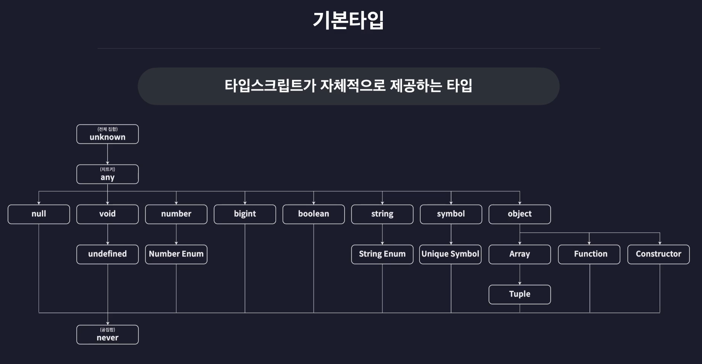

# 타입스크립트 기본

**타입 주석(type annotation)**: 변수의 이름 뒤에 콜론(:)으로 변수의 타입을 정의하는 문법

## 기본 타입(Basic Types, 내장 타입)

타입스크립트가 제공하는 기본 타입들을 계층에 따라 분류한 ‘타입 계층도(type tree)’



### 원시 타입

* number 타입
  * 단순 정수 뿐만 아니라 소수, 음수, Infinity, **NaN**등의 특수한 숫자들도 포함
* null 타입
  * 자바스크립트에서는 아직 값이 정해지지 않은 상태에서는 변수에 null 을 임시로 넣어두곤 했다.
  * 그러나 타입스크립트에서는 다른 타입의 변수에 null을 넣으면 오류 발생
  * 만약 타입스크립트에서 null 값을 변수의 임시값으로 활용하고 싶을 때 → \
    tsconfig.json > compilerOptions > strictNullChecks(엄격한 null 검사) 옵션 false 설정

### 리터럴 타입

string, number 처럼 범용적으로 많은 값을 포함하는 타입이 아닌 딱 하나의 값만 포함하는 타입. \
값 자체로 만들어진 타입 변수의 타입을 숫자 10으로 설정. numA에는 10 이외의 값을 저장할 수 없게 됩니다. \
숫자 값 뿐만 아니라 문자열이나 불리언 타입의 값도 모두 리터럴 타입으로 만들 수 있습니다.

```tsx
let numA: 10 = 10;

let strA: "hello" = "hello";
let boolA: true = true;
let boolB: false = false;
```

### 배열 타입

* `:배열요소타입[]` 또는 제네릭 `:Array<배열요소타입>`

```tsx
let strArr: string[] = ["hello", "im", "winterlood"];
let boolArr: Array<boolean> = [true, false, true];
```

* **유니온(Union) 타입**\
  여러 타입중 하나를 만족하는 타입을 정의하는 문법. 다양한 타입의 배열 요소를 갖는 배열 타입

```tsx
let multiArr: (number | string)[] = [1, "hello"];
```

* 다차원 배열 타입

```tsx
let doubleArr: number[][] = [
  [1, 2, 3],
  [4, 5],
];
```

### 튜플(Tuple) 타입

**길이**와 타입이 고정된 배열. 튜플은 결국 **배열**입니다. \
배열 메서드인 push나 pop을 이용해 고정된 길이를 무시하고 요소를 추가하거나 삭제할 수 있으므로 주의 \
(길이를 2로 정해도 push, pop 가능)

```tsx
// 길이가 2로 고정된 2개의 number 타입 요소를 갖는 튜플(배열) 타입
let tup1: [number, number] = [1, 2];

// 다양한 타입을 갖는 튜플 타입
let tup2: [number, string, boolean] = [1, "hello", true];
```


#### `number[][]` vs `[number][]`

```tsx
let doubleArr: number[][] = [
  [1, 2, 3],
  [4, 5],
];

// [number][]는 요소가 딱 하나인 튜플([number])이 여러 개 모인 배열
let TupleArr: [number][] = [[1], [5], [10]];
```

### 객체 타입

* object로 정의
  * 점 표기법으로 객체의 특정 프로퍼티에 접근하려고 하면 오류가 발생 → 타입스크립트의 object 타입은 단순히 값이 객체임을 표현하는 것 외에는 아무런 정보도 제공하지 않는 타입이기 때문. 따라서 이 타입은 객체의 프로퍼티에 대한 정보를 전혀 가지고 있지 않습니다. 그렇기 때문에 프로퍼티에 접근하려고 하면 오류가 발생합니다.
*   **객체 리터럴 타입** \
    중괄호를 열고 객체가 갖는 프로퍼티를 직접 나열해 만드는 타입

    ```tsx
    let user: {
      id: number;
      name: string;
    } = {
      id: 1,
      name: "이정환",
    };

    user.id;
    ```
* **구조적 타입 시스템(=property based type system; ↔명목적 타입 시스템)** \
  타입스크립트는 기존의 정적 타입 시스템을 따르는 언어인 C나 Java와는 달리 **객체의 타입을 정의할 때 프로퍼티를 기준으로** 객체 구조를 정의하듯이 타입을 정의한다. 객체의 구조를 결정하는 것은 프로퍼티입니다. 따라서 타입스크립트는 **이 객체에 어떤 프로퍼티들이 있어야 하는지 정의하는 방식으로 객체의 타입을 정의**합니다.
* 옵셔널 프로퍼티 ?
* Readonly property \
  특정 프로퍼티를 읽기 전용으로 만들고 싶다면 프로퍼티의 이름 앞에 readonly 키워드 → 의도치 않은 프로퍼티의 수정 방지

```tsx
  let user: {
    id?: number;
    readonly name: string; // name은 이제 Readonly 프로퍼티
  } = {
    id: 1,
    name: "이정환",
  };

  user.name = "dskfd"; // 프로퍼티의 값을 수정하려고 하면 오류 발생
```

### 타입 별칭(Type Alias)

`type 타입_이름 = 타입`

* 동일한 스코프에 동일한 이름의 타입 별칭을 선언하는 것은 불가능. \
  스코프가 다르다면 중복된 이름으로 여러개의 별칭을 선언해도 상관 없습니다
* 타입 별칭 또한 타입 관련 문법이기 때문에 컴파일 후에 사라집니다.

```tsx
// 타입 별칭; 타입 이름 User 그리고 타입으로는 여러개의 프로퍼티가 있는 객체 타입
type User = {
  id: number;
  name: string;
  nickname: string;
  birth: string;
  bio: string;
  location: string;
};

let user: User = {
  id: 1,
  name: "이정환",
  nickname: "winterlood",
  birth: "1997.01.07",
  bio: "안녕하세요",
  location: "부천시",
};

// test 함수 내부에서는 User가 string 타입, test 함수 바깥에서는 User가 객체 타입이 됩니다.
function test() {
  type User = string;
}
```

**타입스크립트 스코프**

타입스크립트의 타입 선언(`type`, `interface`, `enum`)은 기본적으로 `let`, `const`와 같은 '**블록 스코프**'. \
타입스크립트에서 `type`이나 `interface`는 선언된 위치에 따라 스코프가 결정됩니다.

* **전역 스코프:** 파일의 가장 바깥이나 전역 모듈에 선언하면 어디서든 접근 가능합니다.
* **함수 스코프:** 특정 함수 내부에 선언하면 그 함수 안에서만 유효합니다.
* **블록 스코프:** if 문이나 for 문 같은 중괄호 { } 내부에 선언하면 그 블록 안에서만 유효합니다.

### 인덱스 시그니처(Index Signature)

<mark style="background-color:yellow;">**`[key : string] : string`**</mark>  key가 string 타입, value가 string 타입\
한가지 주의할 점은 인덱스 시그니쳐를 사용하면서 동시에 추가적인 프로퍼티를 또 정의할 때에는\
인덱스 시그니쳐의 value 타입과 직접 추가한 프로퍼티의 value 타입이 호환되거나 일치해야 합니다.

```tsx
type CountryCodes = {
  [key: string]: string;
};

let countryCodes: CountryCodes = {
  Korea: "ko",
  UnitedState: "us",
  UnitedKingdom: "uk",
  // (... 약 100개의 국가)
  Brazil: "bz",
};

let countryCodesTry: CountryCodes = {};
// 위는 규칙을 위반하지 않으면 모든 객체를 허용하기 때문에 빈 객체는 오류가 발생하지 않는다.
// (빈객체는 위반한 property가 없다)

// 위 빈객체 문제를 막거나 반드시 포함해야 하는 프로퍼티가 있다면 직접 같이 명시
type CountryCodes = {
  [key: string]: string;
  Korea: string;
};

// 서로 호환되지 않는 타입으로 설정하면 오류 발생
type CountryCodes = {
  [key: string]: string;
  Korea: number; // 오류!
};
```

### 열거형(Enum) 타입

여러가지 값들에 각각 이름을 부여해 열거해두고 사용하는 타입 \
enum은 컴파일될 때 다른 타입들 처럼 사라지지 않고 **자바스크립트 객체로 변환**됩니다. \
&#xNAN;**→ 때문에 값으로 사용할 수 있는 것** \
유저의 권한, 역할과 같은 값을 숫자로 표기할 때 enum을 이용하면 안전하고 직관적으로 관리할 수 있습니다.

```tsx
  enum Role {
    ADMIN = 0,
    USER = 1,
    GUEST = 2,
  }

  // user1.role 에는 0이 user2.role에는 1이 user3.role에는 2가 할당됩니다.
  const user1 = {
    name: "이정환",
    role: Role.ADMIN, //0  enum을 프로퍼티의 값으로 사용할 수 있습니다.
  };

  const user2 = {
    name: "홍길동",
    role: Role.USER, //1
  };

  const user3 = {
    name: "아무개",
    role: Role.GUEST, //2
```

참고로 enum 멤버에 숫자 값을 직접 할당하지 않아도 0 부터 1씩 늘어나는 값으로 자동 할당됩니다.

```tsx
// 자동 할당되는 값은 기본적으로 0부터 시작합니다.
enum Role {
  ADMIN, // 0 할당(자동)
  USER, // 1 할당(자동)
  GUEST, // 2 할당(자동)
}

const user1 = {
  name: "이정환",
  role: Role.ADMIN, // 0
};

const user2 = {
  name: "홍길동",
  role: Role.USER, // 1
};

const user3 = {
  name: "아무개",
  role: Role.GUEST, // 2
};

// 시작하는 위치에 값을 직접 할당해주면 자동으로 그 아래의 멤버들은 1씩 증가된 값으로 할당
enum Role {
  ADMIN = 10, // 10 할당
  USER, // 11 할당(자동)
  GUEST, // 12 할당(자동)
}

const user1 = {
  name: "이정환",
  role: Role.ADMIN, // 10
};

const user2 = {
  name: "홍길동",
  role: Role.USER, // 11
};

const user3 = {
  name: "아무개",
  role: Role.GUEST, // 12
};

// 중간에 할당하면 아래와 같다.
enum Role {
  ADMIN, // 0 할당(자동)
  USER = 10, // 10 할당
  GUEST, // 11 할당(자동)
}

const user1 = {
  name: "이정환",
  role: Role.ADMIN, // 0
};

const user2 = {
  name: "홍길동",
  role: Role.USER, // 10
};

const user3 = {
  name: "아무개",
  role: Role.GUEST, // 11
};
```

값이 모두 숫자인 enum을 숫자형 enum 혹은 숫자 열거형 타입이라고 부릅니다.

\
문자열 열거형 (문자열 enum)

```tsx
enum Role {
  ADMIN,
  USER,
  GUEST,
}

enum Language {
  korean = "ko",
  english = "en",
}

const user1 = {
  name: "이정환",
  role: Role.ADMIN, // 0
  language: Language.korean, // "ko"
};
```

[typescript enum을 사용하지 않는게 좋은 이유를 tree-shaking의 관점에서 소개합니다.](https://engineering.linecorp.com/ko/blog/typescript-enum-tree-shaking)

### any 타입

**타입 검사를 받지 않는** 특수한 치트키 타입. 정말 어쩔 수 없는 경우를 제외하고는 any 타입을 사용하지 않는것을 강력히 권장합니다.

타입스크립트에서는 변수를 초기화 하는 값을 기준으로 변수의 타입을 추론하기 때문에 아래와 같이 하면 오류가 발생합니다. 이런 경우 any 타입 사용

```tsx
let anyVar = 10;
anyVar = "hello"; // 오류 발생!
```

any 타입은 어떠한 타입 검사도 받지 않기 때문에 아무 타입의 값이나 범용적으로 담아 사용할 수 있고 또 다양한 타입의 메서드도 마음대로 호출해서 사용해도 런타임 전에는 오류가 나지 않습니다.

```tsx
let anyVar: any = 10;
anyVar = "hello";

anyVar = true;
anyVar = {};

anyVar.toUpperCase();
anyVar.toFixed();
anyVar.a;
```

**any 타입의 값은** 어떤 타입으로 정의된 변수던 문제 없이 **다 할당**할 수 있습니다. 따라서 다음과 같이 number 타입의 변수 num에 any 타입의 값 anyVar를 할당해도 문제가 발생하지 않습니다.

```tsx
let anyVar: any = 10;
anyVar = "hello";

let num: number = 10;
**num = anyVar;**

```

### unknown 타입

any 타입과 비슷하지만 보다 안전한 타입 특정 변수가 당장 어떤 값을 받게 될 지 모른다면 any 타입으로 정의하는 것 보단 unknown 타입을 이용

변수의 타입으로 정의되면 모든 값을 할당받을 수 있게 되지만, 반대로 unknown 타입의 값은 그 어떤 타입의 변수에도 할당할 수 없고, 모든 연산에 참가할 수 없게 됩니다. 쉽게 정리하면 **오직 값을 저장**하는 행위밖에 할 수 없게 됩니다.

**unknown 타입의 변수**는 **어떤 타입의 값이든 다 저장할 수 있습니다.**

```tsx
let unknownVar: unknown;

unknownVar = "";
unknownVar = 1;
unknownVar = () => {};
```

그러나 반대로는 안됩니다. **unknown 타입의 값**은 **어떤 타입의 변수에도 저장할 수 없습니다.**

```tsx
let num: number = 10;
(...)

let unknownVar: unknown;
unknownVar = "";
unknownVar = 1;
unknownVar = () => {};

num = unknownVar; // 오류 !
```

또 unknown 타입의 값은 어떤 **연산**에도 참여할 수 없으며, 어떤 **메서드**도 **사용할 수 없습니다**.

```tsx
let unknownVar: unknown;
(...)

unknownVar * 2 // 오류!
```

unknown 타입의 값을 number 타입의 값처럼 취급하고 곱셈 연산을 수행하게 하고 싶다면 다음과 같이 조건문을 이용해 이 값이 number 타입의 값임을 보장해줘야 합니다.

**타입 좁히기**: 타입스크립트에서는 조건문을 이용해 특정 값이 특정 타입임을 보장할 수 있게 되면 해당 값의 타입이 자동으로 바뀝니다.

```tsx
if (typeof unknownVar === "number") {
  // 이 조건이 참이된다면 unknownVar는 number 타입으로 볼 수 있음
  unknownVar * 2;
}
```

### void 타입

아무런 값도 없음을 의미하는 타입 아무런 값도 반환하지 않는 함수의 반환값 타입을 정의할 때 사용

```tsx
function func2(): void {
  console.log("hello");
}
```

물론 변수의 타입으로도 당연히 void 타입을 지정할 수 있습니다. 그러나 void 타입의 변수에는 **undefined 이외의 다른 타입의 값은 담을 수 없습니다.** 그 이유는 void 타입이 undefined 타입을 포함하는 타입이기 때문

```tsx
let a: void;
a = undefined;
```

그런데 만약 tsconfig.json에 엄격한 null 검사(strictNullChecks) 옵션을 해제(False)로 설정하면 특별히 이때에는 void 타입의 변수에 null 값도 담을 수 있게 됩니다.

```tsx
// "strictNullChecks: false" 일 경우
let a: void;
a = undefined;
a = null;
```

### never 타입

불가능을 의미하는 타입

함수가 어떠한 값도 반환할 수 없는 상황일 때의 반환값 타입을 정의할 때 사용됩니다.

```tsx
function func3(): never {
  while (true) {}
}

// 함수 func3는 무한 루프. 이 함수는 영원히 종료될 수 없기 때문에 뭔가를 반환한다는 것 자체가 '불가능'. 이렇게 불가능 한 값의 타입을 정의할 때 never 타입을 사용합니다.
```

무한 루프 외에도 의도적으로 오류를 발생시키는 함수의 반환값도 never 타입으로 정의할 수 있습니다.

```tsx
function func4(): never {
  throw new Error(); // 오류 던지면 바로 프로그램 중지
}
```

변수의 타입을 never로 정의하면 any를 포함해 **그 어떠한 타입의 값도 이 변수에 담을 수 없게 됩니다.**

```tsx
let anyVar: any;
(...)

let a: never;

// 아래는 다 에러
a=1;
a=null; // strictNullChecks를 false로 해도 null을 못담음
a=undefined;
a= anyVar; // any타입의 값도 never타입의 변수에는 담을수 없다.
```
