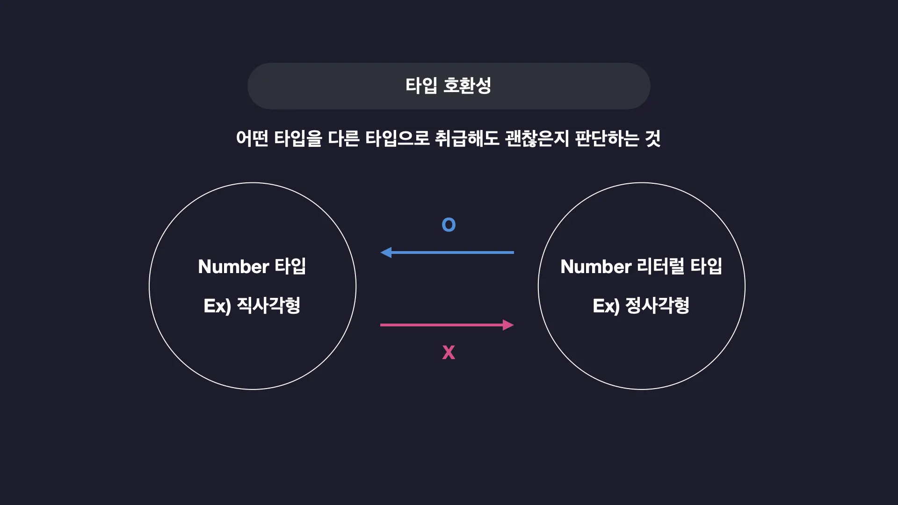
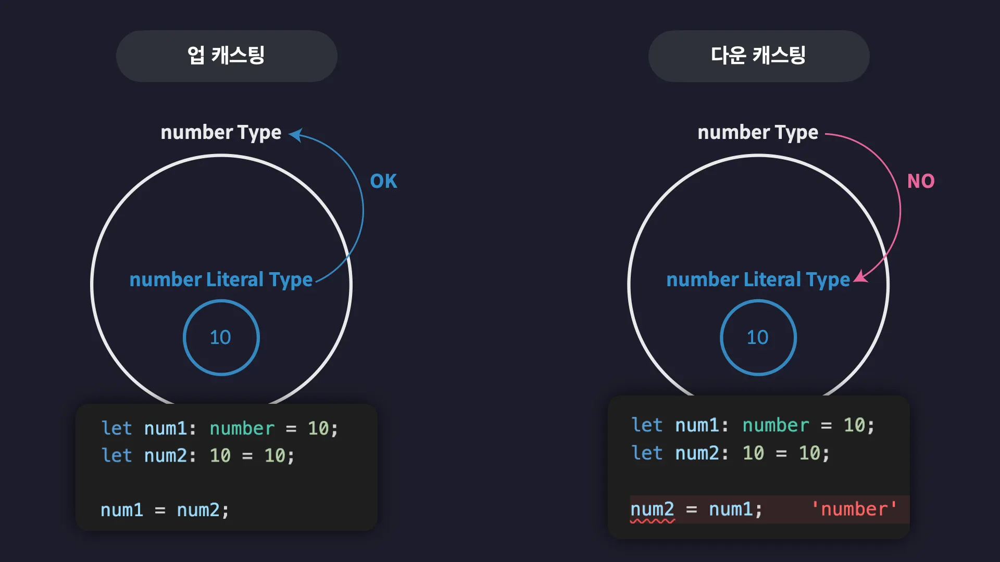
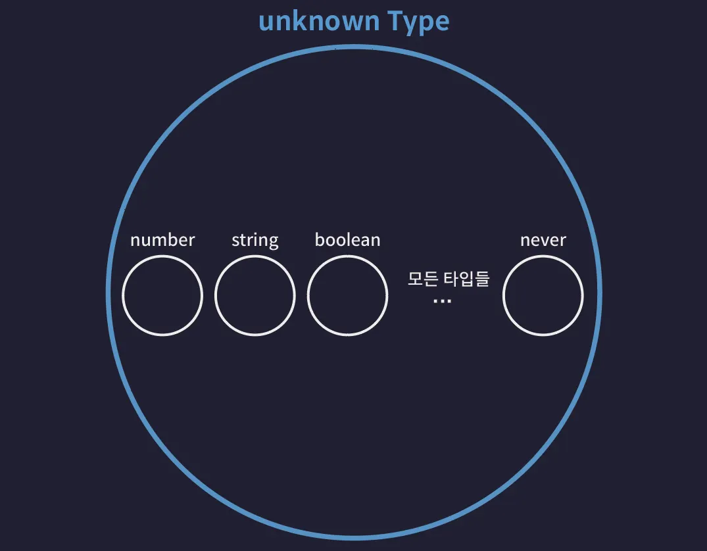
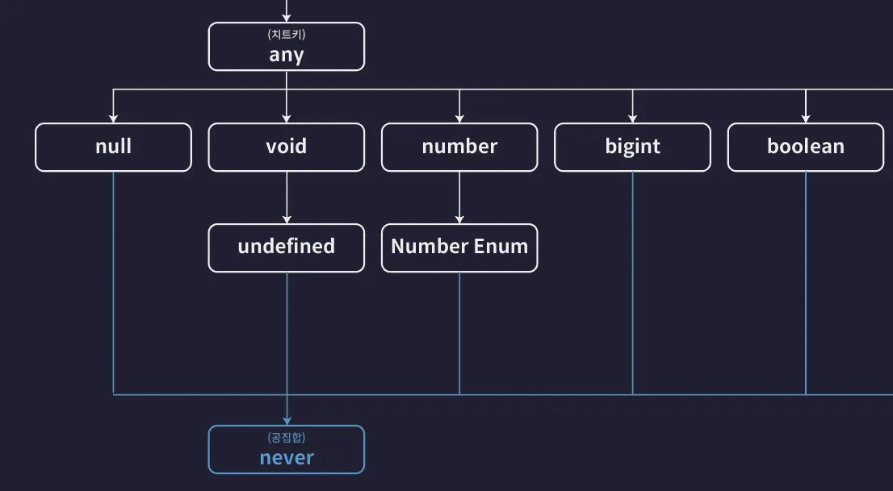

# 타입은 집합이다.

- 집합은 동일한 속성을 갖는 여러개의 요소들을 하나의 그룹으로 묶은 단위를 말합니다.
- 타입스크립트의 '타입'은 사실 여러개의 값을 포함하는 '집합'입니다. (e.g. number type은 Infinity, 20, -20 등이 모인 집합)
- 오직 하나의 값만 포함하는 타입인 Number Literal 타입은 딱 하나의 값만 포함하는 아주 작은 집합
- 모든 Number Literal 타입은 Number 타입이라는 거대한 집합에 포함되는 부분 집합으로 볼 수 있습니다.
- 타입 계층도가 설명해주고 있는 것은 타입스크립트가 제공하는 여러가지 기본 타입들간의 집합으로서의 부모-자식 관계

## 슈퍼타입, 서브타입

- 사실 타입스크립트의 모든 타입들은 집합으로써 서로 포함하고 또 포함되는 이런 관계를 갖습니다. 그리고 이런 관계에서 Number 타입처럼 다른 타입을 포함하는 타입을 슈퍼 타입(부모 타입)이라고 부릅니다. 반대는 서브 타입(자식 타입)이라고 합니다.

## 타입 호환성

- A 타입의 값을 B 타입으로 취급해도 괜찮은지 판단하는 것을 의미합니다.
- 타입스크립트에서는 슈퍼타입의 값을 서브타입의 값으로 취급하는것을 허용하지 않습니다. 반대로는 허용합니다.
- Number 타입의 값을 Number Literal 타입의 변수에 할당하는 것은 Number 타입의 값을 Number Literal 타입의 값으로 취급 하겠다는 것 입니다. 이렇게 더 큰 타입의 값을 더 작은 타입의 값으로 취급하는 것은 안됩니다.
  
  

### 업 캐스팅, 다운 캐스팅

- 업 캐스팅: 서브 타입의 값을 슈퍼 타입의 값으로 취급. 모든 상황에 가능
- 다운 캐스팅: 슈퍼 타입의 값을 서브 타입의 값으로 취급. 대부분의 상황에 불가능

## 타입 계층도와 기본타입

### unknown 타입 (전체 집합 타입)




- 타입 계층도의 최 상단에 위치. 모든 타입의 슈퍼타입. 모든 타입은 unknown 타입의 부분집합
- unknown 타입 변수에는 모든 타입의 값을 할당할 수 있습니다. 즉, 모든 타입은 unknown 타입으로 업 캐스트 할 수 있습니다.

```ts
let a: unknown = 1; // number -> unknown
let b: unknown = "hello"; // string -> unknown
let c: unknown = true; // boolean -> unknown
let d: unknown = null; // null -> unknown
let e: unknown = undefined; // undefined -> unknown
let f: unknown = []; // Array -> unknown
let g: unknown = {}; // Object -> unknown
let h: unknown = () => {}; // Function -> unknown
```

- unknown 타입의 값은 any를 제외한 어떤 타입의 변수에도 할당할 수 없습니다.

```ts
let unknownValue: unknown;

let a: number = unknownValue;
// 오류 : unknown 타입은 number 타입에 할당할 수 없습니다. 다운캐스트X
```

### never 타입 (공집합 타입)




- 공집합은 아무것도 포함하지 않는 집합. never 타입에 해당하는 값은 말 그대로 아무것도 없습니다.
- 공집합은 모든 집합의 부분 집합입니다. 즉, never 타입은 모든 타입의 서브 타입입니다. 따라서 never 타입은 모든 타입으로 업캐스팅 할 수 있습니다.

```ts
let neverVar: never;

let a: number = neverVar; // never -> number
let b: string = neverVar; // never -> string
let c: boolean = neverVar; // never -> boolean
let d: null = neverVar; // never -> null
let e: undefined = neverVar; // never -> undefined
let f: [] = neverVar; // never -> Array
let g: {} = neverVar; // never -> Object
```

- 그 어떤 타입도 never 타입으로 다운 캐스팅 할 수 없습니다.

```ts
let a: never = 1; // number -> never ❌
let b: never = "hello"; // string -> never ❌
let c: never = true; // boolean -> never ❌
let d: never = null; // null -> never ❌
let e: never = undefined; // undefined -> never ❌
let f: never = []; // Array -> never ❌
let g: never = {}; // Object -> never ❌
```

### void 타입


- void 타입은 undefined와 never 타입의 슈퍼타입.
  - 따라서 반환값을 void로 선언한 함수에서 undefined을 반환 해도 오류가 발생하지 않습니다.
    <br/>undefined 타입은 void 타입의 서브 타입이므로 업캐스팅이 가능하기 때문입니다.

  ```ts
  function noReturnFuncA(): void {
    return undefined;
  }

  function noReturnFuncB(): void {
    return;
  }

  function noReturnFuncC(): void {}
  ```

  - void 타입의 서브타입은 undefined 타입과 never 타입 밖에 없습니다. 따라서 void 타입에는 undefined, never 이외에 다른 타입의 값을 할당할 수 없습니다.

  ```ts
  let voidVar: void;

  voidVar = undefined; // undefined -> void (ok)

  let neverVar: never;
  voidVar = neverVar; // never -> void (ok)
  ```

### any 타입


- any 타입은 사실상 타입 계층도를 완전히 무시합니다.
- any는 모든 타입의 슈퍼타입이 될 수도 있고 거의 모든 타입의 서브 타입이 될 수도 있습니다.
- 단, never 타입으로 선언된 변수에는 any 타입의 값을 넣을 수 없습니다.
  - 일반적인 다운캐스트 (허용): any -> number, string, boolean 등
  - 절대 불가 다운캐스트: any -> never 논리적으로 불가능
  - 반대로 never를 any에 할당하는 업캐스트는 가능합니다. 빈 집합은 어디에든 포함될 수 있기 때문입니다.

```ts
let anyValue: any;
let neverValue: never;

anyValue = num; // number -> any (업 캐스트)
anyValue = str; // string -> any (업 캐스트)
anyValue = bool; // boolean -> any (업 캐스트)
anyValue = neverValue; // never -> any (업 캐스트)

let num: number = anyValue; // any -> number (다운 캐스트)
let str: string = anyValue; // any -> string (다운 캐스트)
let bool: boolean = anyValue; // any -> boolean (다운 캐스트)
neverValue = anyValue; // 에러 발생 any -> never X (다운 캐스트X)
```

## 객체 타입의 호환성

- 모든 객체 타입은 각각 다른 객체 타입들과 슈퍼-서브 타입 관계
- 객체 타입간의 호환성도 동일한 기준으로 판단. 따라서 업 캐스팅은 허용하고 다운 캐스팅은 허용하지 않습니다.

```ts
// 어떤 객체가 Dog 타입에 포함된다면 무조건 Animal 타입에도 포함됩니다. 그러나 반대로 Animal 타입에 포함되는 모든 객체가 Dog 타입에 포함되는것은 아닙니다. 따라서 결국 Animal은 Dog의 슈퍼타입

type Animal = {
  name: string;
  color: string;
};

type Dog = {
  name: string;
  color: string;
  breed: string;
};

let animal: Animal = {
  name: "기린",
  color: "yellow",
};

let dog: Dog = {
  name: "돌돌이",
  color: "brown",
  breed: "진도",
};

animal = dog; // ✅ OK
dog = animal; // ❌ NO
```

### 초과 프로퍼티 검사

- 초과 프로퍼티 검사: 변수를 객체 리터럴로 초기화 할 때 발동하는 타입스크립트의 특수한 기능
- 이 기능은 타입에 정의된 프로퍼티 외의 다른 초과된 프로퍼티를 갖는 객체를 변수에 할당할 수 없도록 막습니다.

```ts
type Book = {
  name: string;
  price: number;
};

type ProgrammingBook = {
  name: string;
  price: number;
  skill: string;
};

(...)

let book2: Book = { // 초과 프로퍼티 검사 -> 오류 발생
  name: "한 입 크기로 잘라먹는 리액트",
  price: 33000,
  skill: "reactjs",
};
```

- 초과 프로퍼티 검사는 변수를 초기화 할 때 객체 리터럴을 사용하지만 않으면 발생하지 않습니다.
  <br/>따라서 값을 별도의 다른 변수에 보관한 다음 변수 값을 초기화 값으로 사용하면 발생하지 않습니다.

```ts
(...)
// 1. 프로그래밍 북 타입의 객체를 별도 변수에 담습니다.
const programmingBook: ProgrammingBook = {
  name: "한 입 크기로 잘라먹는 리액트",
  price: 33000,
  skill: "reactjs",
};

// 2. 변수를 할당하면 '초과 프로퍼티 검사'가 일어나지 않습니다. 업캐스트 정상 동작
let book3: Book = programmingBook;
```

- 초과 프로퍼티 검사는 함수의 매개변수에도 동일하게 발생합니다.
- 이때에도 역시 검사를 피하고 싶다면 다음과 같이 변수에 미리 값을 담아둔 다음 변수값을 인수로 전달하면 됩니다.

```ts
function func(book: Book) {}

func({
  // 초과 프로퍼티 검사 -> 오류 발생
  name: "한 입 크기로 잘라먹는 리액트",
  price: 33000,
  skill: "reactjs",
});

func(programmingBook);
```

## 대수 타입(Algebraic type)

- 여러개의 타입을 합성해서 만드는 타입
- 대수 타입에는 합집합 타입과 교집합 타입이 존재합니다. 합집합은 Union 타입, 교집합은 Intersection 타입

### 합집합(Union |) 타입

- 유니온 타입에 참여하는 타입들의 개수에는 제한이 없습니다.

```ts
let a: string | number | boolean;

a = 1;
a = "hello";
a = true;
```

#### Union 타입으로 배열 타입 정의하기

```ts
let arr: (number | string | boolean)[] = [1, "hello", true];
```

#### Union 타입과 객체 타입


```ts
type Dog = {
  name: string;
  color: string;
};

type Person = {
  name: string;
  language: string;
};

type Union1 = Dog | Person;
```

```ts
(...)

let union1: Union1 = { // ✅
  name: "",
  color: "",
};

let union2: Union1 = { // ✅
  name: "",
  language: "",
};

let union3: Union1 = { // ✅
  name: "",
  color: "",
  language: "",
};

let union4: Union1 = { // ❌
  name: "",
};
```

### 교집합(Intersection &) 타입

- 대다수의 기본 타입들 간에는 서로 공유하는 교집합이 없기 때문에 이런 인터섹션 타입은 보통 객체 타입들에 자주 사용됩니다.
- 서로 교집합을 공유하지 않는 서로소 집합 → 변수 variable의 타입은 결국 never 타입으로 추론

```ts
let variable: number & string; // never 타입으로 추론된다
```

#### Intersection 타입과 객체 타입


```ts
type Dog = {
  name: string;
  color: string;
};

type Person = {
  name: string;
  language: string;
};

type Intersection = Dog & Person;

let intersection1: Intersection = {
  name: "",
  color: "",
  language: "",
};
```

## 타입 추론

- 타입스크립트는 타입이 정의되어 있지 않은 변수의 타입을 값을 보고 자동으로 추론합니다.
- 단, 함수의 매개변수 타입은 자동으로 추론할 수 없습니다. 타입 추론이 불가능한 변수(ex 매개변수)에는 암시적으로 any 타입이 추론됩니다.
  - 엄격한 타입 검사 모드 (tsconfig.json의 strict 옵션을 true로 설정)에서는 이런 암시적 any 타입의 추론을 오류로 판단.

```ts
function func(param) {
  // 오류
}
```

### 타입 추론이 가능한 상황들

1. 변수 선언

- 일반적인 변수 선언의 경우 초기값을 기준으로 타입이 잘 추론됩니다. 복잡한 객체 타입도 문제 없이 잘 추론합니다.

```ts
let a = 10;
// number 타입으로 추론

let b = "hello";
// string 타입으로 추론

let c = {
  id: 1,
  name: "이정환",
  profile: {
    nickname: "winterlood",
  },
  urls: ["https://winterlood.com"],
};
// id, name, profile, urls 프로퍼티가 있는 객체 타입으로 추론
```

2. 구조 분해 할당

- 객체와 배열을 구조 분해 할당하는 상황에서도 타입이 잘 추론됩니다.

```ts
let { id, name, profile } = c;

let [one, two, three] = [1, "hello", true];
```

3. 함수의 반환값

- 함수 반환값의 타입은 return 문을 기준으로 잘 추론됩니다.

```ts
function func() {
  return "hello"; // 반환값이 string 타입으로 추론된다
}
```

4. 기본값이 설정된 매개변수

- 기본값이 설정된 매개변수의 타입은 기본값을 기준으로 추론됩니다. (예시에서는 hello를 기본값으로 넣었으므로 string으로 추론)

```ts
function func(message = "hello") {
  return "hello";
}

// 리터럴 타입으로 고정. 이제 message는 오직 "hello"만 가질 수 있습니다.
function func(message: "hello" = "hello") {}
```

### 주의해야 할 상황들

1. 암시적으로 any 타입으로 추론

- 변수를 선언할때 초기값을 생략하면 암시적인 any 타입으로 추론됩니다.
- 이때 매개변수의 타입이 암시적 any로 추론될 때와 달리 일반 변수의 타입이 암시적 any 타입으로 추론되는 상황은 오류로 판단하지 않습니다.
- 암시적으로 추론된 any 타입은 코드의 흐름에 따라 타입이 계속 변화합니다. 이를 any의 진화라고 표현하기도 합니다.

```ts
let d; // 암시적인 any 타입으로 추론
// 이 변수에 값을 할당하면 그 다음 라인부터 any 타입이 해당 값의 타입으로 변화

d = 10; // number type 으로 추론
d.toFixed();

d = "hello"; // string type
d.toUpperCase();
d.toFixed(); // 오류
```

2. const 상수의 추론

- const로 선언된 상수도 타입 추론이 진행됩니다. 그러나 let으로 선언한 변수와는 다른 방식으로 추론됩니다.
- 상수는 초기화 때 설정한 값을 변경할 수 없기 때문에 특별히 가장 좁은 타입으로 추론됩니다.

```ts
const num = 10; // 10 Number Literal 타입으로 추론

const str = "hello"; // "hello" Literal 타입으로 추론
```

- 주의할 점은 객체나 배열을 const로 선언하더라도 내부 속성이나 요소까지 리터럴 타입으로 추론되지는 않는다는 것입니다.
- 만약 객체 내부까지 모두 리터럴 타입으로 고정하고 싶다면 as const (const assertion) 문법을 사용해야 합니다.

```ts
const obj1 = { name: "Gemini" }; // obj1.name은 여전히 string입니다. (속성 값은 바뀔 수 있으니까요!)

const obj2 = {
  name: "Gemini", // obj2.name의 타입은 "Gemini" 리터럴 타입이 됩니다.
} as const; // 동시에 모든 속성에 readonly가 붙어서 수정도 불가능해집니다.
```

### 최적 공통 타입 (Best Common Type)

- 다양한 타입의 요소를 담은 배열을 변수의 초기값으로 설정하면, 최적의 공통 타입으로 추론됩니다.

```ts
let arr = [1, "string"]; // (string | number)[] 타입으로 추론
```

## 타입 단언

- `값 as 타입` 으로 특정 값을 원하는 타입으로 단언할 수 있습니다.

- 변수 person은 Person 타입으로 정의 되었지만 초기화 할 때에는 빈 객체를 넣어두고 싶다고 가정.
- 그러나 타입스크립트에서는 이런 경우를 허용하지 않습니다. 빈 객체는 Person 타입이 아니므로 오류가 발생

```ts
type Person = {
  name: string;
  age: number;
};

let person: Person = {};
person.name = "";
person.age = 23;
```

- 참고로 인덱스 시그니처가 오류가 나지 않는다.
  - 인덱스 시그니처와 일반 객체 타입 선언의 검사 방식이 서로 다르기 때문
  - 인덱스 시그니처는 "만약 속성이 존재한다면 그 속성은 이 규칙을 따라야 한다"는 뜻입니다. 빈 객체 {}는 위 규칙을 어긴 속성이 하나도 없는 상태입니다. 따라서 타입스크립트는 "규칙을 위반한 게 없으니 괜찮다"고 판단하여 오류를 내지 않습니다.

  ```ts
  type CountryCodes = {
    [key: string]: string;
  };

  let countryCodesTry: CountryCodes = {}; // ✅ 정상
  ```

  - 반면, Person처럼 명시적으로 속성을 나열한 객체 리터럴 타입은 해당 속성들이 필수로 존재해야 함을 의미합니다. 빈 객체 {}에는 Person 타입이 요구하는 필수 프로퍼티(name, age)가 누락되어 있습니다. 따라서 초기화 단계에서 즉시 "필요한 정보가 없다"는 오류를 냅니다.
    | 구분 | 인덱스 시그니처 | 일반 객체 리터럴 타입 |
    | :--- | :--- | :--- |
    | **핵심 철학** | "있는 속성만 규칙을 지켜라" | "정의된 속성은 무조건 있어야 한다" |
    | **빈 객체 `{}`** | **허용** (위반 사항 없음) | **불허** (필수 속성 누락으로 오류) |
    | **오류 방지법** | 기본적으로 허용됨 | 옵셔널(`?`) 키워드 사용 시 허용 |

- 이럴 땐 다음과 같이 이 빈 객체를 Person 타입이라고 타입스크립트에게 단언해주면 됩니다.

```ts
type Person = {
  name: string;
  age: number;
};

let person = {} as Person;
person.name = "";
person.age = 23;
```

- 타입 단언은 다음과 같이 초과 프로퍼티 검사를 피할때에도 요긴하게 사용할 수 있습니다.

```ts
type Dog = {
  name: string;
  color: string;
};

// breed 라는 초과 프로퍼티가 존재하지만 이 값을 Dog 타입으로 단언하여 초과 프로퍼티 검사를 피했습니다.
let dog: Dog = {
  name: "돌돌이",
  color: "brown",
  breed: "진도",
} as Dog;
```

### 타입 단언의 조건

값 as 타입 형식의 단언식을 A as B로 표현했을 때 아래의 두가지 조건 중 한가지를 반드시 만족해야 합니다.

- A가 B의 슈퍼타입이다
- A가 B의 서브타입이다

```ts
let num1 = 10 as never; // ✅ never 타입은 모든 타입의 서브타입
let num2 = 10 as unknown; // ✅  unknown 타입은 모든 타입의 슈퍼타입

let num3 = 10 as string; // ❌
```

### 다중 단언

- 타입 단언은 다중으로도 가능합니다.
- 다중 단언의 경우 왼쪽에서 오른쪽으로 단언이 이루어집니다.
- 다중 단언을 이용하면 앞의 예제에서 불가능했던 단언을 다음과 같이 가능하도록 만들 수도 있습니다.
  - 중간을 unknown 타입으로 단언하면 unknown 타입은 모든 타입의 슈퍼타입이므로 모든 타입으로 또 다시 단언하는게 가능합니다.
- 그러나 이렇게 단언하는 것은 매우 좋지 않은 방식입니다. 타입 단언은 실제로 그 값을 해당 타입의 값으로 바꾸는 것이 아니라 단순 눈속임에 불과합니다. 따라서 이렇게 값을 이렇게 슈퍼-서브 관계를 갖지 않는 타입으로 단언하면 오류가 발생할 확률이 매우 높아집니다.

```ts
let num3 = 10 as unknown as string;
```

### const 단언

- 타입 단언때에만 사용할 수 있는 const 타입이 존재합니다. 특정 값을 const 타입으로 단언하면 마치 변수를 const로 선언한 것 과 비슷하게 타입이 변경됩니다.

```ts
let num4 = 10 as const; // 10 Number Literal 타입으로 단언됨

let cat = {
  name: "야옹이",
  color: "yellow",
} as const; // 모든 프로퍼티가 readonly를 갖도록 단언됨
```

### Non Null 단언

- `값 as 타입` 형태를 따르지 않는 단언입니다. 값 뒤에 느낌표(!) 를 붙여주면 이 값이 undefined이거나 null이 아닐것으로 단언할 수 있습니다.
- 옵셔널이나 null이 올 수 있는 상황에서 "지금 이 순간만큼은 값이 확실히 있다"라고 컴파일러에게 강제로 알리기 위해 이 문법을 사용합니다.
  - author?는 string | undefined 타입입니다. 원래대로라면 post.author.length를 호출할 때 "author가 undefined일 수도 있는데 접근하려고 해!"라는 오류가 발생합니다.

```ts
type Post = {
  title: string;
  author?: string;
};

let post: Post = {
  title: "게시글1",
};

const len: number = post.author!.length;
```

- 단언은 타입스크립트의 타입 검사를 강제로 통과시키는 것이지, 실제 데이터가 바뀌는 것이 아닙니다.
  - 런타임 에러 위험: 만약 실제로 author가 비어있는데 !를 써서 강제로 접근하면, 프로그램이 실행되는 도중 Cannot read properties of undefined 에러를 내며 멈출 수 있습니다.
  - 권장 사항: 가급적이면 !보다는 타입 좁히기(if문 등)나 옵셔널 체이닝(?.)을 사용하는 것이 더 안전합니다.

```ts
// 1. Non-null 단언 (위험할 수 있음)
const len1: number = post.author!.length;

// 2. 옵셔널 체이닝 (안전함 - 값이 없으면 undefined 반환)
const len2: number | undefined = post.author?.length;

// 3. 타입 좁히기 (가장 확실함)
if (post.author) {
  const len3: number = post.author.length;
}
```
