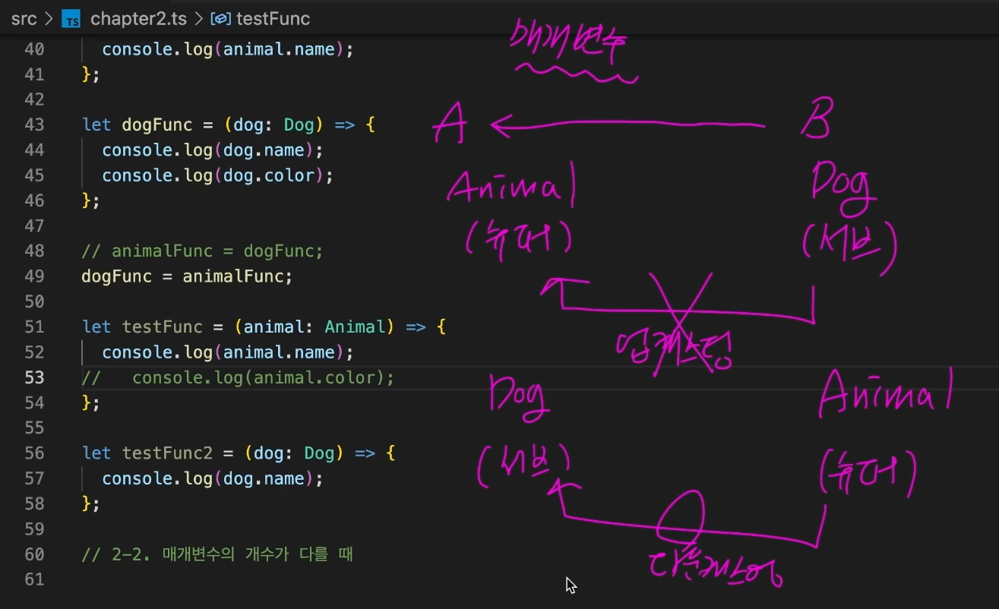

# 함수와 타입

```ts
// 함수를 설명하는 가장 좋은 방법: 어떤 매개변수를 받고, 어떤 결과값을 반환하는지 설명
function func(a, b) {
  return a + b;
}

// 어떤 타입의 매개변수를 받고, 어떤 타입의 값을 반환하는지 설명
function func(a: number, b: number): number {
  return a + b;
}

// 참고로 함수의 반환값 타입은 자동으로 추론되기 때문에 다음과 같이 생략해도 됩니다.
function func(a: number, b: number) {
  return a + b;
}
```

## 화살표 함수 타입 정의하기

```ts
const add = (a: number, b: number): number => a + b;

// 화살표 함수 역시 반환값의 타입은 자동으로 추론됩니다.
const add = (a: number, b: number) => a + b;
```

## 매개변수 기본값 설정하기

* 함수의 매개변수에 기본값이 설정되어있으면 타입이 자동으로 추론됩니다. 이 경우 타입 정의를 생략해도 됩니다.

```ts
function introduce(name = "이정환") {
  console.log(`name : ${name}`);
}

// 당연히 기본값과 다른 타입으로 매개변수의 타입을 정의하면 오류가 발생
function introduce(name: number = "이정환") {
  console.log(`name : ${name}`);
}

// 당연히 기본값과 다른 타입의 값을 인수로 전달하면 오류가 발생합니다.
function introduce(name = "이정환") {
  console.log(`name : ${name}`);
}

introduce(1); // 오류
```

## 옵셔널 매개변수 설정하기

* 선택적 매개변수의 타입은 자동으로 undefined와 유니온 된 타입으로 추론됩니다.
* tall의 타입은 현재 number | undefined
* 이 값이 number 타입의 값일 거라고 기대하고 사용하려면 타입 좁히기가 필요합니다.
* 주의할 점은 선택적 매개변수는 필수 매개변수 앞에 올 수 없습니다. 반드시 뒤에 배치해야 합니다.

```ts
function introduce(name = "이정환", tall?: number) {
  console.log(`name : ${name}`);
  if (typeof tall === "number") {
    console.log(`tall : ${tall + 10}`);
  }
}

introduce("이정환", 156);

introduce("이정환");
```

```ts
function introduce(name = "이정환", tall?: number, age: number) { // 오류!
  console.log(`name : ${name}`);
  if (typeof tall === "number") {
    console.log(`tall : ${tall + 10}`);
  }
}
```

## rest 파라미터(rest 매개변수)

* getSum 함수는 rest 파라미터로 number 타입의 인수들을 담은 배열을 전달받습니다.\
  이때 rest 파라미터 타입은 다음과 같이 정의하면 됩니다.

```ts
function getSum(...rest: number[]) {
  let sum = 0;
  rest.forEach((it) => (sum += it));
  return sum;
}
```

* 이때 rest 파라미터의 길이를 고정하고 싶다면 다음과 같이 튜플 타입을 이용해도 됩니다.

```ts
function getSum(...rest: [number, number, number]) {
  let sum = 0;
  rest.forEach((it) => (sum += it));
  return sum;
}

getSum(1, 2, 3); // ✅
getSum(1, 2, 3, 4); // ❌
```

## 함수 타입 표현식(Function Type Expression)

* **함수 타입을 별도로 정의**.
* 타입 별칭과 함께 사용할 수도 있다.
* 함수 타입 표현식을 이용하면 함수 선언 및 구현 코드와 타입 선언을 분리할 수 있어 유용
* 여러개의 함수가 동일한 타입을 갖는 경우에 요긴

```ts
type Add = (a: number, b: number) => number;

const add: Add = (a, b) => a + b;
```

## 호출 시그니쳐(Call Signature)

* 함수 타입 표현식과 동일하게 함수의 타입을 별도로 정의하는 방식
* 함수가 '객체'로서의 성질을 가져야 할 때는 호출 시그니처가 필요
* 자바스크립트에서는 함수도 객체이기 때문에, **객체를 정의하듯 함수의 타입을 별도로 정의**할 수 있습니다.
* 호출 시그니쳐 아래에 **프로퍼티를 추가 정의**하는 것도 가능합니다. \
  이렇게 할 경우 **함수**이자 **일반 객체**를 의미하는 타입으로 정의되며 이를 **하이브리드 타입**이라고 부릅니다. \
  (이 타입을 갖는 변수를 마치 객체로도 쓰고 함수로도 쓸수 있기 때문에)

```ts
type Operation2 = {
  (a: number, b: number): number;
};

const add2: Operation2 = (a, b) => a + b;
const sub2: Operation2 = (a, b) => a - b;
const multiply2: Operation2 = (a, b) => a * b;
const divide2: Operation2 = (a, b) => a / b;
```

```ts
type Hybrid = {
  (a: number, b: number): number;
  description: string;
};

const hybridFunc: Hybrid = (a, b) => a + b;

// 함수처럼 호출될수도 있고, 객체 사용하듯 점표기법으로도 접근 가능
hybridFunc(1, 2);
hybridFunc.description = "This is a hybrid function";
```

## 함수 타입의 호환성

* 특정 함수 타입을 다른 함수 타입으로 취급해도 괜찮은지 여부
  * 특정 함수 타입이 다른 함수 타입에 할당될 수 있는지 여부
* 공변(covariant): 타입의 상속(서브 → 슈퍼) 방향과 같은 방향으로 함께 변하는 것

1. 매개변수 개수(arity) 체크
2. 그 다음에 매개변수 타입 체크 (반공변)

* ① 에서 안전하다고 판단되면, ②에서 타입을 본다. ①에서 이미 위험하면, 타입이 뭐든 바로 탈락

### 기준1: 두 함수의 반환값 타입이 호환

* A의 반환값 타입은 Number, B의 반환값 타입은 Number Literal 입니다. 변수 a에 b를 할당하는 것은 가능하나 반대로는 불가능 합니다.

```ts
type A = () => number; // A의 반환값 타입이 슈퍼타입
type B = () => 10;

let a: A = () => 10;
let b: B = () => 10;

a = b; // ✅ 업캐스팅 -> 반환값 타입 호환 -> 함수 타입 호환
b = a; // ❌ 다운캐스팅 -> 반환값 타입 비호환 -> 함수 타입 비호환
```

### 기준2: 두 함수의 매개변수의 타입이 호환

#### 2-1: 매개변수의 개수가 다를 때

* 매개변수가 적은 함수를 매개변수가 많은 함수 타입에 넣는 것은 가능하지만, 그 반대는 불가능합니다.

```ts
type Func1 = (a: number, b: number) => void;
type Func2 = (a: number) => void;

let func1: Func1 = (a, b) => {};
let func2: Func2 = (a) => {};

func1 = func2; // ✅ 업캐스팅 -> 매개변수 타입 호환 -> 함수 타입 호환
func2 = func1; // ❌ 개수X -> 매개변수 타입 비호환 -> 함수 타입 비호환
```

#### 2-2: 매개변수의 개수가 같을 때

* 두 함수 타입 C와 D가 있을 때 두 타입의 매개변수의 개수가 같을 경우,\
  D를 C로 취급하려면 C 매개변수의 타입이 D 매개변수 타입의 서브 타입이어야 합니다.
  * C 매개변수의 타입은 Number, D 매개변수의 타입은 Number Literal 입니다. 따라서 C 매개변수의 타입이 D 매개변수의 슈퍼타입이므로 D를 C로 취급하는것은 불가능하나 반대로는 가능합니다. 이는 반환값 타입과 반대됩니다. 마치 다운캐스팅을 허용하는 것 같아 보입니다.

```ts
type C = (value: number) => void; // C의 매개변수 타입이 슈퍼타입
type D = (value: 10) => void;

let c: C = (value) => {};
let d: D = (value) => {};

c-number = d-num literal; // ❌ 업캐스팅 -> 매개변수 타입 비호환 -> 함수 타입 비호환
d = c; // ✅ 다운캐스팅 -> 매개변수 타입 호환 -> 함수 타입 호환
```

```ts
type Animal = {
  name: string;
};

type Dog = {
  name: string;
  color: string;
};

let animalFunc = (animal: Animal) => {
  console.log(animal.name);
};

let dogFunc = (dog: Dog) => {
  console.log(dog.name);
  console.log(dog.color);
};

animalFunc = dogFunc; // ❌ dogFunc 매개변수 타입이 서브타입
dogFunc = animalFunc; // ✅
```

animalFunc = dogFunc를 코드로 표현해보면 다음과 같습니다. (함수 본문은 dogFunc)

```ts
let animalFunc = (animal: Animal) => {
  console.log(animal.name);
  console.log(animal.color); // 오류
};
```

dogFunc = animalFunc를 코드로 표현하면 다음과 같습니다.

```ts
let dogFunc = (dog: Dog) => {
  console.log(dog.name);
};
```



## 함수 오버로딩

* JS에서는 지원이 안되지만 TS에서는 지원
* 하나의 함수를 매개변수의 개수나 타입에 따라 다르게 동작하도록 만드는 문법

```ts
/**
 * 함수 오버로딩
 * 같은 함수를 매개변수의 개수나 타입에 따라
 * 여러가지 버전으로 만드는 문법
 * -> 하나의 함수 func
 * -> 일단 모든 매개변수는 넘버타입
 * -> Ver1. 매개변수가 1개일 때에는 매개변수에 20을 곱한 값을 출력
 * -> Ver2. 매개변수가 3개일 때에는 모든 매개변수를 더한 값을 출력
 */
```

* 타입스크립트에서 함수 오버로딩을 구현하려면 먼저 버전별 오버로드 시그니쳐를 만들어 줘야 합니다.
* <mark style="background-color:yellow;">**오버로드 시그니쳐**</mark>: 구현부 없이 **선언부만 만들어둔 함수** (아래 예시 2개의 오버로드 시그니쳐)
* 오버로드 시그니쳐를 만들었다면 다음으로는 구현 시그니쳐를 만들어줘야 합니다. 구현 시그니쳐는 실제로 함수가 어떻게 실행될 것인지를 정의하는 부분입니다.
* 구현 시그니쳐의 매개변수 타입은 모든 오버로드 시그니쳐와 호환되도록 만들어야 합니다.
* 오버로드 시그니쳐를 만들어 놓으면 실제 구현부에 정의된 매개변수의 갯수나 타입이 아닌 오버로드 시그니쳐들 중 하나의 버전을 골라서 호출할 수 있게 됩니다.

```ts
// 버전들 -> 오버로드 시그니쳐
function func(a: number): void; // Ver1
function func(a: number, b: number, c: number): void; // Ver2

// 실제 구현부 -> 구현 시그니쳐
function func(a: number, b?: number, c?: number) {
  // 매개변수 3개가 다 있다고 하면 Ver1 존재 의미가 없어져서 안됨
  if (typeof b === "number" && typeof c === "number") {
    console.log(a + b + c);
  } else {
    console.log(a * 20);
  }
}

func(1); // ✅ 버전 1 - 오버로드 시그니쳐
func(1, 2); // ❌
func(1, 2, 3); // ✅ 버전 3 - 오버로드 시그니쳐
```

## 사용자 정의 타입가드

* 참 또는 거짓을 반환하는 함수를 이용해 입맛대로 타입 가드를 만들 수 있도록 도와주는 타입스크립트의 문법
* 아래 예시와 같이 in 연산자를 이용해 타입을 좁히는 방식은 좋지 않다고 이전에 살펴본 적 있습니다.\
  예를 들어 만약 Dog 타입의 프로퍼티가 isBarked로 중간에 이름이 수정되거나 추가 또는 삭제될 경우에는 타입 가드가 제대로 동작하지 않을 수도 있습니다.

```ts
type Dog = {
  name: string;
  isBark: boolean;
};

type Cat = {
  name: string;
  isScratch: boolean;
};

type Animal = Dog | Cat;

function warning(animal: Animal) {
  if ("isBark" in animal) {
    console.log(animal.isBark ? "짖습니다" : "안짖어요");
  } else if ("isScratch" in animal) {
    console.log(animal.isScratch ? "할큅니다" : "안할퀴어요");
  }
}
```

* 따라서 이럴 때에는 함수를 이용해 커스텀 타입 가드를 만들어 타입을 좁히는게 더 좋습니다.
* 반환값의 타입으로 animal is Dog 를 정의하면 이 함수가 true를 반환하면 조건문 내부에서는 이 값이 Dog 타입임을 보장한다는 의미가 됩니다. 따라서 warning 함수에서 isDog 함수를 호출해 매개변수의 값이 Dog 타입인지 확인하고 타입을 좁힐 수 있습니다.

```ts
(...)

// 이렇게만 하면 타입이 Dog로 잘 좁혀지지 않는다.
// typescript는 우리가 만든 함수의 반환값으로는 타입을 잘 좁히지 못한다.
function isDog(animal: Animal) {
  return (animal as Dog).isBark !== undefined;
}

// Dog 타입인지 확인하는 타입 가드
// animal is Dog를 반환 타입으로 정의
// 만약 isDog함수가 true를 return한다면 인수로 전달한 animal은 Dog타입이다.
function isDog(animal: Animal): animal is Dog {
  return (animal as Dog).isBark !== undefined;
}

// Cat 타입인지 확인하는 타입가드
function isCat(animal: Animal): animal is Cat {
  return (animal as Cat).isScratch !== undefined;
}

function warning(animal: Animal) {
  if (isDog(animal)) {
    console.log(animal.isBark ? "짖습니다" : "안짖어요");
  } else {
    console.log(animal.isScratch ? "할큅니다" : "안할퀴어요");
  }
}
```

아래 방식을 as 보다 더 권장.\
as Dog는 개발자가 "이건 무조건 Dog야!"라고 거짓말을 하는 위험이 있지만, in은 런타임에 실제로 속성이 있는지 체크하는 자바스크립트 표준 문법이기 때문

```ts
function isDog(animal: Animal): animal is Dog {
  return "isBark" in animal;
}

function warning(animal: Animal) {
  if (isDog(animal)) {
    console.log(animal.isBark ? "짖습니다" : "안짖어요");
  } else {
    console.log(animal.isScratch ? "할큅니다" : "안할퀴어요");
  }
}
```
