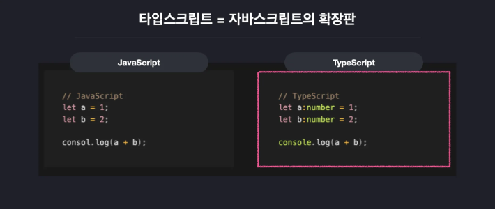
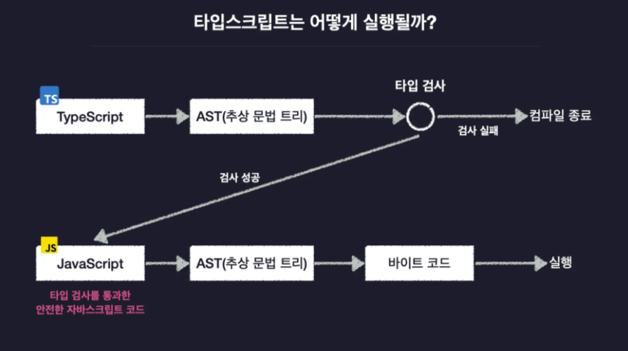

# 1-0. 타입스크립트를 소개합니다

본격적인 문법 학습에 앞서, 우리가 배우려는 이 언어가 **어디서 왔는지, 왜 쓰는지, 그리고 왜 지금 배워야만 하는지** 그 배경을 깊이 있게 살펴보기



---

## 1. 타입스크립트의 탄생: 거장의 손에서 태어나다

타입스크립트는 단순한 유행이 아니라 명확한 설계 철학을 바탕으로 탄생했습니다.

* **출시:** 2012년 마이크로소프트(Microsoft) 발표
* **설계자:** **앤더스 하일스버그(Anders Hejlsberg)**
* C#, Delphi, Turbo Pascal을 만든 전설적인 엔지니어입니다.
* 그의 영향으로 타입스크립트는 C#과 유사한 객체지향적 특징과 견고한 구조를 갖추게 되었습니다.


* **생태계:** 완전한 **오픈소스(Open Source)**로 관리되어 전 세계 개발자들이 실시간으로 발전시키고 있습니다.

---

## 2. 왜 '대세'인가? (압도적 인기와 시장성)

타입스크립트는 이제 선택이 아닌 필수가 되고 있습니다.

* **사용자 통계:** 2022년 `StateOfJS` 설문에 따르면, 자바스크립트 개발자 100명 중 **89명**이 이미 사용 중입니다.
* **취업 시장:** 프론트엔드/백엔드를 막론하고 채용 공고의 자격 요건에 빠지지 않는 **단골 스택**입니다.
* **학습 선호도:** 국내 프로그래머스 설문(2023) 결과, **가장 배우고 싶은 언어 2위**(자바스크립트 개발자들 사이에서는 압도적 1위)로 선정될 만큼 높은 관심을 받고 있습니다.

---

## 3. 타입스크립트의 정체: 자바스크립트의 확장판(Superset)

타입스크립트는 자바스크립트와 완전히 다른 언어가 아닙니다.

* **확장판(Superset) 개념:** 자바스크립트가 가진 모든 기본 문법과 기능을 그대로 유지하면서, 그 위에 **'타입(Type)' 시스템**을 얹은 언어입니다.
* **쉬운 전환:** 이미 알고 있는 자바스크립트 코드에 타입 정의만 추가하면 바로 타입스크립트가 됩니다.
* **JS:** `let sum = (a, b) => a + b;`
* **TS:** `let sum = (a: number, b: number): number => a + b;`

* **익숙함:** 자바스크립트 숙련자라면 새로운 언어를 배우는 부담 없이, 타입을 다루는 추가 기능만 익혀서 프로젝트에 바로 적용할 수 있습니다.

---

## 4. 자바스크립트의 한계와 타입스크립트의 등장 배경

자바스크립트만으로도 충분한데 왜 굳이 타입스크립트를 써야 할까요? 그 이유는 자바스크립트의 **'지나친 유연함'** 때문입니다.

### ① 자바스크립트의 탄생 목적 (과거)

* 원래 웹 브라우저에서 버튼 클릭, 팝업 띄우기 등 아주 간단한 상호작용을 처리하기 위해 만들어졌습니다.
* 빠르고 간결하게 작성하는 것이 목표였기에, 엄격한 문법보다는 유연함을 택했습니다.

### ② Node.js와 자바스크립트의 전성기 (현재)

* Node.js의 등장으로 자바스크립트가 서버, 모바일 앱(React Native), 데스크탑 앱(Electron) 등 **대규모 복잡한 프로그램**을 만드는 데 쓰이기 시작했습니다.
* 간단한 작업에서는 장점이었던 **'유연함'**이, 대규모 프로젝트에서는 어디서 터질지 모르는 **'불안정성'**이라는 단점으로 변했습니다.

### ③ 해결사로서의 타입스크립트

* 대규모 어플리케이션에서도 안정적으로 동작할 수 있도록, 기존 자바스크립트의 매력은 살리되 **'타입'이라는 안전장치**를 추가한 것이 바로 타입스크립트입니다.

---

## 5. 요약: 우리가 타입스크립트를 배우는 이유

결국 타입스크립트는 더 복잡하고 규모가 큰 프로그램을 **안전하고 정확하게** 만들기 위한 시대적 요구에 의해 탄생했습니다.

> **💡 강사 메시지**
> "자바스크립트로도 충분하다고 느낄 수 있지만, 타입스크립트는 여러분의 코드를 더 견고하게 만들고 예상치 못한 에러로부터 보호해 주는 **든든한 방패**가 되어줄 것입니다. 이제 그 방패를 어떻게 사용하는지 하나씩 알아봅시다!"

# 1-1. 자바스크립트의 단점과 타입스크립트

 이번에는 **자바스크립트가 가진 구체적인 한계점**이 무엇인지, 그리고 **타입스크립트가 그 한계를 어떻게 멋지게 극복하는지** 알아보겠습니다.

---

## 1. 모든 프로그래밍 언어에는 '타입 시스템'이 있다

자바스크립트의 한계를 이해하기 위해 가장 먼저 알아야 할 개념은 바로 **타입 시스템(Type System)**입니다.

> **타입 시스템이란?**
> 언어에서 사용할 수 있는 값들을 어떤 기준으로 묶어 타입으로 정할지, 그리고 코드의 타입을 **언제, 어떻게 검사할지** 규칙을 모아둔 체계입니다.

타입 시스템은 크게 두 가지로 나뉩니다.

| 구분 | 동적 타입 시스템 (Dynamic) | 정적 타입 시스템 (Static) |
| --- | --- | --- |
| **타입 결정 시점** | 코드를 실행할 때(Runtime) | 코드 실행 전(Compile) |
| **유연함** | 매우 자유롭고 유연함 | 엄격하고 고정적임 |
| **대표 언어** | JavaScript, Python | Java, C, C++ |

---

## 2. 동적 타입 시스템 (JavaScript)

자바스크립트는 변수의 타입을 미리 정하지 않고, 실행 도중에 값에 따라 유동적으로 결정합니다.

* **장점:** 변수 하나에 문자열을 넣었다가 숫자를 넣는 등 자유롭게 활용할 수 있어 개발 속도가 빠릅니다.
* **단점 (치명적):** 코드 실행 중에 예상치 못한 오류가 발생하여 프로그램이 비정상 종료될 수 있습니다.

```javascript
let a = "hello"; // string 타입으로 결정
a = 123;         // number 타입으로 변경 (유연함)

a.toUpperCase(); // ❌ 오류 발생! (숫자에는 사용할 수 없는 메서드)

```

위 코드는 실행은 되지만, 숫자가 들어있는 상태에서 문자열 전용 메서드를 호출하는 순간 프로그램이 멈춰버립니다. 서비스가 운영 중인 상황이라면 아주 치명적인 사고로 이어질 수 있습니다.

---

## 3. 정적 타입 시스템 (Java, C)

반대로 자바나 C 같은 언어는 실행 전에 모든 변수의 타입을 결정해야 합니다.

* **장점:** 타입 관련 오류가 있으면 실행조차 되지 않으므로, 개발자가 실수하더라도 미리 확인할 수 있습니다.
* **단점:** 모든 변수에 일일이 타입을 명시해야 해서 코드량이 늘어나고 매우 번거롭습니다.

---

## 4. 타입스크립트의 해답: 점진적 타이핑 (Gradual Typing)

타입스크립트는 두 시스템의 장점만 합친 독특한 **점진적 타입 시스템(Gradual Type System)**을 사용합니다.

### ✅ 특징 1. 실행 전 타입 검사 (안전성)

정적 타입 시스템처럼 프로그램을 실행하기 전에 타입을 검사합니다. 타입 오류가 있다면 미리 빨간 줄로 알려줍니다.

### ✅ 특징 2. 타입 추론 (유연성)

모든 변수에 타입을 직접 적지 않아도 됩니다. 변수에 담긴 초기값을 기준으로 타입스크립트가 마치 인공지능처럼 타입을 자동으로 알아냅니다.

```typescript
// 타입스크립트 코드
let a = 123; // 타입을 적지 않아도 자동으로 'number'로 추론!

a.toUpperCase(); // 💡 에러! 실행 전 에디터에서 미리 알려줌

```

---

## 5. 정리하며

1. **동적 타입 시스템(JS):** 유연하지만 실행 중에 갑자기 오류가 발생할 수 있는 불안정함이 있습니다.
2. **정적 타입 시스템(Java):** 안정적이지만 모든 타입을 직접 지정해야 하는 불편함이 있습니다.
3. **점진적 타입 시스템(TS):** 실행 전 타입 검사로 **안전성**을 확보하면서도, 자동 타입 추론으로 **유연함**까지 놓치지 않은 멋진 시스템입니다.

**결론적으로 타입스크립트는 대규모 프로그램을 안정적으로 만들기 위해 자바스크립트에 '타입'이라는 안전장치를 추가한 언어라고 이해하시면 됩니다!**


---

# 1-2. 타입스크립트의 동작 원리 

## 0. 도입 (Opening)

"이번 시간에는 우리가 작성한 타입스크립트 코드가 **내부적으로 어떻게 동작하고, 어떤 과정을 거쳐 컴퓨터에서 실행되는지** 그 원리를 살펴보겠습니다. 이 과정을 이해하면 타입스크립트가 왜 안전한지 그 이유를 명확히 알게 되실 겁니다."

---

## 1. 일반적인 언어의 동작 방식

"타입스크립트를 보기 전에, 먼저 대다수의 프로그래밍 언어가 어떻게 실행되는지 알아야 합니다. 우리가 쓰는 언어는 인간 친화적이지만, 컴퓨터는 이진수나 기계어만 이해할 수 있기 때문이죠."

* **컴파일(Compile):** 우리가 작성한 코드를 컴퓨터가 이해할 수 있는 형태(바이트코드)로 변환하는 과정입니다.
* **컴파일러의 단계:**
1. **AST(추상 문법 트리) 생성:** 코드의 공백, 주석 등을 제거하고 트리 형태의 구조로 코드를 쪼개서 저장합니다.
2. **바이트코드 변환:** AST를 기반으로 실제 실행 가능한 바이트코드를 생성합니다.

---

## 2. 타입스크립트만의 특별한 동작 과정

"그럼 타입스크립트는 무엇이 다를까요? 타입스크립트의 컴파일 과정에는 **'안전장치'**가 하나 더 추가되어 있습니다."

* **타입스크립트의 컴파일 단계:**
1. **AST 변환:** 다른 언어와 동일하게 코드를 트리 구조로 만듭니다.
2. **타입 검사 (Type Check):** **이게 가장 중요합니다.** AST를 보고 코드에 타입 오류가 없는지 확인합니다. 만약 오류가 있다면 여기서 컴파일이 중단됩니다!
3. **자바스크립트 변환:** 타입 검사를 통과하면, AST를 바이트코드가 아닌 **'자바스크립트 코드'**로 변환합니다.

---

## 3. 타입스크립트 컴파일의 결과물

"타입스크립트 컴파일 결과로 만들어진 자바스크립트 파일은 어떤 특징을 가질까요?"

* **검증된 코드:** 타입스크립트가 생성한 JS 파일은 이미 엄격한 타입 검사를 통과한 상태입니다. 따라서 실행 중에 타입 에러가 날 확률이 현저히 낮습니다.
* **타입 코드의 삭제:** 우리가 열심히 작성한 `: number` 같은 타입 관련 문법들은 자바스크립트로 변환될 때 모두 사라집니다. 즉, 실제 프로그램 실행 성능에는 영향을 주지 않고 오직 **'검사용'**으로만 사용되는 것이죠.

---

## 4. 마무리 및 정리 (Closing)



> **핵심 요약**
> 1. 일반적인 언어는 **코드 -> AST -> 바이트코드** 순으로 변환됩니다.
> 2. 타입스크립트는 **코드 -> AST -> [타입 검사] -> 자바스크립트** 순으로 변환됩니다.
> 3. 타입 검사를 통과한 안전한 자바스크립트만 실행되므로 훨씬 견고한 프로그램을 만들 수 있습니다.

"결국 타입스크립트는 우리가 자바스크립트를 실행하기 전에 미리 한 번 꼼꼼하게 검사해주는 **'똑똑한 비서'**와 같다고 생각하시면 됩니다. 자, 원리를 알았으니 이제 직접 코드를 작성해 봐야겠죠? 다음 시간에는 실습 환경을 직접 구축해 보겠습니다. 감사합니다!"

# 1-3. Hello World : 타입스크립트 첫 실습

## 0. 도입 (Opening)

원리를 이해했으니 이제 직접 몸으로 익힐 차례입니다! 이번 시간에는 **새로운 프로젝트 폴더를 만들고, 타입스크립트 실행에 필요한 도구들을 설치한 뒤, 직접 작성한 코드를 실행**까지 해보겠습니다. 실습 위주의 내용!

---

## 1. 프로젝트 초기화 (Setup)

"먼저 실습 코드를 보관할 공간을 만들고 Node.js 프로젝트로 선언해 주어야 합니다."

* **폴더 생성:** `onebite-typescript` 폴더 안에 이번 섹션용 `section1` 폴더 생성
* **패키지 초기화:** 터미널에서 `npm init` 입력 (모두 Enter를 눌러 기본값으로 설정)
* 이 과정을 거치면 프로젝트의 정보를 담은 `package.json` 파일이 생성됩니다.

---

## 2. 필수 패키지 설치

"타입스크립트를 사용하기 위해 꼭 설치해야 하는 두 가지 패키지가 있습니다."

### ① @types/node 설치

```bash
npm i @types/node

```

* **이유:** Node.js가 제공하는 기본 기능(console 등)의 타입을 정의해둔 패키지입니다.
* **중요성:** 타입스크립트는 모든 것에 '타입'이 필요합니다. 이걸 설치하지 않으면 `console` 같은 기본 도구조차 타입이 없다고 에러를 내뱉습니다.

### ② TypeScript 컴파일러 설치

```bash
# Windows
npm i -g typescript
# macOS
sudo npm i -g typescript

```

* **tsc (TypeScript Compiler):** 우리가 쓴 `.ts` 파일을 `.js` 파일로 변환해주는 핵심 도구입니다. `-g` 옵션으로 설치하여 어디서든 사용할 수 있게 합니다.
* **확인:** `tsc -v`를 입력해 버전 정보가 잘 나오는지 확인합니다.

---

## 3. Hello World 작성 및 실행 (전통적 방식)

"이제 첫 코드를 작성하고, 타입스크립트의 정석적인 실행 과정을 거쳐보겠습니다."

1. **파일 생성:** `src/index.ts` 파일 생성 및 코드 작성
```typescript
console.log("Hello TypeScript");
const a: number = 1;

```

2. **컴파일:** `tsc src/index.ts` 입력 -> `index.js` 파일이 생성됨을 확인
3. **실행:** `node src/index.js` 입력 -> "Hello TypeScript" 출력 확인

---

## 4. 더 쉬운 실행 도구: TSX (TypeScript Execute)

"매번 `tsc`로 변환하고 `node`로 실행하는 건 너무 번거롭죠? 그래서 한 번에 실행해주는 도구를 사용합니다."

* **tsx 설치:** `npm i -g tsx`
* **장점:** 별도의 `.js` 파일을 생성하지 않고도 타입스크립트 코드를 즉시 실행합니다.
* **실행:** `tsx src/index.ts`
> **참고:** 기존에는 `ts-node`를 많이 썼지만, 최신 Node.js 버전(20 이상)과의 호환성 문제로 인해 본 강의에서는 최신 도구인 **tsx** 사용을 권장합니다.

---

## 5. 마무리 및 정리 (Closing)

"오늘 우리는 타입스크립트 개발의 기초 공사를 마쳤습니다."

> **핵심 요약**
> 1. **@types/node**: Node.js 내장 기능을 위한 타입 설명서
> 2. **tsc**: 타입스크립트를 자바스크립트로 바꾸는 번역기
> 3. **tsx**: 컴파일과 실행을 한 번에 처리하는 마법 도구 

"환경 설정은 한 번만 제대로 해두면 앞으로의 학습이 매우 수월해집니다. 자, 이제 도구는 모두 준비되었습니다. 다음 시간에는 이 컴파일러를 우리 입맛에 맞게 설정하는 **컴파일러 옵션**에 대해 배워보겠습니다. 수고하셨습니다!"


# 1-4. 타입스크립트 컴파일러 옵션 설정하기

## 0. 도입 (Opening)

이번에는 타입스크립트의 핵심이자 심장이라고 할 수 있는 **컴파일러 옵션**에 대해 알아보겠습니다. 프로젝트의 성격에 맞춰 타입스크립트를 얼마나 엄격하게 사용할지, 어떤 버전의 자바스크립트로 변환할지를 결정하는 아주 중요한 과정입니다.

---

## 1. 컴파일러 옵션이란?

"컴파일러 옵션은 한마디로 **'컴파일러에게 주는 세부 지시 사항'**입니다."

* **역할:** 얼마나 엄격하게 검사할 것인지, 결과물의 자바스크립트 버전은 무엇인지 등을 설정합니다.
* **장점:** 프로젝트마다 최적화된 맞춤형 설정을 만들 수 있어 매우 자유롭고 강력합니다.

---

## 2. 컴파일러 옵션 만들기 (`tsconfig.json`)

"타입스크립트 설정은 프로젝트 루트 폴더의 `tsconfig.json` 파일에서 관리합니다."

* **자동 생성:** 터미널에 `tsc --init`을 입력하면 기본 설정 파일이 생성됩니다.
* **직접 설정:** 강의에서는 기본 원리를 배우기 위해 자동 생성된 내용을 지우고 `{}` 빈 중괄호부터 하나씩 채워나갈 예정입니다.

---

## 3. 핵심 옵션 살펴보기

### ① include

* **용도:** 컴파일할 파일의 범위를 지정합니다.
* **설정:** `"include": ["src"]`
* **효과:** `tsc` 명령어만 입력해도 `src` 폴더 내의 모든 파일이 한 번에 컴파일됩니다. 일일이 파일명을 입력할 필요가 없어집니다.

### ② target

* **용도:** 변환될 자바스크립트의 버전을 설정합니다.
* **설정:** `"target": "ES5"` 또는 `"ESNext"`
* **비교:** `ES5`로 설정하면 최신 문법인 화살표 함수가 일반 함수 표현식으로 변환됩니다. 구형 브라우저 호환성을 챙길 때 유용합니다.

### ③ module

* **용도:** 변환될 자바스크립트의 모듈 시스템(import/export 방식)을 설정합니다.
* **설정:** `"module": "CommonJS"` (require 사용) 또는 `"ESNext"` (import 사용)

### ④ outDir

* **용도:** 컴파일 결과물(.js)이 저장될 폴더를 지정합니다.
* **설정:** `"outDir": "dist"`
* **효과:** 원본 코드와 결과 코드가 섞이지 않아 프로젝트 구조가 깔끔해집니다.

### ⑤ strict (매우 중요 ⭐)

* **용도:** 타입 검사의 엄격함 수준을 결정합니다.
* **설정:** `"strict": true`
* **효과:** 매개변수 타입 정의 등 아주 사소한 부분까지 엄격하게 검사합니다. 타입스크립트의 진가를 느끼려면 반드시 `true`로 설정하는 것이 좋습니다.

### ⑥ moduleDetection

* **용도:** 각 파일을 독립된 모듈로 인식하게 합니다.
* **설정:** `"moduleDetection": "force"`
* **효과:** 파일마다 `export {}`를 적지 않아도 변수 이름 중복 오류를 방지할 수 있습니다.

---

## 4. 마무리 및 정리 (Closing)

"타입스크립트를 우리 입맛에 맞게 길들이는 법을 배웠습니다."

> **핵심 요약**
> 1. **tsconfig.json**: 타입스크립트 설정의 중심 파일
> 2. **target/module**: 결과물 자바스크립트의 형태 결정
> 3. **strict**: 안전한 코딩을 위한 엄격한 검사 모드 활성화

"이제 도구 설정까지 모두 완벽하게 마쳤습니다. 다음 시간부터는 본격적으로 타입스크립트의 기본 타입들에 대해 하나씩 파헤쳐 보겠습니다. 고생 많으셨습니다!"