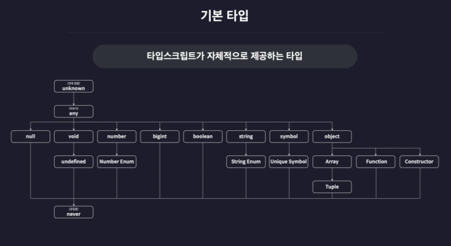

# 2-0. 기본 타입이란

타입스크립트의 가장 기초가 되는 **[기본 타입]**의 개념을 잡고, 앞으로 섹션 2에서 진행할 **실습 환경**을 구축.

---

## 1. 기본 타입(Basic Types)과 타입 계층도

"기본 타입이란 타입스크립트가 우리에게 기본적으로 제공하는 **내장 타입**들을 말합니다."



* **다양한 타입 지원:** 우리가 잘 아는 `string`, `number` 같은 원시 타입뿐만 아니라, 타입스크립트에서만 볼 수 있는 `any`, `void`, `never`, `unknown` 같은 특별한 타입들도 포함됩니다.
* **타입 계층도:** 이 타입들은 그냥 흩어져 있는 게 아니라, 부모와 자식 관계를 맺으며 거대한 **계층 구조**를 이루고 있습니다.

> **강사 메시지:** > "지금 당장 이 계층 구조의 모든 원리를 이해하실 필요는 없습니다! 일단은 **'타입스크립트에는 정말 다양한 도구(타입)들이 있고, 서로 체계적으로 연결되어 있구나'** 정도만 느끼고 넘어가시면 충분합니다. 자세한 관계는 뒤에서 하나씩 파헤쳐 볼 거예요."

---

## 2. 섹션 2 실습 환경 설정하기

### ① 프로젝트 초기화 및 패키지 설치

1. **폴더 생성:** `onebite-typescript/section2` 폴더를 만들고 VSCode로 엽니다.
2. **패키지 초기화:** `npm init -y`
3. **타입 정의 설치:** `npm i @types/node` (Node.js 내장 기능을 위한 타입 설명서)

### ② 컴파일러 옵션 설정 (`tsconfig.json`)

프로젝트 루트에 `tsconfig.json` 파일을 만들고 아래 핵심 옵션들을 설정합니다.

```json
{
  "compilerOptions": {
    "target": "ESNext",         // 최신 자바스크립트로 변환
    "module": "ESNext",         // 최신 모듈 시스템(ESM) 사용
    "outDir": "dist",           // 컴파일 결과물은 dist 폴더에!
    "strict": true,             // 엄격한 타입 검사 활성화
    "moduleDetection": "force"  // 각 파일을 개별 모듈로 취급
  },
  "include": ["src"]
}

```

### ③ 실행 환경 마무리

1. **ES 모듈 설정:** `package.json` 파일에 `"type": "module"`을 추가합니다. (tsconfig의 module 옵션과 맞추기 위함)
2. **즉시 실행 설정:** `tsx` 혹은 `ts-node` 사용을 위해 `tsconfig.json` 하단에 옵션을 추가합니다. (강의에서는 최신 도구인 `tsx` 사용을 권장합니다.)

---

## 3. 요약

> **핵심 요약**
> 1. **기본 타입**은 타입스크립트가 제공하는 내장 타입이며 계층 구조를 가진다.
> 2. **프로젝트 설정**을 반복하는 이유는 실무에서 언제든 스스로 환경을 구축할 수 있는 개발자가 되기 위해서다.

# 2-1. 원시 타입과 리터럴 타입

타입스크립트의 가장 기본이 되는 **원시 타입**과, 아주 독특한 특징인 **리터럴 타입**의 내용.

---

## 1. 원시 타입 (Primitive Type) 이란?

"원시 타입은 동시에 **딱 하나의 값만 저장할 수 있는** 가장 기본형 타입입니다."

* **특징:** 배열이나 객체 같은 비원시 타입과 달리, 숫자면 숫자, 문자면 문자 하나만 담습니다.
* **타입 주석(Type Annotation):** 변수 이름 뒤에 `: 타입`을 붙여 타입을 정의하는 문법입니다.

---

## 2. 5가지 핵심 원시 타입

### ① number 타입

단순 정수뿐만 아니라 소수, 음수, 특수 숫자까지 모두 포함합니다.

```typescript
let num1: number = 123;
let num2: number = -123;
let num3: number = 0.123;
let num4: number = Infinity; // 무한대
let num5: number = NaN;      // Not a Number

```

### ② string 타입

따옴표 종류에 상관없이 모든 문자열과 템플릿 리터럴을 포함합니다.

```typescript
let str1: string = "hello";
let str2: string = `hello ${str1}`; // 템플릿 리터럴

```

### ③ boolean 타입

참(`true`)과 거짓(`false`)만 저장합니다.

```typescript
let bool1: boolean = true;
let bool2: boolean = false;

```

### ④ null & undefined 타입

각각 오직 `null`과 `undefined` 값 하나만 가질 수 있는 타입입니다.

```typescript
let null1: null = null;
let unde1: undefined = undefined;

```

---

## 3. [중요] strictNullChecks (엄격한 null 검사)

"자바스크립트에서는 변수에 임시로 `null`을 넣어두곤 했죠? 타입스크립트에서는 이게 기본적으로 금지됩니다."

* **문제:** `let numA: number = null;` ❌ (에러 발생)
* **해결책:** 만약 null 할당을 허용하고 싶다면 `tsconfig.json`에서 `strictNullChecks` 옵션을 `false`로 설정하면 됩니다.
* **권장:** 하지만 안전한 코딩을 위해 이 옵션은 **`true`**로 유지하는 것을 권장합니다.

---

## 4. 리터럴 타입 (Literal Type)

"리터럴은 우리말로 **'값'**을 의미합니다. 즉, 값 자체가 타입이 되는 아주 특별한 기능입니다."

```typescript
let numA: 10 = 10;
numA = 11; // ❌ 에러! 10 이외의 값은 넣을 수 없음

let strA: "hello" = "hello";
let boolA: true = true;

```

* **용도:** 특정 변수가 정해진 값만 가져야 할 때(예: 상태 값 등) 매우 유용하게 사용됩니다.

---

## 5. 요약 및 정리 (Closing)

"오늘 배운 내용을 정리해 볼까요?"

> **핵심 요약**
> 1. **원시 타입:** `number`, `string`, `boolean`, `null`, `undefined`가 있으며 타입 주석으로 정의한다.
> 2. **strictNullChecks:** `null` 값을 안전하게 다루기 위한 중요한 컴파일러 옵션이다.
> 3. **리터럴 타입:** 값 자체가 타입이 되어, 특정 값만 허용하는 강력한 제약 기능을 제공한다.

"원시 타입은 모든 타입의 뿌리가 됩니다. 이 기초를 잘 다져두어야 나중에 배울 복잡한 객체나 배열 타입도 쉽게 이해할 수 있습니다."

# 2-2. 배열과 튜플

데이터를 묶어서 관리하는 **배열**과 타입스크립트의 특수한 타입인 **튜플**.

---

## 1. 배열 (Array)

타입스크립트에서 배열은 자바스크립트의 배열과 유사하지만, **내부에 어떤 타입의 요소들이 들어가는지**를 엄격하게 관리합니다.

### ① 배열 타입 정의 방법

가장 보편적인 방법은 타입 뒤에 `[]`를 붙이는 방식입니다.

* `let numArr: number[] = [1, 2, 3];`
* `let strArr: string[] = ["hello", "world"];`

또 다른 방법으로는 **제네릭** 문법을 사용하는 방식이 있습니다.

* `let boolArr: Array<boolean> = [true, false];`

### ② 다양한 타입을 갖는 배열 (Union)

배열 안에 한 가지 타입이 아닌 여러 타입의 요소를 함께 넣고 싶을 때는 **유니온(|)** 기호를 사용합니다.

* `let multiArr: (number | string)[] = [1, "hello"];`
* 여기서 `(number | string)[]`는 "숫자나 문자열 중 하나를 요소로 가지는 배열"이라는 뜻입니다.

### ③ 다차원 배열

`[]`를 연달아 작성하여 행렬과 같은 다차원 배열도 쉽게 정의할 수 있습니다.

* `let doubleArr: number[][] = [[1, 2], [3, 4]];`

---

## 2. 튜플 (Tuple)

튜플은 자바스크립트에는 없는 타입스크립트만의 특별한 타입으로, **길이와 타입의 순서가 고정된 배열**을 의미합니다.

### ① 튜플 정의와 특징

배열과 비슷해 보이지만, 대괄호(`[]`) 안에 각 인덱스에 들어갈 타입을 직접 명시합니다.

```typescript
let tup1: [number, number] = [1, 2];
let tup2: [number, string, boolean] = [1, "hello", true];

```

* **순서 고정:** 첫 번째 요소는 반드시 숫자, 두 번째는 반드시 문자열이어야 하는 식의 제약이 생깁니다.
* **길이 고정:** 정의된 개수보다 많거나 적은 요소를 할당하려고 하면 에러가 발생합니다.

### ② 주의사항: 튜플은 결국 배열입니다

튜플은 컴파일 후 결국 자바스크립트의 일반 배열로 변환됩니다. 이 때문에 타입스크립트의 시스템상 한계가 존재합니다.

* **배열 메서드 주의:** `push()`나 `pop()` 같은 메서드를 사용하면 고정된 길이를 무시하고 요소를 추가/삭제할 수 있습니다.
* 타입스크립트가 이 메서드 호출까지는 완벽히 막지 못하므로, 튜플을 사용할 때는 **배열 메서드 사용에 각별히 주의**해야 합니다.

---

## 3. 튜플을 사용하는 이유

튜플은 **데이터의 구조와 순서가 중요한 상황**에서 실수를 방지해 줍니다.

* **예시 (회원 정보 관리):**

```typescript
// 순서가 어긋나도 자바스크립트는 잡아내지 못함
const users: [string, number][] = [
  ["이정환", 1],
  ["이아무개", 2],
  [5, "조아무개"], // ❌ 에러 발생: 순서가 잘못됨(숫자, 문자열 순)
];

```

이처럼 인덱스마다 정해진 의미가 있는 데이터를 다룰 때, 튜플을 사용하면 동료나 자신의 실수를 컴파일 단계에서 즉시 확인할 수 있습니다.

---

## 💡 요약

* **배열:** 같은 타입의 데이터를 유연한 길이로 관리할 때 사용합니다.
* **튜플:** 정해진 개수의 데이터를 특정 순서에 맞게 엄격히 관리해야 할 때 사용합니다.

# 2-3. 객체 (Object)

타입스크립트에서 가장 빈번하게 사용되는 데이터 타입 중 하나인 **객체**를 정의하는 방법과 특수한 프로퍼티 문법.

---

## 1. 객체 타입을 정의하는 두 가지 방법

### ① `object`로 정의하기 (권장하지 않음)

단순히 변수의 타입을 `object`라고 선언할 수 있습니다.

```typescript
let user: object = {
  id: 1,
  name: "이정환",
};

```

하지만 이 방식은 큰 문제가 있습니다. `user.id`처럼 점 표기법으로 프로퍼티에 접근하려고 하면 **"object 타입에 id 프로퍼티가 없습니다"**라는 에러가 발생합니다. `object` 타입은 단순히 이 값이 객체라는 정보만 줄 뿐, 그 안에 어떤 상세 프로퍼티가 들어있는지에 대한 정보는 없기 때문입니다.

### ② 객체 리터럴 타입 (권장)

객체의 구조를 그대로 타입으로 정의하는 방식입니다.

```typescript
let user: {
  id: number;
  name: string;
} = {
  id: 1,
  name: "이정환",
};

```

중괄호 내부에 프로퍼티와 그 타입을 직접 나열합니다. 이렇게 하면 객체 내부의 데이터에 자유롭게 접근할 수 있으며, 자동 완성 기능도 완벽하게 지원됩니다.

> **구조적 타입 시스템 (Property Based Type System)**
> 타입스크립트는 객체의 이름(예: 'Person' 클래스 등)이 아닌, 그 객체가 어떤 프로퍼티들을 가지고 있는지(구조)를 기준으로 타입을 결정합니다. 이를 **구조적 타입 시스템**이라고 부릅니다.

---

## 2. 특수한 프로퍼티 정의하기

### ① 선택적 프로퍼티 (Optional Property)

특정 프로퍼티가 있을 수도 있고 없을 수도 있는 상황일 때 사용합니다. 프로퍼티 이름 뒤에 `?`를 붙여 정의합니다.

```typescript
let user: {
  id?: number; // 있어도 되고 없어도 되는 선택적 프로퍼티
  name: string;
} = {
  id: 1,
  name: "이정환",
};

user = {
  name: "홍길동", // id가 없어도 에러가 발생하지 않습니다.
};

```

* **주의사항:** 프로퍼티를 생략할 수는 있지만, 만약 값을 넣는다면 반드시 지정된 타입(`number`)을 지켜야 합니다.

### ② 읽기 전용 프로퍼티 (Readonly Property)

값이 한 번 할당되면 절대 수정할 수 없도록 보호하고 싶을 때 사용합니다. 프로퍼티 이름 앞에 `readonly` 키워드를 붙입니다.

```typescript
let user: {
  id?: number;
  readonly name: string; // 수정 불가
} = {
  id: 1,
  name: "이정환",
};

user.name = "홍길동"; // ❌ 에러 발생: 읽기 전용 프로퍼티는 수정할 수 없습니다.

```

이를 통해 중요한 데이터가 실수로 변경되는 것을 방지할 수 있습니다.

---

## 💡 요약

* **객체 리터럴 타입:** 객체의 상세 구조를 정의하며, 실무에서 가장 많이 사용됩니다.
* **선택적 프로퍼티(`?`):** 유연한 객체 구조를 위해 특정 프로퍼티를 생략 가능하게 만듭니다.
* **읽기 전용 프로퍼티(`readonly`):** 데이터의 불변성을 보장하여 의도치 않은 수정을 막습니다.

# 2-4. 타입 별칭과 인덱스 시그니처

타입을 변수처럼 정의해서 재사용하는 **타입 별칭**과, 객체의 구조를 유연하게 정의하는 **인덱스 시그니처**에 대해 알아보겠습니다.

---

## 1. 타입 별칭 (Type Alias)

타입 별칭을 사용하면 복잡한 타입 정의를 마치 변수처럼 이름을 붙여 따로 관리할 수 있습니다.

* **정의 방법:** `type 타입_이름 = 타입` 형식으로 작성합니다.
* **장점:** 중복되는 타입 코드를 줄일 수 있고, 코드의 가독성이 좋아집니다.

```typescript
type User = {
  id: number;
  name: string;
  nickname: string;
  location: string;
};

let user: User = {
  id: 1,
  name: "이정환",
  nickname: "winterlood",
  location: "부천시",
};

let user2: User = {
  id: 2,
  name: "홍길동",
  nickname: "hong",
  location: "서울시",
};

```

### 💡 특징 및 주의사항

1. **중복 선언 불가:** 동일한 스코프(범위) 내에서 같은 이름의 타입 별칭을 선언할 수 없습니다.
2. **컴파일 후 삭제:** 타입 별칭은 타입스크립트 전용 문법이므로 자바스크립트로 컴파일되면 모두 삭제됩니다.

---

## 2. 인덱스 시그니처 (Index Signature)

인덱스 시그니처는 객체의 프로퍼티 이름은 모르지만, **key와 value의 타입이 규칙적일 때** 유연하게 타입을 정의하도록 돕는 문법입니다.

### ① 왜 사용할까?

만약 국가 코드를 저장하는 객체에 100개의 국가가 들어간다면, 타입을 100줄 적는 것은 매우 비효율적입니다.

```typescript
// 인덱스 시그니처 사용 전
type CountryCodes = {
  Korea: string;
  UnitedState: string;
  Brazil: string;
  // ... 100개의 국가를 일일이 정의해야 함
};

// 인덱스 시그니처 사용 후
type CountryCodes = {
  [key: string]: string;
};

let countryCodes: CountryCodes = {
  Korea: "ko",
  UnitedState: "us",
  Brazil: "bz",
};

```

* `[key: string]: string`: "key의 타입은 `string`이고, value의 타입도 `string`인 모든 프로퍼티를 허용한다"는 의미입니다.

### ② 필수 프로퍼티와 함께 사용하기

인덱스 시그니처를 사용하면서 특정 프로퍼티를 반드시 포함하도록 강제할 수도 있습니다.

```typescript
type CountryNumberCodes = {
  [key: string]: number;
  Korea: number; // Korea 프로퍼티는 반드시 있어야 함
};

```

> **⚠️ 주의사항**
> 인덱스 시그니처를 사용하면서 추가 프로퍼티를 정의할 때, 추가 프로퍼티의 value 타입은 인덱스 시그니처의 value 타입과 **일치하거나 호환**되어야 합니다.
> ```typescript
> type CountryNumberCodes = {
>   [key: string]: number;
>   Korea: string; // ❌ 에러: 인덱스 시그니처의 value가 number이므로 string은 올 수 없음
> };
> 
> ```

---

## 💡 요약

* **타입 별칭:** 복잡한 객체나 타입을 별도의 이름으로 정의하여 **재사용성**을 높입니다.
* **인덱스 시그니처:** 규칙적인 구조를 가진 객체의 타입을 **간결하고 유연하게** 정의할 때 사용합니다.

# 2-5. 열거형(Enum) 타입

자바스크립트에는 없지만, 타입스크립트에서 매우 유용하게 쓰이는 **열거형(Enum)** 타입.

---

## 1. 열거형(Enum) 타입이란?

열거형은 여러 개의 연관된 값들을 나열하고, 각각에 이름을 부여하여 관리하는 타입입니다. 주로 유저 권한, 국가 코드, 방향 등 정해진 선택지 안에서 값을 할당해야 할 때 사용합니다.

---

## 2. 숫자형 열거형 (Numeric Enum)

가장 기본이 되는 형태이며, 각 멤버에 숫자 값을 할당합니다.

```typescript
enum Role {
  ADMIN = 0,
  USER = 1,
  GUEST = 2,
}

const user1 = { name: "이정환", role: Role.ADMIN }; // 0
const user2 = { name: "홍길동", role: Role.USER };  // 1

```

### 💡 숫자형 Enum의 특징: 자동 할당

멤버에 숫자를 직접 할당하지 않아도 **0부터 1씩 늘어나는 값**이 자동으로 부여됩니다. 시작 값을 지정하면 그 뒤의 값들은 자동으로 1씩 증가합니다.

* **기본:** `ADMIN(0) → USER(1) → GUEST(2)`
* **시작 값 지정 시:** `ADMIN(10) → USER(11) → GUEST(12)`

---

## 3. 문자열 열거형 (String Enum)

멤버에 숫자 대신 **문자열 값**을 할당하는 방식입니다.

```typescript
enum Language {
  korean = "ko",
  english = "en",
}

const user1 = {
  name: "이정환",
  language: Language.korean, // "ko"
};

```

### ✅ 문자열 Enum의 장점

단순히 `"ko"`라고 직접 적는 대신 `Language.korean`을 사용하면 **오타를 방지**할 수 있고, 코드의 의미가 훨씬 더 명확해집니다.

---

## 4. Enum의 특별한 점: 컴파일 결과

일반적인 타입들은 컴파일 후 자바스크립트에서 모두 사라지지만, **Enum은 사라지지 않고 자바스크립트 객체로 변환됩니다.**

이런 특징 덕분에 컴파일 이후에도 실제 실행 환경에서 `Role.ADMIN`과 같이 **값으로서 호출하여 사용**할 수 있는 것입니다.

---

## 💡 요약

* **Enum:** 여러 값에 이름을 붙여 열거하고 관리하는 타입스크립트 전용 문법입니다.
* **숫자형 Enum:** 0부터 자동 할당되거나 특정 숫자부터 1씩 증가합니다.
* **문자열 Enum:** 명확한 문자열 값을 할당하여 오타를 방지하고 가독성을 높입니다.
* **런타임 존재:** 다른 타입과 달리 컴파일 후에도 객체 형태로 남아 실제 값으로 쓰입니다.

---

# 2-6. Any와 Unknown 타입

타입스크립트의 타입 검사를 무력화하는 **Any** 타입과, 그 대안으로 사용할 수 있는 더 안전한 **Unknown** 타입.

---

## 1. Any 타입 (모든 검사를 해제하는 치트키)

`any` 타입은 타입스크립트의 가장 큰 특징인 **타입 검사를 받지 않도록** 만드는 특수한 타입입니다.

### ① 특징

* **모든 값 할당 가능:** 숫자, 문자열, 불리언, 객체 등 어떤 타입의 값도 담을 수 있습니다.
* **모든 곳에 할당 가능:** `any` 타입의 값은 다른 타입으로 정의된 변수에도 자유롭게 할당됩니다.
* **메서드 사용 제한 없음:** 해당 값이 실제로 가지고 있지 않은 메서드(`toUpperCase`, `toFixed` 등)를 호출해도 컴파일 에러가 발생하지 않습니다.

```typescript
let anyVar: any = 10;
anyVar = "hello"; // 에러 발생 안 함

let num: number = 20;
num = anyVar; // any 타입은 어디든 들어갈 수 있음

```

### ⚠️ 위험성 (사용 자제 권장)

`any`를 남용하면 타입스크립트가 제공하는 안전장치를 모두 스스로 버리는 것과 같습니다. 컴파일 시점에는 조용하다가 **실제 프로그램이 실행되는 도중(Runtime)**에 에러가 터지게 됩니다. 정말 어쩔 수 없는 경우를 제외하고는 사용하지 않는 것이 좋습니다.

---

## 2. Unknown 타입 (안전한 전체 타입)

`unknown` 타입은 `any`처럼 모든 값을 담을 수 있지만, 그 값을 사용하는 방식은 훨씬 엄격하고 안전합니다.

### ① 특징

* **모든 값 할당 가능:** `any`와 마찬가지로 어떤 값이든 변수에 저장할 수 있습니다.
* **할당 및 사용 제한:** `unknown` 타입의 값을 다른 타입의 변수에 할당하거나, 연산에 참여시키거나, 메서드를 호출하는 것이 **기본적으로 불가능**합니다.

```typescript
let unknownVar: unknown;
unknownVar = 123;
unknownVar = "string";

let num: number = unknownVar; // ❌ 에러: unknown은 다른 곳에 바로 할당 불가
unknownVar * 2; // ❌ 에러: 연산 불가

```

### ② 안전하게 사용하기 (타입 좁히기)

`unknown` 변수의 값을 실제로 사용하려면, **조건문** 등을 통해 그 값이 특정 타입임을 확실히 증명해야 합니다.

```typescript
if (typeof unknownVar === "number") {
  // 이 블록 안에서는 unknownVar가 number 타입으로 안전하게 인정됩니다.
  console.log(unknownVar * 2); 
}

```

---

## 💡 요약 및 비교

| 특징 | Any | Unknown |
| --- | --- | --- |
| **모든 값 저장 가능** | ✅ 가능 | ✅ 가능 |
| **다른 타입 변수에 할당** | ✅ 가능 (위험) | ❌ 불가능 |
| **연산 및 메서드 호출** | ✅ 가능 (위험) | ❌ 불가능 (타입 확인 필수) |
| **안전성** | ❌ 매우 낮음 | ✅ 높음 |

**결론적으로, 당장 어떤 값이 들어올지 몰라 범용적인 타입이 필요하다면 `any`보다는 `unknown`을 사용하는 것이 타입스크립트다운 안전한 코딩 방식.**

# 2-7. Void와 Never 타입

'아무것도 없음'을 의미하는 **Void**와 '발생할 수 없음'을 의미하는 **Never** 타입.

---

## 1. Void 타입

`void` 타입은 **"아무런 값도 반환하지 않음"**을 의미합니다. 주로 함수의 반환 타입으로 사용됩니다.

### ① 함수의 반환 타입으로 사용

함수 내부에서 `return` 문이 없거나, 명시적으로 값을 반환하지 않을 때 사용합니다.

```typescript
function func2(): void {
  console.log("hello");
  // return이 없으므로 반환값은 undefined이나, 타입은 void로 정의합니다.
}

```

### ② 변수의 타입으로 사용

`void` 타입으로 선언된 변수에는 오직 `undefined`만 담을 수 있습니다.

* **strictNullChecks: true (기본):** `undefined`만 허용
* **strictNullChecks: false:** `undefined`와 `null` 모두 허용

```typescript
let a: void;
a = undefined; // ✅ 가능
a = 1;         // ❌ 에러

```

---

## 2. Never 타입

`never` 타입은 **"불가능"**을 의미합니다. 어떠한 값도 가질 수 없고, 반환될 수도 없는 상태를 나타냅니다.

### ① 함수의 반환 타입으로 사용

함수가 정상적으로 종료되지 않아 **아무런 값도 반환할 수 없는 상황**일 때 사용합니다.

* **무한 루프:** 함수가 영원히 끝나지 않아 반환이 불가능한 경우
* **예외 발생:** `throw`를 통해 의도적으로 오류를 던져 함수를 중단시키는 경우

```typescript
// 무한 루프
function func3(): never {
  while (true) {}
}

// 의도적인 에러 발생
function func4(): never {
  throw new Error();
}

```

### ② 변수의 타입으로 사용 (철저한 고립)

`never` 타입으로 선언된 변수에는 **그 어떠한 값도 할당할 수 없습니다.** 심지어 모든 타입을 받아주는 `any` 타입의 값조차도 `never` 타입 변수에는 들어갈 수 없습니다.

```typescript
let a: never;
a = 1;         // ❌ 에러
a = null;      // ❌ 에러
a = undefined; // ❌ 에러
a = anyVar;    // ❌ 에러

```

---

## 💡 요약 및 비교

| 특징 | Void | Never |
| --- | --- | --- |
| **의미** | 아무런 값도 반환하지 않음 | 반환하는 것 자체가 불가능함 |
| **주요 용도** | 일반적인 `return` 없는 함수 | 무한 루프, 에러 던지는 함수 |
| **허용 값** | `undefined` (옵션에 따라 `null`) | **없음** (그 어떤 값도 불가) |