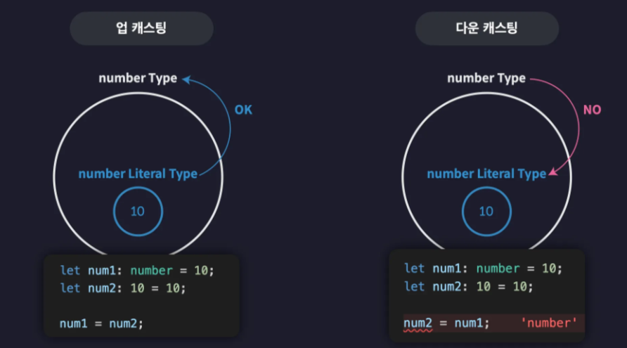
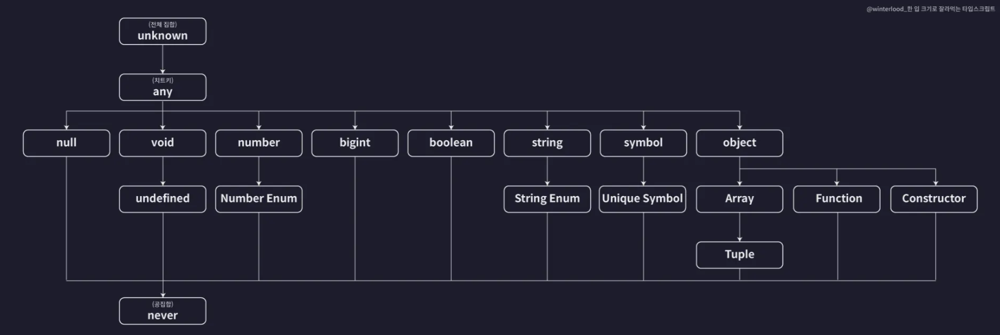
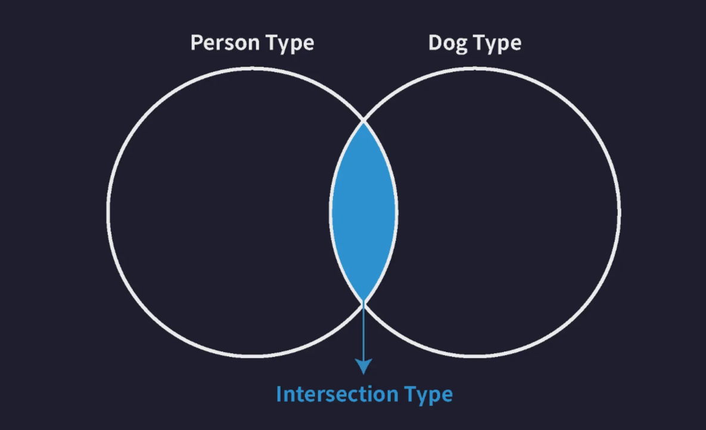

# 3-0. 타입스크립트를 이해한다는 것은?

단순히 문법을 익히는 단계를 넘어, 타입스크립트의 **원리와 동작 방식**

---

## 1. 타입스크립트의 '원리'가 왜 중요한가?

"문법만 빨리 배워서 프로젝트에 적용하면 안 되나요?"라는 의문이 들 수 있습니다. 하지만 타입스크립트는 단순히 외워서 써먹기에는 생각보다 만만치 않은 언어입니다.

* **응용력의 한계:** 공식 문서의 치트시트만으로는 실무에서 마주치는 복잡하고 예외적인 상황들을 해결하기 어렵습니다.
* **복잡한 타입의 벽:** 강의 후반부(10섹션)에서 다룰 아래와 같은 코드를 보면 원리 이해의 중요성을 실감할 수 있습니다.

```typescript
type ReturnType<T extends (...args: any) => any> = T extends (
  ...args: any
) => infer R
  ? R
  : never;

```

원리에 대한 이해 없이 위와 같은 조건부 타입(Conditional Types)이나 추론(infer) 문법을 단순히 암기해서 사용하는 것은 거의 불가능에 가깝습니다.

---

## 2. 원리를 모를 때 발생하는 문제 (강사의 경험담)

강사인 저 역시 초보 시절, 빠른 적용을 위해 문법만 외워 프로젝트에 투입된 적이 있습니다. 그 결과는 다음과 같았습니다.

1. **더티 코드 생산:** 타입스크립트가 지적하는 수많은 오류를 근본적으로 해결하지 못해, 이를 회피하기 위한 임시방편의 코드를 남발하게 되었습니다.
2. **개발 기간 연장:** 오류를 해결하는 데 더 많은 시간을 쏟게 되어 오히려 생산성이 떨어졌습니다.
3. **학습의 회귀:** 결국 원점으로 돌아와 기초 원리부터 다시 공부해야만 했습니다.

---

## 3. 이번 섹션에서 배울 핵심 내용

단순한 'How(어떻게 쓰는가)'를 넘어 **'Why(왜 그렇게 동작하는가)'**에 집중합니다.

* **타입 정의의 기준:** 타입스크립트가 타입을 판단하는 근거
* **타입 간의 관계:** 어떤 타입이 다른 타입의 부모나 자식이 되는 기준
* **오류 검사의 원리:** 타입스크립트가 코드의 안정성을 검사하는 내부 메커니즘

---

## 💡 요약

타입스크립트를 제대로 이해한다는 것은 **"타입스크립트가 세상을 바라보는 규칙"**을 익히는 과정입니다. 이번 섹션을 통해 어떤 복잡한 타입을 만나더라도 능동적으로 해결할 수 있는 탄탄한 기초 체력을 길러보겠습니다.

# 3-1. 타입은 집합이다

타입스크립트의 가장 핵심적인 원리 중 하나는 **'타입을 집합으로 이해하는 것'**입니다. 이 개념을 잡아야만 앞으로 배울 복잡한 오류와 동작 방식을 명확히 이해할 수 있습니다.



---

## 1. 타입과 집합의 관계

집합이란 동일한 속성을 가진 요소들을 하나로 묶은 단위를 말합니다. 타입스크립트의 타입 역시 이와 같습니다.

* **거대 집합 (`number` 타입):** 모든 숫자 값들을 포함하는 아주 큰 집합입니다.
* **부분 집합 (`Number Literal` 타입):** 예를 들어 `20`이라는 리터럴 타입은 오직 숫자 `20` 하나만 포함하는 아주 작은 집합입니다.
* **포함 관계:** 숫자 `20`은 리터럴 타입의 원소이기도 하지만, 동시에 `number`라는 거대 집합에도 속합니다. 즉, **모든 리터럴 타입은 해당 원시 타입의 부분 집합**입니다.

---

## 2. 슈퍼 타입과 서브 타입

타입 간의 포함 관계를 부르는 명칭이 있습니다.

* **슈퍼 타입 (Super Type):** 다른 타입을 포함하는 타입 (부모 타입)
* **서브 타입 (Sub Type):** 다른 타입에 포함되는 타입 (자식 타입)

우리가 이전에 보았던 **타입 계층도**는 사실 이 슈퍼 타입과 서브 타입의 관계를 지도처럼 그려놓은 것입니다.

---

## 3. 타입 호환성 (Type Compatibility)

타입 호환성이란 **어떤 타입의 값을 다른 타입으로 취급해도 괜찮은지** 판단하는 규칙입니다.

### ① 업 캐스팅 (Upcasting)

* **의미:** 서브 타입의 값을 슈퍼 타입의 값으로 취급하는 것 (작은 쪽 → 큰 쪽)
* **가능 여부:** **언제나 가능합니다.**
* **비유:** "정사각형은 직사각형이다"라고 말하는 것과 같습니다.

### ② 다운 캐스팅 (Downcasting)

* **의미:** 슈퍼 타입의 값을 서브 타입의 값으로 취급하는 것 (큰 쪽 → 작은 쪽)
* **가능 여부:** **대부분의 상황에서 불가능합니다.**
* **비유:** "직사각형은 정사각형이다"라고 말할 수 없는 것과 같습니다.

---

## 4. 코드로 보는 호환성

집합 관계를 코드로 직접 확인해 보겠습니다.

```typescript
let num1: number = 10;      // 슈퍼 타입 (number)
let num2: 10 = 10;          // 서브 타입 (Number Literal 10)

// ✅ 업 캐스팅: 서브 타입을 슈퍼 타입에 할당 (허용)
num1 = num2; 

// ❌ 다운 캐스팅: 슈퍼 타입을 서브 타입에 할당 (금지)
num2 = num1; 

```

### 왜 다운 캐스팅은 안 될까?

`num1`은 `number` 타입이므로 나중에 `10`이 아닌 `100`, `-5` 등 어떤 숫자든 들어올 가능성이 있습니다. 반면 `num2`는 오직 `10`만 받아낼 수 있는 아주 좁은 통입니다. 따라서 넓은 범위의 값을 좁은 범위의 변수에 억지로 넣으려고 하면 문제가 발생할 수밖에 없기 때문에 타입스크립트는 이를 사전에 차단합니다.

---

## 💡 요약

* 타입스크립트의 타입은 **값들의 집합**이다.
* **업 캐스팅(서브 → 슈퍼)**은 자유롭게 허용된다.
* **다운 캐스팅(슈퍼 → 서브)**은 데이터의 안전성을 위해 원칙적으로 금지된다.


# 3-2. 타입 계층도와 함께 기본 타입 살펴보기

이전 단원의 '집합'의 개념을 토대로 타입 계층도를 다시 살펴보면, 각 타입이 왜 특정한 동작 방식을 갖는지 명확히 이해할 수 있습니다.



---

## 1. unknown 타입 (전체 집합)

`unknown` 타입은 타입 계층도의 최상단에 위치하는 **전체 집합**입니다.

* **슈퍼 타입:** 모든 타입의 부모입니다. 따라서 어떤 타입의 값이든 `unknown` 타입 변수에 담는 것은 **업 캐스팅**이 되어 항상 허용됩니다.
* **제약:** 반대로 `unknown` 타입의 값을 다른 타입의 변수에 담는 것은 **다운 캐스팅**이므로, `any` 타입을 제외하고는 모두 금지됩니다.

---

## 2. never 타입 (공집합)

`never` 타입은 계층도의 가장 바닥에 위치하는 **공집합**입니다.

* **의미:** 아무것도 포함하지 않는 집합입니다. 무한 루프나 예외 발생처럼 값을 반환하는 것 자체가 불가능한 상황에서 사용됩니다.
* **서브 타입:** 공집합은 모든 집합의 부분 집합이듯, `never`는 모든 타입의 자식입니다. 따라서 `never` 타입의 값은 어떤 타입의 변수에도 할당(업 캐스팅)할 수 있습니다.
* **제약:** 하지만 그 어떤 타입의 값도 `never` 타입 변수에는 담을 수 없습니다. (공집합에 원소를 넣는 다운 캐스팅은 불가능하기 때문입니다.)

---

## 3. void 타입

`void` 타입은 아무것도 반환하지 않는 함수의 반환값 타입으로 쓰이며, 계층도상에서 `undefined`를 자식으로 둡니다.

* **업 캐스팅:** `undefined` 타입은 `void`의 서브 타입입니다. 따라서 `void`로 선언된 함수에서 `undefined`를 반환하거나 아무것도 적지 않는 것은 허용됩니다.
* **관계:** `void` 타입의 변수에는 오직 `undefined`와 `never` 타입의 값만 할당할 수 있습니다.

---

## 4. any 타입 (치트키)

`any`는 타입 계층도와 집합의 논리를 **완전히 무시하는 예외적인 타입**입니다.

* **쌍방향 호환:** 모든 타입의 슈퍼 타입이 될 수도 있고, 동시에 모든 타입의 서브 타입이 될 수도 있습니다.
* **위험성:** `any` 타입의 값을 다른 변수에 담는 것은 논리적으로 '다운 캐스팅'임에도 불구하고 타입스크립트가 이를 허용합니다. 이 때문에 안정성이 깨질 수 있으므로 사용에 주의해야 합니다.
* **유일한 예외:** 단 하나, `never` 타입만큼은 `any` 조차도 침범할 수 없습니다. `never`는 공집합이므로 그 어떤 값도 담을 수 없기 때문입니다.

---

## 💡 요약

* **unknown:** 모든 것을 담을 수 있는 **가장 큰 주머니**
* **never:** 아무것도 담을 수 없는 **빈 주머니** (모든 타입의 자식)
* **void:** `undefined`를 포함하는 **상위 타입**
* **any:** 타입 시스템의 **규칙 파괴자**

# 3-3. 객체 타입의 호환성

기본 타입과 마찬가지로 객체 타입 사이에도 **슈퍼-서브 타입 관계**가 존재하며, 이를 통해 호환성 여부를 판단합니다. 객체 타입의 호환성을 결정하는 핵심 기준을 정리.

---

## 1. 객체 타입의 슈퍼-서브 관계

객체 타입 간의 호환성은 어떤 타입이 더 많은 프로퍼티를 가졌느냐가 아니라, **어떤 타입의 조건이 더 적고 일반적이냐**에 따라 결정됩니다.

### ① 프로퍼티가 적은 쪽이 슈퍼 타입이다

언뜻 생각하면 프로퍼티가 많은 타입이 '더 크다'고 느낄 수 있지만, 집합의 관점에서는 반대입니다.

* **Animal (슈퍼 타입):** `name`과 `color`만 있으면 모두 포함 (범위가 넓음)
* **Dog (서브 타입):** `name`, `color`에 추가로 `breed`까지 있어야 포함 (조건이 까다로워 범위가 좁음)

```typescript
type Animal = {
  name: string;
  color: string;
};

type Dog = {
  name: string;
  color: string;
  breed: string;
};

let animal: Animal = { name: "기린", color: "yellow" };
let dog: Dog = { name: "돌돌이", color: "brown", breed: "진도" };

animal = dog; // ✅ 업 캐스팅 (허용)
dog = animal; // ❌ 다운 캐스팅 (금지)

```

---

## 2. 구조적 타입 시스템의 적용

타입스크립트는 **구조적 타입 시스템**을 따르기 때문에, 객체가 가진 프로퍼티의 구조만 맞으면 슈퍼-서브 관계가 성립합니다. `Dog`는 `Animal`이 갖춰야 할 모든 조건(`name`, `color`)을 이미 만족하고 있으므로, `Animal` 타입에 포함될 수 있는 것입니다.

---

## 3. 초과 프로퍼티 검사 (Excess Property Check)

객체 타입의 호환성 원칙(업 캐스팅 허용)을 따르더라도, **객체 리터럴**을 직접 사용할 때는 타입스크립트의 특수한 검사가 발동합니다.

### ① 검사의 목적

변수를 객체 리터럴로 **직접 초기화**할 때, 타입 정의에 없는 프로퍼티가 포함되어 있으면 "실수했을 가능성이 높다"고 판단하여 오류를 발생시킵니다.

```typescript
type Book = {
  name: string;
  price: number;
};

// ❌ 오류 발생 (초과 프로퍼티 검사)
let book2: Book = {
  name: "한 입 크기로 잘라먹는 리액트",
  price: 33000,
  skill: "reactjs", // Book 타입에 정의되지 않은 프로퍼티
};

```

### ② 검사를 피하는 방법

이 검사는 오직 **객체 리터럴을 변수에 직접 할당할 때**만 일어납니다. 미리 선언된 다른 변수를 할당하면 초과 프로퍼티 검사가 작동하지 않고 순수한 '타입 호환성' 원칙만 적용됩니다.

```typescript
let programmingBook = {
  name: "한 입 크기로 잘라먹는 리액트",
  price: 33000,
  skill: "reactjs",
};

let book3: Book = programmingBook; // ✅ 허용 (업 캐스팅으로 인식)

```

---

## 💡 요약

1. **객체 타입의 호환성:** 조건(프로퍼티)이 더 적은 타입이 **슈퍼 타입**이 됩니다.
2. **업 캐스팅:** 프로퍼티가 많은 객체를 프로퍼티가 적은 타입의 변수에 담는 것은 가능합니다.
3. **초과 프로퍼티 검사:** 객체 리터럴로 직접 값을 넣을 때는 정의된 프로퍼티만 딱 맞게 넣어야 합니다. (실수 방지 목적)

# 3-4. 대수 타입 (Algebraic Type)

대수 타입이란 여러 개의 타입을 합성해서 만드는 타입을 말합니다. 여기에는 두 가지 이상의 타입을 합치는 **합집합(Union)**과 공통된 속성을 추출하는 **교집합(Intersection)** 타입이 존재합니다.



---

## 1. 합집합 타입 (Union Type)

유니온 타입은 바(`|`) 기호를 사용하여 정의하며, 여러 타입 중 하나라도 만족하면 허용되는 타입입니다.

* **기본 타입의 유니온:**
```typescript
let a: string | number | boolean;
a = 1;       // ✅ OK
a = "hello"; // ✅ OK
a = true;    // ✅ OK

```

* **객체 타입의 유니온:**
객체 타입의 유니온은 각 타입의 프로퍼티 조건을 **최소 하나 이상 완전히 만족**하는 객체들의 집합입니다.
```typescript
type Dog = { name: string; color: string; };
type Person = { name: string; language: string; };
type Union1 = Dog | Person;

let union1: Union1 = { name: "강아지", color: "white" }; // ✅ Dog 조건 만족
let union2: Union1 = { name: "사람", language: "ko" }; // ✅ Person 조건 만족
let union3: Union1 = { name: "혼종", color: "black", language: "en" }; // ✅ 둘 다 만족

let union4: Union1 = { name: "이름만" }; // ❌ Dog도 Person도 아니므로 에러

```

---

## 2. 교집합 타입 (Intersection Type)

인터섹션 타입은 앰퍼샌드(`&`) 기호를 사용하여 정의하며, 나열된 모든 타입을 **동시에 만족**해야 하는 타입입니다.

* **기본 타입의 인터섹션:**
대부분의 기본 타입(string, number 등)은 서로 겹치는 값이 없으므로, 인터섹션을 수행하면 아무것도 담을 수 없는 공집합 타입인 **never**로 추론됩니다.
```typescript
let variable: number & string; // never 타입

```

* **객체 타입의 인터섹션:**
객체 타입에서 인터섹션은 **모든 프로퍼티를 합친 것과 같은** 효과를 냅니다. 모든 타입의 조건을 동시에 충족해야 하기 때문입니다.
```typescript
type Dog = { name: string; color: string; };
type Person = { name: string; language: string; };
type Intersection = Dog & Person;

let intersection1: Intersection = {
  name: "캡틴 도그",
  color: "gold",
  language: "Korean" // 모든 프로퍼티가 다 있어야만 합니다.
};

```
---

## 💡 요약 및 비교

| 타입 종류 | 기호 | 의미 | 객체 관점 |
| --- | --- | --- | --- |
| **Union** | `|` | 합집합 | 나열된 타입 중 **하나라도** 온전히 만족하면 허용 |
| **Intersection** | `&` | 교집합 | 나열된 **모든 타입의 프로퍼티**를 전부 가져야 허용 |

## 3-5. 타입 추론 (Type Inference)

타입스크립트는 프로그래머가 모든 변수에 타입을 직접 명시하지 않아도, 코드를 해석하여 타입을 자동으로 결정하는 **타입 추론** 기능을 제공합니다.

---

### 1. 타입 추론이 가능한 주요 상황

타입스크립트는 주로 **대입 연산자의 오른쪽 값(초기값)**이나 **코드의 문맥**을 살펴보고 타입을 결정합니다.

* **일반 변수 선언:** 초기값을 기준으로 가장 적절한 타입이 추론됩니다. 객체의 경우 내부 프로퍼티의 구조까지 파악하여 복잡한 객체 리터럴 타입으로 추론합니다.
* **구조 분해 할당:** 배열이나 객체에서 값을 꺼내올 때도 원본의 타입을 추적하여 자동으로 할당합니다.
* **함수의 반환값:** 함수 내부의 `return` 문 뒤에 오는 값을 보고 해당 함수의 반환 타입을 결정합니다.
* **기본값이 설정된 매개변수:** 매개변수에 기본값을 설정하면, 그 값을 기준으로 매개변수의 타입이 정해집니다.

---

### 2. 주의해야 할 추론 방식

추론 방식은 변수 선언 방식(`let`, `const`)이나 초기화 여부에 따라 달라집니다.

#### ① any 타입의 진화 (Evolution)

변수를 선언할 때 초기값을 생략하면 **암시적 any** 타입이 됩니다. 일반적인 `any`와 달리, 이 변수는 **어떤 값을 할당하느냐에 따라 타입이 계속해서 변합니다.**

```typescript
let d;      // 암시적 any
d = 10;     // 이 시점부터 number 타입처럼 동작
d.toFixed();

d = "hello"; // 이 시점부터 string 타입처럼 동작
d.toUpperCase();

```

* **위험성:** 타입이 유동적으로 변하므로 예상치 못한 에러를 유발할 수 있습니다. 가급적 선언 시 초기값을 주거나 명시적으로 타입을 선언하는 것이 좋습니다.

#### ② const 상수의 추론

`let` 변수는 값이 바뀔 수 있으므로 `number`나 `string` 같은 범용적인 타입으로 추론되는 반면, `const` 상수는 값이 절대 변하지 않으므로 **리터럴 타입**으로 가장 좁게 추론됩니다.

* `let a = 10;` → `number` 타입
* `const b = 10;` → `10` (리터럴) 타입

---

### 3. 최적 공통 타입 (Best Common Type)

배열에 여러 종류의 타입이 섞여 있을 경우, 타입스크립트는 모든 요소를 포괄할 수 있는 가장 적절한 타입을 선택합니다. 보통 **유니온(Union)** 타입으로 추론됩니다.

```typescript
let arr = [1, "string"]; 
// number와 string이 섞여 있으므로 (number | string)[] 타입으로 추론

```

---

## 💡 요약

1. **편의성:** 타입 추론 덕분에 모든 곳에 타입 주석을 달 필요가 없어 코드가 간결해집니다.
2. **한계:** 함수의 매개변수 등 문맥만으로 알 수 없는 곳은 추론이 불가능하므로 직접 명시해야 합니다.
3. **안전성:** 암시적 `any`가 진화하는 상황은 에러의 원인이 될 수 있으므로 주의가 필요합니다.

## 3-6. 타입 단언 (Type Assertion)

타입스크립트가 코드를 분석해 타입을 추론하는 것이 원칙이지만, 때로는 개발자가 해당 값의 타입을 시스템보다 더 정확히 알고 있는 경우가 있습니다. 이럴 때 **"이 값의 타입은 이것이니 의심하지 마라"**고 타입스크립트에게 알려주는 기능을 **타입 단언**이라고 합니다.

---

### 1. 타입 단언의 사용법

가장 보편적인 방법은 `값 as 타입` 문법을 사용하는 것입니다.

* **초기화 시 빈 객체 사용:** 특정 타입으로 정의된 변수를 빈 객체로 초기화하고 나중에 값을 채우고 싶을 때 유용합니다.
* **초과 프로퍼티 검사 회피:** 타입에 정의되지 않은 속성이 포함되어 있어도 단언을 통해 강제로 할당할 수 있습니다.

```typescript
type Person = { name: string; age: number; };

// 💡 빈 객체를 Person 타입으로 단언
let person = {} as Person; 
person.name = "이정환";
person.age = 23;

```

---

### 2. 타입 단언의 성립 조건

무분별한 단언을 막기 위해 타입스크립트는 최소한의 안전장치를 둡니다. `A as B`라고 할 때, 다음 중 하나는 만족해야 합니다.

1. **A가 B의 슈퍼타입이다.** (큰 주머니 → 작은 주머니로 단언)
2. **A가 B의 서브타입이다.** (작은 주머니 → 큰 주머니로 단언)

* **✅ 가능:** `10 as unknown` (number는 unknown의 서브타입)
* **❌ 불가능:** `10 as string` (둘은 아무런 상속 관계가 없음)

---

### 3. 특수한 단언 기법

#### ① 다중 단언 (Double Assertion)

서로 상관없는 타입을 단언하고 싶을 때 `unknown`을 거쳐서 단언할 수 있습니다. 하지만 이는 타입 시스템을 완전히 무력화하는 위험한 방식이므로 권장되지 않습니다.

```typescript
// ⚠️ 매우 위험한 방식
let num = 10 as unknown as string;

```

#### ② const 단언

값 뒤에 `as const`를 붙이면 해당 값을 **가장 좁은 리터럴 타입**으로 고정합니다. 특히 객체에 사용할 경우 모든 프로퍼티가 자동으로 `readonly`가 되어 변경이 불가능해집니다.

```typescript
let cat = {
  name: "야옹이",
  color: "yellow",
} as const;

cat.name = "나비"; // ❌ 에러: 모든 프로퍼티가 읽기 전용임

```

#### ③ Non-Null 단언 (`!`)

값 뒤에 느낌표(`!`)를 붙이면, 타입스크립트에게 **"이 값은 절대 null이나 undefined가 아니다"**라고 단언하는 것입니다. 선택적 프로퍼티를 다룰 때 자주 사용됩니다.

```typescript
type Post = { title: string; author?: string; };
let post: Post = { title: "게시글1" };

// author가 없을 수도 있지만, 무조건 있다고 단언함
const len: number = post.author!.length; 

```

---

## 💡 요약 및 주의사항

1. **타입 단언**은 실제 값을 바꾸는 것이 아니라, 타입스크립트의 **눈을 잠시 가리는 것**입니다.
2. 잘못된 단언은 컴파일 에러는 없애주지만, **런타임 에러(실제 실행 중 오류)**의 주범이 됩니다.
3. 따라서 가급적 타입 추론을 믿되, 정말 확실한 상황에서만 조심스럽게 사용해야 합니다.
