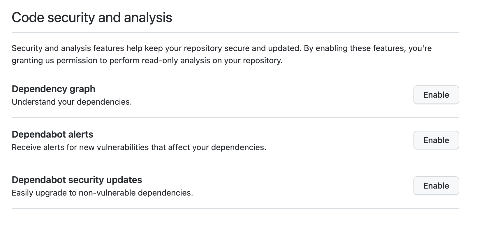

## 9. 모던 리액트 개발 도구로 개발 및 배포 환경 구축하기

9장은 **Next.js 개발 환경을 수동으로 구축**하고, **GitHub 기능을 100% 활용**하여 프로젝트의 품질과 보안을 극대화하는 실질적인 방법을 공유하고 있음.
우리는 단순한 CLI 도구 사용을 넘어, 왜 이런 설정을 도입했는지 이유와 실질적인 가치에 초점을 맞춰야 합니다.

---

## 9-1. Next.js 환경 수동 구축: 제어권 확보와 최적화 (9.1)

`create-next-app` 대신 환경을 직접 구축하는 이유는 **프로젝트 설정에 대한 깊은 이해와 통제력**을 갖기 위함입니다. 이는 장기적인 유지보수에서 큰 이점을 줍니다.

| 영역            | 핵심 설정 내용                                                             | 💡 실질적인 팁                                                                                                                                         |
| :-------------- | :------------------------------------------------------------------------- | :----------------------------------------------------------------------------------------------------------------------------------------------------- |
| **성능 최적화** | `next.config.js`에 **`styledComponents: true`** 추가.                      | **SWC 컴파일러 활용**: Next.js의 Rust 기반 SWC가 `styled-components`를 더 빠르게 처리하도록 명시해 빌드 속도를 최적화합니다.                           |
| **품질/린팅**   | **`@titicaca/eslint-config-triple`**을 `next/core-web-vitals`와 함께 적용. | **고수준 린팅 규칙 도입**: AirBnb보다 최신이며 한국 커뮤니티에서 유지보수 되는 설정을 도입해 코드 스타일 및 잠재적 문제를 일관성 있게 관리합니다.      |
| **CI 효율화**   | `next.config.js`에 **`eslint.ignoreDuringBuilds: true`** 설정.             | **로컬 빌드 시간 단축**: 무거운 린팅 작업을 CI 환경으로 완전히 분리하여 로컬 개발 환경의 빌드 속도를 높입니다.                                         |
| **SSR 안정성**  | `pages/_document.tsx`에서 **`ServerStyleSheet`**를 적용.                   | **SSR Critical Path 확보**: SSR 환경에서 `styled-components`의 스타일이 누락되지 않도록 서버에서 미리 추출하여 초기 로딩 시 깜빡임(FOUC)을 방지합니다. |
| **재사용성**    | 수동 설정 후 재사용을 위해 GitHub에서 **`Template repository`** 옵션 체크. | **Boilerplate화**: 수동 설정의 노력을 보존하고 향후 프로젝트의 일관된 구조 및 설정을 빠르게 복제할 수 있습니다.                                        |

---

## 9-2. 🛡️ GitHub 100% 활용: CI/CD 및 보안 방어 전략 (9.2)

GitHub는 **CI/CD 자동화** 및 **보안 점검**을 위한 강력한 플랫폼으로 **GitHub Actions**와 **Dependabot**은 필수 도구.

### 9-2.1. CI/CD 자동화와 품질 관리

- **CI** (Continuous Integration): 코드 변경 시마다 자동화된 작업(빌드, 테스트 등)을 수행하여 정합성을 확인하는 핵심 요소이며, GitHub Actions는 깃허브 저장소 기반의 SaaS 형태 CI/CD 도구
- **SaaS**: 클라우드 기반 소프트웨어 제공 모델로, 사용자가 직접 설치/관리하는 대신 인터넷을 통해 구독 방식으로 소프트웨어를 사용하고 접근하는 방식
- **GitHub Actions의 기본**: 액션은 러너(Runner)에서 실행되며, 이벤트(`push`, `pull_request`) 발생 시 잡(Jobs)과 **스텝(Steps)** 순서로 실행됩니다.
- **GitHub Runner**: GitHub Actions 워크플로우의 작업을 실제로 실행하는 호스트 머신(가상 머신 또는 컨테이너)으로, GitHub가 제공하거나 사용자가 직접 구축하여 사용하는 두 가지 종류가 있으며, CI/CD 자동화 파이프라인을 구성하는 핵심 요소입니다. 간단히 말해, **'자동화된 작업을 수행하는 컴퓨터'**로 Jobs를 실행하는 환경이고, Job은 여러개의 Step으로 구성되며 Step은 개별 명령어 또는 작업을 실행하고 Actions는 Step에서 호출되는 재사용 가능한 작업. 따라서 Runners > Job > Step > Actions의 계층구조
- **PR 기반 CI 운영**: `.yml` 파일에서 **`branches-ignore: ['main']`** 설정을 통해, `main` 브랜치로의 직접 푸시를 차단하고 **풀 리퀘스트(PR)를 통한 CI 실행을 강제**합니다.
- **브랜치 보호 규칙**: **`Required status checks`** 기능을 사용해 **`build`** 액션이 반드시 **성공**해야만 PR 병합이 가능하도록 강제합니다. 이는 코드가 CI를 통과하지 못하면 main 브랜치에 절대 유입될 수 없게 하는 핵심적인 품질 방어선입니다.

### 9-2.2. 유용한 액션과 깃허브 앱 활용

GitHub **Marketplace**에서 다른 사용자가 만든 유용한 액션을 사용할 수 있습니다.

- 기본 액션: `actions/checkout`, `actions/setup-node`, `actions/stale`, `actions/dependency-review`, `github/codeql-action` 등 주요 액션 존재
- **이미지 최적화**: `calibreapp/image-actions`는 PR 시 이미지를 자동 압축하고 최적화 결과를 댓글로 알려줍니다. 이 액션은 커밋 권한이 필요하므로 `secrets.GITHUB_TOKEN`을 설정해야 합니다.
- **웹사이트 취약점 검사**: **lirantal/is-website-vulnerable**는 배포된 웹사이트의 라이브러리 취약점을 Snyk.io의 분석을 기반으로 스캔하여 확인하는 데 사용됩니다.
- **성능 측정 (Lighthouse CI)**:
  - **Lighthouse CI** 액션을 CI에 통합하여 PR 발생 시마다 **성능, 접근성, SEO** 등의 웹 지표를 측정합니다.
  - **팁**: 결과를 PR에 댓글로 첨부하여, 개발자가 기능 개발과 함께 성능 변화를 지속적으로 모니터링하도록 유도해야 합니다.

### 9-2.3. 보안 취약점 실질적인 방어 (Dependabot)

**Dependabot의 역할**: Dependabot은 의존성 패키지의 보안 취약점을 감지하고, 이를 해결하는 PR을 자동으로 생성해주는 GitHub 기능으로 repository의 Setting의 Code security and analysis 탭에서 쉽게 Enable 가능.

- dependabot이 문제점을 발견하면 Security 탭의 Dependabot alerts에 issue를 추가해 주며 repository 메인 화면에서도 다음과 같이 알림창을 띄워주는 것을 확인 가능
- 생성된 issue를 확인하면 어떠한 종속성 패키지의 어떤버전에서 보안 이슈가 발생했으며 그 보안 이슈의 위험성 및 어떠한 종류인지 상세하게 설명해줌
- CWE에 등록된 보안 이슈들을 기준으로 명세되며 어떠한 버전으로 업그레이드 해야하는지 알려줌
- 버튼 하나로 보안 이슈가 발생하지 않는 패키지의 버전 업그레이드 PR을 생성해줌
- 버튼 하나만 누르면 모든 의존성 보안 이슈를 처리해주는것처럼 설명하였지만 생각보다 잘작동하지 않는 경우가 많이 발생

- **취약점 심각도**: Dependabot은 취약점을 **Critical, High, Moderate, Low** 4단계로 분류합니다.
- 취약점 해결 예시:
  - `shell-quote`: **Critical** 심각도의 취약점을 해결하기 위해 Dependabot이 PR을 생성하며, npm ls shell-quote 명령어로 설치 위치를 확인할 수 있습니다.
  - `minimatch` (ReDoS): **High** 심각도의 취약점은 3.0.5 이상 버전에서 해결되며, **package.json**의 overrides 필드를 사용하여 의존성 내부의 버전을 **^3.0.5**로 강제로 올릴 수 있습니다.
  - `follow-redirects`: **axios** 내부 패키지의 취약점은 Dependabot이 PR을 생성하여 해결합니다.
  - `react-scripts`: **react-scripts** 관련 PR이 생성될 수 있으나, 리액트 팀에서 공식적으로 대응하지 않기로 결정한 취약점도 있으므로 모든 PR을 무조건 병합할 필요는 없습니다.
- **💡 실질적인 방어 팁 (`overrides`)**:
  - 취약점은 종종 의존성의 의존성(transitive dependency) 깊은 곳에 숨어 있습니다 (예: `minimatch`의 ReDoS 취약점).
  - 이때 `package.json`의 **`overrides`** 필드를 사용하여, 취약점이 해결된 버전(예: **`^3.0.5`**)으로 해당 패키지의 버전을 **강제로 통일**하여 보안을 확보해야 합니다.
  - `npm ls [패키지명]`을 통해 취약한 패키지가 어디에 설치되어 있는지 확인하는 것이 중요합니다.

---

## 9-3. package.json의 dependencies 이해하기

안정적인 프로젝트 관리는 정확한 버전 규칙과 의존성 분류에서 시작됩니다.

### 9-3.1. Semantic Versioning (SemVer)

Semantic Versioning, 줄여서 **SemVer(유의적 버전)**는 소프트웨어의 버전을 **`주 버전.부 버전.수 버전`**의 세 자리 숫자로 부여하는 규칙 체계입니다. 이 규칙은 버전 번호를 통해 해당 소프트웨어의 변경 내용과 하위 호환성(Backward Compatibility)에 대한 명확한 의미를 전달하는 것을 목표로 합니다.

| 버전 요소                   | 의미                                        | 하위 호환성    | 💡 팀원 주의사항 및 예시                                                                                                                                                                           |
| :-------------------------- | :------------------------------------------ | :------------- | :------------------------------------------------------------------------------------------------------------------------------------------------------------------------------------------------- |
| **주 버전 (Major Version)** | **기존 버전과 호환되지 않는 API 변경**      | **호환 안 됨** | `1.x.x에서 2.0.0으로 변경` **업데이트 시 가장 위험합니다.** 주 버전이 바뀌면 기존 코드가 더 이상 작동하지 않을 가능성이 높으므로, 반드시 마이그레이션 가이드와 변경 사항을 철저히 검토해야 합니다. |
| **부 버전 (Minor Version)** | **기존 버전과 호환되면서 새로운 기능 추가** | 호환됨         | `1.1.x에서 1.2.0` **안전하게 업데이트 가능**하며, 새로운 API나 기능(Feature)을 프로젝트에서 활용할 수 있습니다. 기존의 기능을 사용하던 코드는 그대로 작동합니다.                                   |
| **수 버전 (Patch Version)** | **기존 버전과 호환되면서 버그 수정**        | 호환됨         | `1.1.1에서 1.1.2` **가장 안전한 업데이트입니다.** 일반적으로 버그 수정(Bug fix)에만 해당하며, 새로운 기능은 추가되지 않습니다. 보안 취약점 패치도 여기에 포함될 수 있습니다.                       |

### 🔍 SemVer 사용 시 추가 고려사항

1.  **초기 개발 버전 (`0.y.z`)**:

    - 주 버전이 **`0`**으로 시작하는 패키지(예: `0.7.6`)는 **초기 개발 단계**에 있음을 의미합니다.
    - 이 버전은 API가 안정적으로 보장되지 않으므로, **수 버전이 올라가도 API가 변경될 수 있습니다**. 사용 시 항상 주의가 필요합니다.

2.  **버전 고정의 원칙**:

    - 특정 패키지를 배포하고 나면 그 버전의 내용은 **절대 변경되어서는 안 됩니다**.
    - 변경 사항이 있을 경우, 반드시 새로운 버전을 배포해야 합니다.

3.  **버전 표기 (`package.json`에서의 의존성)**:
    - `^16.0.0`: **주 버전(16) 내에서 가장 높은 부 버전/수 버전**까지의 업데이트를 허용합니다. 주 버전이 바뀌는 업데이트(예: 17.0.0)는 막습니다. (`react@16`의 경우, 16.0.0 이상 17.0.0 미만의 모든 버전에 호환됩니다).
    - `~16.0.0`: **부 버전(0) 내에서 가장 높은 수 버전**까지의 업데이트만 허용합니다. (예: 16.0.9까지 업데이트 가능하지만 16.1.0으로 업데이트되지 않습니다.)

### 9-3.2. 의존성 분류의 이해

`package.json`에서 의존성을 분류하는 주요 필드

| 필드                   | 목적                                                                                                                      | 포함되는 패키지 예시          |
| :--------------------- | :------------------------------------------------------------------------------------------------------------------------ | :---------------------------- |
| **`dependencies`**     | 프로젝트 **실행**에 필수적인 라이브러리 목록.                                                                             | `react`, `react-dom`, `next`. |
| **`devDependencies`**  | **개발 단계**에만 필요하고 실행에는 불필요한 패키지 목록.                                                                 | `eslint`, `typescript`.       |
| **`peerDependencies`** | 주로 라이브러리가 제공하는 기능에 필요한 의존성을 명시하며, 해당 패키지를 사용하는 프로젝트가 설치해야 하는 의존성을 의미 |

---
